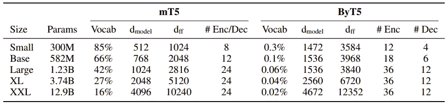

# ByT5:通过预先训练的字节到字节模型走向无令牌的未来

> 原文：<https://towardsdatascience.com/byt5-towards-a-token-free-future-with-pre-trained-byte-to-byte-models-3638791a44b2?source=collection_archive---------37----------------------->

## NLP 研究论文摘要

作者图片

*在这篇博客中，我试图根据我的理解，用预先训练好的字节到字节模型* *来总结论文* [*ByT5:迈向一个无令牌的未来。请随时评论你的想法！*](https://arxiv.org/pdf/2105.13626v1.pdf)

# 想法

迄今为止，大多数 NLP 研究广泛使用了**记号赋予器**的概念来将文本序列分成更小的词汇单元。如今，你会发现[子词标记化](https://www.thoughtvector.io/blog/subword-tokenization)是人们用来表示文本单元的事实上的技术，*(在过去的某个时候是单字，双字)*

*考虑到这些方法的局限性，其中一些是—*

*   **处理 OOV 时不够稳健**。
*   拼写、大小写等方面的变化导致了**不同的表示**。

作者提出的**无令牌**模型直接在原始文本(字节)上操作**，给我们带来了下面提到的好处——**

*   他们可以处理任何语言的文本。我们需要**而不是需要特定于语言的标记器**。您只需要一个标记器！】
*   它们对噪声具有很强的鲁棒性，并最大限度地减少了复杂文本预处理管道的麻烦。
*   我们现在**不需要庞大的词汇矩阵**作为字节级模型，根据定义，只需要 256 个嵌入。

mT5(薛等，2020)和 ByT5(本作品)的训练前实例创建和网络架构比较|图片来自[来源](https://arxiv.org/pdf/2105.13626v1.pdf)

虽然，字节级模型的**主要缺点**之一是**字节序列通常比原始文本序列长，导致处理成本较高**。众所周知，变形金刚中的自我关注是一种二次计算，当试图处理越来越长的序列时，这种计算会带来巨大的挑战。话虽如此，我们确实有进步，如 [Longformer](https://github.com/allenai/longformer) 等，它们利用稀疏注意力和其他巧妙的技术来处理非常大的序列。

# mT5 与 ByT5 —设计

1.  mT5/ [T5](/understanding-t5-model-text-to-text-transfer-transformer-model-69ce4c165023) 使用子字标记，而 ByT5 使用原始字节作为模型的输入，这使得**不知道文本预处理**的类型，等等。
2.  mT5/T5 使用跨度掩蔽的概念作为在大量未标记数据上预先训练模型的自我监督目标。ByT5 通过屏蔽字节使用类似的概念。此外，mT5 平均屏蔽掉 3 个子字标记，这里作者发现更长的屏蔽序列有利于模型，因此他们将其平均屏蔽跨度长度设置为 20 字节。
3.  mT5/T5 使用所谓的“平衡架构”*(编码器深度= =解码器深度)，*然而，byT5 的作者发现，当编码器深度几乎是解码器深度的 3 倍时，它工作得最好，从而使整个架构编码器很重。此外，即使在降低解码器的容量后，他们发现该模型在分类和生成*(翻译/摘要)*任务上表现更好。

此外，作为质量控制协议，由于根据 UTF-8，并非所有的字节序列都是合法的，因此作者通过使用 python 的字节解码函数—***. bytes . decode(" utf-8 "，errors="ignore")*** 来删除任何无效的序列

# 技术性能分析

1.  通常，词汇表中每个标记的向量表示采用模型总参数空间中的大多数参数。例如，在最近的 mT5-Base 模型中，词汇和 softmax 输出矩阵占总参数计数的 66%。对于字节模型，由于不会出现这种情况，如果我们要补偿大的模型参数计数，我们可以通过使我们的模型更深更宽来实现它，通过拥有更复杂的模型来给我们带来优势。
2.  与使用单词或子单词标记化方案相比，给定文本片段的字节序列通常更长。因此，你会有明显较高的计算成本，因为变压器使用自我关注，具有二次时间复杂度。

# 结果

## 摘要文本摘要*(英语)*

他们在 XSum 数据集上评估 mT5 和 ByT5 来进行抽象文本摘要。正如您在下表中看到的，对于所有大小的变体，ByT5 都优于 mT5，并且接近专门为抽象概括而训练的[Pegasus](https://medium.com/analytics-vidhya/pegasus-pre-training-with-extracted-gap-sentences-for-abstractive-summarization-acb238aa1096)model*(17.0)*。

GEM-XSUM |图片来自[来源](https://arxiv.org/pdf/2105.13626v1.pdf)

## 文本分类(英语)

他们评估了 mT5 和 ByT5 在不同模型尺寸下在**粘合**和**强力胶**任务上的表现。正如我们在下表中看到的，仅在小型和基本型号中，ByT5 的性能优于 mT5。作者解释说，这可能是由于有效的参数使用，因为大多数 mT5 参数只是作为词汇表矩阵被锁定。

mT5 和 ByT5 在胶水和强力胶上不同型号的性能|图片来自[来源](https://arxiv.org/pdf/2105.13626v1.pdf)

正如您在下表中看到的，在固定参数计数设置下，随着模型大小的增加，两个模型的 *dmodel* 和 *dff* 变得可比，这与模型大小较低时不同。这是上表所示行为的可能原因。

mT5 和 ByT5 架构的比较|图片来自[来源](https://arxiv.org/pdf/2105.13626v1.pdf)

*好了，这篇博客到此为止。论文中提到了更多的实验。我鼓励你也阅读它们。*

> *如果你愿意，你也可以* [*查看我写的其他研究论文摘要*](https://medium.com/analytics-vidhya/summarizing-nlp-research-papers-dbd12965aa0a) *。*

请随意阅读整篇论文，并向作者问好，感谢他们的贡献。

> ***论文标题:*** ByT5:用预先训练好的字节到字节模型走向无令牌的未来
> 
> ***论文链接:***[https://arxiv.org/pdf/2105.13626v1.pdf](https://arxiv.org/pdf/2105.13626v1.pdf)
> 
> ***作者:*** [【林挺】薛](https://arxiv.org/search/cs?searchtype=author&query=Xue%2C+L)，[阿迪雅巴鲁阿](https://arxiv.org/search/cs?searchtype=author&query=Barua%2C+A)，[诺亚恒](https://arxiv.org/search/cs?searchtype=author&query=Constant%2C+N)，[拉米阿尔-Rfou](https://arxiv.org/search/cs?searchtype=author&query=Al-Rfou%2C+R) ，[莎兰纳朗](https://arxiv.org/search/cs?searchtype=author&query=Narang%2C+S)，[米希尔卡莱](https://arxiv.org/search/cs?searchtype=author&query=Kale%2C+M)， [Adam Roberts](https://arxiv.org/search/cs?searchtype=author&query=Roberts%2C+A) ，[科林·拉斐尔](https://arxiv.org/search/cs?searchtype=author&query=Raffel%2C+C)

我希望你喜欢读这篇文章。如果你愿意支持我成为一名作家，可以考虑注册[成为](https://prakhar-mishra.medium.com/membership)的媒体成员。每月只需 5 美元，你就可以无限制地使用 Medium。谢谢你！