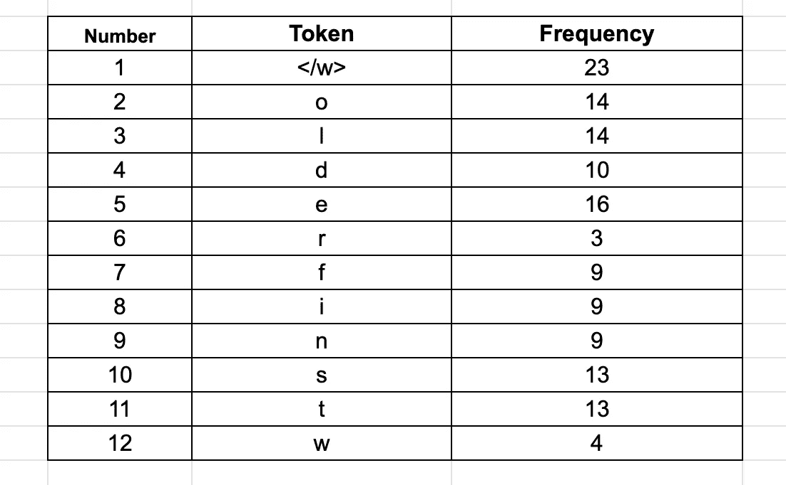
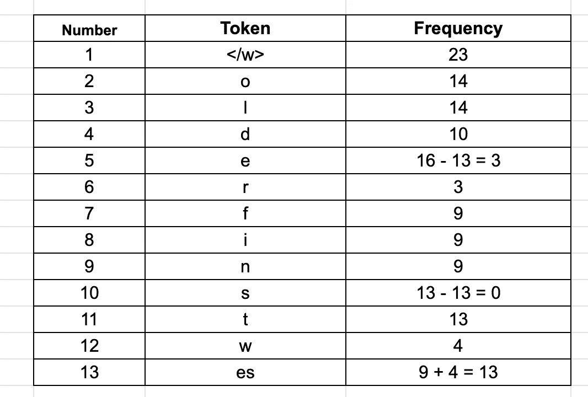
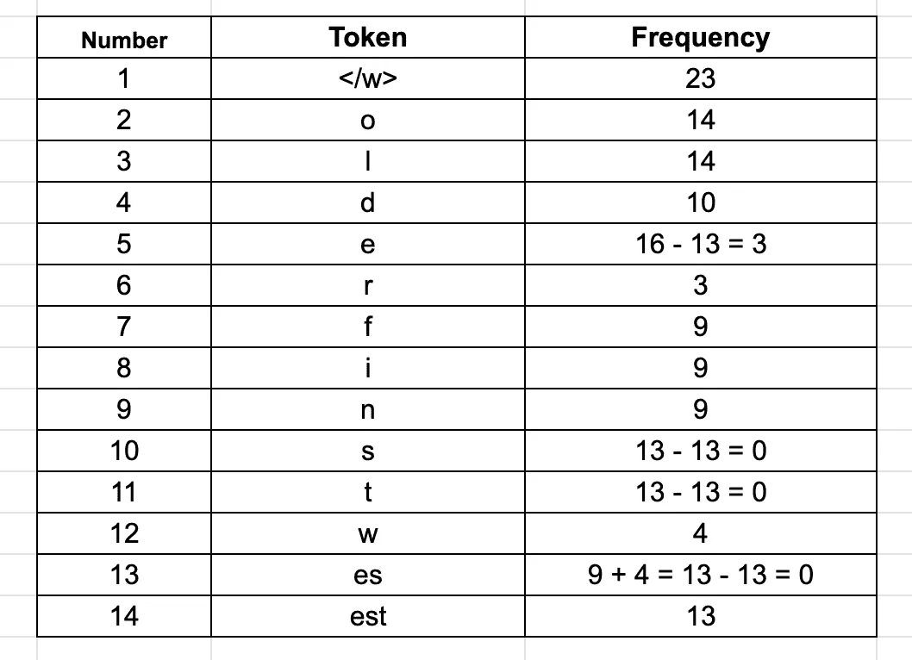
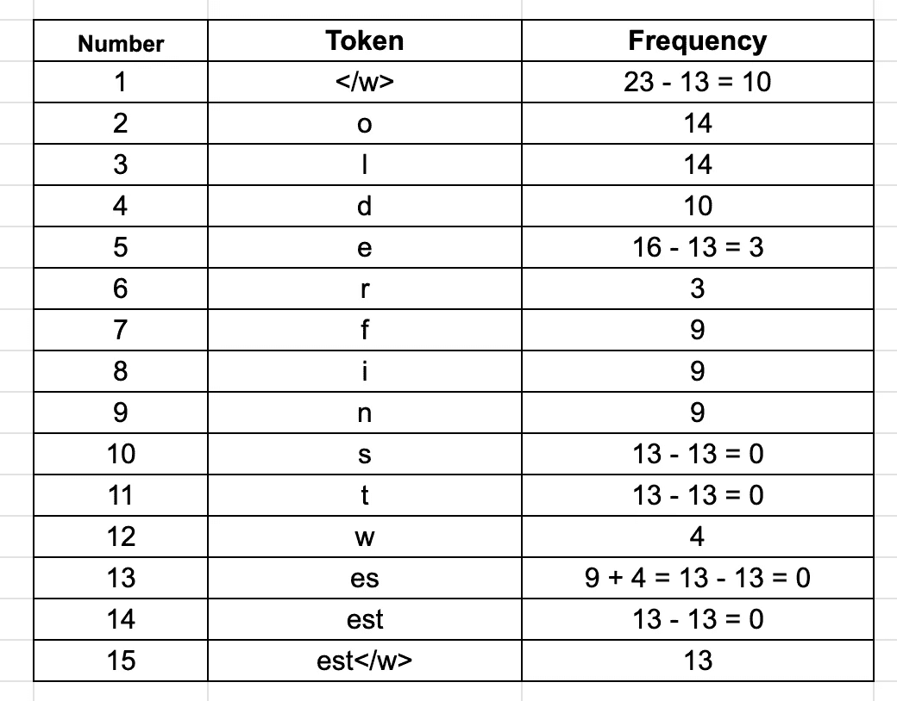
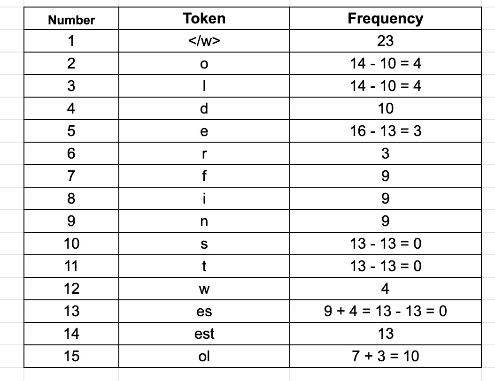
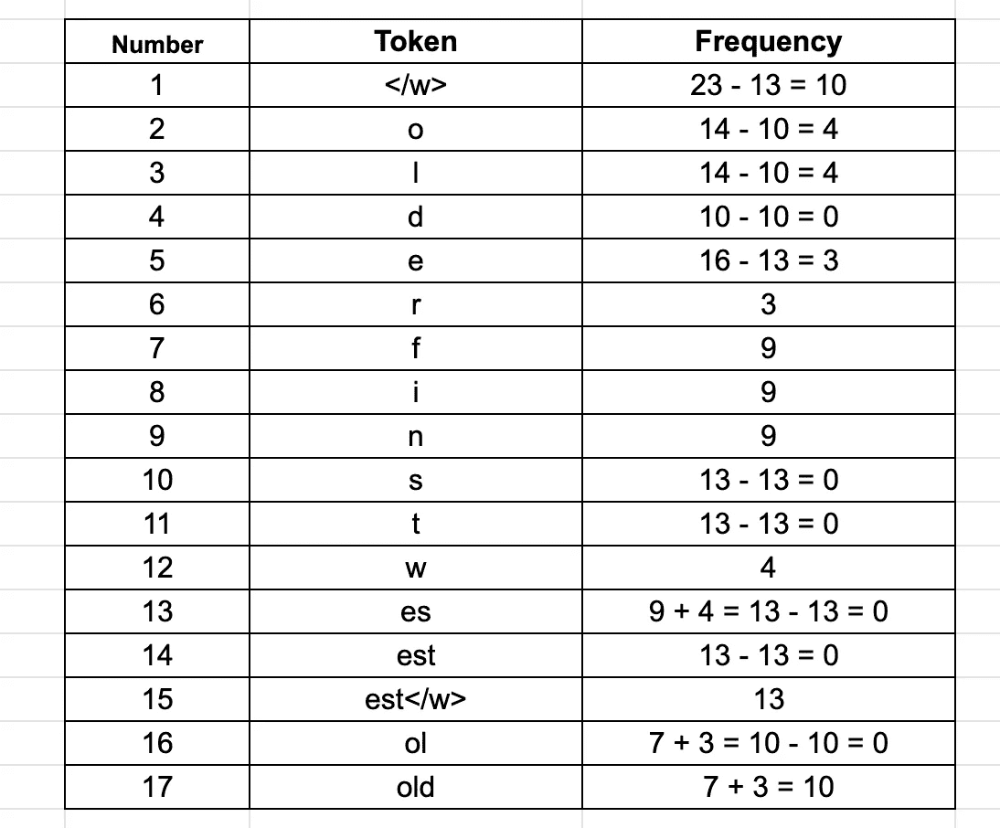
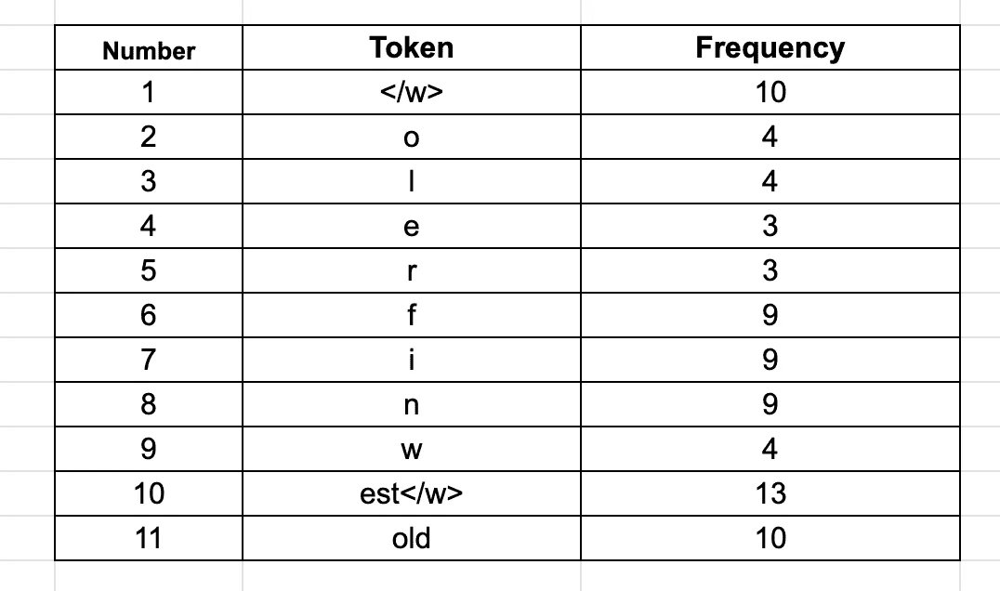

# 字节对编码:基于子字的标记化算法

> 原文：<https://towardsdatascience.com/byte-pair-encoding-subword-based-tokenization-algorithm-77828a70bee0?source=collection_archive---------2----------------------->

## 了解最新的 NLP 模型使用的基于子词的符号化算法——字节对编码(BPE)

照片由[克拉克](https://unsplash.com/@clarktibbs)在 [Unsplash](https://unsplash.com/photos/oqStl2L5oxI) 上拍摄

人工智能的分支**【自然语言处理(NLP)** ，就是让机器理解和处理人类语言。对于机器来说，处理人类语言不是一件容易的事情，因为机器处理的是数字而不是文本。💻NLP 是人工智能的一个如此巨大和广泛研究的分支，我们不时听到这个领域的新进展。研究人员正在努力让机器理解人类语言及其背后的语境。

在理解人类语言的过程中，一个主要的角色是由标记化者扮演的。标记化算法可以是基于单词、子单词或字符的。每种类型的分词器帮助机器以不同的方式处理文本。两者各有优势。如果您想了解 NLP 中使用的不同类型的记号赋予器，那么您可以阅读这篇文章。这篇文章是关于 TDS 的实践教程，可以让你很好地理解这个主题。😇

</word-subword-and-character-based-tokenization-know-the-difference-ea0976b64e17>  

这些分词器中最流行的是基于子词的分词器。大多数最新的 NLP 模型都使用这个标记器。因此，让我们首先了解什么是基于子词的记号赋予器，然后理解最新的 NLP 模型使用的字节对编码(BPE)算法。🙃

# 基于子词的标记化

基于子词的标记化是介于基于词和基于字符的标记化之间的一种解决方案。😎主要思想是解决基于单词的标记化(非常大的词汇量，大量的 OOV 标记，以及非常相似的单词的不同含义)和基于字符的标记化(非常长的序列和不太有意义的单个标记)所面临的问题。

基于子词的记号化算法不会将频繁使用的词分成更小的子词。而是将生僻的单词拆分成更小的有意义的子单词。例如，“男孩”不是分裂的，而是“男孩”分裂为“男孩”和“s”。这有助于模型了解单词“boys”是使用单词“boy”形成的，单词“boy”的意思略有不同，但词根相同。

一些流行的子词标记化算法是单词块、字节对编码(BPE)、Unigram 和句子块。在本文中，我们将讨论字节对编码(BPE)。BPE 用于语言模型，如 GPT-2，罗伯塔，XLM，福楼拜等。这些模型中的一些使用空间标记化作为预标记化方法，而一些使用由 Moses、spaCY、ftfy 提供的更高级的预标记化方法。那么，我们开始吧。🏃

# 字节对编码(BPE)

BPE 是一种简单的数据压缩算法，在这种算法中，最常见的一对连续数据字节被替换为该数据中不存在的字节。在 1994 年发表的文章“[一种新的数据压缩算法](https://www.drdobbs.com/a-new-algorithm-for-data-compression/184402829)中首次对其进行了描述。下面的例子将解释 BPE，并取自[维基百科](https://en.wikipedia.org/wiki/Byte_pair_encoding)。

假设我们有需要编码(压缩)的数据**。字节对 **aa** 出现的频率最高，因此我们将使用 **Z** 替换它，因为 **Z** 在我们的数据中没有出现。所以我们现在有了 **ZabdZabac** 其中 **Z = aa** 。下一个公共字节对是 **ab** ，所以让我们用 **Y** 来代替它。我们现在有了 **ZYdZYac** 其中 **Z = aa** 和 **Y = ab** 。唯一剩下的字节对是 **ac** ，它看起来只有一个，所以我们不会对它进行编码。我们可以使用递归字节对编码将 **ZY** 编码为 **X** 。我们的数据现在已经转换为 **XdXac** ，其中 **X = ZY，Y = ab，**和 **Z = aa** 。它不能被进一步压缩，因为没有字节对出现超过一次。我们通过以相反的顺序执行替换来解压缩数据。**

NLP 中使用了它的一个变体。让我们一起来了解一下它的 NLP 版本。🤗

BPE 确保最常见的单词在词汇表中被表示为单个记号，而不常见的单词被分解为两个或多个子单词记号，这与基于子单词的记号化算法所做的是一致的。

假设我们有一个语料库，其中包含单词(在基于空间的预标记化之后)——old、old、high 和 lowest，我们计算这些单词在语料库中的出现频率。假设这些词的频率如下:

**{“老”:7，“老”:3，“最好”:9，“最低”:4}**

让我们在每个单词的末尾添加一个特殊的结束标记“”。

**{ "老< /w > ": 7，"老< /w > ": 3，"最细< /w > ": 9，"最低< /w > ": 4}**

在每个单词的末尾添加“”标记来标识单词边界，以便算法知道每个单词的结束位置。这有助于算法检查每个字符，并找到频率最高的字符对。当我们将在字节对中包含“”时，我将详细解释这一部分。

接下来，我们将把每个单词拆分成字符，并计算它们出现的次数。初始标记将是所有字符和“”标记。

由于我们总共有 23 个单词，所以我们有 23 个“”记号。第二高频率的标记是“e”。我们总共有 12 种不同的代币。

BPE 算法的下一步是寻找最频繁的配对，合并它们，并一次又一次地执行相同的迭代，直到我们达到我们的令牌限制或迭代限制。

合并可以让你用最少的符号来表示语料库，这是 BPE 算法的主要目标，也就是压缩数据。为了合并，BPE 寻找最频繁出现的字节对。这里，我们认为一个字符和一个字节是一样的。这是英语中的一种情况，在其他语言中可能有所不同。现在，我们将最常见的 bye 对合并成一个标记，并将它们添加到标记列表中，并重新计算每个标记的出现频率。这意味着我们的频率计数将在每个合并步骤后改变。我们将继续进行这个合并步骤，直到达到迭代次数或达到令牌限制大小。

## 迭代次数

**迭代 1:** 我们将从第二常见的标记“e”开始。在我们的语料库中，带有“e”的最常见的字节对是“e”和“s”(在单词 finest 和 lowest 中)，它们出现了 9 + 4 = 13 次。我们将它们合并形成一个新的标记“es ”,记下它的频率为 13。我们还将从单个令牌(“e”和“s”)中减少计数 13。这将让我们知道剩余的“e”或“s”令牌。我们可以看到“s”根本没有单独出现,“e”出现了 3 次。以下是更新后的表格:

**迭代 2:** 我们现在将合并标记“es”和“t”，因为它们在我们的语料库中出现了 13 次。因此，我们有一个频率为 13 的新令牌“est ”,我们将把“es”和“t”的频率减少 13。

**迭代 3:** 现在让我们使用“< /w >”令牌。我们看到字节对“est”和“< /w >”在我们的语料库中出现了 13 次。

**注意:**合并停止令牌“< /w >”非常重要。这有助于算法理解“估计”和“最高”这样的词之间的区别。这两个单词都有“est”这个词，但是一个在末尾有一个“est”标记，一个在开头。因此，像“est”和“est < /w >”这样的标记将被不同地处理。如果算法将看到标记“est < /w >”，它将知道这是单词“最高”的标记，而不是单词“房地产”的标记。

**迭代 4:** 查看其他标记，我们看到字节对“o”和“l”在我们的语料库中出现了 7 + 3 = 10 次。

**迭代 5:** 我们现在看到字节对“ol”和“d”在我们的语料库中出现了 10 次。

如果我们现在查看我们的表格，我们会看到“f”、“I”和“n”的频率是 9，但我们只有一个包含这些字符的单词，所以我们没有合并它们。为了本文的简单起见，现在让我们停止迭代，仔细看看我们的令牌。

频率计数为 0 的令牌已从表中删除。我们现在可以看到，令牌总数是 11，比我们最初的 12 少。这是一个小语料库，但在实践中，大小减少了很多。这 11 个单词的列表将作为我们的词汇表。

您一定也注意到了，当我们添加一个令牌时，我们的计数要么增加，要么减少，要么保持不变。实际上，令牌计数先增加后减少。停止标准可以是令牌计数或迭代次数。我们选择这个停止标准，以便我们的数据集可以以最有效的方式分解成记号。

## 编码和解码

现在让我们看看我们将如何解码我们的例子。为了解码，我们必须简单地将所有的标记连接在一起以得到整个单词。例如，编码序列["the 、" high "、" est 、" range 、" in 、" Seattle]，我们将被解码为["the "、" high "、" range "、" in "、" Seattle"]，而不是["the "、" high "、" enever "、" in "、" Seattle"]。请注意“est”中出现了“”标记。

对新数据进行编码的过程也很简单。然而，编码本身在计算上是昂贵的。假设单词的顺序是[“最”、“最高、“范围”、“在、“西雅图”]。我们将遍历我们在语料库中找到的所有标记——从最长到最短，并尝试使用这些标记替换给定单词序列中的子字符串。最终，我们将遍历所有的令牌，我们的子字符串将被替换为令牌列表中已经存在的令牌。如果还剩下一些子字符串(对于我们的模型在训练中没有看到的单词)，我们将用未知的标记来替换它们。

一般来说，词汇量很大，但仍然有可能是一个未知单词。在实践中，我们将预先标记的单词保存在字典中。对于未知(新)单词，我们应用上述编码方法来标记新单词，并将新单词的标记添加到我们的词典中以供将来参考。这有助于我们为将来积累更丰富的词汇。

## **不是贪心吗？**🤔

为了以最有效的方式表示语料库，BPE 通过查看其频率，在每次迭代中检查每个潜在的合并选项。所以，是的，它遵循一个贪婪的方法来优化最佳可能的解决方案。

不管怎样，BPE 是使用最广泛的子分词算法之一，尽管它很贪婪，但它有很好的性能。💃

我希望这篇文章能帮助你理解 BPE 算法背后的思想和逻辑。😍

**参考文献:**

1.  【https://aclanthology.org/P16-1162.pdf 
2.  [https://huggingface.co/transformers/tokenizer_summary.html](https://huggingface.co/transformers/tokenizer_summary.html)
3.  [https://www . drdobbs . com/a-new-algorithm-for-data-compression/184402829](https://www.drdobbs.com/a-new-algorithm-for-data-compression/184402829)
4.  [https://en.wikipedia.org/wiki/Byte_pair_encoding](https://en.wikipedia.org/wiki/Byte_pair_encoding)

感谢大家阅读这篇文章。请分享您宝贵的反馈或建议。快乐阅读！📗 🖌