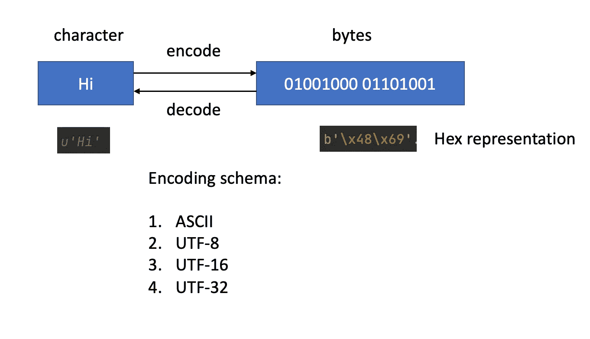

# 字节字符串、Unicode 字符串、原始字符串 Python 中所有字符串的指南

> 原文：<https://towardsdatascience.com/byte-string-unicode-string-raw-string-a-guide-to-all-strings-in-python-684c4c4960ba?source=collection_archive---------3----------------------->

## 区别，用法，Python 对 NumPy 对熊猫？


在 [Unsplash](https://unsplash.com?utm_source=medium&utm_medium=referral) 上由 [Hitesh Choudhary](https://unsplash.com/@hiteshchoudhary?utm_source=medium&utm_medium=referral) 拍摄的照片

Python 中的“字符串”？听起来像是每个 Python 程序员在他们的第一个 Python 教程中应该已经掌握的最基本的主题。然而，你知道在原始 Python 中至少有四种类型的字符串吗？你知道你的字符串实际上是如何在 Numpy 或 Pandas 或任何其他包中表示的吗？我需要知道哪些区别和注意事项？(见下文)

在这里，让我根据自己的学习经历，试着为你澄清一些困惑。我们将讨论以下主题:

1.  「编码」和「解码」是什么概念？
2.  什么是 raw(r)字符串或 format(f)字符串，何时应该使用它们？
3.  Numpy/Pandas 字符串和原始 Python 字符串有什么区别？

# 字节字符串和 Unicode 字符串(默认的 Python3 字符串)——都是关于编码的

要理解字节串和 Unicode 串的区别，我们首先需要知道什么是“编码”和“解码”。



编码和解码(图片由作者提供)

为了在计算机上存储人类可读的字符，我们需要**将它们编码成字节。相比之下，我们需要**将字节解码**成人类可读的字符来表示。在计算机科学中，字节表示 0/1 的单位，通常长度为 8。所以字符“Hi”在计算机上实际上是以“01001000 01101001”的形式存储的，消耗 2 个字节(16 位)。**

定义编码过程的规则称为**编码模式**，常用的有“ASCII”、“UTF-8”等。现在，问题是这些编码模式看起来怎么样？

" **ASCII** "将每个字符转换成一个字节。因为一个字节由 8 位组成，每一位包含 0/1。“ASCII”能代表的字符总数是 2⁸=256.26 个英文字母加上一些常用字符绰绰有余。完整信息见[“ASCII”表](https://www.rapidtables.com/code/text/ascii-table.html)。

但是，256 个字符显然不足以存储世界上所有的字符。有鉴于此，人们设计了 Unicode 码，其中每个字符将被编码为一个“代码点”。例如，“H”将被表示为**代码点**“U+0048”。根据[维基百科](https://en.wikipedia.org/wiki/Unicode)，Unicode 可以包含 144697 个字符。但是，代码点仍然不能被计算机识别，所以我们有“ **UTF-8** ”或其他变体编码模式来将代码点转换为字节。“UTF-8”是指表示一个字符的最小比特长度是 8，所以你可以猜测，“ **UTF-16** 是指最小比特长度是 16。UTF-8 比 UTF-16 更受欢迎，所以在本文和你的大部分工作中，因为它们与旧的原始 ASCII 标准兼容(一个字符可以用一个字节表示)，理解 UTF-8 就足够了。完整信息见[“UTF-8”表](https://www.utf8-chartable.de/unicode-utf8-table.pl)。

了解了基本概念后，让我们来看看 Python 中一些实用的编码技巧。在 Python3 中，默认的字符串叫做 **Unicode string (u string)** ，你可以把它们理解为人类可读的字符。如上所述，您可以将它们编码成**字节字符串(b 字符串)**，字节字符串可以解码回 Unicode 字符串。

```
u'Hi'.encode('ASCII')
> b'Hi'b'\x48\x69'.decode('ASCII')
> 'Hi'
```

在 Python IDE 中，通常，在打印输出时，字节字符串会使用“ASCII”自动解码，所以这就是为什么第一个结果是人类可读的(b'Hi ')。更多的时候，字节串应该用十六进制代码(b'\x48\x69 ')表示，可以在任何[“ASCII”表](https://www.rapidtables.com/code/text/ascii-table.html)中找到。

为了总结这一节，让我们看一个“UTF-8”的例子，同样每个字符的十六进制代码可以在 [UTF-8 表](https://www.utf8-chartable.de/unicode-utf8-table.pl)中找到:

```
b'\xe0\xb0\x86'.decode('utf-8')
> 'ఆ'
```

# 原始字符串

从这种类型的字符串开始，我们只需要知道关于默认 Unicode 字符串(u string)的一件事——*反斜杠(" \ ")是 Unicode 字符串中的一个特殊字符，这样后面的字符将具有特殊的含义(即\t，\n 等)*。所以为了忽略反斜杠的特殊含义，我们有了 **Raw string (r string)** ，其中反斜杠只是一个反斜杠，它不会对改变其后面字符的含义产生影响。


Unicode 和原始字符串(图片由作者提供)

下面是我个人的建议，除非在需要定义正则表达式匹配模式的场景下(见下面的例子)，我建议使用带转义的 **Unicode 字符串**(使用反斜杠忽略特殊字符)。如第三个示例所示，我们使用反斜杠来确保我们输出的是文字“\”而不是新的制表符“\t”。

为什么我会推荐这个？这是因为原始字符串不能真正解决所有问题，例如，如何在原始字符串中输出文字单引号？

```
r'ttt'g''File "<ipython-input-76-2839752ff4e6>", line 1
    r'ttt'g''
          ^
SyntaxError: invalid syntax
```

然而，将转义思想与 Unicode 字符串一起使用似乎是一种更通用的方法:

```
u'ttt\'g\''> "ttt'g'"
```

Raw string (r string)唯一有用的地方是当你处理**正则表达式**的时候。正则表达式是一个复杂的问题，我不打算在本文中讨论它。但是当使用正则表达式时，我们通常需要首先定义一个匹配的模式，其中推荐原始字符串。

```
import re
pat = re.compile(r'ENSG\d+$')
string = 'ENSG00000555'
re.search(pat,string)<_sre.SRE_Match object; span=(0, 12), match='ENSG00000555'>
```

# 格式字符串

对于有经验的 Python 程序员来说，格式字符串应该不是一个陌生的概念，它允许你动态配置我们想要打印的字符串。在 Python 版之前，创建格式字符串的推荐方法如下:

```
var = 'hello'
print('{} world'.format(var))> hello world
```

从 Python 3.5 和更高版本开始，有一个新的" **f 字符串**来帮助我们实现同样的目标:

```
var = 'hello'
print(f'{var} world')> hello world
```

这里我要注意的重要一点是，当使用格式字符串时，花括号“{}”变成了一个非常特殊的字符，包含了它独特的含义。因此，如果我们的目标仍然是输出文字“{}”，我们需要使用**双花括号**“{ { } }”对其进行转义:

```
'{{}}{}'.format(5)> '{}5'
```

此外，还要注意格式字符串中的`\1`(或反斜杠后的其他数字):

```
# Make sure to write the command in a python file and execute the python file
'ttt {} \1'.format('rr')
> ttt rr 
'ttt {} \\1'.format('rr')
> ttt rr \1
```

请注意，在上面的代码中，输出是通过运行 python 文件生成的，如果您使用交互式 Python 控制台，这将会令人困惑，因为输出实际上会自动编码为字节:

```
# if using interactive python console
'ttt {} \1'.format('rr')
> 'ttt rr \x01'
'ttt {} \\1'.format('rr')
> 'ttt rr \\1'
```

最后但同样重要的是，可以使用`rf` string，其中我们希望为正则表达式构造一个原始字符串，但我们希望在其中包含一些变量:

```
v1 = 3
pattern = re.compile(rf'^E{v1}\.{v1+1}$')
```

# 串起熊猫和熊猫

到目前为止，我们讨论的都是 Python 中的原始字符串类型，我们还没有涉及到在其他流行的 Python 包中如何处理字符串。在这里，我将分享一些 Numpy 和 Pandas 中的字符串类型。

在 Numpy 中，通常可以用三种不同的“数据类型”来指定字符串:

1.  可变长度 Unicode (U)
2.  固定长度字节
3.  Python 对象(O)

```
import numpy as np
arr1 = np.array(['hello','hi','ha'],dtype='<U5')
arr2 = np.array(['hello','hi','ha'],dtype='|S5')
arr3 = np.array(['hello','hi','ha'],dtype='object')> array(['hello', 'hi', 'ha'], dtype='<U5')
> array([b'hello', b'hi', b'ha'], dtype='|S5')
> array(['hello', 'hi', 'ha'], dtype=object)
```

`<U5`表示最长的是一个长度为 5 的字符串，然而，一个更节省内存的方法是使用固定长度的`|S5`，它本质上是将它们转换成字节字符串。如果您试图将其转换为强类型数据结构(即存储为 h5 文件)，这是首选方式。此外，我们可以将字符串视为 Python 对象，并将它们存储在 Numpy 数组中，因为每个 Python 对象都可以使用“object”类型存储在 Numpy 数组中。

熊猫身上的弦可以用两种方式来表示:

1.  对象数据类型(大多数时候应该没问题)
2.  字符串数据类型

```
import pandas as pd
s1 = pd.Series(['hello','hi','ha'],dtype='object')
s2 = pd.Series(['hello','hi','ha'],dtype='string')> s1
0    hello
1       hi
2       ha
dtype: object> s2
0    hello
1       hi
2       ha
dtype: string
```

这两种类型大体相似，细微的差别在[文档](https://pandas.pydata.org/pandas-docs/stable/user_guide/text.html#behavior-differences)中有所概述。

# 结论

总之，我们讨论了 Python 中“字符串”的不同表示。从默认的 **Unicode 字符串(u 字符串)**开始，我们讨论了它与**字节字符串(b 字符串)**的关系。理解这种转换非常重要，因为有时来自其他程序的标准输出将是字节格式，我们需要首先将它们解码为 Unicode 字符串，以便进行进一步的流操作。然后我们谈到了 **Raw string (r string)** 和 **Format string (f string)** 以及使用它们时需要注意的事项。最后，我们总结了 Numpy 和 Pandas 中字符串表示的不同方式，在用 string 实例化 Numpy 或 Pandas 对象时应该特别小心，因为它们的行为与原始的 Python 字符串有很大的不同。

差不多就是这样！我希望你觉得这篇文章有趣和有用，感谢阅读！如果你喜欢这篇文章，请在 medium 上关注我，非常感谢你的支持。在我的 [Twitter](https://twitter.com/FrankLI55917967) 或 [LinkedIn](https://www.linkedin.com/in/guangyuan-li-399617173/) 上联系我，也请让我知道你是否有任何问题或你希望在未来看到什么样的教程！