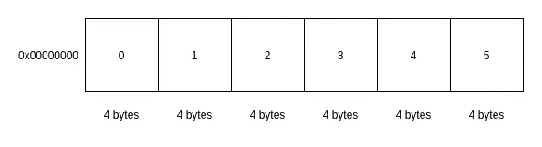
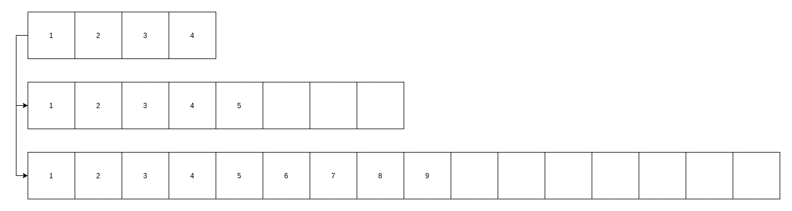
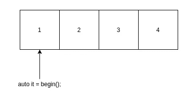
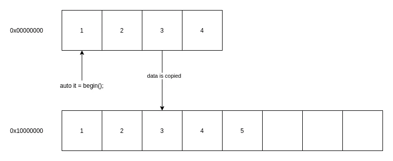
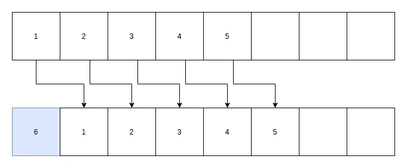

# C++基础:数组数据结构

> 原文：<https://towardsdatascience.com/c-basics-array-data-structure-c25b8ad4d32c?source=collection_archive---------16----------------------->

## C++提供了不同类型的数组，了解它们的内部工作方式将有助于我们为自己的应用选择正确的类型


照片由 [Fotis Fotopoulos](https://unsplash.com/@ffstop?utm_source=medium&utm_medium=referral) 在 [Unsplash](https://unsplash.com?utm_source=medium&utm_medium=referral) 上拍摄

# 数组

当我们用任何编程语言编码时，最重要的事情之一是选择正确的数据结构来表示我们的数据。这一点很重要，因为我们不希望我们的应用程序变慢到成为瓶颈，或者在应用程序扩展时使用过多的内存。

其中一种数据结构是数组，它是一个连续的内存块，可以存储许多相同数据类型的变量(元素)。



内存中的数组(图片由作者提供)

假设我们有一个大小为 4 字节的数据类型，我们有 6 个字节。上图直观地显示了我们的数据是如何存储在内存地址 0x00000000 中的，数字 0 到 5 是元素的索引。

数组存储在连续的内存块中这一事实意味着数组可以提供以下功能:

```
int data[6];
```

*   随机访问任何元素
    例如，我们可以用**数据【3】**访问索引为 3 的元素
*   使用指针偏移量
    不仅使用下标操作符，我们还可以使用指针偏移量，例如，我们可以用 ***(data + 3)** 访问索引 3 处的元素参见[指针算法](https://www.tutorialspoint.com/cplusplus/cpp_pointer_arithmatic.htm)

正如我们在上面看到的，无论我们使用下标操作符还是使用常规指针的偏移量，读取特定位置的元素都没有开销或者 O(1)。但是对于搜索，复杂度是 O(n ),假设我们不对数组进行排序，这不是本文的重点。

插入和删除等其他操作取决于我们选择的数组类型。我们将在接下来的章节中讨论细节。

# c 风格数组

C++支持固定大小的 C 风格数组，有时也称为裸数组。这就是我们如何声明一个数组。

```
int data[6];
```

这意味着我们有 6 个整数存储在连续的内存块中。我们也可以直接初始化我们的数据。

```
int data[6] = {1, 2, 3, 4, 5, 6};
```

或者，

```
int data[] = {1, 2, 3, 4, 5, 6};
```

根据我们声明数组的位置和方式(局部/全局和初始化/未初始化)，可以在堆栈或数据/bss 上创建数组。我们还可以使用 **new[]** 操作符在堆内存上创建数组，并使用 **delete[]** 操作符销毁它们。这些运算符不同于**新增**和**删除**运算符，不要混淆。

```
int *data = new int[5];
delete[] data;
```

## 数组/指针二元性

c 风格的数组可以退化为指针。这意味着它们可以被转换成指针，并在这个过程中丢失它们的类型和大小。我们可以将指针用作数组，反之亦然。

```
int data[6] = {1, 2, 3, 4, 5, 6};std::cout << *(data+3);
```

上面的代码将打印“4”。

```
void print_array(int *data, int len)
{
   for (int i=0; i<len; i++)
   {
     std::cout << data[i] << "\n";
   }
}
```

上面的代码将打印 1 到 6。正如我们所看到的，我们的数组类型退化为指针类型，并在此过程中丢失了大小信息，这就是为什么我们将长度/大小作为参数传递。

# 固定大小的数组

C++标准模板库或 STL 在 **std::array** 中提供了固定大小的数组，本质上与 C 风格数组 ***相同，封装在 **structs** 中的*** 保存 C 风格数组，带有额外的标准 STL APIs，如访问元素、返回迭代器、检查容量等。

就像 C 风格的数组一样，根据我们声明它们的位置和方式，std::array 可以在 stack 或 data/bss 上创建。

以下示例假设我们使用 C++17 之前的 C++版本。

```
std::array<int, 6> data{1, 2, 3, 4, 5, 6};
```

## 它不会衰减成指针类型

除了拥有标准的 STL APIs，C 风格数组的另一个不同之处是它不会退化成指针。当我们把它传递给一个函数时，我们需要指定类型和大小。

```
void print_array(const std::array<int, 6>& data)
{
   for (const auto& x : data)
   {
     std::cout << x << "\n";
   }
}
```

好的一面是，由于它保留了大小信息，我们可以使用 for-range 循环。它也更安全，因为如果类型或大小不匹配，我们会得到一个编译错误。

```
std::array<int, 6> data{1, 2, 3, 4, 5, 6};void print_array(const std::array<int, 5>& data)
{
   for (const auto& x : data)
   {
     std::cout << x << "\n";
   }
}
```

我们将得到以下错误消息:

```
error: invalid initialization of reference of type ‘const std::array&’ from expression of type ‘std::array’
```

如果我们希望函数支持不同的类型或大小，我们可以将函数创建为模板:

```
template <typename T, std::size_t size>
void print_array(const std::array<T, size>& data)
{
   for (const auto& x : data)
   {
     std::cout << x << "\n";
   }
}
```

## 它提供了 STL APIs

我想说的最大好处是它提供了 STL APIs，所以我们可以使用 STL 算法来处理我们的数组。虽然我们也可以使用 C 风格的数组来使用 STL 算法，但是代码是不可移植的，比如当我们想换成另一种类型的容器时，比如我们将在下一节讨论的 **std::vector** 。

对于 C 风格的数组，我们可以使用 **std::find_if** 算法如下:

```
int data[6] = {1, 2, 3, 4, 5, 6};
int *result = std::find_if(data, data+6,
              [](const int x)
              {
               if (x == 4) return true;
               else return false;
              });
```

用 **std::array** ，看起来是这样的:

```
std::array<int, 6> data{1, 2, 3, 4, 5, 6};
auto result = std::find_if(data.begin(), data.end(),
              [](const int x)
              {
               if (x == 4) return true;
               else return false;
              });
```

我们可以简单地用 std::vector 替换 std::array，它仍然可以工作，如下所示。

```
std::vector<int> data{1, 2, 3, 4, 5, 6};
auto result = std::find_if(data.begin(), data.end(),
              [](const int x)
              {
               if (x == 4) return true;
               else return false;
              });
```

有很多标准 API 比如 **back()** 或者 **front()** 分别访问最后一个和第一个元素。

## 随机存取和指针偏移

就像 C 风格的数组一样，std::array 通过下标操作符为随机访问提供了灵活性:

```
std::array<int, 6> data{1, 2, 3, 4, 5, 6};
int x = data[3];
```

以及获取原始指针和使用偏移量来访问数据:

```
std::array<int, 6> data{1, 2, 3, 4, 5, 6};
int *pData = data.data();
int x = *(pData+3);
```

# 动态大小数组

在许多情况下，固定大小的数组不是我们编码问题的解决方案。例如，当我们不知道数据的大小或者数据的大小在运行时自然变化时。

C++为动态大小的数组提供了 std::vector。要声明 std::vector，我们只需指定类型:

```
std::vector<int> data;
```

如果你正在用 C++写代码，我相信你已经用了很多这种数据结构，因为如果你不知道使用哪种数据结构，大多数人会说这是最好的数据结构。

但是了解它是如何工作的是很重要的，这样下次你就可以更明智地选择你的数据结构。

## std::vector 从堆中分配内存

std::vector 从堆中动态分配内存来存储我们的数据。当我们的 std::vector 对象超出范围时，它会将内存返回给系统。

默认情况下，如果我们不指定它，std::vector 将使用 std::allocator 来分配内存。std::allocator 的内部结构并不是本文的重点，出于本文的目的，我们假设它的工作方式就像 C 编程语言中的 **malloc()** 一样。

因为我们的数据大小是动态的 std::vector 在运行时分配和重新分配内存。为了避免每次添加或删除元素时都要调整内存大小(释放和分配)，std::vector 会根据大量内存调整大小，比如将当前大小增加一倍。不同编译器的实现细节可能有所不同。

让我们看一个使用 gcc 的例子:

```
std::vector<int> data{1, 2, 3, 4};
```

如果我们通过调用 data.capacity()来查询元素的数量，它将返回 4。当我们再添加一个元素时:

```
data.push_back(5);
```

现在尺寸变成了 8，而不是 5。如果我们再增加 4 个元素:

```
data.push_back(6);
data.push_back(7);
data.push_back(8);
data.push_back(9);
```

尺寸变为 16，而不是 9。我们可以看到，每当先前分配的内存满了，大小就会翻倍。



内存增长示例(图片由作者提供)

## 它不会自动收缩

我们需要注意的一点是，当我们通过调用 **pop_back()** 或 **erase()** 删除元素时，std::vector 不会自动收缩。

继续我们上面的例子，即使我们删除了 8 个元素，大小仍保持不变:

```
for (int i=0; i<8; i++)
{
  data.pop_back();
}
```

***数据*** 对象仍然拥有 16 个元素的容量。如果我们想要移除未使用的内存，我们必须通过调用 **shrink_to_fit()** 显式地要求它收缩:

```
data.shrink_to_fit();
```

## 迭代器失效

在使用动态大小数组 std::vector 时，我们需要注意的另一件事是使用迭代器。迭代器是我们在使用 STL 时经常使用的类似指针的对象。

迭代器指向 std::vector 中的一个元素，例如，调用 **begin()** 将返回一个指向 std::vector 中第一个元素的迭代器。

```
std::vector<int> data{1, 2, 3, 4};
auto it = data.begin();
```



迭代器(作者图片)

如果 std::vector 的内存发生变化，这个迭代器可能会失效。

```
data.push_back(5);
```

在这种情况下，添加一个元素会触发重新分配，这是一个新的内存块。现在我们的迭代器无效了，因为它仍然指向旧的位置。下图说明了内部发生的情况:



无效的迭代器(图片由作者提供)

# 摘要

总而言之，在很多情况下，我们需要将数据存储在连续的内存块中。数组数据结构的特征如下:

*   恒定访问时间，包括随机访问和指针偏移
*   没有/较少内存分配开销

为了保存少量已知大小的数据，我们可以使用固定大小的数组，这在分配内存方面没有成本，对于 c++我们可以使用 std::array。

当我们需要存储较大的数据时，可以使用动态数组 std::vector。使用 std::vector 时要记住几件事:

*   它可能会分配比优化插入时间所需更多的内存
*   尺寸不会因为移除元素而自动缩小
*   当内存改变时，迭代器失效
*   它不支持 push_front()和 pop_front()，因为这两个操作总是会触发内存中的数据转移，如下图所示



在开始添加新元素时移动数据(图片由作者提供)

如果您需要频繁地在数据的开头插入和/或删除元素，c++提供了 std::deque，这是一个针对这种情况优化的双端队列。

我没有把它放在这篇文章中，因为 std::deque 不连续存储数据。它实现为数组的集合，你可以把它想象成 std::vector 的链表。

[](https://debby-nirwan.medium.com/subscribe) [## 每当王思然·尼旺发表文章时，就收到一封电子邮件。

### 每当王思然·尼旺发表文章时，就收到一封电子邮件。通过注册，您将创建一个中型帐户，如果您还没有…

debby-nirwan.medium.com](https://debby-nirwan.medium.com/subscribe)