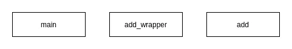
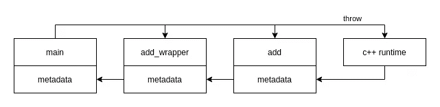
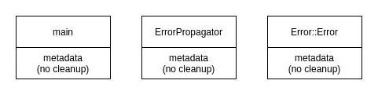
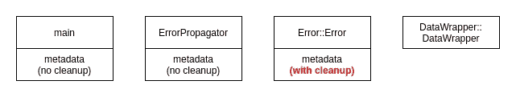
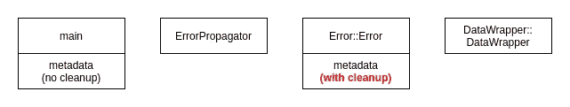

# C++基础:理解异常处理

> 原文：<https://towardsdatascience.com/c-basics-understanding-exception-handling-b2a8271433a7?source=collection_archive---------22----------------------->

## 为什么它是处理错误的更好方法？它是如何在引擎盖下工作的？让我们后退一步，看看它到底提供了什么。


凯文·Ku 在 [Unsplash](https://unsplash.com?utm_source=medium&utm_medium=referral) 上的照片

# 什么是异常处理？

软件中的异常是指阻止软件执行常规路径的错误情况。这些错误可能是软件本身可以控制的，如错误的参数或超出其控制范围。例如，打开文件、套接字、分配内存块等系统调用返回的错误。

异常处理提供了一种更好的机制来检测和处理错误。为了理解为什么它更好，现在让我们看看在没有异常处理的情况下，我们如何检测和处理错误，比如在像 c 这样的编程语言中。

## 检测和处理错误的传统方法

我们通常将程序分解成多个函数或子程序，使其模块化，更容易理解。这意味着我们的程序将有多个链接的函数调用。每个函数都可以返回一些信息供调用者使用。

让我们看一个简单的程序，将两个必须小于 100 的整数相加。我们可以这样写程序:

错误传播 1(作者编写的代码)

所有涉及的函数都返回一个整数，当我们遇到错误时，我们返回 ***-1*** 。但是我们这里遗漏了一些东西， ***-1*** 可能是加法的结果。我们可能想要添加一个检查来确保参数不小于 ***0*** 。但是现在，在主函数中，当我们收到一个错误时，我们不知道它是哪一个，是 *< 0* 还是 *> 100* 。我们需要添加一个全局变量**。**

错误传播 2(作者编写的代码)

所以现在我们有了一个检测错误和处理错误的机制。根据您的程序，函数调用可能会更长。

这是我们以传统方式处理错误的方式，例如当我们想用 C 编程语言打开一个文件时:

```
FILE *fp;
fp = fopen ("file.txt", "w+");
```

如果 **fp == NULL** ，则操作失败，全局变量 **errno** 被更新。

## 传统方法的一些问题

上述传统方法存在一些问题。这些是其中的一些:

*   所有涉及的函数必须返回相同的类型，例如 integer 来传播错误状态。这些函数调用可能相当长，并且它们被强制返回相同的类型。
*   在处理程序的函数调用返回后，必须立即检查全局变量，或者缓存全局变量。因为当随后发生另一个错误时，它可能被更新。
*   是否处理错误取决于调用者。如果不处理它，可能会导致程序稍后崩溃或程序异常继续。

## 用异常处理来处理错误

异常处理如何改进传统方法？

对于初学者来说，它在**知道错误**的代码和**知道如何处理错误**的代码之间提供了一个**清晰的分隔**，并且中间的所有代码都可以安全地**忽略错误**。

带异常处理(由作者编写的代码)

有了异常处理，我们的代码现在看起来不同了。中间的函数 ***add_wrapper()*** 不一定要返回 **integer** 类型。它不需要知道错误。当抛出一个错误时，将在捕获该错误的 ***main()*** 函数中进行处理。现在，无论您在错误检测器和错误处理程序之间添加多少函数，它们都可以忽略它们不应该关心的错误。

我们可以去掉全局变量。

关于最后一点，如果没有处理异常，程序将会终止，因为 C++运行时将调用 std::terminate。

如果我们删除代码中的 try-catch 并执行它，我们会得到以下结果:

```
terminate called after throwing an instance of 'std::invalid_argument'
  what():  parameters must be >= 0
Aborted (core dumped)
```

所以它是更安全的，从某种意义上说，程序不会继续运行，我们会得到一些关于发生了什么的信息。

现在我们已经看到了异常处理提供了什么，让我们深入了解更多的细节。

# C++中的异常处理

上面我们已经看到了如何用 C++编写异常处理，它由两部分组成:

*   错误检测器:我们调用 throw 语句的地方
*   错误处理程序:我们编写 try-catch 语句的地方

## 异常作用于函数

异常通过在所有相关函数中添加额外的信息和代码来工作。所涉及的功能不仅包括**探测器和处理器**还包括**在**之间的所有功能。

现在你可以看到这不是魔术，所有涉及的功能必须仍然做一些事情来实现这个错误报告。

不同的是，所有这些工作都是由编译器 为我们完成的 ***，所以从我们的代码中是看不到的。这就是为什么我们需要理解这个概念，因为仅仅看代码是不明显的。***

添加到参与异常的所有函数中的额外信息和代码都被添加到相关函数代码的末尾，位于称为 LSDA(语言特定数据区)的区域。

LSDA 包含函数是否能捕获异常、异常的类型以及如何清理函数的信息。



无一例外的函数代码(图片由作者提供)



异常的函数代码(图片由作者提供)

如上所示，当我们使用异常时，编译器会为我们生成额外的代码。

实现细节是特定于语言和编译器的，通常通过一个名为 ***的函数来实现个性函数*** ，它使用 C++运行时的元数据(见上图)来:

*   搜索可以处理所引发的异常类型的处理程序
*   执行清理程序，如销毁物品

当调用 *throw* 语句时，C++运行时将搜索处理程序，并在一个称为堆栈展开的过程中执行清理例程。根据编译器的不同，这可能是一次通过或两次通过的过程。

在一次通过过程中，每次展开返回一个功能时，搜索之后是清除过程，直到找到 *try-catch* 。

在两遍过程中，搜索在没有清理的情况下完成，只有在第二遍中找到处理程序时才执行清理例程。

## 安全设计

在 C++中有一些我们需要知道的细节，以确保我们的代码是安全编写的。

内存泄漏(作者代码)

如果 ***add()*** 抛出异常，上面的代码可能会导致内存泄漏。因为最后两行没有执行。编译器不能为这个函数生成 cleanup 例程，它能做的就是生成 cleanup 来调用析构函数，但是 ***temp*** 不是对象。

> 记住这一点的最简单的方法是不要在所有涉及的函数中使用指针。

另一个细节是构造函数中引发的异常。如果在构造函数中引发异常，编译器不会生成清理例程。

ctor 中的异常(作者代码)

在上面的代码中，我们有一个内存泄漏，因为没有进行适当的清理。编译器不会为***error propagator()***函数生成清理例程。我相信是因为物体被认为是部分创造的。



没有清理的异常(图片由作者提供)

为了解决这个问题，我们应该避免在构造函数中使用原始指针，而是使用包装器。并且，我们所有的对象都应该实现 [RAII(资源分配是初始化)习语](https://en.cppreference.com/w/cpp/language/raii#:~:text=Resource%20Acquisition%20Is%20Initialization%20or,in%20limited%20supply)%20to%20the)，以确保所有的对象都被清理。

这是因为清理例程是为构造函数生成的。下面我们来看看正确的版本。

正确清除的 ctor 中的异常(由作者编写的代码)

这样，我们就为构造函数生成了一个清理例程。



清理时出现异常(图片由作者提供)

## 没有例外——打破链条

有些情况下，我们不想捕捉或传播异常。C++通过在函数名末尾添加一个 ***noexcept*** 关键字提供了一种方法。如果我们通过向***error propagator()***函数添加一个 *noexcept* 关键字来修改上面的代码，则不会生成元数据，并且对错误处理程序的搜索将会失败，这将导致 C++运行时调用 std::terminate。

```
void ErrorPropagator() noexcept
{
    Error error;
    error.Test();
}
```

结果是:

```
terminate called after throwing an instance of 'std::invalid_argument'
  what():  wrong error parameter
Aborted (core dumped)
```



除了错误传播器(图片由作者提供)

# 摘要和参考文献

我们现在知道了异常处理可以解决什么问题，它是如何工作的——编译器添加了额外的代码，以及我们在编写 C++代码时需要注意什么。

理解这个概念有助于我们写出更好的 C++代码。

## 一些好的参考

[](https://docs.microsoft.com/en-us/cpp/cpp/exception-handling-in-visual-cpp?view=msvc-160) [## MSVC 的异常处理

### 异常是一种错误情况，可能在程序的控制之外，阻止程序继续运行…

docs.microsoft.com](https://docs.microsoft.com/en-us/cpp/cpp/exception-handling-in-visual-cpp?view=msvc-160) [](http://systemtbe.blogspot.com/2017/02/notes-on-c-exception-handling-and-stack.html) [## 关于 C++异常处理和堆栈展开的注释

### 如果您看一下 LLVM 文档，您可能会惊讶地发现不同的处理器架构有…

systemtbe.blogspot.com](http://systemtbe.blogspot.com/2017/02/notes-on-c-exception-handling-and-stack.html) [](https://www.codeproject.com/Articles/2126/How-a-C-compiler-implements-exception-handling) [## C++编译器如何实现异常处理

### C++相对于传统语言的革命性特征之一是它对异常处理的支持。它提供了…

www.codeproject.com](https://www.codeproject.com/Articles/2126/How-a-C-compiler-implements-exception-handling)