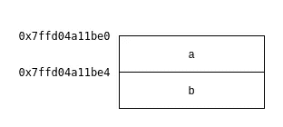
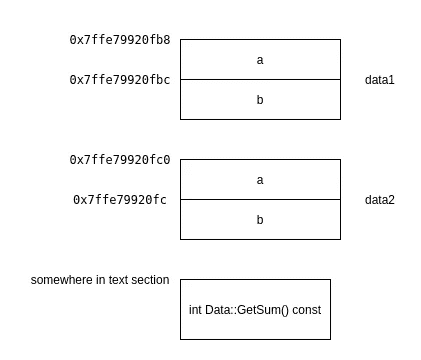
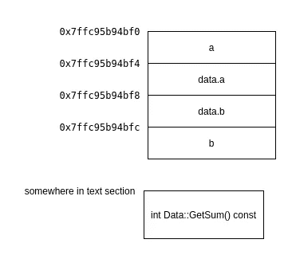
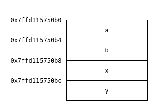
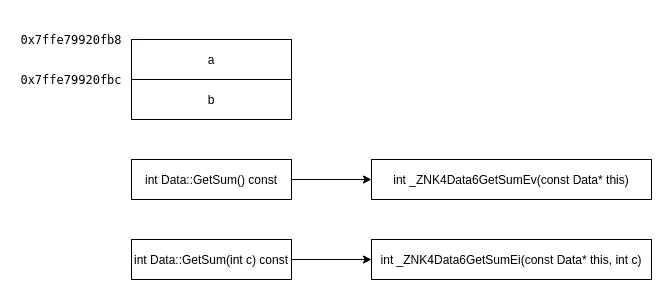
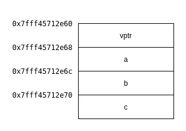

# C++基础:理解对象模型

> 原文：<https://towardsdatascience.com/c-basics-understanding-object-model-b8152c8a4bcf?source=collection_archive---------18----------------------->

当你开始学习 C++的时候，首先要了解的是对象模型。在你理解了对象模型之后，其他的一切都将变得有意义。


阿诺·弗朗西斯卡在 [Unsplash](https://unsplash.com?utm_source=medium&utm_medium=referral) 上的照片

# 介绍

C++可能很难学，尤其是如果你来自 Python 这样的高级编程语言。通过了解基础知识来开始你的学习之旅是非常重要的。

其中之一就是理解一个物体是什么。它在记忆中是如何表达的，以及它与语言中的其他概念是如何联系的。

在本文中，我们将研究 C++中对象模型的细节。

# 对象模型

我们从理解对象的定义开始。在 C++标准中，对象是内存中的一个存储区域。

看到它是如何存储在内存中的，会更容易理解。假设我们有下面的结构。

## 普通旧数据— POD

它非常简单，只有两个整数。根据我们声明对象的位置，可以在数据、堆栈或堆中创建对象。但是对于这个例子，让我们假设我们将它声明为一个局部变量，因此存储在堆栈中。如果我们打印地址，我们会得到:

```
start addr: 0x7ffd04a11be0
a: 0x7ffd04a11be0
b: 0x7ffd04a11be4
```

就像 C 语言**中的*结构*一样，我们的对象只是内存中两个整数的集合。**

## 具有成员函数

现在，让我们看看当我们在结构中添加一个成员函数时会发生什么。

当我们打印成员变量的地址时，它们保持不变:

```
start addr: 0x7ffd04a11be0
a: 0x7ffd04a11be0
b: 0x7ffd04a11be4
```

这是因为函数存储在其他地方——在文本/代码部分，而不是数据/堆栈/堆中成员变量存储的一部分。



内存中的对象(图片由作者提供)

成员函数就像非成员函数一样，只要程序运行，它们就存在于文本/代码部分。

## 多重实例化

如果我们构造两个物体呢？就像下面的代码一样。

正如你所猜测的，我们在内存中的不同区域有两个对象:

```
start addr of data1: 0x7ffe79920fb8
data1.a addr: 0x7ffe79920fb8
data1.b addr: 0x7ffe79920fbcstart addr of data2: 0x7ffe79920fc0
data2.a addr: 0x7ffe79920fc0
data2.b addr: 0x7ffe79920fc
```

但是成员函数呢？它只有**一个**，存储在**文本**部分。



内存中的多个对象(图片由作者提供)

现在，你会想当我们调用 ***GetSum()*** 时会发生什么？它如何知道使用哪些数据？

这就是 ***的神奇之处，这个*** 指针发挥了它的作用。编译器将 ***这个*** 指针添加到我们的函数中，并修改函数内部的成员访问。

除了添加隐藏的 ***这个*** 指针，编译器还将 ***const*** 关键字移入括号内，所以现在***const***cv-qualifier 也开始有意义了。就是说 ***这个*** 指针是一个指向常量对象的指针。

除此之外，编译器将我们函数的名称改为如下形式:

成员函数被编译器重命名，它就像一个非成员函数。

在调用方，编译器修改代码，将对象的地址传递给函数，以便函数可以使用正确的对象。

现在我们已经解决了这个由编译器执行的魔术，并且理解了它是如何工作的。这里似乎没有什么新奇的东西，就像我们在 C 编程语言中做的一样，只是现在编译器为我们做了。

## 静态成员函数

在我们理解了编译器如何修改我们的函数之后，现在就很容易理解什么是静态成员函数了。

对于静态成员函数，编译器不添加 ***这个*** 指针它只改变函数的名字。

静态成员函数和非成员函数之间的唯一区别在于我们如何调用它们(作用域)。

# 更复杂的对象

现在让我们看看更复杂的对象，比如具有用户定义类型(非原语)、继承和多态的对象。

## 用户定义的类型

我们已经看到了一个带有基本成员的简单结构，现在让我们看一个更复杂的例子。

地址打印如下:

```
start addr of complexData: 0x7ffc95b94bf0
complexData.a addr: 0x7ffc95b94bf0
complexData.data.a addr: 0x7ffc95b94bf4
complexData.data.b addr: 0x7ffc95b94bf8
complexData.b addr: 0x7ffc95b94bfc
```

所以没什么特别的。它们就像我们订购时那样摆放。



使用用户定义的类型(按作者分类的图像)

## 遗产

就像用户定义的类型一样，数据的布局和继承没有什么特别的。请参见以下示例:

这是它在内存中的样子:



继承(作者图片)

父代成员放在子代成员之前。

## 多态性

这就是我们引入静态与动态绑定概念的地方。在这个上下文中，绑定指的是将函数调用和函数定义链接起来的过程，更准确地说是函数在内存中的地址。

静态绑定是指过程发生在编译时，而动态绑定是指过程发生在运行时。

在 C++中实现多态性需要这些过程。

多态的一种形式是**函数重载**，这是一个创建同名但参数不同的函数的过程。让我们看看我们的例子。

实际情况是，我们在内存中有两个不同的函数，名字不同。



函数重载(图片由作者提供)

函数调用到函数定义的链接可以在编译时完成，因为所需的信息在编译时是可用的。编译时还会链接以下内容:

*   正常函数调用
*   运算符重载

多态的另一种形式是**函数覆盖**，这是一个创建函数来覆盖基类/父类的函数的过程。基类和子类中的两个函数具有相同的名称和参数。请看这个例子:

您可能已经猜到，这段代码在编译时会产生两个不同的函数:

```
int Data::GetSum(const Data* this);
int ComplexData::GetSum(const ComplexData* this);
```

就像函数重载的例子一样，链接发生在编译时。这个代码

```
int main()
{
  Data data;
  ComplexData complexData;

  int b = complexData.GetSum();
  int a = data.GetSum();

  return 0;
}
```

在编译时更改为以下内容

```
int main()
{
  Data data;
  ComplexData complexData;

  int a = ComplexData::GetSum(&complexData);
  int b = Data::GetSum(&data);

  return 0;
}
```

## 虚拟功能

我们想用**函数覆盖**做的一件事是能够从基类访问不同类型的子类，这提供了一个有用的抽象机制。当我们编写这段代码时:

```
void PrintSum(const Data& data)
{
  std::cout << data.GetSum() << "\n";
}int main()
{
  ComplexData complexData;
  PrintSum(complexData);

  return 0;
}
```

我们想要**的*数据。GetSum()*** 调用***complex Data::GetSum()***，而不是***Data::GetSum()***。

现在的问题是，我们在编译时没有信息将调用者链接到正确的函数定义。编译器只知道在 ***PrintSum()*** 函数中类型是 ***数据*** 。

这里我们可以使用**动态绑定**来强制编译器在运行时在调用者和正确的函数定义之间进行匹配。在 C++中，这可以通过在基类的函数声明中添加虚拟关键字来实现。

有了这个声明，在这段代码中

```
void PrintSum(const Data& data)
{
  std::cout << data.GetSum() << "\n";
}int main()
{
  ComplexData complexData;
  PrintSum(complexData);

  return 0;
}
```

**数据*。GetSum()*** 会正确调用***complex data::GetSum()***。

## 虚拟指针和虚拟表

现在，让我们来看看当我们在类中使用**虚拟**函数使动态绑定成为可能时，我们的对象会发生什么。



虚拟函数覆盖(图片由作者提供)

我们的对象现在看起来不同了，我们有了一条额外的信息来存储名为**虚拟指针的**虚拟表**的地址— vptr** 。

**虚拟表**是一个函数查找表，用于将调用者链接到正确的函数定义。它通常存储在**文本/常量部分**中。

我们现在可以明白为什么这个过程被称为动态/后期绑定了。因为调用函数的过程是通过 **vptr** 完成的。

vptr 是怎么设置的？它在构造函数中设置，从基类开始，直到层次结构中最低的派生类。对于我们的示例，如下所示:

```
Data::Data()
{
  vptr = &data_vtable;
}ComplexData::ComplexData()
{
  vptr = &complexData_vtable;
}
```

它首先被设置为基类 **Data** 的 vtable，然后被设置为派生类 **ComplexData** 的 vtable。

现在我们明白了为什么我们的程序可以在不知道对象类型的情况下调用正确的函数。

# 结论

在我看来，在理解更高层次的概念之前，先理解好基本面是非常重要的。

通过理解对象在 C++中是如何建模的，我们可以理解为什么我们必须以特定的方式编写 C++代码。同样重要的是，我们知道何时以及为什么我们需要使用动态绑定和静态绑定。

我们也知道为什么人们说使用虚函数是有“成本”的，因为动态绑定的代码中有额外的步骤。

我希望这些信息对你有用。

# 参考

     