# 用于数据处理的 C++内存分配/释放

> 原文：<https://towardsdatascience.com/c-memory-allocation-deallocation-for-data-processing-1b204fb8a9c?source=collection_archive---------4----------------------->

## 理解如何管理内存将有助于我们更明智地分配/释放内存。


[附身摄影](https://unsplash.com/@possessedphotography?utm_source=medium&utm_medium=referral)在 [Unsplash](https://unsplash.com?utm_source=medium&utm_medium=referral) 上拍照

# 概观

除非您正在运行 RTOS 或裸机的资源非常有限的嵌入式系统上工作，否则几乎肯定需要动态分配内存来处理数据。在 C++中有许多动态分配内存的方法，比如使用 **new** 和 **delete** 操作符以及它们的对应操作符 **new[]** 和 **delete[]** 、 **std::allocator** ，或者 C 的 malloc()。

无论采用哪种方法，系统都必须连续分配内存块。

C++ STL 提供了许多方便的库，比如容器，它们也在内部动态分配内存。C++中的动态内存分配随处可见。

在本帖中，我们将讨论在 C++中如何管理内存，以便我们可以更明智地使用它。

# 存储配置

## 物理和虚拟内存

请记住，这个内存布局是用户空间应用程序的虚拟内存布局。在像 Linux 这样的系统中，物理内存大体上分为内核空间和用户空间，对于应用程序，我们说的是用户空间。此外，系统中的每个进程都分配有虚拟内存，该虚拟内存通常大于可用内存。例如，在一个 4GB 内存的系统中，每个进程都假设它拥有所有可用的内存。

## C++内存布局

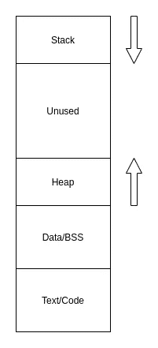

C++内存布局(图片作者提供)

这是我们的应用程序的虚拟内存的布局。在这篇文章中，我们对堆段感兴趣，堆段是我们用来动态分配内存的段。

Text/Code 是存储代码指令的地方，data/BSS 是存储全局数据(已初始化/未初始化)的地方，stack 是用于管理函数调用和局部变量的调用栈。

# 操作系统如何管理堆？

不同的操作系统管理堆内存的方式不同，为了让本文直观地理解堆内存的管理方式，我们假设有一个类似 unix 的系统，比如 Linux。

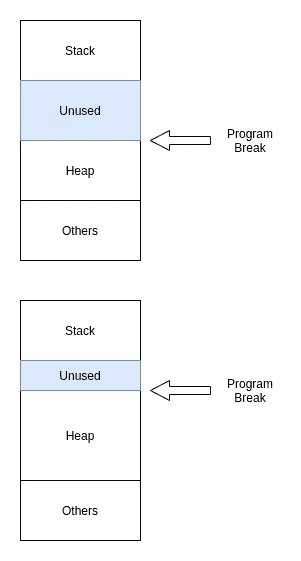

控制程序中断地址以分配/取消分配内存(作者图片)

在 Linux 中，我们可以通过调整程序中断来分配/释放内存，程序中断是当前的堆限制。用户空间应用程序可以通过使用 unistd.h 中包含的系统调用 brk()和 s brk()来调整它，有关详细信息，请参见[手册页](https://man7.org/linux/man-pages/man2/brk.2.html)。

不建议以这种方式手动管理内存，因为这样容易出错。我们拥有的第一级抽象是由 C 运行时提供的内存分配库，malloc()系列。

# 动态内存分配

与直接调用系统调用相比，C 标准库提供了一种更方便的分配/释放内存的方式。它提供:

*   malloc():根据给定的大小分配内存
*   free():释放以前分配的内存
*   realloc():调整先前分配的内存大小
*   calloc():为对象数组分配内存

使用这种方法不容易出错，因为应用程序不需要知道当前的堆限制。它所要做的就是通过传入大小来请求内存块，一旦完成了对内存的处理，就通过调用 free()来请求释放内存。

```
int *ptr = (int *) malloc(sizeof(int));
free(ptr);
```

malloc()系列 API 使用 brk()、sbrk()和 mmap()系统调用来管理内存。这是抽象的第一层。

## malloc()是如何工作的？

实现细节可能因编译器和操作系统而异，但这里我们将概述 malloc()所做的内存管理。

在内部，malloc()通过在应用程序请求的每个内存块中添加元数据来管理内存。出于本文的目的，我们假设它的元数据中有两条信息:

*   大小
*   分配状态(使用中/空闲)

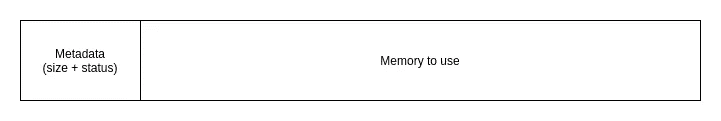

Malloc 内存块(作者图片)

当您调用 malloc()、realloc()或 calloc()时，它会在内存中搜索符合您所请求大小的空闲区域。

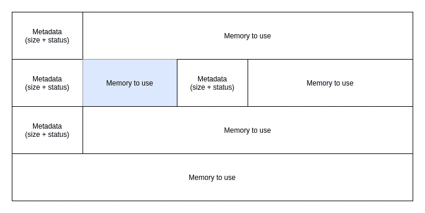

malloc 示例(图片由作者提供)

例如，在上图中，可用块显示为蓝色。如果大小合适或更小，块将被重用，否则如果内存中的空闲区域在系统中仍然可用，malloc()将通过调用 brk()、sbrk()或 mmap()系统调用来分配新的内存。

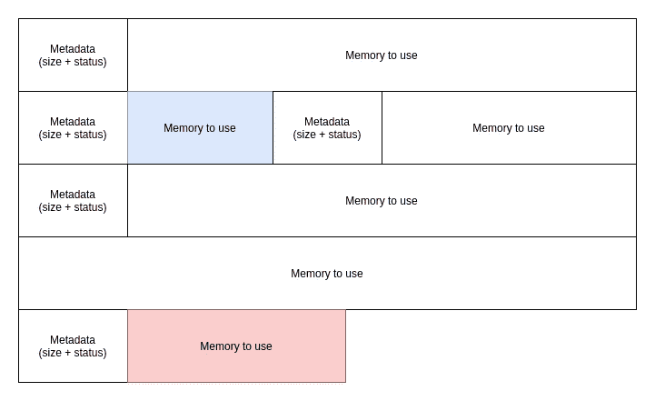

分配新块(图片由作者提供)

如果系统中没有可用的内存，malloc()将失败并返回 NULL。

## 存储器分配

当你想分配内存块的时候，在引擎盖下发生的是一个搜索。有多种策略，例如:

*   First-fit:首先遇到的 fit 内存块
*   下一个 fit:第二个遇到的 fit 内存块
*   最合适的:就尺寸而言最合适的

并非在所有情况下，我们请求的大小都与可用的空闲块匹配，大多数情况下，只有部分可用的空闲块会被使用，并且这些块会被拆分。

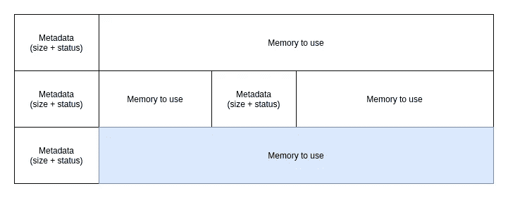

蓝色的可用区块(图片由作者提供)

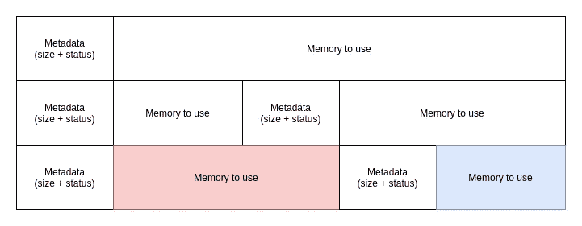

以红色分配的内存(图片由作者提供)

## 内存释放

当您释放内存时，它不会返回给系统。只有其元数据被改变以反映其现在未被使用的状态。

当内存被释放时，可能发生的一件事是空闲块合并。相邻的空闲块可以合并成一个更大的块，用于更大的请求。

如果当前我们在中间有一个小的空闲块，如下图所示:


当前状态(作者图片)

我们解放了最后一个街区:


另一个块被释放(作者图片)

它们将结合形成更大的块:


最终模块(图片由作者提供)

## 内存重新分配

正如您可能已经猜到的，内存重新分配，即当我们调用 realloc()时，只是分配内存+将现有数据复制到新分配的区域。

## 内存碎片

内存碎片是指 ***小内存块*** 在较大内存块之间分配的情况。这种情况会导致系统无法分配内存，即使大部分区域可能未分配。

下图说明了这种情况:

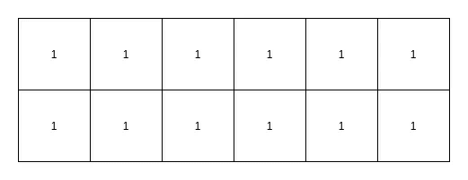

全部免费(图片由作者提供)

我们分配 3 个数据块、1 个数据块和 8 个数据块:

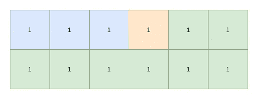

所有已分配(图片由作者提供)

然后，我们释放 3 个块和 8 个块:

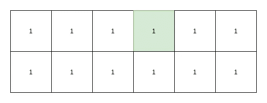

释放两块内存(图片由作者提供)

现在，我们想要分配 9 个块，尽管我们总共有 11 个空闲块，但是它们都是碎片，还是失败了。

当您的程序在运行时频繁地在堆上分配/释放小对象时，很可能会发生这种情况。

# C++动态内存分配

现在我们已经看到了系统中的第一级抽象，我们可以看到 C++提供的下一级抽象。

## 新建和删除运算符

在 C++中，当我们想从自由存储(或者我们可以称之为堆)中分配内存时，我们使用 **new** 操作符。

```
int *ptr = new int;
```

为了解除分配，我们使用了**删除**操作符。

```
delete ptr;
```

与 C 编程语言中的 malloc()相比，不同之处在于**新的**操作符做了两件事:

*   分配内存(可能通过调用 malloc())
*   通过调用对象的构造函数来构造对象

类似地， **delete** 操作符做两件事:

*   通过调用对象的析构函数销毁对象
*   释放内存(可能通过调用 free())

以下代码显示了这一点:

C++中的新建和删除操作符(由作者编写代码)

为了分配内存和构造对象数组，我们使用:

```
MyData *ptr = new MyData[3]{1, 2, 3};
```

为了销毁和解除分配，我们使用:

```
delete[] ptr;
```

如果我们已经分配了内存块，并且只想构造一个对象，我们可以使用所谓的**放置 new** 。

```
typename std::aligned_storage<sizeof(MyData), alignof(MyData)>::type data;
MyData *ptr = new(&data) MyData(2);
```

第一行将分配在堆栈上存储 MyData 对象所需的内存(假设这些代码行在一个函数中)，第二行将在该位置构造对象，而不分配新的内存。这里要小心，因为我们不应该在 ptr 上调用 **delete** 。

## 标准::分配器

如你所知 STL 容器如 std::vector，std::deque 等。内部动态分配内存。它们允许您使用自己的内存分配器对象，但是通常情况下，我们使用默认的对象 std::allocator。

他们不使用 **new** 和 **delete** 操作符的原因是他们想分别分配内存和创建对象。例如，std::vector 通过将当前大小增加一倍来动态增加内存以优化速度，更多详细信息请参见我的另一篇文章。

[](/c-basics-array-data-structure-c25b8ad4d32c) [## C++基础:数组数据结构

### C++提供了不同类型的数组，了解它们的内部工作方式将有助于我们选择正确的类型…

towardsdatascience.com](/c-basics-array-data-structure-c25b8ad4d32c) 

我们可以认为 std::allocator 会调用 malloc()，尽管它可能会做一些其他的事情，比如为优化预分配内存。

## 智能指针

到目前为止，我们所看到的一切都没有解决手动内存管理的问题，分配和释放内存的责任在于开发人员。众所周知，手动内存管理会导致如下问题:

*   内存泄漏，当我们忘记释放内存时
*   崩溃/未定义的行为，当我们试图释放已被释放或双释放的内存时
*   当我们试图访问已经释放的内存块时，出现崩溃/未定义的行为

由于性能和便利性的权衡，C++没有隐式的垃圾收集器来自动管理内存。但它在智能指针中有一个显式的垃圾收集器，当对象超出范围或没有其他对象引用它时，它会自动分配内存和释放内存。

它们是:

*   管理不可复制的另一类型指针的对象(唯一的)
*   std::shared_ptr
    类似于 unique_ptr，但是可以通过使用引用计数来共享所有权
*   std::weak_ptr
    一个不拥有的对象，它拥有对指针的引用，但不拥有它

大多数情况下，您应该使用智能指针，并忘记何时释放内存。我们可以在将来的另一篇文章中讨论细节。

# 其他内存管理库

在内存管理中，我们可能还需要考虑其他一些事情，比如减少使用内存池分配/释放内存时的开销，或者在某些情况下，我们可能需要特别注意小对象分配。我们将在以后的文章中讨论它们。

# 摘要

关于如何在 C++中分配/释放内存，有多个抽象层次。了解它们非常重要，因为我们不仅知道应该使用哪个级别，还知道在我们的应用程序中可能会出现什么问题。下图说明了不同级别的 API。

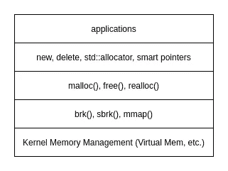

C++中不同级别的内存管理(图片由作者提供)

[](https://debby-nirwan.medium.com/subscribe) [## 每当王思然·尼旺发表文章时，就收到一封电子邮件。

### 每当王思然·尼旺发表文章时，就收到一封电子邮件。通过注册，您将创建一个中型帐户，如果您还没有…

debby-nirwan.medium.com](https://debby-nirwan.medium.com/subscribe)