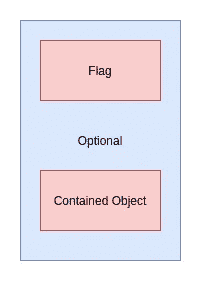
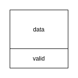

# C++:可选对象，可能包含另一个对象

> 原文：<https://towardsdatascience.com/c-optional-object-that-may-contain-another-object-f04d5cfb6b63?source=collection_archive---------17----------------------->

使用第一原则思维来学习更好地编码以处理我们的数据。了解可选对象能解决什么问题，分解它，并重新构建它

穆罕默德·拉赫马尼在 [Unsplash](https://unsplash.com?utm_source=medium&utm_medium=referral) 上的照片

# 概观

从 C++17 开始，C++标准库提供了 **std::optional** ，这是一个管理可选包含值的类模板。*可选的*类型或者有时也叫*可能*类型代表一个可选值的封装。

在这篇文章中，我将介绍 **std::optional** 解决的问题，描述解决这些问题的需求，最后构建一个简单版本的可选类来演示它是如何工作的。

# 可选对象解决的问题

在我们代码中的一些场景中，我们会面临这样的情况:我们希望从函数中返回一个可选对象，或者在函数中接受可选参数。例如，在下面的代码中，我们希望返回一个只有在满足某些条件时才可用的数据对象。

另一个例子是当我们想设置数据，但有时他们不可用，我们希望函数检查和决定。

如果不使用像 **std::optional** 这样的类模板来包装数据对象，在 C++17 之前，我们可以使用以下技术。

## 用一个标志将我们的数据包装在一个结构/类中

我们可以创建以下结构， **OptionalData** :

我们是这样调用这个函数的:

这种技术不仅增加了大小开销(bool + padding)，还增加了构造数据对象的时间开销，当数据对象无效时，这是不必要的。

## 使用指针包装我们的数据

为了避免在不需要的时候构造数据对象，我们可以使用智能指针，比如 **std::unique_ptr** 来包装我们的数据。当条件不满足时，我们可以返回 **nullptr** 。

在呼叫者方面，它看起来是这样的:

与前一种技术相比，这种技术要好得多，但是代码不是很有表现力，因为为此目的使用指针不能很好地解释函数的意图。

**返回多个值**

从 C++11 开始，我们可以使用 **std::tuple** 返回多个值，或者在这种情况下我们想返回两个值，可以使用 **std::pair** 。这可能是最常用的技术。

在呼叫端，它看起来是这样的:

从语义上来说，这种技术与我们的第一种技术相同，在第一种技术中，我们将数据对象包装在一个结构中。因此，它遭受同样的问题，此外，程序员必须记住是否使用“第一”或“第二”。

## 传入指针并返回布尔状态

我们也可以使用类似 C 的技术，传递一个指针并返回一个布尔值。

在呼叫端，它看起来是这样的:

我们不仅在这里使用了可能被认为是不安全的原始指针，而且尽管它是有效的并且总是需要构造数据对象，但是它的表达性较差。

## 问题

我们现在可以列出上述各种技术存在的问题，如下所示。

1.  他们没有清楚地传达意图。我们的目的不是获取一个指针或一对对象，而是希望在数据对象可用时可以选择获取它
2.  其中一些不必要地构造了数据对象
3.  对于类似 C 的技术，它是不安全的，尤其是如果指针是从空闲存储/堆中分配的

# 我们如何解决这些问题？

从上面列出的问题来看，这些是我们的需求。

1.  可选对象必须包含真实对象
2.  包含的对象应该在可选对象内(不是动态分配的)
3.  可选对象可能为空
4.  所包含的对象可以稍后设置
5.  包含的对象可能在可选对象之前被销毁

包含另一个对象的可选对象(图片由作者提供)

# 编写简单的可选对象

我们构建可选对象来理解 **std::optional** 是如何工作的。我们省略了大部分接口，把注意力集中在存储对象的主要内容上。

第一个要求是包含任何对象，并有一个标志来检查它是否为空。

但是这和我们上面的第一个技术是一样的，只是现在它是一个类模板。我们希望可选对象在默认情况下不构造包含的对象。实现它的一种方法是使用 **std::aligned_storage** 为包含的对象保留空间。

这里发生的情况是，被包含的类型没有被存储，但是当我们构造可选对象时，存储它所必需的空间被保留。

可选对象内存布局(图片由作者提供)

当我们构造一个空的可选对象时，我们只初始化这两个对象。为了初始化包含的对象，我们使用**放置 new** ，即使用 new 运算符在现有位置构造一个对象。

另一种方法是使用**匿名联合**，这可能是一种更好、更干净的方法。

下一个要求是，我们可能希望在销毁可选对象之前销毁包含的对象，为此我们添加了 reset()函数。

我们可能还想稍后设置包含的对象，如下例所示:

为此，我们可以实现复制赋值和移动赋值操作符。

我们可以用类似的方式实现移动赋值操作符。通过调用**可选<数据>(常量数据& t)** 构造器，然后调用复制赋值操作符，首先将**数据**对象隐式转换为**可选<数据>** 类型。

## 其余的接口

为了获得包含的对象，我们可以很容易地实现 **value()** 函数，如果包含的对象存在，则返回该对象，否则抛出异常。

其余的接口可以很容易地实现，在这篇文章中没有全部展示，因为它可能会变得太长。可以看这个[页面](https://en.cppreference.com/w/cpp/utility/optional)看其他界面。

## 现有 std::optional 的其他改进

可以对现有的 **std::optional** 进行进一步的改进。在某些情况下，我们可能希望根据可选对象的状态调用其他函数。

为此，根据此[页面](https://en.cppreference.com/w/cpp/utility/optional)，C++23 将添加以下内容:

*   and_then(f)
    如果返回的可选对象包含另一个对象，则执行可调用的‘f’可以返回**任何**类型，否则返回空的可选对象。
*   transform(f)
    如果返回的可选对象包含另一个对象，则执行可调用的‘f’返回**可选的**类型，否则返回空的可选对象。
*   or_else(f)
    如果返回的可选对象为**空**，则执行可调用的‘f’返回可选类型，否则返回可选对象。

它们被称为[一元函数](https://en.wikipedia.org/wiki/Monad_(functional_programming))，其工作是抽象出样板代码，我们可以以更简单、更易读的形式修改上面的代码。

# Python 中的类似功能

您可能已经意识到，在 Python 中，我们可以通过不返回任何对象来轻松实现可选对象。

在 C++中，我们必须使用 C++标准库中的 std::optional 来实现这一点。

# 摘要

关键要点是:

*   我们使用 **std::optional** 使我们的代码更具表现力
*   **std::optional** 包含对象本身，这取决于它的存储位置(堆栈/数据/堆)
*   **std::optional** 复制包含的对象
*   一元函数将被添加到 **C++23** 中，通过消除编写样板代码的需要来改进我们代码中的抽象

 [## 每当王思然·尼旺发表文章时，就收到一封电子邮件。

### 每当王思然·尼旺发表文章时，就收到一封电子邮件。通过注册，您将创建一个中型帐户，如果您还没有…

debby-nirwan.medium.com](https://debby-nirwan.medium.com/subscribe)