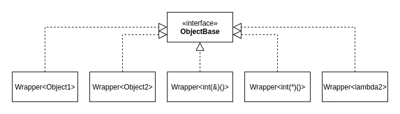
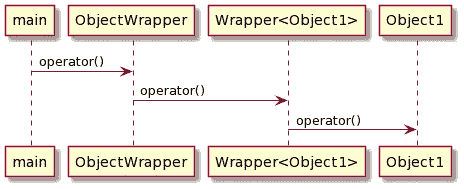

# C++类型擦除:包装任何类型

> 原文：<https://towardsdatascience.com/c-type-erasure-wrapping-any-type-7f8511634849?source=collection_archive---------2----------------------->

## 了解如何用 C++编写类中任何类型的包装器，以提高代码的抽象层次。

[Unsplash](https://unsplash.com?utm_source=medium&utm_medium=referral) 上 [AltumCode](https://unsplash.com/@altumcode?utm_source=medium&utm_medium=referral) 拍摄的照片

# 介绍

我们从泛型编程、面向对象编程和 Duck Typing 概念的一些基础知识开始，以理解这种技术试图解决什么问题。我们将在这篇文章的最后一步一步地介绍细节。

# 通用编程

泛型编程是指一种编程风格，其中函数或算法被编写为接受不同类型，而不是单一类型。在 C++中，你可以用**模板**来实现这一点。

使用模板，我们可以要求编译器根据代码中使用的类型为我们生成函数/类。这有助于我们避免多次编写类似的代码块，以保持代码整洁。这里有一个简单的例子:

我们可以如下创建一个模板，而不是编写上面的两个函数。

只有在我们需要的时候，编译器才会为我们生成函数。例如，当我们将这些调用添加到我们的 **main()** 函数中时:

编译器将生成这些函数:

# 统一界面

一些基本的编程原则包括“不要重复自己— DRY”，这是为了避免我们的代码中出现重复。方法之一是创建一个统一的接口。

为了更好地理解这个想法，让我们看一个例子。假设我们想要创建一个函数，它接收任何具有 *Id* 的类型，我们可以通过调用我们想要打印的 **GetId()** 函数来获得这个类型，让我们调用我们的函数 **PrintId()** 。

假设我们有如下两个不同的类型和一个自由函数，我们也可以添加 lambdas。

简单的解决方案是为我们想要打印的每种类型编写函数重载:

下面是我们调用它们的方法:

第三个函数可以处理自由函数和**无捕获** lambdas。它对**无捕获** lambdas 有效，因为它们**衰减**成函数指针。

这里我们想要解决的问题是，我们想要一个能够接受上述所有类型的函数。

## 多态性

首先想到的是使用继承，这是 OOP 中的一个概念。我们可以创建一个接口，抽象基类 ABC，并让对象继承或实现它。

并且只实现了一个 **PrintId()** 函数:

显然，当我们传递不同的类型时，比如函数指针，它就不起作用了。

## 模板

说到统一接口，还有一个来自 Python 编程语言的概念叫做 [**鸭子打字**](https://realpython.com/lessons/duck-typing/#:~:text=Duck%20typing%20is%20a%20concept,a%20given%20method%20or%20attribute.) 。这基本上意味着我们不需要知道对象的类型，只要它支持我们需要的行为。在我们的例子中，我们需要一个不接受任何东西并返回一个 int 的行为/函数， **int(*behavior)()** 。

在 C++中，我们可以使用模板来实现同样的事情。Python 的不同之处在于，Python 中的检查是在运行时进行的，而 C++是在编译时进行的。

现在， **Object1** 和 **Object2** 不需要相互关联，只要有一个名为 **GetId** 的函数就可以了。在引擎盖下，我们实际上有两个不同的函数(参见关于泛型编程的第一部分)。

但是，我们仍然不能调用自由函数和 lambdas，因为它们没有一个名为 **GetId()** 的函数。

## 使用仿函数使其更通用

我们可以通过使用仿函数来改变我们的类和 **PrintId()** 函数，使其更加通用。如果你需要更多的细节，请阅读我关于 C++ Lambda 的帖子。

</c-basics-understanding-lambda-7df00705fa48>  

有了这个变化，所有类型都可以工作了。

在引擎盖下，我们有许多由编译器生成的函数，它们是:

第一个 lambda 通过在前面添加“+”运算符隐式转换为函数指针。

现在看起来我们有了解决方案，但是我们还有一个问题要解决。

> 如果我们想把对象存储到一个数组中呢？

# 用相同的行为包装任何类型

在我们代码的某些场景中，我们希望将可调用对象存储到一个数组或其他容器中。就我们目前的实现而言，这是不可能的，因为我们没有 STL 容器所需的单一类型，比如 **std::vector** 。举一个具体的例子，如果我们将 **PrintId()** 函数改为:

我们将会有编译错误，因为我们还没有实现 **ObjectWrapper** 类。

## 创建任何类型的包装

为了解决这个问题，我们需要一个单独的类来包装所有不同类型的对象。这就是我们在 C++中使用**类型擦除**技术的地方。让我们一步一步地构建我们的包装器。我们的包装类必须:

## 公开公共接口

我们的包装器首先需要提供统一的接口，在我们的例子中，它是***int(* behavior)()***。

## 复制传递的对象

我们的包装类必须管理对象的生存期，以避免使用悬空引用或指针。另一个考虑是对象的大小可能相当大，所以我们需要将它们存储在空闲存储/堆中。我们选择使用智能指针。为此我们需要一个新的类型，我们称之为 **ObjectBase** 。

## 多态性

现在我们有了一个名为 **ObjectBase** 的新类型，我们的目标是包装任何类型。解决方案是使用多态性，我们将 **ObjectBase** 作为一个接口，并从编译器那里获得帮助来创建继承它的子类。

子类必须是模板类，这样编译器才能生成它们。

## 提供一个接受不同类型的构造函数(显然)

最后一步是为我们的构造函数创建一个模板函数来接受不同的类型。

## 形象化

为了帮助更好地理解它，用 UML 图可视化我们的包装类是很好的。我们现在可以包装支持我们通用接口的不同类型， ***int(*behavior)()*** 。

我们也可以将它们存储在一个向量中:

类图(图片由作者提供)

实际上，我们有 5 个不同的类实现了 **ObjectBase** 接口。当我们调用 operator()时，会发生以下情况:

当我们调用 operator()时的事件序列(图片由作者提供)

我们可以看到有两个额外的函数调用，这是包装对象的成本。运行时发生的另一个开销是由我们的虚函数引起的动态分派。

## 这种技术的真实例子

现在，我们已经看到了用相同的行为包装任何类型的技术，我们可能想知道在什么情况下使用这种技术。您可能在代码中经常使用的两个示例是:

*   std::function
    一个通用多态函数包装器。
*   std::any
    任何可复制构造类型的单个值的类型安全容器。

# 摘要

在这篇文章中，我们将讨论通过使用 C++中的类型擦除技术来提高代码的抽象层次。通过结合 OOP 和编译时 duck typing——c++中的模板，我们可以创建存储任何类型的包装器。

了解一些库(比如 std::function)是如何实现的，对于避免不必要的使用非常重要。例如，我们可能不希望在我们的算法中调用 std::function 对象一百万次，因为上面描述的函数调用和动态分派的开销。

<https://debby-nirwan.medium.com/subscribe> 