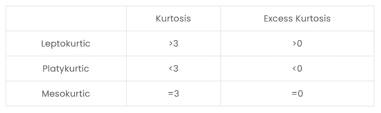

# 用 Python 计算峰度(有例子)

> 原文：<https://towardsdatascience.com/calculate-kurtosis-in-python-with-examples-pyshark-2b960301393?source=collection_archive---------10----------------------->

## 在本教程中，我们将探讨如何在 Python 中计算峰度。


[https://stats . stack exchange . com/questions/84158/分布的峰度如何与密度的几何形状相关](https://stats.stackexchange.com/questions/84158/how-is-the-kurtosis-of-a-distribution-related-to-the-geometry-of-the-density-fun)

**目录:**

*   介绍
*   什么是峰度？
*   如何计算峰度？
*   Python 中如何计算峰度？
*   结论

# 介绍

峰度主要是描述概率分布形状的一种度量，特别是它的“尾部”。

计算的统计值评估给定概率分布的尾部与正态分布相比有多厚或多薄。

其中[偏斜度](https://pyshark.com/skewness-in-python/)关注于根据极值区分分布的尾部(或者仅仅是尾部的对称性)，峰度测量在任何一个尾部中是否有极值(或者仅仅是尾部是重还是轻)。

为了继续学习本教程，我们需要以下 Python 库:scipy。

如果您没有安装它，请打开“命令提示符”(在 Windows 上)并使用以下代码安装它:

```
pip install scipy
```

# 什么是峰度？

在统计学中，峰度是一个概率分布的相对峰值的度量，或者说它的尾部有多重或多轻。峰度值描述了给定概率分布的尾部与正态分布的不同程度。

峰度可以取几个值:


[https://stats . stack exchange . com/questions/84158/how-of-the-kortosis-of-a-distribution-related to-the-geometry of-the-density-fun](https://stats.stackexchange.com/questions/84158/how-is-the-kurtosis-of-a-distribution-related-to-the-geometry-of-the-density-fun)

*   正的过度峰度-当(峰度-3)给出的过度峰度为正时，则分布有一个尖锐的峰，称为细峰分布。
*   负的过度峰度-当(峰度-3)给出的过度峰度为负时，则该分布具有平坦的峰值，并被称为平峰分布。
*   零超额峰度-当(峰度-3)给出的超额峰度为零时，则分布遵循正态分布，也称为中峰度分布。

下面以表格形式总结了上面提到的内容:



# 如何计算峰度？

峰度的度量被计算为分布的第四个标准化矩。

听起来有点复杂？按照下面的步骤，对计算有一个完整的理解。

分布的第*k 个*力矩可以计算为:


如前所述，偏斜度是分布的四阶矩，可计算如下:


并且知道分布的二阶矩是它的方差，我们可以将上面的等式简化为:


其中:


**举例:**

上面是很多公式。为了使这一切成为一个更好理解的概念，让我们来看一个例子！

请考虑以下代表学生考试成绩的 10 个数字序列:

*X* = [55，78，65，98，97，60，67，65，83，65]

计算 x 的平均值，我们得到:x̄=73.3.

求解 m_4:


求解 m_2:


求解 *K* :


# Python 中如何计算峰度？

在这一节中，我们将通过一个例子来计算 Python 中的峰度。

首先，让我们创建一个类似于上一部分的数字列表:

为了计算偏度的 Fisher-Pearson 相关性，我们需要 **scipy.stats.kurtosis** 函数:

我们应该得到:

```
2.0453729382893178
```

注意:在上面的代码中设置 **fisher=False** 会计算 Pearson 的峰度定义，其中正态分布的峰度值= 3。

我们发现，对于给定的数列，峰度值约为 2.05，而过度峰度值约为-0.95。这表明我们有一个比正态分布更厚更平的分布。

# 结论

在本文中，我们讨论了如何使用 scipy 库在 Python 中计算一组数字的峰度。

如果你有任何问题或对一些编辑有建议，请随时在下面留下评论，并查看更多我的[统计](https://pyshark.com/category/python-programming/)文章。

*原载于 2021 年 9 月 2 日 https://pyshark.com*<https://pyshark.com/kurtosis-in-python/>**。**