# 用牛顿-拉夫逊法计算最大似然估计量

> 原文：<https://towardsdatascience.com/calculate-maximum-likelihood-estimator-with-newton-raphson-method-using-r-7d3f69fbf8fe?source=collection_archive---------5----------------------->


卢卡斯·布拉塞克在 [Unsplash](https://unsplash.com?utm_source=medium&utm_medium=referral) 上的照片

## 使用此方法可以帮助您计算模型中任何估计量的最大似然估计量(MLE)。

**动机**

在统计建模中，我们必须计算估计量来确定你的模型的方程。问题是，估计量本身是很难计算的，尤其是当它涉及到一些分布，如贝塔分布、伽玛分布，甚至 Gompertz 分布。

最大似然估计(MLE)是计算这些分布的估计量的许多方法之一。在这篇文章中，我会给你一些例子，用牛顿-拉夫逊法计算最大似然估计。

**概念:MLE**

首先，我们考虑

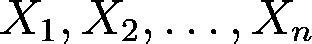

作为具有概率分布函数(PDF)的独立同分布(iid)随机变量

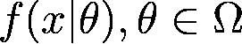

其中参数θ未知。该方法的基础是由下式给出的似然函数

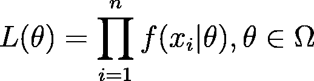

该函数的对数，即对数似然函数，表示为

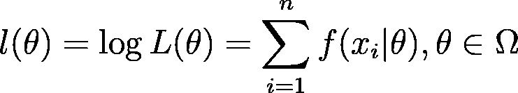

为了确定 MLE，我们确定对数似然函数的临界值；也就是说，最大似然法解了这个方程

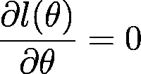

**概念:牛顿-拉夫逊法**

牛顿-拉夫森法是计算函数 *f* 的根的迭代程序。在这种方法中，我们希望通过计算来逼近函数的根

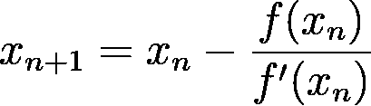

其中 x_{n+1}是第(n+1)次迭代。这种方法的目标是使近似结果尽可能接近精确结果(即函数的根)。

**综合起来:计算最大似然估计的牛顿-拉夫逊方法**

牛顿-拉夫逊方法可用于生成收敛于最大似然估计的序列。如果我们假设θ为一个 *k* × *1* 向量，我们可以迭代

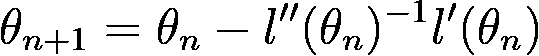

其中 *l'(θ)* 是对数似然函数的梯度向量， *l''(θ)* 是对数似然函数的海森。

**R 中的实现**

对于实现，假设我们有

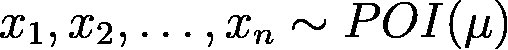

而我们想用 MLE 来估计μ。我们知道泊松分布的 **PDF 为**

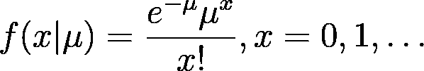

**似然函数**可以写成如下形式。

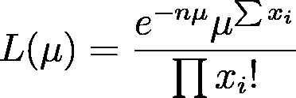

根据上面的似然函数，我们可以将**对数似然函数**表示如下。

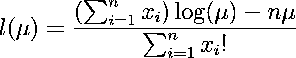

在 R 中，我们可以通过取 PDF 的对数来简单地写出对数似然函数，如下所示。

```
#MLE Poisson
#PDF : f(x|mu) = (exp(-mu)*(mu^(x))/factorial(x))#mu=t
loglik=expression(log((exp(-t)*(t^(x))/factorial(x))))
dbt=D(loglik,"t")
dbtt=D(dbt,"t")
```

然后，我们通过分别运行`dbt=D(loglik,"t")`和`dbtt=D(dbt,"t")`来计算对数似然函数对μ的一阶和二阶偏导数(然后μ对第二个偏导数)。结果如下。

```
dbt=(exp(-t) * (t^((x) - 1) * (x)) - exp(-t) * (t^(x)))/factorial(x)/(exp(-t) * 
    (t^(x))/factorial(x))dbtt=(exp(-t) * (t^(((x) - 1) - 1) * ((x) - 1) * (x)) - exp(-t) * 
    (t^((x) - 1) * (x)) - (exp(-t) * (t^((x) - 1) * (x)) - exp(-t) * 
    (t^(x))))/factorial(x)/(exp(-t) * (t^(x))/factorial(x)) - 
    (exp(-t) * (t^((x) - 1) * (x)) - exp(-t) * (t^(x)))/factorial(x) * 
        ((exp(-t) * (t^((x) - 1) * (x)) - exp(-t) * (t^(x)))/factorial(x))/(exp(-t) * 
        (t^(x))/factorial(x))^2
```

然后，我们可以开始在 r 中创建 Newton-Raphson 方法函数。首先，我们生成泊松分布的随机数作为我们用来计算 MLE 的数据。对于这个函数，我们需要如下这些参数。

*   `n`对于泊松分布的生成数据的数量，
*   `t`为μ值，且
*   `iter`为牛顿-拉夫逊法的迭代次数。

由于均值的泊松分布的 **MLE 是μ** ，那么我们可以如下编写函数的第一行代码。

```
x=rpois(n,t)
x.mean=mean(x)
par.hat=matrix(0,1,1)
estimate=c(rep(NULL,iter+1))
difference=c(rep(NULL,iter+1))
estimate[1]=t
difference[1]=abs(t-x.mean)
```

然后，我们创建循环函数来计算**偏导数的和**(这就是为什么我们只需要将对数似然函数的 PDF 的对数写在 R 中)**、梯度向量**、**Hessian 矩阵**和 **MLE 近似值**，如下所示。

```
for(i in 1:iter)
  {
    #First partial derivative of log-likelihood function with respect to mu
    dbt=(exp(-t) * (t^((x) - 1) * (x)) - exp(-t) * (t^(x)))/factorial(x)/(exp(-t) * 
    (t^(x))/factorial(x))

    #Second partial derivative of log-likelihood function with respect to mu, then mu
    dbtt=(exp(-t) * (t^(((x) - 1) - 1) * ((x) - 1) * (x)) - exp(-t) * 
    (t^((x) - 1) * (x)) - (exp(-t) * (t^((x) - 1) * (x)) - exp(-t) * 
    (t^(x))))/factorial(x)/(exp(-t) * (t^(x))/factorial(x)) - 
    (exp(-t) * (t^((x) - 1) * (x)) - exp(-t) * (t^(x)))/factorial(x) * 
        ((exp(-t) * (t^((x) - 1) * (x)) - exp(-t) * (t^(x)))/factorial(x))/(exp(-t) * 
        (t^(x))/factorial(x))^2

    sdbt=sum(dbt)
    sdbtt=sum(dbtt)

    #hessian matrix
    h=matrix(sdbtt,1,1)

    #gradient vector
    g=matrix(sdbt,1,1)

    #parameter
    par=matrix(t,1,1)
    par.hat=par-solve(h)%*%g
    t=par.hat[1,]
    estimate[i+1]=t
    difference[i+1]=t-x.mean
  }
```

当迭代达到极限时，我们需要计算每次迭代中最大似然估计的实际值和近似值之差，以评估牛顿-拉夫逊方法计算最大似然估计的性能。规则很简单:差异越小，性能越好。我们可以把它写成我们函数的最后几行代码，如下所示。

```
tabel=data.frame(estimate,difference)
rownames(tabel)=(c("Initiation",1:iter))
print(x)
print(tabel)
cat("The real MLE value for mu is :",x.mean,"\n")
cat("The approximated MLE value for mu is",t,"\n")
```

完整的函数如下所示。

```
nr.poi=function(n,t,iter=100)
{
  x=rpois(n,t)
  x.mean=mean(x)
  par.hat=matrix(0,1,1)
  estimate=c(rep(NULL,iter+1))
  difference=c(rep(NULL,iter+1))
  estimate[1]=t
  difference[1]=abs(t-x.mean)
  for(i in 1:iter)
  {
    #First partial derivative of log-likelihood function with respect to mu
    dbt=(exp(-t) * (t^((x) - 1) * (x)) - exp(-t) * (t^(x)))/factorial(x)/(exp(-t) * 
    (t^(x))/factorial(x))

    #Second partial derivative of log-likelihood function with respect to mu, then mu
    dbtt=(exp(-t) * (t^(((x) - 1) - 1) * ((x) - 1) * (x)) - exp(-t) * 
    (t^((x) - 1) * (x)) - (exp(-t) * (t^((x) - 1) * (x)) - exp(-t) * 
    (t^(x))))/factorial(x)/(exp(-t) * (t^(x))/factorial(x)) - 
    (exp(-t) * (t^((x) - 1) * (x)) - exp(-t) * (t^(x)))/factorial(x) * 
        ((exp(-t) * (t^((x) - 1) * (x)) - exp(-t) * (t^(x)))/factorial(x))/(exp(-t) * 
        (t^(x))/factorial(x))^2

    sdbt=sum(dbt)
    sdbtt=sum(dbtt)

    #hessian matrix
    h=matrix(sdbtt,1,1)

    #gradient vector
    g=matrix(sdbt,1,1)

    #parameter
    par=matrix(t,1,1)
    par.hat=par-solve(h)%*%g
    t=par.hat[1,]
    estimate[i+1]=t
    difference[i+1]=t-x.mean
  }
  tabel=data.frame(estimate,difference)
  rownames(tabel)=(c("Initiation",1:iter))
  print(x)
  print(tabel)
  cat("The real MLE value for mu is :",x.mean,"\n")
  cat("The approximated MLE value for mu is",t,"\n")
}
```

对于这个函数实现的例子，假设我们想要计算 100 个泊松分布数据的最大似然估计，其平均值为 5。通过使用上面已经写好的牛顿-拉夫逊法函数，迭代次数为 5，结果如下。

```
> nr.poi(100,5,5)
[1]  5  4  6  9  7  8  7  2  9  4  5  6 10  1  4  8  5  7  4  3  6  3  4  4  4  7  6  6  3  6  5  5  6  4  5  5  9  5
[39]  5  3  5  6  5  8  5  3  3 12  6  5  3  4  8  5  4  5  7  8  8  5  7  2  8  3  6  4  2  3  7  5  3  4  6  5  2  6
[77]  3  3  5  4  8  2  4  7  6  5  4  3  4  7  3  4  6  6  4  7  4  4 14  4
           estimate    difference
Initiation 5.000000  2.400000e-01
1          5.229008 -1.099237e-02
2          5.239977 -2.305956e-05
3          5.240000 -1.014779e-10
4          5.240000  0.000000e+00
5          5.240000  0.000000e+00
The real MLE value for mu is : 5.24 
The approximated MLE value for mu is 5.24
```

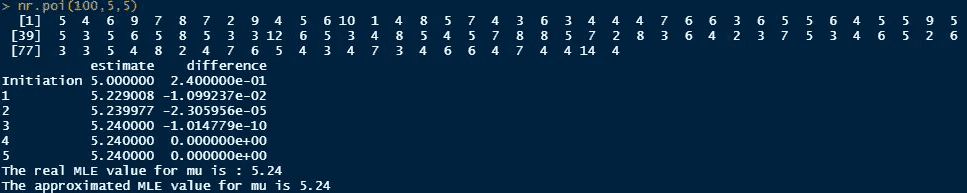

作者图片

从上面的结果中，我们可以看到牛顿-拉夫逊法 MLE 产生的结果与真实的 MLE 值相同。**请注意，该方法使用生成的数据，因此每次运行的结果可能不同。**

**结论**

MLE 可以帮助我们根据对数似然函数计算估计量。我们可以用牛顿-拉夫逊法在数值上逼近极大似然估计的结果。

现在我们在这里，你可以用牛顿-拉夫逊法，用 R 来计算最大似然。关于这个话题的更多讨论，请随时通过 LinkedIn [联系我。](https://www.linkedin.com/in/raden-aurelius-andhika-viadinugroho-b84b19163/)

**参考文献:**

[1] Robert V. Hogg，Joseph W. McKean 和 Allen T. Craig，[数理统计导论，第七版](https://www.pearson.com/us/higher-education/product/Hogg-Introduction-to-Mathematical-Statistics-7th-Edition/9780321795434.html) (2013)，培生教育。

[2]阿迪·本-伊斯雷尔，[《求解方程组的牛顿-拉夫森法》](https://core.ac.uk/download/pdf/82634382.pdf) (1966)，数学分析与应用杂志。

[3]https://book down . org/rdpeng/advstatcomp/newtons-method . html # proof-of-newtons-method