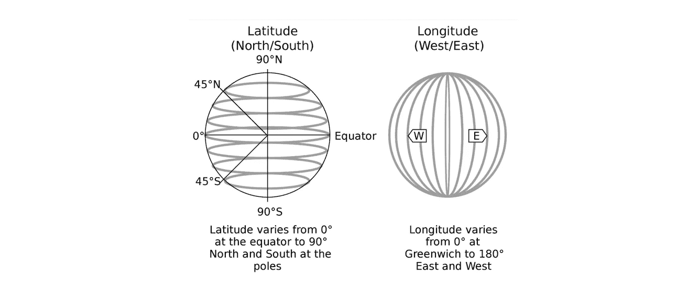
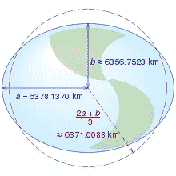
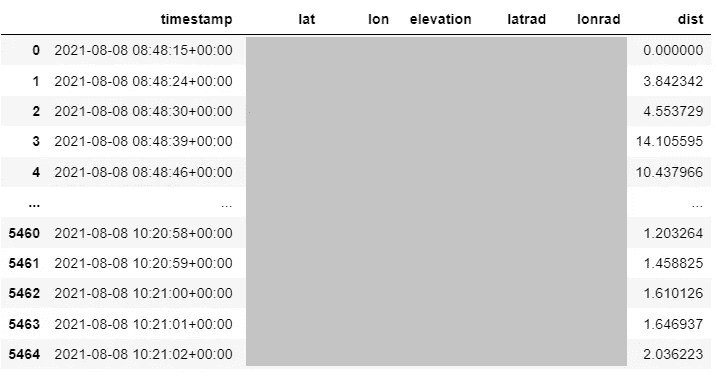
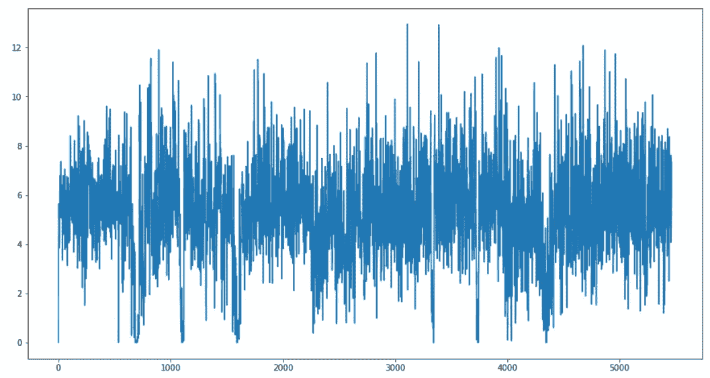
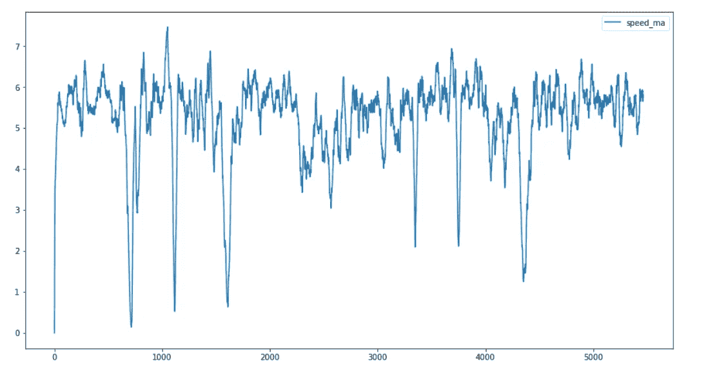
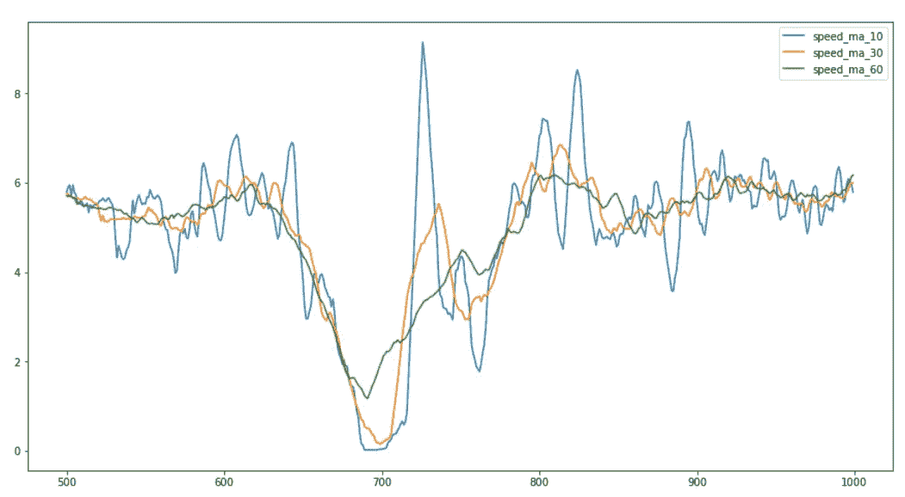
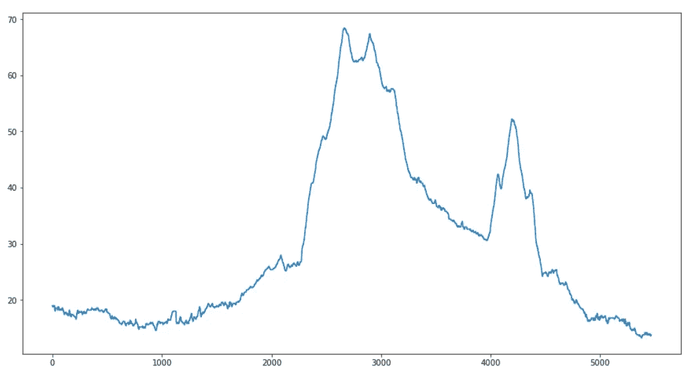
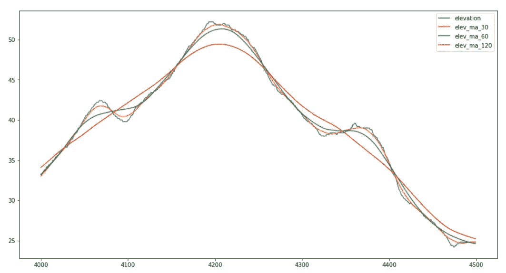
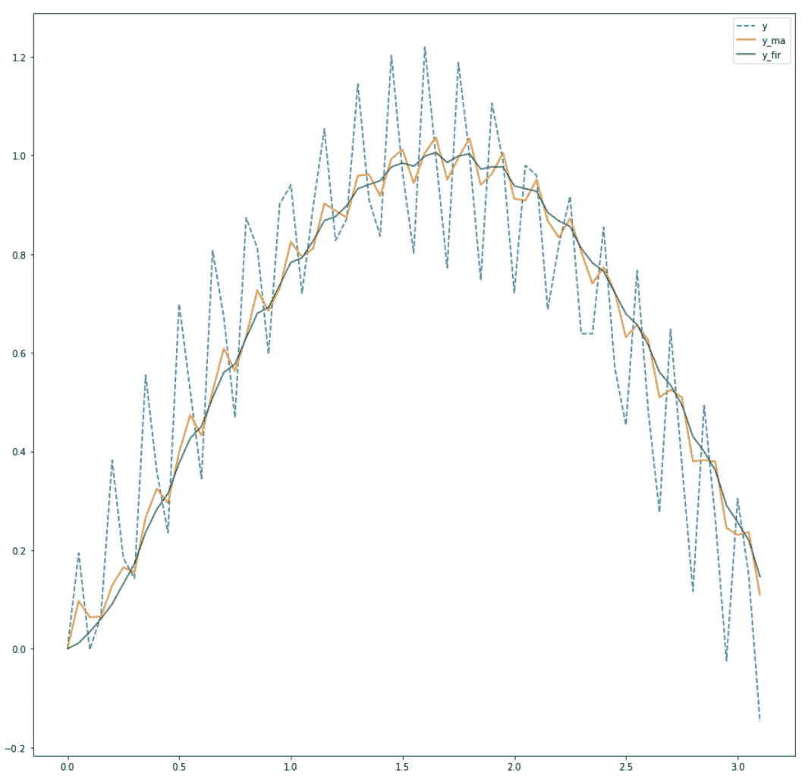

# 从活动跟踪器的日志中计算指标

> 原文：<https://towardsdatascience.com/calculate-metrics-from-the-logs-of-your-activity-tracker-4e84437c3b3b?source=collection_archive---------40----------------------->

## 计算距离，速度和海拔增益从您的活动跟踪器的日志


弗兰克·布施在 [Unsplash](https://unsplash.com?utm_source=medium&utm_medium=referral) 上的照片

## 介绍

前一篇文章描述了如何从你的活动跟踪器或应用程序导入日志文件。我们还创建了一个热图，显示地图上的轨迹。本文将向您展示如何从 gpx 日志文件中计算一些基本指标，如行驶距离、速度和方位。一些活动记录器将这些信息存储在日志文件中，但大多数不这样做。

## 计算行驶距离

从日志文件中计算旅行的距离听起来很简单。测井记录由一系列经度/纬度位置组成，因此计算所有时间之间的距离，并将这些时间相加，即可得出行进的距离。但是计算两个经度/纬度位置之间的距离很繁琐，即使是很短的距离。

我们将尝试几种方法来找到速度和准确性之间的平衡。您可能已经猜到，与低精度相比，高精度需要更多的计算。我们将把上一篇文章中的数据框架用于所有活动，并过滤掉一个:

```
df = df[df.name == 'XXXXX'].reset_index(drop=True)
df = df[['timestamp', 'lat', 'lon', 'elevation']]
```

在这种情况下，我们根据名称过滤一个活动，但也可以使用源文件或开始日期和/或时间。

## 平坦的地球

用 lon/lat 计算距离需要一些三角学知识。三角函数以弧度作为输入。gpx 文件将经度和纬度存储为度数，因此我们首先添加(第 4–5 行)以弧度表示的经度和纬度。

为每个距离公式创建一个名为`dist_xxxx`的方法，计算结果将存储在名为`dist_xxxx`的列中。第 14 行循环所有的实现(到目前为止只有一个)，第 16 行创建列 an，在第一行存储`0`。第 17–19 行调用距离函数，将当前位置和先前位置作为参数。结果存储在适当的列中。第 20 行根据距离公式打印行驶的总距离。

第一个实现假设两点之间的距离是一条直线([勾股定理](https://en.wikipedia.org/wiki/Pythagorean_theorem))。它没有考虑到当你靠近其中一个极点时，经线会彼此靠近。假设这些线平行，经度为 1 度，距离为 110.25 公里。计算很简单，但即使在短距离内，误差也相对较大。结果是 10.8 公里。

```
flat             : 10864.7117
```

## 地球是一个球体

一个简单的改进是假设地球是一个完美的球体。当你越靠近两极，两条经线之间的距离就越小。



纬度和经度(来源:[维基百科](https://en.wikipedia.org/wiki/Geographic_coordinate_system)

这个距离取决于所在位置的纬度。在赤道是 110 公里，但在两极是 0 公里。通过将 110 km 乘以纬度的余弦，应用球体形状(0 度的余弦为 1，90 度的余弦为 0)。

活动日志每隔几秒钟存储一次位置。看起来这些距离的误差可能很小，但是总距离变化很大:

```
flat             : 10864.7117
sphere           :  8057.7413
```

差别是惊人的 26%，但这种差别取决于我活动的纬度。如果在赤道附近记录到这种活动，它将接近于 0。根据上面的结果，你可以计算出该活动是在纬度 50 度附近记录的。所以要小心，由于信息量有限，活动的位置从地球上的某个地方缩小到纬度约为 50 度的范围内。

## 地球是椭球体

那么地球是球体吗？不，它不是，它是一个椭球体。赤道的半径(“水平”)是 6378 公里，从极点到极点的半径(“垂直”)是 6356 公里。



椭圆计算(来源:[维基百科](https://en.wikipedia.org/wiki/Reference_ellipsoid))

FCC 已经定义了[公式](https://en.wikipedia.org/wiki/Geographical_distance)来计算两点之间的距离，其中考虑了这个椭球体形式:

地球的小椭球形对计算的距离有影响:

```
flat             : 10864.7117
sphere           :  8057.7413
ellipsoid        :  8143.150109
```

## 哈弗辛函数

哈弗辛函数是计算球体上两点间距离的另一种方法。最早的查找表形式的实现可以追溯到 1805 年。它是基于哈弗辛的[定律，该定律描述了两点之间的距离，该距离基于它们与网格原点一起形成的三角形。哈弗辛函数没有考虑地球的椭球形状。](https://en.wikipedia.org/wiki/Haversine_formula)

与其他实现相比的哈弗线距离:

```
flat             : 10864.7117
sphere           :  8057.7413
ellipsoid        :  8143.1501
haversine        :  8126.8135
```

还有更多像文森特的公式一样的计算方法。但是从这里我们将采用椭球体实现:

```
df = df[['timestamp', 'lat', 'lon', 'elevation', 'latrad', 
         'lonrad', 'dist_eucledian']]
df = df.rename(columns={"dist_eucledian": "dist"})
```



带有距离栏的活动日志(图片由作者提供)

## 计算速度

所以现在距离有了，就可以计算速度了。速度是距离除以时间，因此我们需要获得两个日志条目之间的时间，并将行驶距离除以该时间(速度单位为 km/h):

那很简单…让我们想象一下结果:

```
df.speed.plot(figsize=(15,8))
```



速度随时间的变化(图片由 auhtor 提供)

的确，这好得令人难以置信。该图显示了一个行走活动，速度肯定不是恒定的，但它是可变的吗？不太可能。这是怎么回事？

正如您在最后打印的数据帧中所看到的，每秒钟都会记录一次该位置。平均速度 1.6 米/秒。但是 Garmin 活动追踪器公认的精确度是 3 米。在实践中，它可以更精确，但会发生一些不准确，并且对于 1 米的预期位移，不准确性相对较高。在整个活动过程中，它会工作(见显示的平均速度 5.1 公里/小时)，但在这个详细的水平上不是那么好。

为了过滤掉极端情况，我们将实现一个平均速度的策略。我们想要每 30 秒的平均速度。为了确定要平均的行数，我们首先确定数据集中两行之间的平均时间。用 30 除以这个数，我们得到要平均的行数。我们使用 dataframe 的`rolling()`函数来创建移动平均值:



速度，移动平均线(图片由作者提供)

这是速度的一个更好的表示。选择 30 秒是基于我的行走习惯。在旅途中，每个地点拍照大约需要 30 秒。使 30 秒的时间间隔更长会使识别这些停车点变得更加困难。

在第一张图中，停车瞬间将速度降至零，30 秒移动平均速度在行程后期降至 1 km/h 或 3 km/h 以下。

让我们看看滚动窗口大小的影响:

```
df['speed_ma_10'] = df['speed'].rolling(window=10, 
                          min_periods=1, center=True).mean()
df['speed_ma_30'] = df['speed'].rolling(window=30, 
                          min_periods=1, center=True).mean()
df['speed_ma_60'] = df['speed'].rolling(window=60, 
                          min_periods=1, center=True).mean()
df[500:1000][['speed_ma_10', 'speed_ma_30',
              'speed_ma_60']].plot(figsize=(15,8))
```



多个滚动窗口(图片由作者提供)

滚动窗口越小，停止时刻越明显，但窗口越大，停止时刻越不明显。滚动窗口越大，图形越平滑。找到合适的窗口大小是准确性和可读性之间的平衡。对于我的使用，我把它保持在 30 秒，但是你需要根据你的规格来改变它。

请注意，无法使用`df.iloc[::30, :]`分割数据帧并在 30 行中保留 1。行驶的距离将是不正确的，因为 31 和 60 之间的最短路径被用于计算速度，从而切断了路径上的所有拐角:


分割数据帧对行驶距离的影响(图片由 authot 提供)

## 海拔

当确定上升和下降时，同样的问题出现了。由于高程数据的不准确性，分析原始高程数据会导致上升和下降数字较高:



高程数据(图片由作者提供)

总的上升和下降是用每行的高程平均值计算的，并对下降的负数和上升的正数求和:

与海拔高度和活动概况相比，上升和下降的数字较高。通过使用移动平均值平滑与速度相当的高程数据，可以提高这些值。

30 秒移动平均值保持高程数据的形状，并过滤小的差异，正如您在高程数据的子集中看到的，滚动窗口由 30、60 和 120 行组成:



滚动窗口对高程数据的影响(图片由作者提供)

## 最后的话

使用活动跟踪器跟踪您的活动会产生一个包含位置和高度数据的详细数据文件。记录的数据包含一些(或大量)噪声，使得从数据中得出结论更加困难。在计算距离、速度和高度等指标之前，需要进行一些数据清理。

使用简单的移动平均滤波器来平滑数据。也可以使用更复杂的滤波器，如 [FIR 和 Butterworth](https://ipython-books.github.io/102-applying-a-linear-filter-to-a-digital-signal/) 。从数学的角度来看，这非常有趣，但解释起来要复杂得多(与移动平均线相比)。过滤后的数据不会有更好的价值。这些滤波器从信号中移除高频噪声，并且在噪声还包含模式时工作得最好。这在我们的活动数据中并非如此。当我们创建一个带有高频噪声的信号时，IFR 滤波器将比移动平均效果更好:

```
x = np.arange(0, np.pi, 0.05)
y = np.sin(x) + 0.2*np.sin(x*40) + + 0.05*np.sin(x*80)df = pd.DataFrame(y,x, columns=['y'])
df = df.reset_index().rename(columns={'index': 'x'})df['y_ma'] = df['y'].rolling(window=5, min_periods=1).mean()
#FIR filter
h = sg.get_window('triang', 5)
fil = sg.convolve(df.y, h / h.sum())
df['y_fir'] = fil[:len(df)]df.plot('x', ['y', 'y_ma', 'y_fir'], style=['--','-','-'])
```

IFR 滤波信号比移动平均值更接近原始正弦:



FIR 滤波器在去除高频噪声方面更好(图片由作者提供)

理解你的数据是成功的关键:-)。

在你的活动日志文件中隐藏着更多的数据。我们将在下一篇文章中揭开它们的面纱。

我希望你喜欢这篇文章。要获得更多灵感，请查看我的其他文章:

*   [根据你的活动跟踪器的日志创建热图](/create-a-heatmap-from-the-logs-of-your-activity-tracker-c9fc7ace1657)
*   [用 Python 删除文本中的个人信息](/remove-personal-information-from-text-with-python-232cb69cf074)
*   [Python 中字符串的并排比较](/side-by-side-comparison-of-strings-in-python-b9491)
*   [使用 Python 实现并行 web 请求](/parallel-web-requests-in-python-4d30cc7b8989)
*   [所有公共交通工具都通向乌得勒支，而不是罗马](/all-public-transport-leads-to-utrecht-not-rome-bb9674600e81)
*   [使用 OTP 和 QGIS 可视化行程时间](/visualization-of-travel-times-with-otp-and-qgis-3947d3698042)

*免责声明:本文包含的观点和意见仅归作者所有。*