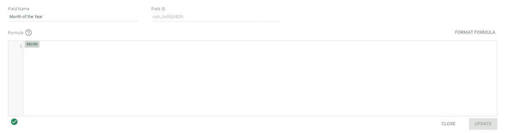
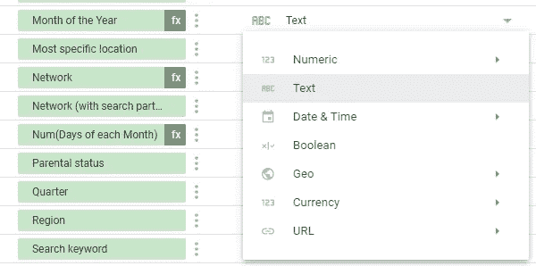
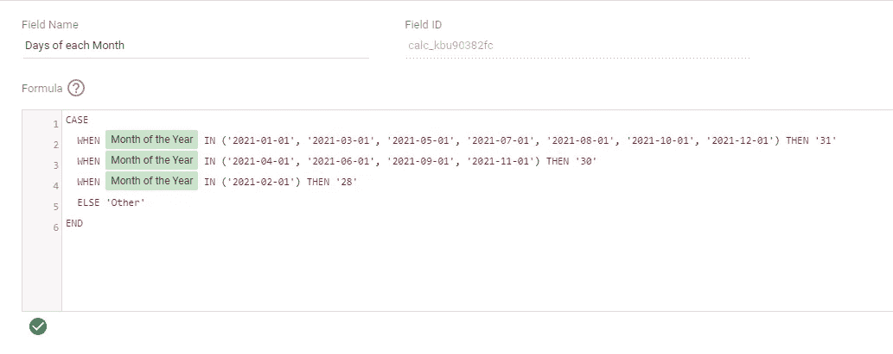
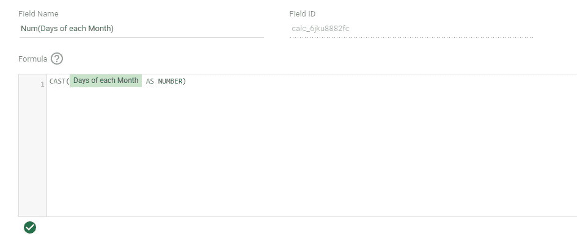
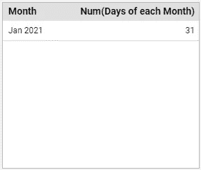
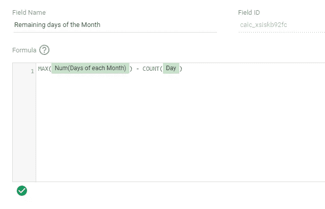
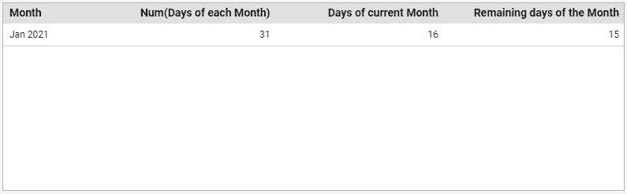

# 在 Data Studio 中计算一个月的剩余天数

> 原文：<https://towardsdatascience.com/calculate-remaining-days-of-a-month-in-data-studio-97debe22e68d?source=collection_archive---------12----------------------->

## 这并不像听起来那么简单！


Joshua Hoehne 在 [Unsplash](https://unsplash.com/) 上拍摄的照片

# 介绍

你有没有遇到过这样的情况，你创建一个数据工作室的报告，有很多障碍要通过？

上周我也遇到过类似的事情。我正在使用不同的数据源、计算字段、混合等进行仪表板自动化工作，突然我意识到我需要一个非常具体的指标。

那是什么？

我想计算到月底为止每天可用的平均预算。但是在 Data Studio 中，没有提供该月剩余天数的字段。作为一个纯 90 后的孩子，我从谷歌搜索开始。经过一些搜索和博客文章阅读，我意识到没有工作的解决方案，将涵盖我的需求。大多数解决方案建议创建一个谷歌表，然后计算一个月的剩余天数，然后将其与我的 Data Studio 仪表板连接，诸如此类。

不够好！正如我所说的，我正在为一个**自动化**任务工作。所以，我开始研究自己的解决方案。

它并不花哨，但很有效…

# 该过程

对于我自己的任务，我使用了 Google Ads 数据源。当然，您可以使用自己的数据源，但是您必须适当地调整字段，以便解决方案能够工作。

## 流程背后的想法:我需要哪些领域？

1.  每月**天**的一个字段
2.  一个带有**当月剩余天数的字段**

在整个过程中，我们将需要一些额外的修改，但主要的想法是创建这两个字段。

## 让我们看看实践中…

正如你可能已经知道的，谷歌数据工作室定制字段，不能在一个案例函数中结合维度和度量——真扫兴。因此，像下面这样的字段最终将不起作用:

```
CASE
  WHEN Month = 'January' THEN 31
  WHEN Month = 'February' THEN 28
  ...
END
```

诀窍是表现为两个场都是二维的。

**字段 1:** **一年中的月份**

对于我的解决方案，我们希望将月维度从日期类型修改为文本类型。我不喜欢修改我的原始字段，所以我们将创建一个新字段，其中只包含月份维度。就像下面这样:



自定义字段:一年中的月份

Data Studio 会自动将您的字段识别为日期类型。

*   转到数据源以更改自定义字段的类型



*   单击“类型”列中的项目
*   选择文本选项

**字段 2:每月的天数**

现在我们有了一年中的月份字段，我们可以创建一个新字段来为每个月分配正确的天数:



自定义字段:每月的天数

⚠️In 为了在我的计算中调用我的“一年中的月份”字段，我创建了一个表来查看我的字段的格式。我建议您对自己的数据源也这样做。

**字段 3: Num(每月的天数)**

正如你可能已经注意到的，在我的计算中，我给每个月分配了一个数字**作为维度。**我们需要用一个新的自定义字段来解决这个问题…



自定义字段:Num(每月的天数)

⚠️When:你将“Num(每月的天数)”字段添加到一个可视或表格中，**你必须使用 MAX** ，作为你的聚合方法。



到目前为止，我们应该能够用您的月维度和我们创建的 Num(每个月的天数)创建一个数据表，并且能够看到每个月的正确天数(！idspnonenote)。！！不要忘记使用 MAX！！！).

**字段 4:本月剩余天数**

接下来是“本月剩余天数”。这当然是这篇文章的最终目的！



自定义字段:一个月的剩余天数

我们流程的最后一步，当您使用我们的“本月剩余天数”字段时，您应该定义符合您需求的日期范围。我喜欢使用“本月至今”，它不包括当天，但是您也可以使用“本月”来获得总天数。在下表中，您可以看到正在运行的字段:



实际日期:2021 年 1 月 17 日

万岁！！！🎆

# 最后的想法

我告诉过你，这不会是幻想…

Data Studio 是一个强大的工具，功能丰富，但有时，像这样的重要字段会丢失。有时候很容易计算，有时候却不容易。可能还有其他更好的方式，但我希望我为你节省了一些填写谷歌表单的时间。🤓

> 我叫 Alexandra Poulopoulou，是 Reprise Digital 的数据和分析主管。在我的职业生涯中，我参与了几个分析项目，以推动成功的商业决策。
> 
> 如果你喜欢刚刚阅读的内容，请在 [Medium](https://apoulopoulou.medium.com/) 、 [LinkedIn](http://www.linkedin.com/in/alexandra-poulopoulou-93a72313b) 或 [Twitter](https://twitter.com/alexpoulopoulou) 上关注我，因为还会有很多类似的活动。下次见…