# 用 Python 计算偏斜度(有例子)

> 原文：<https://towardsdatascience.com/calculate-skewness-in-python-with-examples-pyshark-b7467dfa166d?source=collection_archive---------43----------------------->

## 在本教程中，我们将探索如何在 Python 中计算偏斜度


作者图片

**目录:**

*   介绍
*   什么是偏斜度？
*   如何计算偏斜度？
*   Python 中如何计算偏斜度？
*   结论

# 介绍

偏斜是我们在日常生活的许多领域观察到的现象。例如，人们经常在网上搜索的是感兴趣的特定国家的工资分布。这里有一个例子:

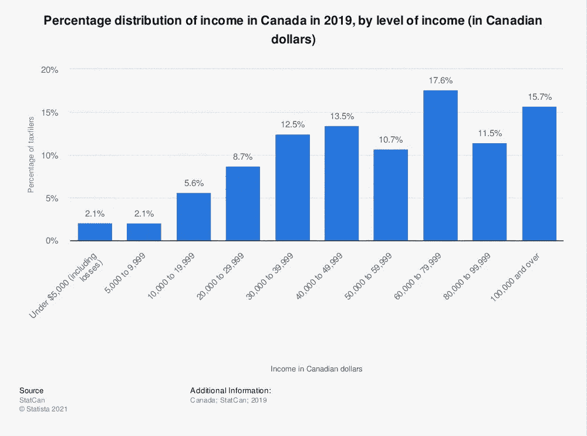

[来源](https://www.statista.com/statistics/464262/percentage-distribution-of-earnings-in-canada-by-level-of-income/)

在 [Statista](https://www.statista.com) 找到更多统计数据

从上面的图表中，我们可以看到 2019 年加拿大的收入分布，平均收入大约在 40，000 美元到 50，000 美元之间。

我们还注意到，数据不是正态分布在平均值周围，因此存在某种类型的偏斜。

在上面的例子中，很明显有一些负偏斜，分布的左尾更粗。但是为什么会有歪斜呢？我们看到，分布的中位数将在 60，000 美元左右，因此它大于平均值；并且分布的模式将在$60，000 和$70，000 之间，因此产生了我们上面观察到的偏斜。

其中[峰度](https://pyshark.com/kurtosis-in-python/)衡量的是两个尾部中是否存在极值(或者只是尾部是重还是轻)，偏斜度关注的是基于极值(或者只是尾部的对称性)来区分分布的尾部

为了继续学习本教程，我们需要以下 Python 库: **scipy** 。

如果您没有安装它，请打开“命令提示符”(在 Windows 上)并使用以下代码安装它:

```
pip install scipy
```

# 什么是偏斜度？

在统计学中，偏度是概率分布关于其平均值的不对称性的度量，有助于描述概率分布的形状。基本上，它衡量给定分布与正态分布(对称)的差异程度。

偏斜度可以取几个值:


[来源](https://codeburst.io/2-important-statistics-terms-you-need-to-know-in-data-science-skewness-and-kurtosis-388fef94eeaa)

*   正-当分布具有较厚的右尾且众数<median></median>
*   Negative — observed when the distribution has a thicker left tail and mode>中值>平均值时观察到。
*   零(或接近零)-当分布关于其均值对称且近似众数=中位数=均值时观察到。

注:上述定义是一般化的，值可以根据分布族的不同而有不同的符号。

# 如何计算偏斜度？

在大多数情况下，样本偏度的计算方法是 Fisher-Pearson 偏度系数(注意:还有更多计算偏度的方法:Bowley，Kelly's measure，Momental)。

这种方法把偏斜度看作分布的第三个标准化矩。

听起来有点复杂？按照下面的步骤，对计算有一个完整的理解。

分布的第 *k* 阶矩可以计算为:

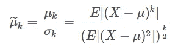

作者图片

如前所述，偏斜度是分布的三阶矩，可计算如下:

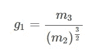

作者图片

其中:

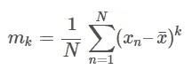

作者图片

如果您想要校正统计偏差，那么您应该求解调整后的 Fisher-Pearson 标准化力矩系数，如下所示:

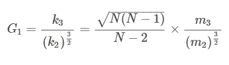

作者图片

**举例**:

上面是很多公式。为了使这一切成为一个更好理解的概念，让我们来看一个例子！

请考虑以下代表学生考试成绩的 10 个数字序列:

*X*=【55，78，65，98，97，60，67，65，83，65】

计算 x 的平均值，我们得到:x̄=73.3.

求解 m_3:

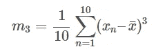

作者图片

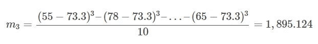

作者图片

求解 m_2:

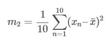

作者图片

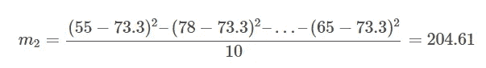

作者图片

求解 G1:

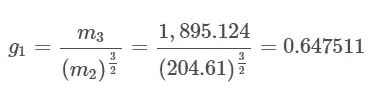

作者图片

在本例中，Fisher-Pearson 偏斜系数等于 0.647511，表明数据中存在正偏斜。另一种检查方法是查看这些值的众数、中位数和平均值。这里我们有 mode<mean with="" values=""></mean>

In addition, let’s calculate the adjusted Fisher-Pearson coefficient of skewness:

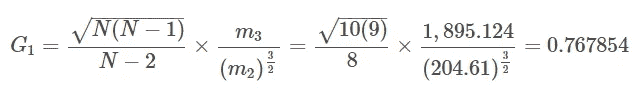

Image by Author

# How to calculate Skewness in Python?

In this section we will go through an example of calculating skewness in Python.

First, let’s create a list of numbers like the one in the previous part:

To calculate the Fisher-Pearson correlation of skewness, we will need the **scipy.stats.skew** 函数:

我们应该得到:

```
0.6475112950060684
```

要在 Python 中计算调整后的偏斜度，请将 **bias=False** 作为参数传递给 **skew()** 函数:

我们应该得到:

```
0.7678539385891452
```

# 结论

在本文中，我们讨论了如何使用 scipy 库在 Python 中计算一组数字的偏斜度。

如果您有任何问题或对一些编辑有建议，请随时在下面留下评论，并查看更多我的[统计](https://pyshark.com/category/python-programming/)文章。

*原载于 2021 年 7 月 26 日 https://pyshark.com*[](https://pyshark.com/skewness-in-python/)**。**