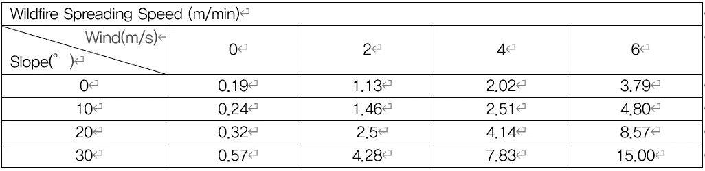
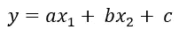
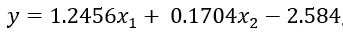
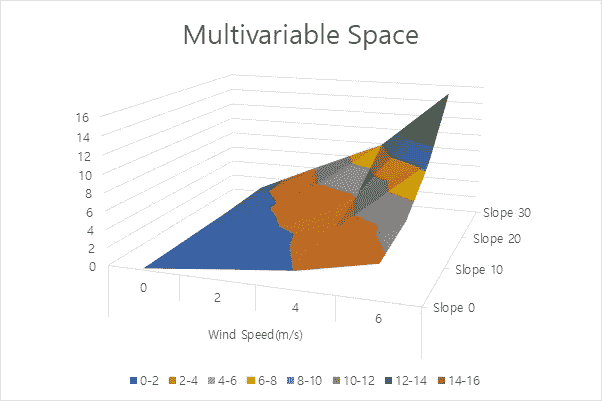
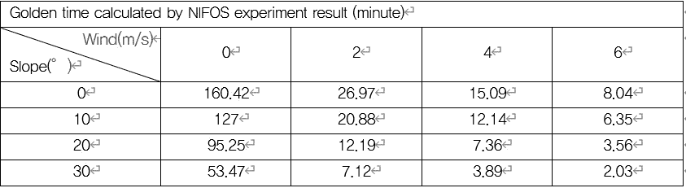
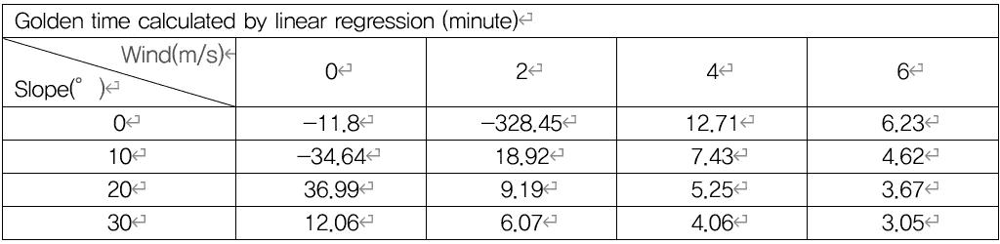
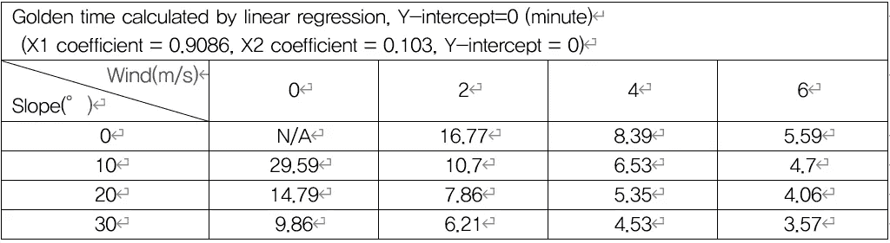
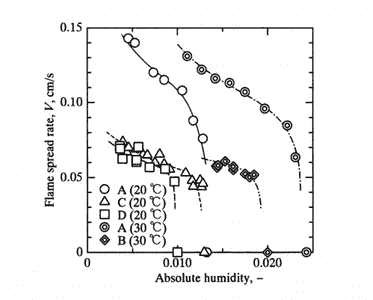
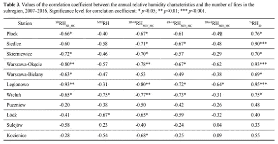

# 计算火灾探测的可靠“黄金时间”

> 原文：<https://towardsdatascience.com/calculating-a-reliable-golden-time-for-fire-detection-8fa8f6086d57?source=collection_archive---------51----------------------->

## 将关于野火的空间信息转换成基于时间的信息。线性回归增加了可信度。

在 Alchera Inc .工作期间，我被分配到视觉异常检测技术产品部门工作，目前我们正在从事基于摄像头的烟雾和火灾检测。野火缓解空间中的典型对话领域是“黄金时间”,即从着火事件到需要检测它以防止它变成灾难之间的时间量。虽然有许多因素在起作用，但下面的文章是我试图对火灾探测的黄金时间进行适当的分类，以便根据部署位置为我们的火灾探测系统提供一个明确的基准。

在我开始之前，我想说清楚野火的灾难是什么。如果不对“灾难”一词进行定义，黄金时间的概念也会过于主观。我将“野火灾难”定义为一场超出消防员在“失控”之前将其扑灭的能力的火灾。那么，让我把‘失控’的意思说清楚。我建议，考虑控制火灾的实体，如果火灾蔓延范围/速度，经济损失，灭火花费的时间等。变得不可预测，不可计算，火势处于‘失控’状态。现在我准备好继续问题/解决方案分析了。

**问题**:关于防止野火失控的最晚可能时间，没有确定的“基于时间”的信息。

**解决方案**:利用既定的可防御空间面积、火势蔓延速度、风力条件和湿度数据，我们可以创建一个代理公式来计算给定位置的黄金时间。

[可防御空间](https://en.wikipedia.org/wiki/Defensible_space_(fire_control)')是“建筑物周围的自然和/或景观区域，经过维护和设计以降低火灾危险。在野火的情况下，该术语尤其用于荒地-城市界面(WUI)。”这个空间降低了火势从一个区域蔓延到另一个区域或一个结构的风险，并为消防队员提供了通道和一个[更安全的区域来保卫受威胁的区域](https://www.fire.ca.gov/programs/communications)。这意味着，即使在森林中的随机区域发生火灾，只要它在可防御的空间内，消防员就可以阻止它进一步蔓延。

根据 CalFire 网页上的一篇文章，防御空间有两种类型的区域。1 区从建筑物延伸 30 英尺(如果发生野火，它将是起火点)。区域 2 从建筑物或着火点向外延伸 100 英尺。现在我们有了野火的空间数。

然后，韩国国立森林科学研究所(NIFOS)进行了一项实验。他们根据风速和土地坡度测试了火势蔓延的速度。以下是 NIFOS 实验的结果。

作者图片

地势越陡，火势蔓延越快。此外，大风会导致火势蔓延得更快。虽然需要更多的原始数据来获得更好的准确性，但为了制定一些通用的代理公式，我进行了多元线性回归。

(当然，它可以是取决于变量的二次函数；然而，为了简单起见，让我们假设它是线性关系)

作为线性回归的结果，X1(风速)的系数是 1.245625，X2(土地坡度)的系数是 0.170425，Y 截距是-2.58388；

为了计算可防御空间的黄金时间，我们用传播速度来划分空间范围。

作者图片

*   100 英尺= 30.48 米
*   30.48 米/传播速度(按米/分钟)=黄金时间(分钟)

因此，我们黄金时间计算的结果如下:

作者图片

作者图片

因为基本的线性回归公式由于数据相当缺乏而相当极端，所以我们可以在低风速和低坡度的情况下稍作调整以使数字合理。可以将 Y 截距设置为 0，这个数字看起来更有说服力，但与 NIFOS 数据相比有些保守(图片由作者提供)

从分析中可以看出，野火的黄金时间会因位置而异，只要我们知道位置的坡度并监控该区域的风速，就有可能为任何给定的位置创建实时黄金时间。例如，美国的加利福尼亚州是全球最大的野火危害区之一，从春季到秋季野火最为频繁。在此期间，加州洛杉矶的平均风速约为 3.2 米/秒。假设加利福尼亚的一个位置有 10°的坡度，基本线性模型(LM)给出 9.8 分钟的黄金时间，调整后的 LM 给出 7.7 分钟的黄金时间。

虽然这是一个合理的估计，如果不是粗略的话，但仍然有一个变量没有包括在内:湿度。有理由认为湿度会极大地影响火势的蔓延。理想情况下，上述分析还应包括上述线性回归中的湿度。不幸的是没有足够的原始数据。尽管如此，还是有必要看看湿度是否与火势蔓延呈负相关。

两篇著名的论文论述了这个问题。根据*湿度和温度对火焰在滤纸上向下蔓延的影响(2000)* 由铃木、Kushida 和 Dobashi 提出，绝对湿度和相对湿度都与火焰蔓延速率负相关。它说火焰传播速度随着湿度的增加而降低，当绝对湿度高于临界值时，火焰传播速度变为零。下面是一个图表。

铃木，Kushida，Dobashi (2000)，*湿度和温度对滤纸上向下火焰蔓延的影响，日本东京 113–8656(*)T4【https://pdf . semantic scholar . org/38 a2/0647392 C9 c 145 CFB 8 f 76173088 EC 79 f 38 c 7b . pdf

此外，*相对湿度对波兰中部森林火灾的影响*研究了湿度和野火点燃次数之间的关系，条件是与湿度相关的环境因素。表 3 显示，火灾爆发与相对湿度之间通常存在负相关关系。

konca-kdzierska，Pianko-Kluczyńska (2018 年)，*相对湿度对波兰中部森林火灾的影响，*波兰波德莱娜 61，01–673([https://content . science do . com/download pdf/journals/FRP/79/3/article-p269 . XML](https://content.sciendo.com/downloadpdf/journals/frp/79/3/article-p269.xml))

要提供尽可能精确的计算，这一篇文章是不够的；我们需要用更多的原始数据进行另一个实验，将所有四个变量(三个自变量和一个因变量)考虑在内。然而，值得注意的是，本文提出的方法是可行的，并适用于实际计算。

不管怎样，我相信我们已经提出了最可靠的方法来计算野火探测的黄金时间。利用这一点，我们的目标是将这一计算引入我们的火灾探测工作，为我们的客户增加情景意识。Alchera Inc .目前正在加州各地的摄像机上部署基于机器视觉的火灾检测，在 2020 年已经捕捉到数百起早期野火点火，并在 2021 年继续这样做。

关于 Alchera: Alchera Inc .是一个人工智能专家团队，他们解决需要人工智能但受资源限制的问题。凭借世界级的速度和准确性，Alchera 将系统和硬件不可知的 AI 技术部署到影响社会的行业。

[参考]

[1][https://en . Wikipedia . org/wiki/Defensible _ space _(fire _ control)](https://en.wikipedia.org/wiki/Defensible_space_(fire_control))

[2][https://www . readyforwildfire . org/prepare-for-wild fire/get-ready/defensible-space/](https://www.readyforwildfire.org/prepare-for-wildfire/get-ready/defensible-space/)

[3] 2016.03.23.韩国보도자료国立森林科学研究所

[4]铃木，Kushida，Dobashi (2000)，*湿度和温度对滤纸上向下火焰传播的影响，*日本东京 113-8656

[5]Konca-kdzierska，Pianko-Kluczyńska (2018)，*相对湿度对波兰中部森林火灾的影响，*波兰波德莱娜 61，01–673