# 计算和设置阈值以优化逻辑回归性能

> 原文：<https://towardsdatascience.com/calculating-and-setting-thresholds-to-optimise-logistic-regression-performance-c77e6d112d7e?source=collection_archive---------1----------------------->

## 如何创建一个简单的类来优化精确度、召回率、f1 分数、准确度、TPR-FPR 或定制成本函数的阈值


照片由[肖恩·林](https://unsplash.com/@seanlimm?utm_source=unsplash&utm_medium=referral&utm_content=creditCopyText)在 [Unsplash](https://unsplash.com/s/photos/computer-programming?utm_source=unsplash&utm_medium=referral&utm_content=creditCopyText) 拍摄

## 背景

我已经了解了逻辑回归、混淆矩阵、ROC 曲线、阈值等。我参加过各种数据科学课程，但我从未完全理解它们，并希望更详细地探索它们。

此外，我还在网上看到了各种例子，说明如何在给定阈值的情况下重新计算真假分类，但这些例子没有提供我在现实世界中使用阈值所需的细节。

我怀疑可能有一种方法可以将阈值优化封装到一个简单的面向对象的类中，这样我就可以在将来轻松地使用它们，因此本文记录了我实现这些目标的学习之旅。

## 准备

让我们从导入我们将需要的库开始…

我们还需要一些数据来操作。我选取的数据是来自 ka ggle—[https://www . ka ggle . com/c/credit-default-prediction-ai-big-data/overview](https://www.kaggle.com/c/credit-default-prediction-ai-big-data/overview)的银行信用违约数据。

我对这些数据进行了一些清理，包括处理空值、转换分类特征和平衡数据以均匀地表示真假分类，这超出了本文的范围。下面导入的数据包括所有这些数据清理步骤…

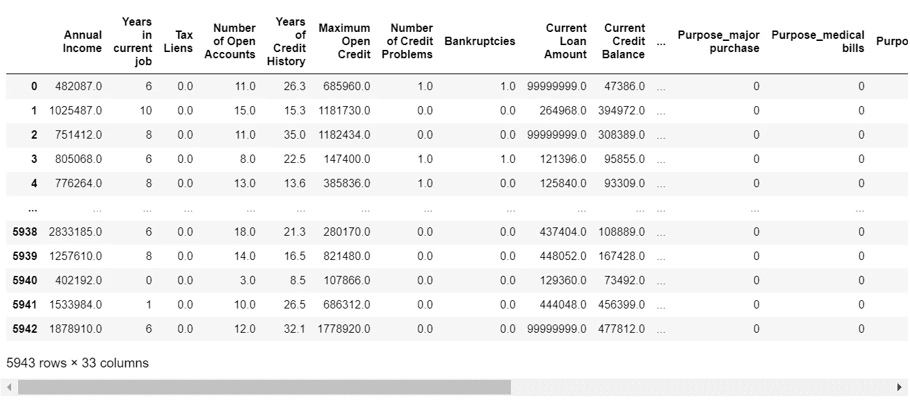

作者图片

让我们通过将数据分为测试和培训来完成准备工作，这样我们就可以根据培训数据进行优化，稍后再回到测试数据上来…

```
((4754, 32), (1189, 32), (4754,), (1189,))
```

# 标杆管理

## 初步分析

好了，让我们对测试数据进行基本的`LogisticRegression`拟合，然后查看结果...

```
array([0, 0, 0, ..., 1, 0, 0], dtype=int64)
```

混淆矩阵的可视化将有助于我们评估性能…

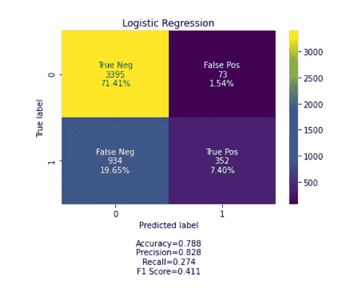

作者图片

银行数据被用来预测哪些客户会继续违反他们的信贷协议，哪些不会违约。

我们可以直接看到，一个基本的逻辑回归有 79%的准确性，预测了 352 个客户将违约，3395 个客户不会违约。

听起来很不错，对吧？好吧，如果我是接收这个算法的经理之一，我的第一个问题会是——“那 934 个假阴性呢？”。有近 1000 名客户没有被算法预测为违约，而是继续违约。

如果银行默认账户的平均成本是 10，000 英镑，我的数据科学团队刚刚让企业损失了 934 万英镑，对此我肯定不会满意！

这个简单的分析揭示了三个关键点-

*   `accuracy`测量可能并不总是评估分类算法性能的最佳方式。
*   分类算法的优化方式在很大程度上取决于企业想要实现的目标。
*   必须对算法进行适当的优化，以实现预期的业务成果。

## 进一步分析

更深入的挖掘将揭示我们基本算法性能的所有关键指标-

`accuracy = 0.7881783761043332 precision = 0.8282352941176471`

`recall = 0.2737169517884914`

`f1 score = 0.4114552893045003`

`true positive rate (tpr) = 0.2737169517884914`

`false positive rate (fpr) = 0.02104959630911188`

`tpr-fpr = 0.2526673554793796`

我通常也会看一下 ROC(受试者工作特性)曲线

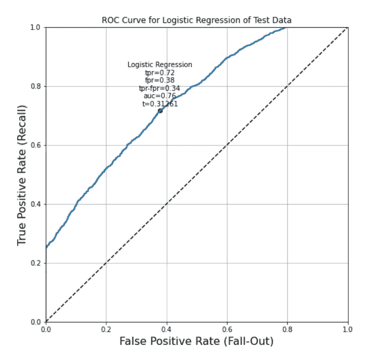

作者图片

黑点代表最佳点的一种解释。

一种可用于计算 ROC 曲线上最佳点的方法是𝑇𝑃𝑅−𝐹𝑃𝑅，其中𝑇𝑃𝑅=的真阳性率和𝐹𝑃𝑅=的假阳性率。𝑇𝑃𝑅−𝐹𝑃𝑅达到最大值的点是最佳点。

该图显示，如果我们将逻辑回归的阈值设置为 0.31261，而不是默认值 0.5，那么我们将优化𝑇𝑃𝑅−𝐹𝑃𝑅.的逻辑回归算法

## 快速回顾一下阈值

如果所有这些关于阈值的讨论令人困惑，有许多在线文章将解释细节，但最简单的设想是这样的

我们数据的每一行将被分类为`Default=True`或`Default=False`。逻辑回归为每一行分配一个带来`True`的概率，然后对每一行进行预测，其中该概率为> = 0.5，即 0.5 是默认阈值。

一旦我们对其工作原理有了更多的了解，我们就可以使用 0.5 的默认值来改进和优化我们预测算法的结果。

## 分析结论

根据这个快速分析，证据表明我们可以做得比接受默认阈值 0.5 更好，默认阈值是在作为`sklearn.linear_model`库的一部分的`LogisticRegression`算法中实现的。例如，我们已经知道，如果我们改变默认值为 0.31261，我们将优化𝑇𝑃𝑅−𝐹𝑃𝑅TPR−FPR.

然而，没有简单的方法来改变`LogisticRegression`类中的阈值，通常数据科学家将手动完成这一点，并在多个项目中重复工作。

我们需要的是一个简单的类，每当我们想要优化阈值时，它就会为我们做这件事。

# 自动化阈值计算

这是我第一次尝试编写一个类来扩展`LogisticRegression`类，以优化基于𝑇𝑃𝑅−𝐹𝑃𝑅TPR−FPR 计算的阈值。它由一个类定义、一个名为`threshold_from_optimal_tpr_minus_fpr`的方法和一个`predict`方法组成，后者覆盖了基类方法，使`threshold`参数能够被传入...

有了这个新的实用程序类，我们现在可以轻松地将训练数据与它相匹配，要求该类告诉我们𝑇𝑃𝑅−𝐹𝑃𝑅TPR−FPR 的最佳阈值，然后使用该阈值返回一组新的预测…

```
(0.3126109044627986, 0.3383474055618039)
```

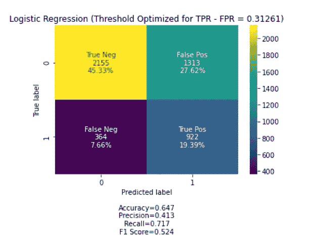

作者图片

嗯，这种优化确实改变了结果的形状，如混淆矩阵所示。假阴性和真阴性减少了，而假阳性和真阳性增加了。

这个发现让我问了一个问题——“还有什么其他的优化方法？”

# 精确和召回的快速回顾

评估分类算法结果的另一种方式是绘制混淆矩阵的精确度和召回率，而不是 FPR 和 TPR。

快速提醒一下，精确度和召回率的计算如下-

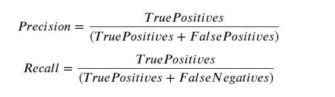

作者图片

即精度是混淆矩阵的右手列，精度是底行。

𝑇𝑃𝑅−𝐹𝑃𝑅通常用于挑选 ROC 曲线上的最佳点，而 F1 分数可以用于挑选精度-召回曲线上的最佳点。F1 分数的计算方法如下-

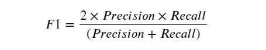

作者图片

F1 分数是精确度和召回率的调和平均值。我们使用调和平均值而不是简单平均值，因为它会惩罚极值。

我们默认算法的精确度和召回率的关系图如下所示-

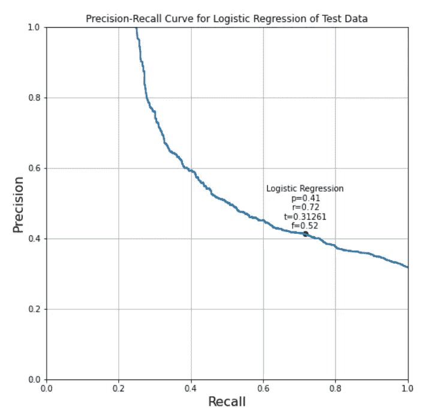

作者图片

这里我们可以看到最佳(即最大)F1 分数是 0.5237148537347345，最佳精度和召回率分别是 0.41 和 0.72。从算法中产生这个结果的阈值是 0 . 32660 . 386383863686

## 自动化阈值计算需要 2

扩展`LogisticRegression`类的第二次尝试增加了一种优化 F1 分数的新方法，以产生最佳精度和阈值-

现在，我们可以很容易地使用该类的新版本来告诉我优化 f1 分数所需的阈值，然后使用该值来微调算法，以获得最佳精度和召回率…

```
(0.3126109044627986, 0.5237148537347345)
```

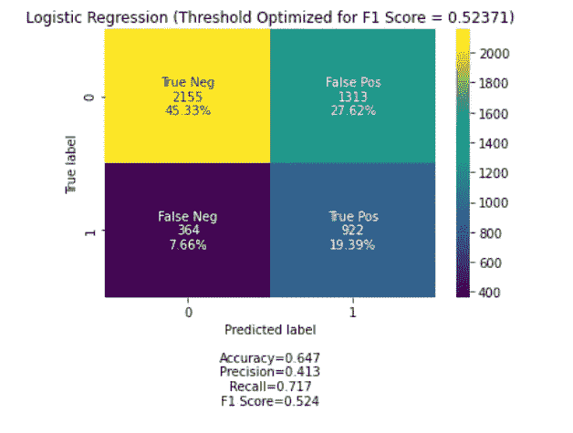

作者图片

这个版本大大减少了假阴性，代表了最大可能的优化精度和召回。

现在想象一下，我把新模型带回给银行的管理团队，他们说“嗯，这是一个改进，但我们必须召回 90%的产品，这种模型才能有效”。

记住，回忆是𝑇𝑃/(𝑇𝑃+𝐹𝑁)而此刻这个模型有 922 / (364+922) = 71.7%。

我们需要向管理团队解释召回率和精确度是相互权衡的，因此如果模型被调优为 90%的召回率，精确度肯定会降低，但是如果这是可以接受的，如何实现呢？

## 自动化阈值计算需要 3

第三次尝试增加了两种新方法来计算给定特定召回(和精度)所需的阈值，现在可以使用这两种方法来实现管理团队要求的性能-

```
(0.19142214362243234, 0.35382262996941893)
```

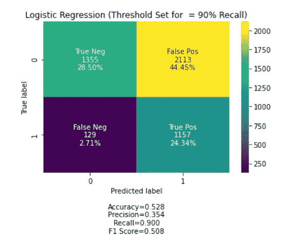

作者图片

我们可以看到，管理团队要求的召回已经实现，因此精确度从 41.3%降到了 35.4%。

## 自动化阈值计算需要 4

在这一点上，我有点忘乎所以了，我想要一个可以实现自定义成本函数的优化版本。

让我们假设管理团队现在给我们以下新信息-

*   每一个真负值意味着我们可以向不会违约的客户销售 10，000 份额外的信贷产品。
*   每一次误报都会让我们损失 1000 英镑，因为我们本可以吸引这些客户，但我们却避开了他们。
*   因为我们未能干预并阻止这些客户违约，所以每一次假阴性都会让我们损失 1500 英镑。
*   每一个真正的积极有助于我们防止信贷违约，每一个都产生 20，000 英镑的新收入。

实现这一点的“成本函数”很容易构建

再做一点工作，我们可以修改我们的类，计算出优化这个成本函数所需的阈值，然后应用它-

…可以按如下方式使用-

```
(0.4324142856743824, -40033500)
```

新的混淆矩阵看起来像这样..

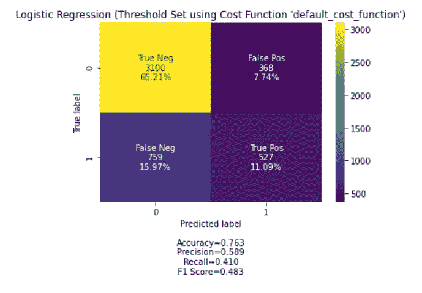

作者图片

…这是我们的自定义成本函数值与阈值的关系图…

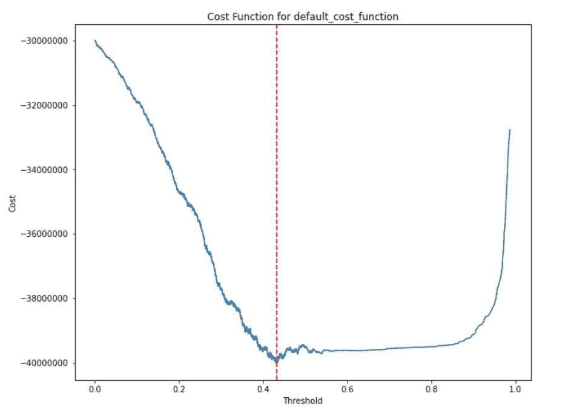

作者图片

## 阈值计算自动化—最终版本

鉴于我已经意识到最佳精度的阈值可以使用与定制成本函数非常相似的方法来计算，我想我会将其添加到最终版本中。

毕竟，许多数据科学竞赛确实是基于准确性进行评估的，尽管我已经开始考虑这并不总是，事实上也不经常是分类算法有效性的最佳衡量标准。

也就是说，当我将使用训练数据计算的最佳准确性阈值插入到测试数据中时，它将预测的准确性提高了整整 1%,这在数据科学竞赛中可能会有所不同！

`LogisticRegressionWithThreshold`类的最终版本增加了一个新方法来计算优化精度所需的阈值

```
(0.5654501621491699, 0.7968026924694994)
```

这是最佳(最高)精确度的混淆矩阵…

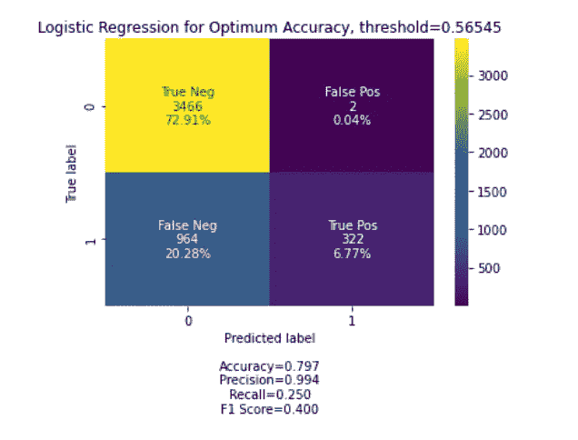

作者图片

…这是精度与阈值的关系图…

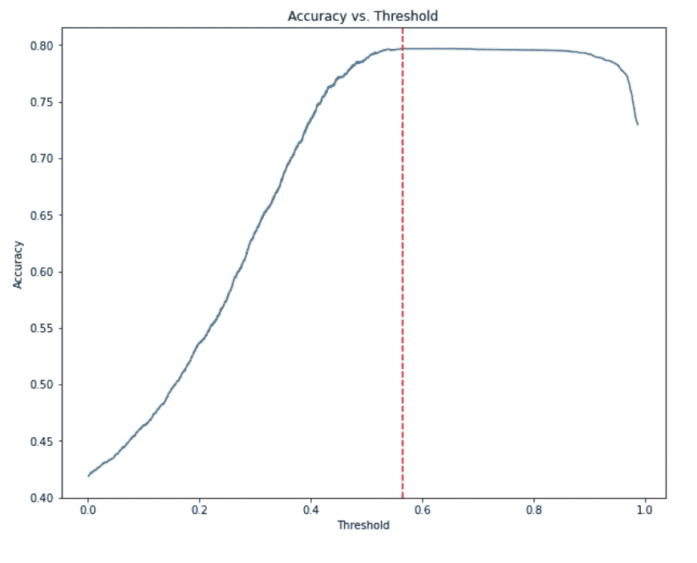

作者图片

# 结论

我们已经看到，有许多优化逻辑回归的方法，这些方法可以顺便应用于其他分类算法。这些优化包括为精确度、召回率、f1 分数、准确度、TPR-FPR 或定制成本函数的优化寻找和设置阈值。

我们还看到，所选择的优化严重依赖于期望的业务成果。

我们已经看到，`sklearn.linear_model`中的`LogisticRegression`类无法设置阈值来优化算法，但是我们可以使用本文中开发的`LogististicRegressionWithThreshold`类来让我们即时访问所有必要的功能，以便根据期望的业务结果来调整基本算法。

完整的代码可以通过以下链接在 GitHub 上找到

[](https://github.com/grahamharrison68/Public-Github/blob/master/Logistic%20Regression%20Thresholds/Logistic%20Regression%20Thresholds.ipynb) [## grahamharrison68/Public-Github

### GH 公共项目库。通过在…上创建帐户，为 grahamharrison68/Public-Github 开发做出贡献

github.com](https://github.com/grahamharrison68/Public-Github/blob/master/Logistic%20Regression%20Thresholds/Logistic%20Regression%20Thresholds.ipynb) 

# 感谢您的阅读！

如果你喜欢读这篇文章，为什么不看看我在 https://grahamharrison-86487.medium.com/[的其他文章呢？](https://grahamharrison-86487.medium.com/)

此外，我很乐意听到您对这篇文章、我的任何其他文章或任何与数据科学和数据分析相关的内容的看法。

如果你想联系我讨论这些话题，请在 LinkedIn 上找我—[https://www.linkedin.com/in/grahamharrison1](https://www.linkedin.com/in/grahamharrison1)或者发邮件给我[ghar rison @ Lincoln college . AC . uk](mailto:GHarrison@lincolncollege.ac.uk)。