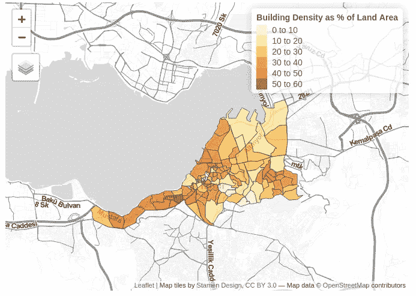
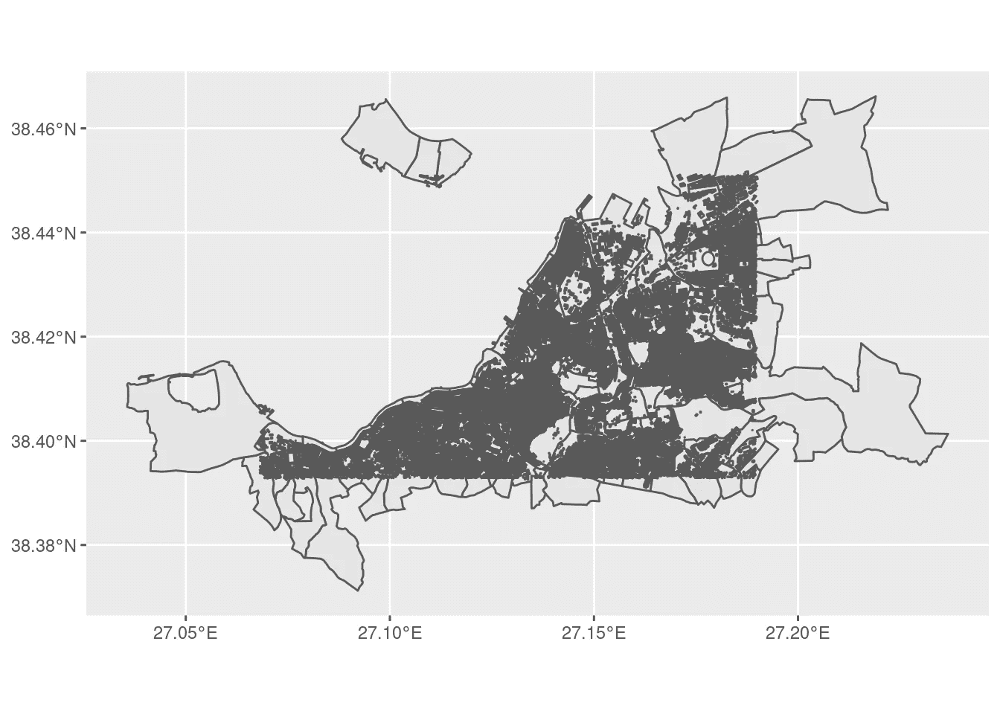
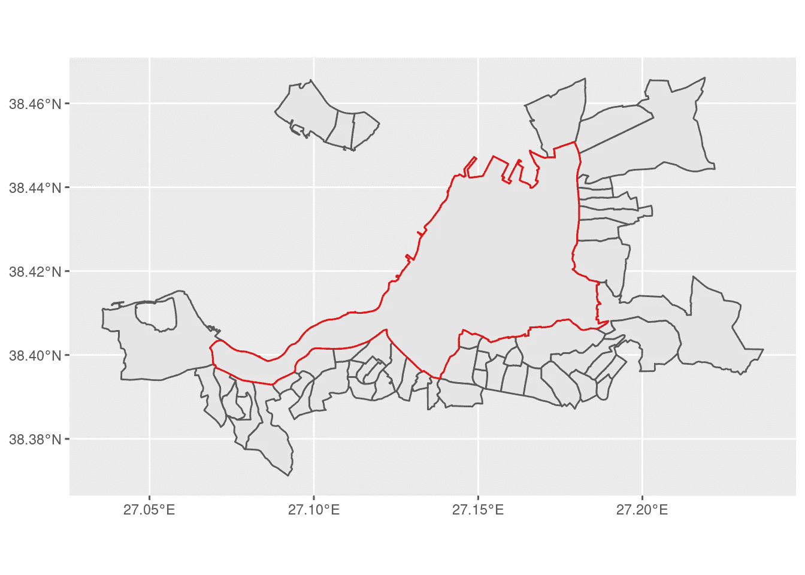
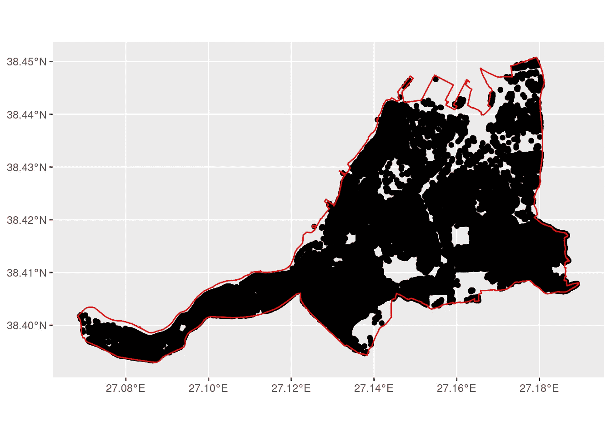

# 用 OSM 数据计算建筑密度

> 原文：<https://towardsdatascience.com/calculating-building-density-in-r-with-osm-data-e9d85c701e19?source=collection_archive---------23----------------------->

# 介绍

OpenStreetMaps 是一个很好的空间数据源。大多数通用编程语言都有从 OSM 下载数据的包。

在本教程中，我将展示如何使用 R 的 osmdata 包下载建筑数据，执行密度分析，并使用 ggplot 绘制，以及交互使用 tmap。

这需要一些空间数据结构的知识。

# 获取数据

第一步需要使用 osmdata 从 OSM api 下载数据。首先，我需要为 OSM 设置一个边界框来搜索数据。接下来，我将下载用于制作 choropleth 地图的行政边界。最后，我将为定义的边界框下载建筑数据。

# 设置搜索区域

我将在土耳其的伊兹密尔市搜索数据。为了定义我的搜索，我将使用`getbb`命令。该命令将位置名称作为字符串，并返回由 OSM 定义的边界框。也可以返回一个多边形的边界框，这很有用，因为我想搜索由行政边界定义的建筑物。

因为该函数返回一个矩阵，所以您可以使用自己的多边形来定义 OSM `opq`查找(如下)，但是确保数据的 CRS 是 EPSG:3857 是很重要的。

获取边界多边形

# 检索边界线

在这个项目中，我正在寻找伊兹密尔的街区边界。因为各国的行政级别界限并不统一，所以可能需要进行一些研究来确定需要什么样的行政级别。幸运的是，他有一个有用的工具，可以让你在交互式地图中找到 OSM 的边界。

地区名称旁边的数字表示 OSM 的行政级别。在我的例子中，我在 8 级寻找界限。我可以使用`osmdata`请求特性传递这个信息，它是 [OSM API](https://wiki.openstreetmap.org/wiki/API) 的包装器。

检索 OSM 边界线

(注意:OSM 有更多可用的地图功能，可以使用右键[键:值对](https://wiki.openstreetmap.org/wiki/Map_features)进行查询。)

该函数返回一个 osmdata 对象，这是一个`sf`数据帧的列表。每个数据帧由不同的几何类型组成，这意味着返回的对象可能很大。为了得到正确的数据，你需要知道你在寻找哪种几何图形。

在这种情况下，我需要的形状是多多边形几何类型。OSM 查询最终会返回大型对象。为了保留一些空闲空间，我将删除多余的数据帧。我还会清理一些数据。

清理边界数据

现在我想检查一下我是否有正确的界限。

原始边界多边形的 OSM 边界线

看起来不错，但是它也返回了所有外围区域的边界，因为它们可能落在边界多边形线上。这是我以后可以处理的事情。

# 检索建筑

使用与上面相同的过程，查询 OSM 原始边界多边形:`iz_bbox`内的所有建筑物。建筑物多边形对象将比我的边界对象大 100 倍，所以我将再次去掉多余的数据。这一次我将保持多边形 sf 对象。

然后我会画出结果。

在边界多边形上打印建筑多边形

返回的建筑物并不真正遵循任何多边形的边界，所以现在我将做一些空间修剪。

# 剪裁点数据

为了过滤掉所有的外围建筑，我需要将它们作为点来计算，这可以通过找到它们的质心来完成。我将使用建筑质心创建一个新的数据框。在此之前，我想计算所有建筑物的面积，这样数据就可以与新创建的数据框一起使用。从现在开始，我不再需要建筑多边形了。

我还需要创建一个多边形几何图形，以过滤外围建筑。我可以用原来的边界框`iz_bbox`来做这件事。但是，因为这个对象是一个矩阵，我需要把它转换成一个 sf 对象。这可以通过使用`sf_headers::sf_polygon`来完成。

红色的多边形是目标区域，我可以使用这个多边形来裁剪建筑数据

现在我有了一个可以过滤点的多边形。首先，我必须创建一个允许我过滤的数据框架。将`st_join`连接变量设置为`st_within`将给出一个列，指示一个点是否在多边形数据框内。列`id`被创建，1 表示一个点落在多边形内。我将策划检查结果。

将质心构建为边界多边形内的点

它工作了，所以现在我将过滤正确的点，然后从`iz_polys`数据帧创建一个新的数据帧，但是使用过滤的点。

使用更精细的数据框架，我可以对每个地区内所有建筑的总面积进行汇总和求和。我将创建一个最终的数据框，其中包含总建筑面积以及地区多边形的总面积。

现在我将使用`tmap`创建一个漂亮的交互式地图。

互动图截图。看这里的实物:[https://greggsaldutti . netlify . app/post/2021-05-05-calculating-building-density-in-r-with-osm-data/](https://greggsaldutti.netlify.app/post/2021-05-05-calculating-building-density-in-r-with-osm-data/)

# 结论

这里我们有一张建筑的面积密度图，以占总土地面积的百分比来表示。当你有很多数据要处理，或者需要以编程方式访问数据时，r 是一个很好的工具。其他程序，如 QGIS，可能对用户更友好，但是 R 给你更多的控制，也能制作漂亮的地图。

注意:这篇文章基于 [Matt Herman 关于纽约树木的文章](https://mattherman.info/blog/point-in-poly/)，以及这个[使用 Python 的伟大开源 GIS 课程](https://sustainability-gis.readthedocs.io/en/latest/lessons/L1/intro-to-python-geostack.html)。

*原载于 2021 年 5 月 5 日*[*https://greggsaldutti . net lify . app*](https://greggsaldutti.netlify.app/post/2021-05-05-calculating-building-density-in-r-with-osm-data/)*。*