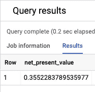

# 在 BigQuery 中计算内部收益率(IRR)

> 原文：<https://towardsdatascience.com/calculating-internal-rate-of-return-irr-in-bigquery-75e6703e8ec3?source=collection_archive---------12----------------------->

## 在 BigQuery 中实现 Excel 的 IRR 函数的分步指南

内部收益率(IRR)是财务中经常出现的一种常见计算方法。在这篇博文中，我将展示如何在 BigQuery 中构建一个查询，该查询执行相当于 [Excel 的](https://support.microsoft.com/en-us/office/irr-function-64925eaa-9988-495b-b290-3ad0c163c1bc) `[IRR](https://support.microsoft.com/en-us/office/irr-function-64925eaa-9988-495b-b290-3ad0c163c1bc)` [函数](https://support.microsoft.com/en-us/office/irr-function-64925eaa-9988-495b-b290-3ad0c163c1bc)的计算。如果现金流存储在 BigQuery 表中，并且您希望在不将数据移动到 Excel 的情况下计算 IRR，或者如果您希望将 BigQuery 用作数据可视化和 BI 的来源，这将很有帮助。


照片由[斯科特·格雷厄姆](https://unsplash.com/@homajob?utm_source=medium&utm_medium=referral)在 [Unsplash](https://unsplash.com?utm_source=medium&utm_medium=referral) 上拍摄

# 1.背景:内部收益率(IRR)和净现值(NPV)

内部收益率(IRR)是投资产生的所有现金流的净现值等于零的收益率。它主要作为一个决策规则:一项投资的一系列现金流的内部收益率越高，超过资本成本的金额越大，该项投资就越有利可图。

从数学上讲，IRR 是求解以下方程的`r`的值:


这与以下内容相同:


这里，`t`是时间段(从 0 到`N`)，`CF`是时间段`t`的现金流，`r`是收益率(IRR)。

上述方程没有解析解。换句话说，没有数学公式可以给我们内部收益率。解决这个问题的唯一方法是用数值方法，尝试`r`的多个值，看看哪一个最接近满足这个方程。

对于`r`的任何给定值，上述等式的左侧给出了净现值:


# **2。示例**使用 Excel 的 IRR 函数计算 IRR

在本指南的其余部分，我们将使用下面的简单示例。让我们假设我们在文件`irr.csv`中存储了以下现金流

```
PERIOD, CASHFLOW
0, -10000
1, 2000
2, 6000
3, 6000
```

我们可以用 Excel 的`IRR`函数来计算内部收益率。 [Excel 的文档](https://support.microsoft.com/en-us/office/irr-function-64925eaa-9988-495b-b290-3ad0c163c1bc)对`IRR`函数描述如下:

> 返回由数值中的数字表示的一系列现金流的内部收益率。这些现金流不必像年金一样均匀。然而，现金流必须定期发生，例如每月或每年。

在 Excel 中计算 IRR 相当简单:


我们的目标是在 BigQuery 中实现这一点。

# 3.现在净价值

**a.** 首先，让我们在 BigQuery 中计算上述现金流的净现值。我们可以使用 BigQuery 控制台轻松地将`irr.csv`数据导入到 BigQuery 表[中。在本指南中，生成的表被命名为`tutorial.irr.cashflows`](https://cloud.google.com/bigquery/docs/batch-loading-data)

**b.** 一旦创建了表，我们就可以运行下面的查询，该查询返回一个包含每个现金流现值的附加列:

```
SELECT
  period,
  cashflow,
  cashflow/POWER(1+0.16, period) AS present_value
FROM
  `tutorial.irr.cashflows`
ORDER BY
  period
```

BigQuery 输出以下查询结果:


**c.** 净现值就是现金流的现值之和。因此，我们可以使用 SUM aggregate 函数来获得现金流的净现值:

```
SELECT
  SUM(cashflow/POWER(1+0.1614, period)) AS net_present_value
FROM
  `tutorial.irr.cashflows`
```

BigQuery 输出以下查询结果:



净现值接近于零，这验证了我们从 Excel 得到的结果，即 16.14%是 IRR 的近似值。

# 4.内部收益率

**答**。现在我们知道了如何计算净现值，我们的目标是找到`r`的一系列值的净现值，并选择最接近零的一个。为了生成`r`的一系列值，我们将利用 BigQuery 的`GENERATE_ARRAY`函数。下面是来自 BigQuery 的[官方文档](https://cloud.google.com/bigquery/docs/reference/standard-sql/arrays)对`GENERATE_ARRAY`函数的简要说明:

> `[GENERATE_ARRAY](https://cloud.google.com/bigquery/docs/reference/standard-sql/array_functions#generate_array)`根据起始值、结束值和步长值生成一个值数组。例如，以下查询生成一个数组，其中包含从 11 到 33 的所有奇数，包括 11 和 33:
> 
> `SELECT GENERATE_ARRAY(11, 33, 2) AS odds;`
> 
> `+--------------------------------------------------+
> | odds |
> +--------------------------------------------------+
> | [11, 13, 15, 17, 19, 21, 23, 25, 27, 29, 31, 33] |
> +--------------------------------------------------+`

**b** 。为了说明我们将如何找到 IRR，让我们考虑一小组`r` `[0.14, 0.15, 0.16, 0.17, 0.18, 0.19]`的值作为 IRR 的猜测值。(我们稍后将考虑更大范围的值。现在，假设我们知道 IRR 在上述范围内。我们从前面的计算中知道，IRR 最接近 0.16。)以下查询为这些猜测值中的每一个生成净现值:

```
SELECT
  guess,
  SUM(cashflow/POWER(1+guess, period)) AS net_present_value
FROM
  `tutorial.irr.cashflows`
CROSS JOIN
  UNNEST(GENERATE_ARRAY(0.14,.19,0.01)) AS guess
GROUP BY
  guess
```


我们可以看到，当猜测值等于 0.16 时，结果表中的净现值最接近于零。

我们的下一个任务是编写一条 SQL，给出净现值最接近于零的`r`的值(即 IRR)。以下查询通过使用公用表表达式来实现这一点:

```
WITH
  npv_table AS (
  SELECT
    guess,
    SUM(cashflow/POWER(1+guess, period)) AS net_present_value
  FROM
    `tutorial.irr.cashflows`
  CROSS JOIN
    UNNEST(GENERATE_ARRAY(0.14,.19,.01)) AS guess
  GROUP BY
    guess)
SELECT
  guess AS IRR
FROM
  npv_table
WHERE
  ABS(net_present_value) = (
  SELECT
    MIN(ABS(net_present_value))
  FROM
    npv_table)
```

BigQuery 输出以下查询结果:


**d.** 现在我们知道了如何计算 IRR，我们可以考虑使用下面的查询来计算`GENERATE_ARRAY`函数中`r`的更大范围的值:

```
WITH
  npv_table AS (
  SELECT
    guess,
    SUM(cashflow/POWER(1+guess, period)) AS net_present_value
  FROM
    `tutorial.irr.cashflows`
  CROSS JOIN
    UNNEST(GENERATE_ARRAY(0,2,.0001)) AS guess
  GROUP BY
    guess)
SELECT
  ROUND(guess*100,2) AS IRR_percentage
FROM
  npv_table
WHERE
  ABS(net_present_value) = (
  SELECT
    MIN(ABS(net_present_value))
  FROM
    npv_table)
```

BigQuery 输出以下查询结果:


这与我们从 Excel 的 IRR 函数中得到的值完全相同。(在最终查询中，IRR 值已被格式化为小数点后两位的百分比。)

*感谢阅读！请在评论中分享反馈。*