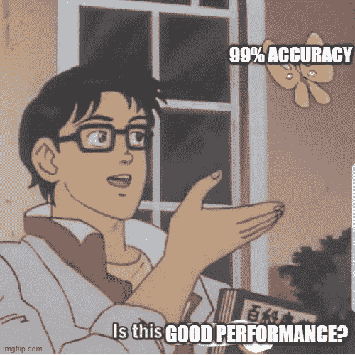
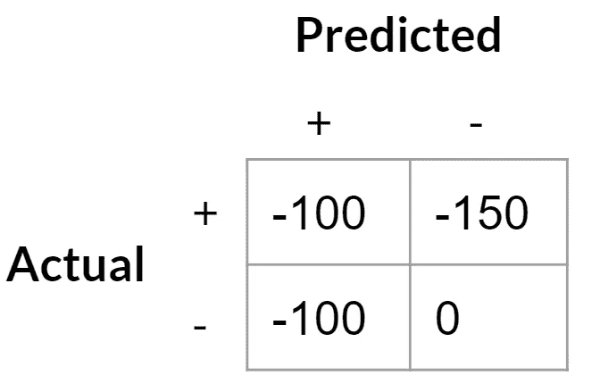
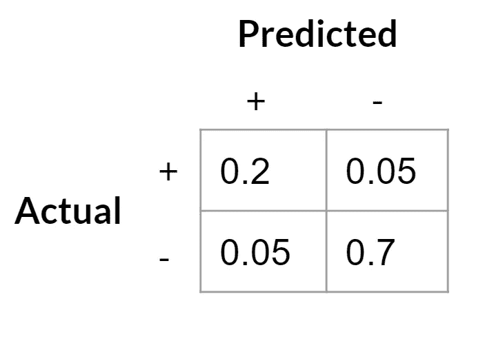
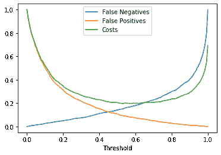
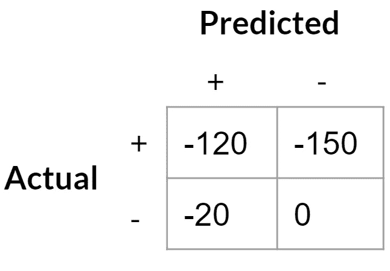
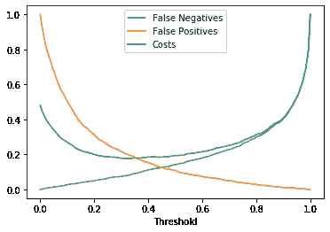

# 计算数据科学项目的商业价值

> 原文：<https://towardsdatascience.com/calculating-the-business-value-of-a-data-science-project-3b282de9be3c?source=collection_archive---------9----------------------->

## 性能度量不能告诉你你想知道的:一个项目实际上有多大价值

照片由 [Unsplash](https://unsplash.com?utm_source=medium&utm_medium=referral) 上的 [israel palacio](https://unsplash.com/@othentikisra?utm_source=medium&utm_medium=referral) 拍摄

数据科学非常关注各种性能指标。数据科学家将花费几个月的时间来尝试改进项目的各种性能指标。问题是，不清楚所有这些努力是否真的有价值。如果你只看性能指标，就不可能知道你是否增加了你的模型所提供的价值。

绩效指标不知道你的预测有多大价值。举一个例子，F1 分数明确地对精确度和召回率赋予了同等的权重。在实践中，假阳性和假阴性通常有不同的业务成本。

您可以使用一百万种不同的指标来告诉您您的模型做得有多好。但是这些都没有告诉你利益相关者真正想知道的:**这有什么商业价值？**

## 金钱万能

什么是商业价值？归根结底，对于营利性企业来说，商业价值就是货币价值。

> **商业价值= $ $**

这对数据科学家来说是个好消息:我们热爱数字。钱是量化的。

Photo by [金 运](https://unsplash.com/@jinyun?utm_source=medium&utm_medium=referral) on [Unsplash](https://unsplash.com?utm_source=medium&utm_medium=referral)

不幸的是，我们建造的东西和货币价值之间的联系并不总是简单明了的。

将数据科学项目与商业模型联系起来的最具体的方法之一是计算实现该模型对公司的底线意味着什么。这并不总是可能的，但它是一个有用的练习。通过查看我们可以计算显式值的情况，我们可以澄清联系不太清楚的领域。

## 计算模型商业价值的一个具体例子

让我们举一个简单的例子，我们正在为一个业务问题建立一个模型:在一个部件工厂检测制造缺陷。

照片由[拉利特·库马尔](https://unsplash.com/@klalit?utm_source=medium&utm_medium=referral)在 [Unsplash](https://unsplash.com?utm_source=medium&utm_medium=referral) 上拍摄

我们知道，如果我们检测到一个有缺陷的部件，我们会扔掉它，导致生产成本的损失。**更换有缺陷的部件的成本是 100 美元**

如果我们未能检测到有缺陷的部件，我们会将部件运送给客户，然后必须更换他们的部件并支付新部件的运费。**假设运输成本为 50 美元，加上替换小工具的 100 美元损失。**

如果我们有一个预测缺陷部件的模型，我们就可以写出不同场景的成本:

**真阳性**:-100 美元用于关闭一个小工具

**误报**:-100 美元更换我们认为有缺陷的部件

**真负值** : 0(我们认为“无缺陷”是比较成本的默认场景)

**假阴性**:-150 美元运送替换部件

此场景的成本矩阵

请注意，这相当于说**假阳性的成本是 100 美元**(假阳性和真阴性之间的差异)**假阴性的成本是 50 美元**(假阴性和真阳性之间的差异)。

现在，我们可以构建一个分类器，并为该分类器计算如果我们将该分类器用作筛选过程，缺陷的成本会是多少。评估模型的商业价值很简单——我们只需要在测试集上产生一个混淆矩阵。让我们举个例子:

然后，我们将每个结果的成本乘以该结果发生的次数比例:

> (-100*0.2) + (-100*0.05) + (-150 * 0.05) + (0 * 0.8) = -32.50.

**换句话说，平均来说，如果我们使用这种模式，由于缺陷，每个小部件我们将平均损失 32.50 美元。**

我们可以将此与当前政策的成本进行比较。让我们假设目前没有缺陷筛选，所有的小部件都已发货。根据上面的混淆矩阵，25%的部件是有缺陷的。因此，要计算这项政策的成本，我们只需将 0.25 乘以运输缺陷产品的成本:

> -150 * 0.25 = -37.50

这项政策的平均成本为每件 37.50 美元。**因此，实施我们的模型来筛选小工具将为公司节省平均每个小工具 5 美元**。

就是这样！我们已经计算了模型的商业价值。当然，在现实世界中，实施一项新政策可能会有成本，这些成本必须与实施该模型的计算收益进行比较。

## 不对称成本改变了最优决策阈值

有了明确定义的成本矩阵，我们就有机会微调我们的模型，以进一步降低成本。

默认情况下，大多数分类器使用 0.5 的概率决策阈值来确定标记积极或消极的内容，但对于不对称成本，这不一定是使用的最佳阈值。

例如，在这种情况下，假阴性的成本低于假阳性(假阳性为 100 美元，假阴性为 50 美元)。这将最优决策阈值推得更高；假阴性比假阳性成本低，所以我们应该更愿意接受假阴性。

下面是成本矩阵的成本曲线的简单模拟(请注意，成本曲线的最小值约为 0.7，因此这将是我们的最佳决策阈值):

不同概率阈值的成本曲线示例。成本已标准化，因此 1 是成本最高的方案。

**因此，我们应该把任何预测概率在~0.7 以上的东西贴上有缺陷的标签，其他的都贴上没有缺陷的标签。**

## 改变成本矩阵

认识到成本矩阵的改变不仅会改变模型的商业价值，还会改变最佳决策阈值，这一点很重要。

例如，假设公司里有人开发了一种新的有缺陷部件的测试。它很贵，所以我们不想在每个部件上都使用它，但是它明确地告诉我们一个部件是否有缺陷。如果这个测试花费 20 美元，我们的模型的成本矩阵会有很大的变化:

**真阳性**:-120 美元(100 美元的生产成本，另外 20 美元用于最终测试，以确保它是有缺陷的)

**假阳性**:-20 美元的最终测试费用，这将免除好的部件

**真负值** : 0(我们再次考虑将“无缺陷”作为比较成本的默认场景)

**假阴性**:-150 美元运送替换部件

成本矩阵，如果我们有一个有缺陷的部件的决定性测试

因为假阳性的成本现在更低了，这就改变了收益曲线。我们现在应该更愿意出现假阳性，因为假阳性的成本没有假阳性高，而假阴性的成本仍然一样高:

随着成本矩阵的变化，成本曲线移动。成本已标准化，因此 1 是成本最高的方案。

使成本最小化的最优决策阈值已经转移到 0.3 左右。我们会将更多的部件标记为潜在缺陷，但这没关系，因为现在我们会将它们提交给进一步的测试，而不是扔掉它们。我们可以计算这个策略的总体成本，并将其与其他策略进行比较(例如，对每个小部件进行 20 美元的测试)。

## 在更模糊的情况下进行归纳

在现实世界中，我们很少遇到如此明确定义的问题。以这种方式定义一个业务问题就是我所说的数据科学的困难部分。

 [## 数据科学的难点在于

### 那些闯入这一领域的人往往会遗漏什么

towardsdatascience.com](/the-hard-part-of-data-science-fa9cad734319) 

在现实世界中，成本并不为人所知，而且很少有直接的分类问题能够完全抓住业务问题的本质。然而，通过观察这些简化的案例，我们可以更清晰地处理更复杂的问题。认识到项目定义中的模糊或缺失是澄清问题并将其与带来最大商业价值的技术解决方案联系起来的第一步。