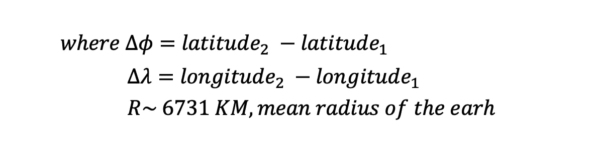
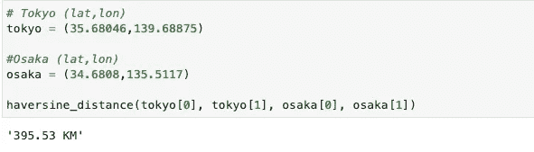

# 使用地理编码计算两个位置之间的距离

> 原文：<https://towardsdatascience.com/calculating-the-distance-between-two-locations-using-geocodes-1136d810e517?source=collection_archive---------18----------------------->

## PYTHON。地理空间分析。位置数据。

## 如何使用 Python 计算两组地理编码之间的距离


塔玛斯·图兹-卡泰在 [Unsplash](https://unsplash.com?utm_source=medium&utm_medium=referral) 上的照片

# 介绍

你可能听说过著名的短语“位置，位置，位置”，例如人们想要强调位置对商业和房地产的中心地位。

然而，在数据分析和计算中，这个短语有点含糊不清。计算机理解“位置”概念的方式是通过我们所知的“地理编码”这些是经度和纬度，并且是特定于特定位置的。

*注:对于那些想知道如何计算这些地理编码的人，我写了一篇关于这个的文章。*

根据不同位置的地理编码，我们可以生成其他“特征”这个过程是地理空间特征工程的一个例子。

一个特别的特征是起点和目的地位置之间的距离。距离在许多机器学习问题中发挥着重要的作用，例如，客户和员工流失预测，客流量，以及在某些情况下，财富预测。

例如，**某些研究表明，离兴趣点**较远的员工和客户，比如一个分支机构或公司，流失的可能性更高。但是，仅使用地理编码，不可能生成此特征并因此在机器学习模型中使用它们。

但是，如何计算一组经度和纬度之间的位置呢？

一种方法是使用大圆距离公式。

## 大圆距离/哈弗线距离


[粘土堤](https://unsplash.com/@claybanks?utm_source=medium&utm_medium=referral)在 [Unsplash](https://unsplash.com?utm_source=medium&utm_medium=referral) 上拍照

大圆距离，有时称为*正圆*，或*球面*距离，是球面上两点之间的最短距离**。**

**虽然不是一个完美的球体，地球表面上两点之间的距离因此可以近似为大圆距离。**

**假设我们有地理编码，公式如下:**

****

**作者配制的配方**

****

**作者配制的配方**

**请注意，在公式中，地理编码假定为弧度，而不是度。我们通常从网上或通过谷歌 API 等提供商获得的地理编码是分等级提供的。**

# **PYTHON 代码**

**事不宜迟，下面是计算哈弗线距离的代码:**

```
import numpy as npdef haversine_distance(lat1, lon1, lat2, lon2):
    '''
    Calculates the spherical distance between two sets of geocodes coming from an origin and a destination.

    Parameters:
    --------------
    lat1: float
         - latitude of the origin location in degrees
    lon1: float
         - longitude of the origin location in degrees    
    lat2: float
         - latitude of the destination location in degrees
    lon2: float
         - longitude of the destination location in degrees 

    Returns:
    --------------
    Float distance in km.

    '''
    r = 6371 # radius of the Earth in Km

    # Convert degrees to radians  
    phi1 = np.radians(lat1)
    phi2 = np.radians(lat2)

    delta_phi = np.radians(lat2 - lat1)
    delta_lambda = np.radians(lon2 - lon1)

    a = np.sin(delta_phi / 2)**2 + np.cos(phi1) * np.cos(phi2) *   np.sin(delta_lambda / 2)**2

    c = 2 * np.arctan2(np.sqrt(a), np.sqrt(1 - a))

    d = r * c

    return f'{d:.2f} KM'
```

**让我们试试我们的功能:**

****

**作者图片**

**尝试从谷歌地图上查看实际距离，并验证这确实是一个很好的近似值。**

# **结束语**

**大圆距离，或称哈弗线距离，是两个短距离位置之间的近似距离。**

**对于更长的距离，由于更多的道路障碍、堵塞和道路延长了整个路径，这种近似法就失效了。**

**为此，可以尝试使用 Google API 来计算两点之间的总距离。**

**参见我关于地理编码和访问 Google Maps API 的文章:**

## **[使用谷歌地图 API 生成地理编码](/generating-geocodes-using-google-maps-api-eb56028821a6?source=your_stories_page-------------------------------------)**

**让我知道你的想法！**