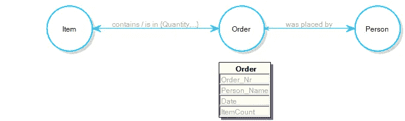
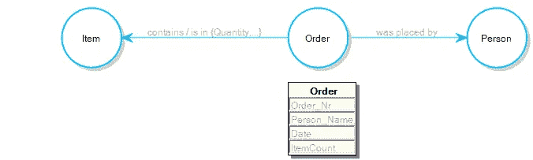

# 呼唤属性图模式标准

> 原文：<https://towardsdatascience.com/call-for-a-property-graph-schema-standard-eff921287c83?source=collection_archive---------18----------------------->

重视人际关系。

属性图模式。图片作者。

我使用数据库作为[图数据库](/what-is-a-graph-database-249cd7fdf24d)已经有一段时间了，并且认真地研究了[有向图](https://en.wikipedia.org/wiki/Directed_graph)的概念。我的观点是，有向图是看图的一种相当原始的方式。

上图是一个简单订单管理数据库的属性图模式。人们下订单，每个订单都包含一定数量的商品。订单、人员和物品是由边/关系连接的[图论](https://en.wikipedia.org/wiki/Graph_theory)的图中的节点/顶点。有向图是指每个边/关系都有一个方向的图，如下所示:

有向图。图片作者。

微妙的区别在于，现在每条水平线(关系)都有一个指向一个方向的箭头。

我不觉得有向图特别有用。从本质上来说，关系是双向的。例如，对于每个由 人员下达的 ***订单，该人员 ***下达*** 订单。更不用说，在我们的数据库模式中，每个订单最多由一个人*下。如果我们用箭头表示只能存在一个关系(作为该关系的实例)，那么我们会将第二个图理解为每个订单只包含一个*商品。显然，这不会是一个非常有用的数据库。*****

## **对标准的呼唤**

**本文是对数据库行业标准的呼吁。如果我们要有属性图模式，让它们背后至少有一点逻辑和意义。**

****

**多对多关系。图片作者。**

**我的建议是，带有两个大箭头的边代表多对多关系。也就是说，在我们的模式中，一个项目可以有多个订单，一个订单可以包含多个项目。**

**我还建议:**

1.  **如果关系包含一个大箭头和一个小箭头，则表明数据库中存在关系的反向读数；**
2.  **带有大箭头和可选小箭头的关系表示该关系是多对一的。**

****

**多对一关系提案。图片作者。**

**例如，在我们的数据库中，许多订单可能由一个人下，而它的倒数…任何一个人都可以下许多订单。**

## **为什么专门的图形供应商会锁定有向图？**

**在我对专用(本地)图形数据库所做的研究中，出现了简单的有向图概念，因为它反映了数据是如何存储在数据库的磁盘层的。也就是说，当数据库中的数据最终存储到永久介质中时，它的存储方式是焦点位于有向图的非箭头侧……相关的节点信息从该节点延伸到一个有效且复杂的一维数组中。**

**当数据被放入随机存取存储器时，一个更传统的*图*被开发出来，使得该图在概念上形成被称为无索引邻接的链接；更像是一个三维图形，因为随机存取存储器中的晶体管矩阵可以被认为是三维的。**

**数据科学是非常技术性的，但基本上，它归结为…如果你做你的研究，你会很容易地发现从业者抱怨图形数据库性能差，当图形数据库以这种方式而不是那种方式查询时，只有图形数据库供应商和专家告诉你，图形数据库的查询性能在很大程度上取决于你如何构造有向图。我甚至读到过这样的评论，有人抱怨说，为了达到他们所追求的查询性能，他们需要在混合中引入索引(放弃了无索引邻接所带来的好处的整个概念)，数据库供应商的专家说了类似这样的话:“好吧，如果这真的是您想要做的查询类型，那么图形数据库可能不适合您”。即关系数据库*将会是*。**

**也就是说，这些都没有回答描绘关系的基数或它们的相互关系的问题。在我看来，将数据在磁盘级别存储的方式以及单个数据库如何工作融入到图形的概念中，并不是标准化属性图模式的任何方式。**

## **为什么？**

**在我看来，答案很简单。世界正朝着多模型(关系和图形)数据库的方向发展，不管怎样，图形数据库供应商正在悄悄地向关系领域发展。**

**正在发生的情况是，专用图形数据库的营销材料几乎总是基于它们的索引而轻视关系数据库，只是转而告诉它们的数据库的用户“为了获得这种类型的查询所需的查询性能，你将需要一个索引”。**

**也就是说，图只是查看模式概念化的一种方式，如果我们无论如何都要在混合中加入索引的话，它也可以被看作是一个[实体关系图](https://en.wikipedia.org/wiki/Entity%E2%80%93relationship_model)。**

**也就是 ***所有的*** 要说…属性图模式最好像周围最好的实体关系图一样信息丰富，如果它们要让数据库专业人员相信的话，这些专业人员知道他们在谈论什么，并且希望概念模型在他们的意义上是清晰和信息丰富的。**

**我的业务是编写软件，将数据库概念化，就好像它已经是一个多模型数据库(关系或图形)。我之所以呼吁属性图模式的标准，是因为我发现简单的有向图太简单了。我觉得是时候让人们拥有概念模型了，它们尽可能地具有表现力，并且是数据库不可知的。当我创建一个属性图模式时，我更关心的是模型在概念上是否合理，而不是任何数据库的底层架构。在许多情况下，我可能甚至没有选择我想要使用的数据库。我当然不希望使用一个不能满足我的概念模型的数据库；我想使用那些 ***做*** 对概念模型表现良好的数据库。**

**让我们停止在图形数据库空间中遵从单个数据库供应商，并创建单个数据库供应商可以向往的标准。让我们抛弃旧的有向图的概念，转而使用同样表示基数的双向图。**

**感谢阅读。如果时间允许，我将写更多关于图数据库、关系数据库、多模型数据库和属性图模式的文章。**

**— — — — —结束— — — —**