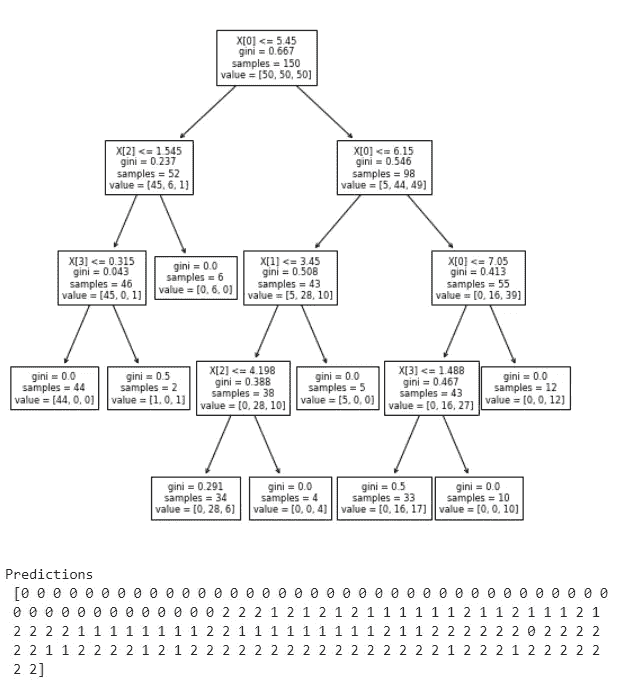
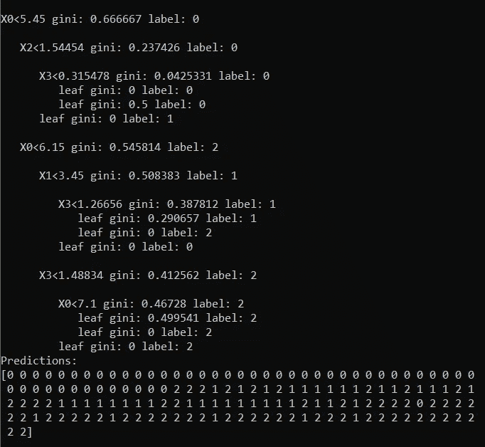

# 用 ctypes 模块从 Python 调用 C++代码

> 原文：<https://towardsdatascience.com/calling-c-code-from-python-with-ctypes-module-58404b9b3929?source=collection_archive---------3----------------------->

## 决策树实现示例

Python 在过去几年变得非常流行，因为它有一个很大的社区和很多可用的包，这些包非常容易使用，可以帮助你相对快速地完成工作。但是很多包不是用纯 Python 写的，因为作为一种解释语言，这意味着你不需要编译你的程序来执行指令，它非常慢。例如，一个名为 [*xgboost*](https://github.com/dmlc/xgboost/tree/master/src) 的流行数据科学包主要是用 C++编写的，这是一种编译语言，因此执行起来很快。出于这个原因，如果我们能用这样一种语言编写计算量最大的操作，但从一种较慢但非常用户友好的编程语言(如 Python)调用它，那就太好了。好消息是我们可以做到，在本教程中，我们将看到如何使用 *ctypes* 模块。

> **先决条件**:您需要安装 Python 3(ctypes 是一个内置库)和 Visual Studio buildtools 来编译 C++代码。

为了能够从 Python 中调用 C++代码，我们需要精确地定义我们将在语言之间传递的输入和输出数据类型，因为 C++需要在编译时知道所有的数据类型。在 Python 中，一切都是对象，包括像 *int* 、 *float* 等数据类型。虽然它们通常不对应于唯一的 C++类型，例如，Python 中的 *int* 是唯一的，而在 C++中，我们可以有 short、long、unsigned integers 等等，它们的不同之处在于它们可以存储多少位或符号。因此，当在语言之间转换时，我们需要指定确切的数据类型，以防止 Python 整数溢出/下溢 C++整数(即，传递的 Python *int* 的大小大于或小于某个 C++整数类型预期的大小)。所以，一旦我们定义了对应于 Python 对象*的 C 类型*，我们就差不多完成了，可以从 Python 中调用我们的 C++函数了！

## 履行

我们不打算在这里深入研究决策树算法——当前的 C++实现与 *sklearn* 模型非常相似，如果我们不使用样本权重，它应该会给我们相同的结果，正如我将在本教程末尾展示的那样。

因为 Python 和 C++都是基于 C 编程语言构建的，所以我们可以使用它来使两者进行交互——我们需要的是将我们希望 C 可以调用的函数封装到 *extern "C"* 命令中，如果我们在 Windows 平台上，则在它们之前添加 *__declspec(dllexport)* 。在下面的代码中，由于我们希望我们的 Python 代码能够与决策树*类初始化器*、 *fit* 和 *predict_data* 方法交互，我们定义了 3 个可从 Python 调用的函数(将它们包装在*extern“C”*)——*new _ tree、fit_tree & predict。new_tree，*在被调用时返回一个指向新初始化的决策树实例的指针，该实例具有已定义的 *max_depth* 和 *min_size* 参数， *fit_tree* 函数将初始化的决策树实例的指针、指向 2d 数组的双指针、行数、列数和布尔值作为参数，如果为真，将打印出拟合的树。传递行数和列数对于循环 C++数组指针至关重要，否则我们无法推断出它的维数。最后*预测*函数采用与 *fit_tree* 相同的参数，除了最后一个布尔值，并返回给定特征数组的预测值。

既然我们已经使相关函数可以从 Python 中调用，第二步就是构建 C++模块。为此，我们需要在命令行中运行 *python setup.py build* ，它将编译在 [*setup.py*](https://github.com/MLAlex1/DecisionTree_C_plus_plus_Python/blob/master/setup.py) (见所附链接)文件中的 *ext_modules* 参数下定义的扩展模块，然后我们可以调用这些模块。

现在我们要用 Python 定义一个决策树类

在加载了构建好的 C++编译模块( *decision_tree.pyd* )并定义了决策树实例之后，我们调用了 *fit* 函数，在这个函数里面发生了 *ctypes* 的神奇之处！首先，我们需要确保我们有一个连续的数组，即数组存储在一个连续的内存块中，这样我们就可以在知道第一个元素的地址和元素数量的情况下遍历它。然后我们开始定义*输入(argtypes)* 和*返回类型(restype)* 。 *new_tree* 方法的输入类型非常简单，因为它只是 2 *c_int (max_depth* 和*min _ size)*，而输出被设置为 *c void 指针*，这将允许我们获得指向 C++决策树实例的指针，并在稍后将其传递给 *fit_tree* 和 *predict* 方法。事实上，我们可以观察到最后两个方法的第一个参数将 a *c_void_p* 作为输入。Void 指针没有与之相关的数据类型，所以存储我们的决策树类对象很方便。对于 *fit_tree* 函数，我们需要定义一个指向 2d 数组的双指针——我们首先将连续的 *numpy* 数组转换成一个 *c 类型数组* ( *ct_ar* )，然后将其转换成双指针。请注意，我们没有将 *ct_arr* 直接转换为双指针，这样做会在遍历数组时引发*访问冲突*错误。因此，我们首先将 2d 数组的每一行转换为一个指针，然后将其转换为一个双指针。基本上对*预测*功能也是如此。最后值得注意的是， *fit_tree* 方法不返回任何东西，而 *predict* 方法返回一个数组指针，我们需要为返回类型定义该指针来指示预期的输出长度，否则我们将无法返回正确的预测数。

## 结果

我们可以比较 C++决策树和 *sklearn* 的结果

> Sklearn 决策树图和预测:

作者图片

> C++决策树绘图和预测:

作者图片

你可以在 [this](https://github.com/MLAlex1/DecisionTree_C_plus_plus_Python) GitHub 页面找到完整的代码，包括 C++决策树实现。

## 结论

在本教程中，我们已经看到了如何使用内置的 *ctypes* 模块*从 python 中调用 C++代码。虽然这不是唯一的选择，实际上我们可以使用其他的库，比如 *SWIG* ，它实现起来非常快，但是在某些情况下可能会变得复杂。 *CFFI* 是另一种选择——不用手动定义 *c 类型*,你只需用 C 代码描述你的数据类型，然后 *cffi* 就会从中推断出它们。尽管如此，在切换到 *cffi* 之前，我相信理解使用 *ctypes* 库的逻辑是有用的。*