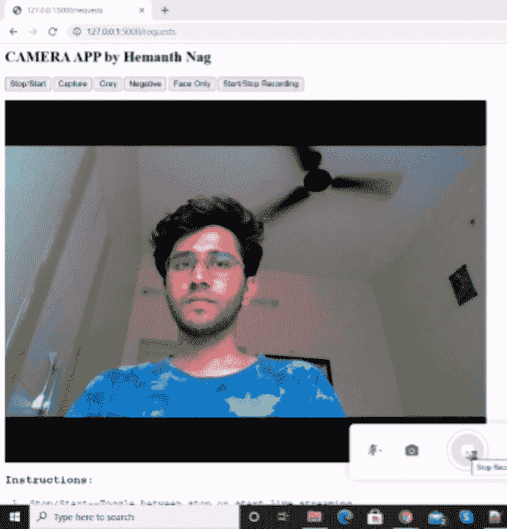
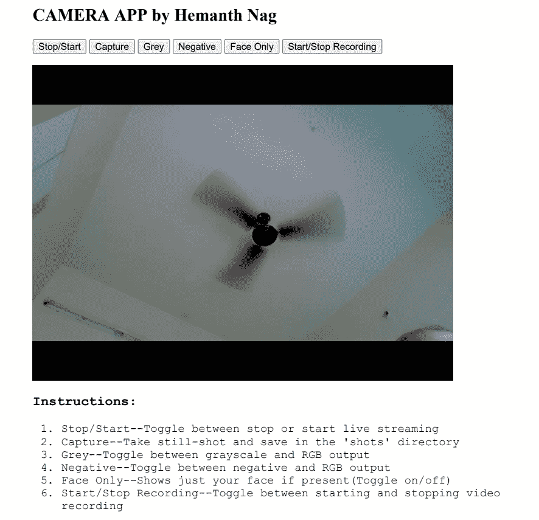

# 带 Flask 和 OpenCV 的相机应用程序

> 原文：<https://towardsdatascience.com/camera-app-with-flask-and-opencv-bd147f6c0eec?source=collection_archive---------2----------------------->

## 使用 flask 构建一个相机应用程序，应用 Snapchat 一样的过滤器，点击照片和录制视频…

在这篇博文中，我们将使用 flask framework 构建一个相机应用程序，在其中我们可以点击图片，录制视频，应用灰度、负片和“仅面部”滤镜等滤镜，就像 Snapchat 上出现的那样。我使用了一个非常基本的前端设计，因为这个项目背后的主要动机是让自己熟悉 flask web-framework，还包括实时视频流。同样的功能也可以扩展，以增加更多的功能。


巴斯蒂安·里卡迪在 [Unsplash](https://unsplash.com?utm_source=medium&utm_medium=referral) 上拍摄的照片

**演示:**



作者 GIF

我们利用了像*线程、HTTP 请求-响应、全局变量、错误处理*和*人脸检测*这样的概念。让我们详细看看所有这些是如何发生的。

# **前端:**

首先，前端是一个基本的 HTML 文件，带有接受输入的按钮和在后端预处理后显示输出帧的图像源标签。文件中的按钮将数据发送到服务器。该文件还显示了一些使用该应用程序的说明。该文件保存在项目目录的“templates”文件夹中。



作者截图

# 后端:

至于后端，它是一个完成所有魔术的 python 脚本。它保存在项目目录中。让我们分别看一下文件的各个部分，以便理解它的工作情况。

**初始化:**

在上面的代码中，我们导入了所有必要的模块。

Flask 是一个微型的 web 框架，它就像是前端和后端之间的桥梁。从 *flask* 中，我们导入' *Response* 和' *request* 模块来处理 HTTP 响应请求。 *render_template* 用于渲染之前显示的 HTML 文件。OpenCV 是用于执行所有计算机视觉任务的模块。*线程*模块用于产生新的线程。

然后，我们声明所有的全局变量，它们就像一个“拨动开关”来执行不同的任务，如捕捉图像、开始/停止记录和应用过滤器。将变量初始化为 0，将所有内容设置为 false。

在第 18 行，我们尝试创建一个名为“ *shots* 的文件夹，如果它不存在的话。这是保存所有捕获图像的地方。

第 24 行加载了一个预训练的人脸检测模型供将来使用，第 27 行创建了 Flask 应用程序的一个实例。第 30 行为内置摄像头创建了一个视频捕获对象。

**功能:**

*记录*功能用于开始记录，即将帧写入 avi 文件，同时将变量 *rec* 设置为真。它使用“ *out* ，这是后来初始化的视频编写器的对象。(*注意:如果你觉得录制的视频快或慢，调整一下 time.sleep 的值*)。

*detect_face()* '将相机帧作为输入，并返回一个裁剪出的帧，其中只包含在该帧中检测到的人脸。它使用之前加载的预训练人脸检测模型。(*请访问* [*本网站*](https://www.pyimagesearch.com/2018/02/26/face-detection-with-opencv-and-deep-learning/) *深入了解这是如何做到的*)。

*gen_frames* 是一个重要的功能，在其中完成实际的帧捕捉(通过摄像机)和处理。它在一个无限的 while 循环中运行。第 4 行从相机对象中捕获帧。如果帧捕获成功，它将检查是否有任何过滤器开关为真。如果'*人脸'、'负片'*或'*灰度*'为真，则分别对读取帧应用人脸滤镜、负片滤镜和灰度滤镜。

如果' *capture* '变量被设置为 true，它被重置为 false(全局变量)，当前帧以' png '格式保存。如果' *rec* '为真，帧被复制到' rec_frame '全局变量，该变量在被触发时被保存到视频文件中。

第 25 行将帧编码到内存缓冲区，然后转换成字节数组。第 27 行产生了需要作为 HTTP 响应发送的格式的帧数据。

**HTTP 路由:**

这是前端与服务器通信的地方。通信通过 URL 路由发生在*‘GET*’和 *POST* 方法中。

@app。route('/')'是 Flask 提供的一个 Python 装饰器，用于轻松地将 URL 分配给我们应用程序中的函数。Route '/'是根 URL，输入根 URL 时调用' *index()* '函数。 *'index.html'* 文件从函数渲染到网页中。

在 html 文件中，Route ' */video_feed* '被设置为图像源。此函数返回由循环中的“ *gen_frames()* ”生成的帧的响应块。

路由'*/请求*'被分配给'*任务()*'功能，该功能处理所有开关和视频记录。该路由既有' *POST* '又有 *'GET* '方法，即接受信息，也发送信息。之前所有路线默认为' *GET* '。

如果来自客户端的 HTTP 方法是' POST '，那么' *request.form.get* '接受来自用户按下的按钮的数据，并反转全局变量的先前状态，这些变量就像' *gen_frame* 函数中的开关。例如，当用户按下'*灰色*'按钮时，*灰色*'全局变量被设置为真，从而在' *gen_frames* '函数中将帧转换为灰度。当再次按下*灰色*按钮时，“灰色”设置为假，将画面恢复正常。

在运行 flask 应用程序的同时将帧记录到视频中是非常棘手的。最简单的解决方案是启动一个新的*线程*。

> 一个**线程**是一个独立的执行流。这意味着你的程序将同时发生两件事。一个**线程**共享数据段、代码段、文件等信息。与其对等**线程**，同时包含其自己的寄存器、堆栈、计数器等。

在我们的例子中，'*record()【T21]'函数有自己的 while 循环，所以这个循环在新线程中运行。首先，当' *rec* '为真时，我们创建一个' *VideoWriter* 对象。在第 37 行，我们初始化一个新线程，目标是' *record()* '函数，第 38 行启动新线程，其中' *record()'* 函数正在运行。再次按下录制按钮时，*【video writer】*对象被释放，录制停止，将视频保存到根目录。*

最后，如果来自客户端的 HTTP 方法是' *GET* '，则呈现' index.html '模板。

**主要功能:**

*'app.run()'* 用于启动默认地址**:**[**http://127 . 0 . 0 . 1:5000/**](http://127.0.0.1:5000/)**的烧瓶 app。**您可以通过将“主机”和“端口”参数添加到函数“*运行*”来设置不同的主机和端口号。将主机设置为广播地址 **0.0.0.0** 将使应用程序在整个局域网(wifi 等)中可见。因此，如果移动设备连接到同一个 Wi-Fi，您就可以从移动设备访问该应用程序。这是一个很好的“间谍凸轮”。

# 结论:

要运行这个应用程序，你应该在你的电脑上安装 python、flask 和 OpenCV。要启动应用程序，请在命令提示符中移动到项目目录。键入并输入:

```
python camera_flask_app.py
```

现在，将[**http://127 . 0 . 0 . 1:5000/**](http://127.0.0.1:5000/)复制粘贴到你最喜欢的互联网浏览器中即可。

你可以添加更多像人工智能滤镜这样的功能来构建一个 Snapchat 式的应用程序。您还可以增强用户界面，使其更具交互性和丰富多彩。**你可以在** [**我的 GitHub 账号**](https://github.com/hemanth-nag/Camera_Flask_App) **中获取这个项目的源代码。**

谢谢大家！！