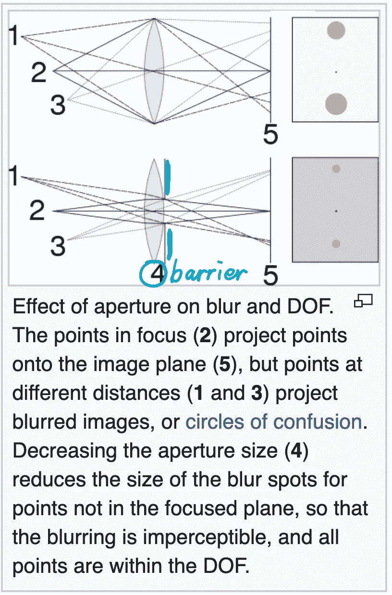
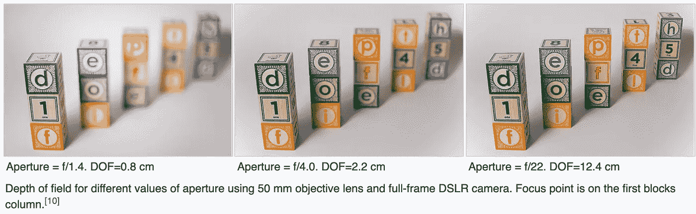
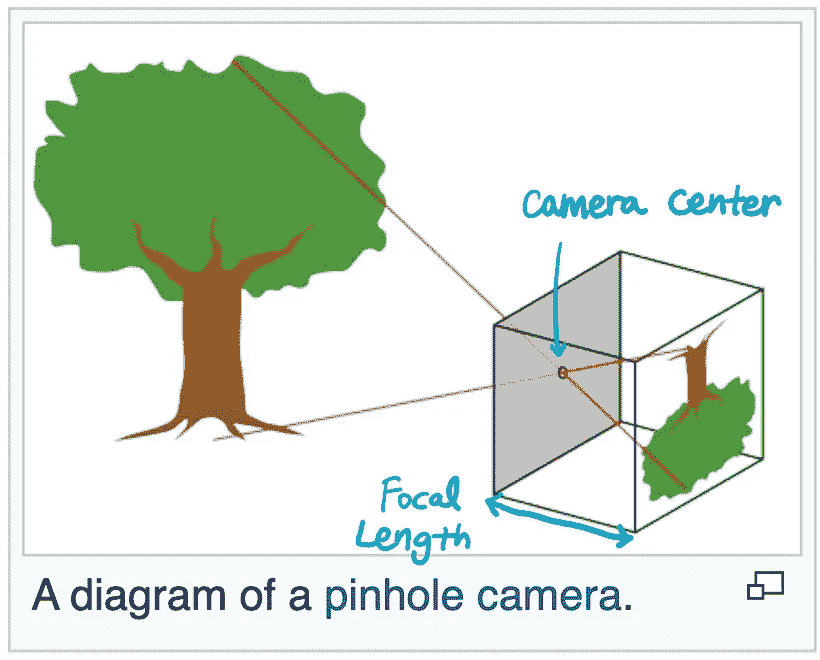
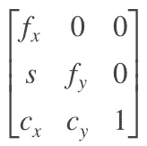
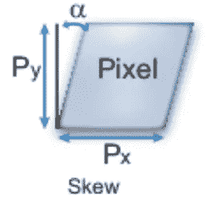
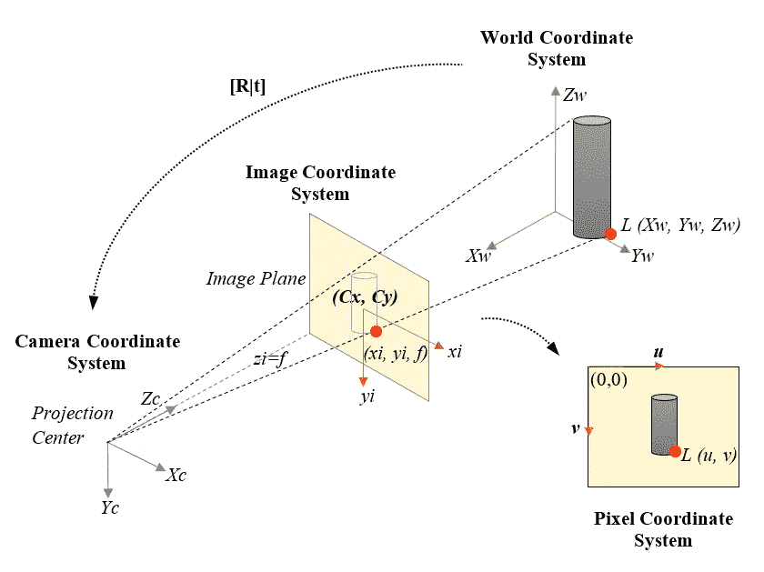
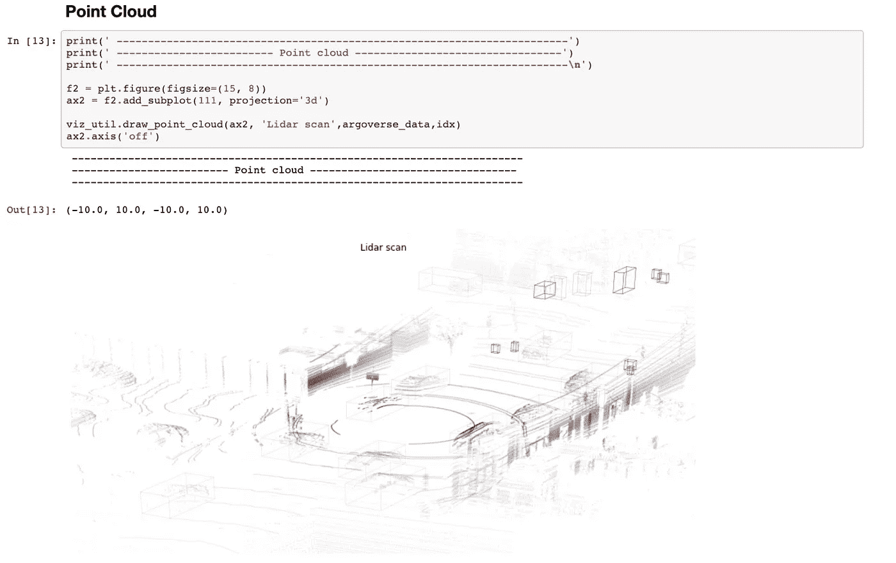
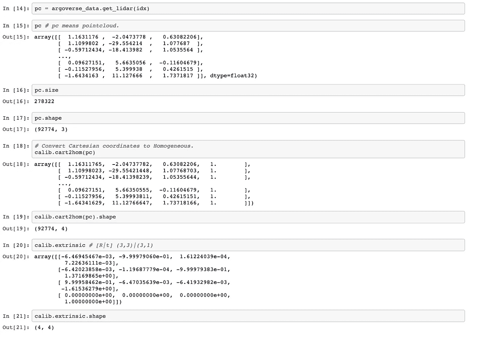
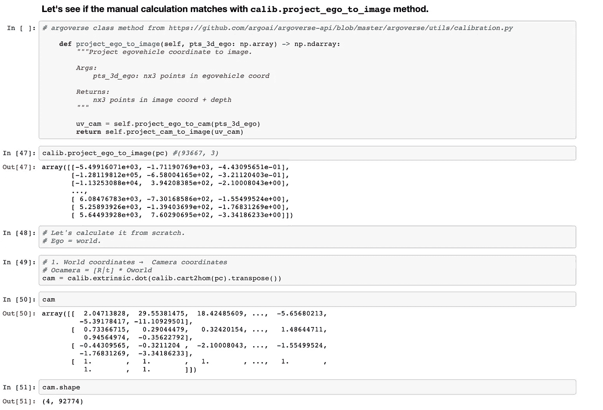
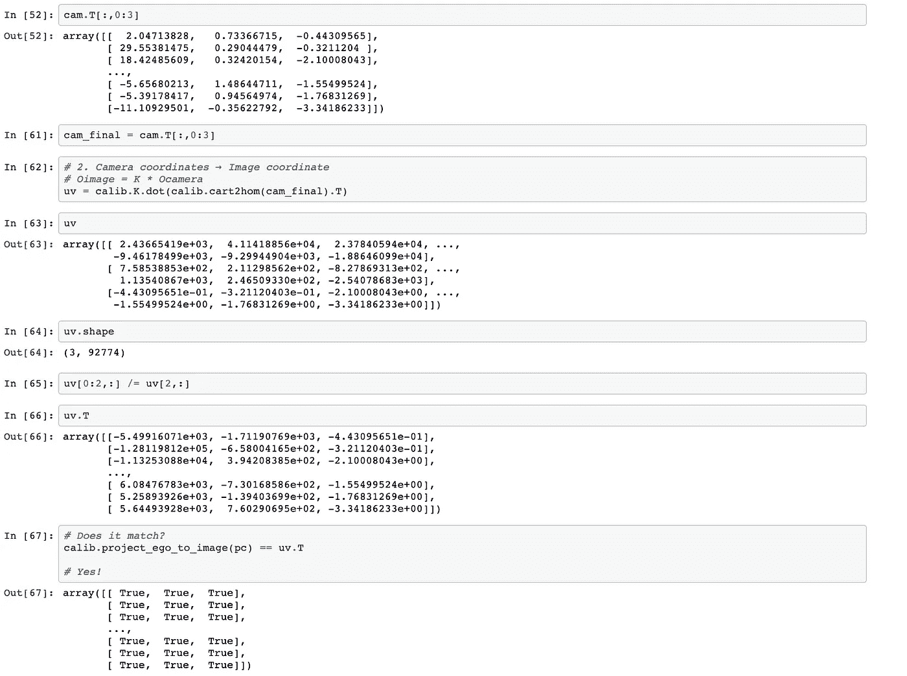

# 摄像机标定

> 原文：<https://towardsdatascience.com/camera-calibration-fda5beb373c3?source=collection_archive---------3----------------------->

## 相机几何和针孔模型

摄像机校准或摄像机切除**估计给定照片的针孔摄像机模型**的参数。通常，针孔摄像机参数用一个称为摄像机矩阵的 3 × 4 矩阵表示。我们用这些参数来**估计一个物体的实际大小**或者**确定摄像机在世界上的位置**。

# 怎么

在我们讨论摄像机校准之前，首先你需要了解针孔摄像机是如何工作的。

> 为什么我需要了解针孔摄像头？

因为这是任何相机工作的本质。针孔相机模型解释了世界上的一个点与图像平面(图像传感器)上的投影之间的关系。

> 我们如何将世界上的点投影到相机传感器中？

# 针孔**型号**

如果我们使用大开的相机传感器，我们最终会得到模糊的图像，因为成像传感器在传感器的同一位置收集来自物体上多个点的光线。

解决这个问题的方法是在成像传感器前面放一个有微小孔洞的障碍物。

该屏障仅允许有限数量的光线穿过该孔，并降低了图像的模糊性。



[https://en.wikipedia.org/wiki/Depth_of_field](https://en.wikipedia.org/wiki/Depth_of_field)

**【示例】不同光圈大小的真实图像**



[https://en . Wikipedia . org/wiki/Depth _ of _ field # Effect _ of _ lens _ aperture](https://en.wikipedia.org/wiki/Depth_of_field#Effect_of_lens_aperture)

## **针孔摄像机模型中最重要的两个参数**

1.  **焦距**:针孔与像面之间的距离

它影响投影图像的尺寸。使用镜头时会影响相机**对焦**。

2.**摄像机中心:**针孔**中心的坐标**。



[https://en.wikipedia.org/wiki/Pinhole_camera_model](https://en.wikipedia.org/wiki/Pinhole_camera_model#geometry)

针孔摄像机模型非常简单。知道了焦距和相机的中心，我们就可以用数学方法计算出物体反射的光线到达图像平面的位置。

焦距和相机中心是相机**内参数，K** 。( **K** 是表示固有矩阵的行业规范。)

## **内在参数**

(又名，相机矩阵。)



**固有参数，K** 。

(C *x，Cy)* :以像素为单位的相机中心。
( *fx* ， *fy* ):以像素为单位的焦距。

*FX*=*F*/*px*
fy=*F*/*py*

*F* :世界单位焦距(如毫米。)



像素倾斜

(P *x* ，P *y* ):以世界单位表示的像素大小。

*s* :倾斜系数，如果图像轴不垂直，则不为零。
*s*=*FX*tan(*α)*

# 坐标系转换(通过矩阵代数！)

> 我们为什么想要这个？
> 
> **为了将世界帧中的点投影到摄像机图像平面！**
> 
> 做什么？
> 
> **(如果说的是自动驾驶汽车)把自动驾驶汽车本土化！**

**光线(从物体反射)**从世界通过相机光圈(针孔)传播到传感器表面。通过孔径投射到传感器表面上导致翻转的图像。为了避免翻转混淆，我们在摄像机中心前定义了一个**虚像平面**(黄色平面)。



图来自[简化的摄像机模型投影](https://www.researchgate.net/figure/Pinhole-Camera-Model-ideal-projection-of-a-3D-object-on-a-2D-image_fig1_326518096)

```
# World Coordinate System 
**Oworld = [Xw, Yw, Zw]**# Camera Coordinate System
**Ocamera = [Xc, Yc, Zc]**# Pixel Coordinate System
**Oimage = [u,v]**
```

我们定义了一个 3 乘 3 **的旋转矩阵** ( **R** )和一个 3 乘 1 **的平移向量** ( **t** )，以便对世界坐标系和另一个坐标系之间的任何转换进行建模。

现在我们可以将投影问题(世界坐标→图像坐标)框架为

1.  **世界坐标** →摄像机坐标
2.  相机坐标→ **图像坐标**

```
**Oworld [Xw,Yw,Zw]** → **Oimage [u,v]**
```

## 怎么会？通过使用线性代数！

```
**1\. World coordinates** →  Camera coordinates**Ocamera = [R|t] * Oworld**2\. Camera coordinates → **Image coordinate****Oimage = K * Ocamera** Remind me what **K** (camera intrinsic parameter) was?
```


**内参数，K: f 为焦距，c 为相机中心，是相机特有的参数**

步骤 1 和 2 都只是矩阵乘法。因此，它可以重写(组合)为:

```
**Oimage = P * Oworld = K[R|t] * Oworld****Let P = K[R|t]
P** as Projection
```

等等， **K** 是(3，3)矩阵。**【R | t】**为(3，4)。(|意味着你将矩阵 **R** 与向量 **t** 连接起来。) **Oworld [Xw，Yw，Zw]** 为(3，1)。

那就不能用 **Oworld [Xw，Yw，Zw] (3，1)** 乘以 **K[R|t] (3，4)** ！

😎我们可以通过在 Oworld vector **[Xw，Yw，Zw，1]的末尾添加一个来解决这个问题，称为齐次坐标(或投影坐标)**。

如果想进一步把图像坐标转换成像素坐标:用 x 和 y 除以 z，得到图像平面上的齐次坐标。

```
**[x, y, z] -> [u, v, 1] = 1/z * [x, y, z]**
```

这就是了。这是核心。**这个简单的投影原理将被用于每一个 3d 视觉感知算法，从物体检测到 3d 场景重建。**

在现实生活中，会有更复杂的场景，比如非方形像素、摄像头访问倾斜、失真、非单位长宽比等。但是，**他们只是改变了相机矩阵 K** ，方程还是一样的。

需要注意一些事情:

a)**旋转矩阵** ( **R** )和**平移向量** ( **t** )被称为**外部** **参数**，因为它们在摄像机的“外部”。

平移向量 ***t*** 可以解释为相机坐标中世界原点**的位置，旋转矩阵 ***R*** 的列代表相机坐标**中世界轴**的方向。这可能有点难以理解，因为我们习惯于用世界坐标来思考。**

b)通常，多个传感器(如摄像机、激光雷达、雷达等。)用于自动驾驶车辆中的感知。每个传感器都有自己的外部参数，用于定义从传感器框架到车辆框架的变换。

c) 图像坐标(虚像平面)**【u，v】**从虚像平面的左上角开始。这就是为什么我们将像素位置调整到图像坐标框架。

# 眼见为实

看一下功能`project_ego_to_image`。它连续调用两个函数，首先是`project_ego_to_cam`，然后是`project_cam_to_image`，就像我们把世界坐标分解成两步转换成图像坐标一样:**世界坐标** →相机坐标，然后相机坐标→ **图像坐标**。

`cart2hom`将笛卡尔坐标转换成齐次坐标。

上面的代码片段来自 [argoverse-api](https://github.com/argoai/argoverse-api) 。

[](https://www.argoverse.org/) [## 主页

### 用于自驾研究的公开数据集很少包括丰富的地图数据，即使详细的地图是…

www.argoverse.org](https://www.argoverse.org/) 

在下面的 jupyter 笔记本中，您可以看到手动计算(从世界到图像平面的点云投影)与 argoverse api 的结果相匹配。



code:[https://github . com/aerinkim/towards data science/blob/master/Camera % 20 calibration % 20 Argo verse . ipynb](https://github.com/aerinkim/TowardsDataScience/blob/master/Camera%20Calibration%20Argoverse.ipynb)