# 一个数据科学家能代替一个 NBA 球探吗？最佳转会建议的 ML 应用程序开发

> 原文：<https://towardsdatascience.com/can-a-data-scientist-replace-a-nba-scout-ml-app-development-for-best-transfer-suggestion-f07066c2773?source=collection_archive---------16----------------------->

## [实践教程](https://towardsdatascience.com/tagged/hands-on-tutorials)

## 使用 NBA API 创建自己的 ML 模型并预测最佳球员交易

*“我有一个行动计划，但这个游戏是一个调整的游戏”* |迈克·沙舍夫斯基


照片由 [JC Gellidon](https://unsplash.com/@jcgellidon?utm_source=unsplash&utm_medium=referral&utm_content=creditCopyText) 在 [Unsplash](https://unsplash.com/photos/XmYSlYrupL8) 上拍摄

由于最近达到顶峰的希腊怪胎，我给了这个项目一个机会，这个项目我潜伏了几个月。那就 NBA 吧！

本文的主要内容是提出一个端到端的 ML 应用程序开发过程，其中包含了大量的监督和非监督算法，包括**高斯混合模型(GMM)** 、 **K-Means** 、**主成分分析(PCA)** 、 **XGBoost** 、**随机森林和多项逻辑回归分类器**。

## **概念**

在成功聚集威士忌品种以促进供应商的销售后，数据公司接受了一个新项目:协助密尔沃基雄鹿队在 2020 年交易窗口期间做出最佳下一步行动。即预先接触得分后卫(SG)位置的候选球员，并购买表现最好的球员。对篮球知识的无知让我想到了一个棘手的选择:

请求 NBA API，从过去赛季的比赛中获取球员数据(例如，助攻失误率、助攻百分比等)，以一种有意义的方式为总经理(GM)分类，并最终指导他应该在谁身上花费转会预算，怎么样？

为了更好地传达结果，我们做了几个假设:

#1:我们在 2020 赛季(10 月)结束。雄鹿通用为 SG 职位准备了 3 名候选人名单:**朱·霍勒迪**、**丹尼·格伦**、**博格丹·博格达诺维奇**。

#2:为了完成任务，我们必须从数据中发现任何可能导致雄鹿在各自主场进攻中提高表现的见解(最大助攻数、最小失误数等)，同时**保留**其余的统计数据(即加权投篮命中率%等)。也就是说，我们不应该简单地建议总经理购买最好的传球手或得分手，因为这可能会损害其他有价值的数据。

## 作案手法

1.  构建**数据集**；获取每个游戏的玩家统计数据(从现在开始“游戏”)。
2.  执行**EDA；**对变量的利用建立直觉，得出最早的结论。
3.  **集群**‘玩’通过**K-Means**&**GMM**；揭示潜在模式并确定最适合该案例的群集。
4.  使用现在标记的数据集(clusters = labels)，训练多个多类分类器，包括**多项式** **逻辑回归**，**随机森林** & **XGBoost** 。
5.  对候选球员的最新‘比赛’(2020 赛季)进行**预测**，并据此对其进行基准测试。
6.  **通过构建&服务 API(在下一篇文章中分析*)，向最终用户提供***训练好的模型。

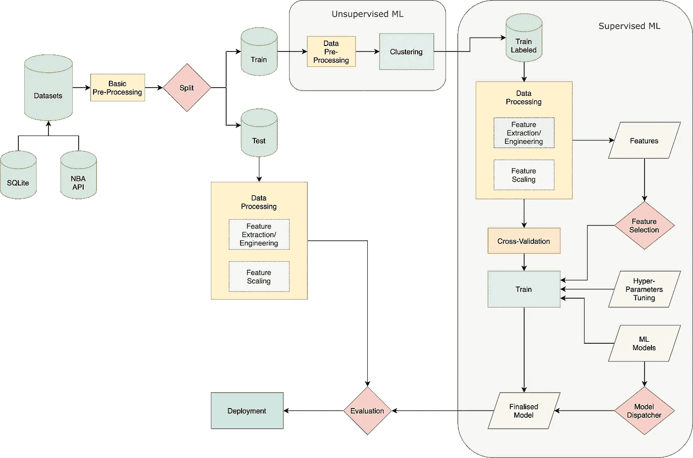

工作流程图(图片由作者提供)

*您可以运行解释过的工作流程的笔记本或脚本文件(。py)为自动的*。

# 1.资料组

该数据集分两步构建:(a)从这个 Kaggle [数据集](https://www.kaggle.com/wyattowalsh/basketball)开始，我们查询`basketball.sqlite`以提取 2017-2020 赛季的`GAME_IDs`,( b)我们向 [NBA_api](https://github.com/swar/nba_api) 发出请求以获取每场比赛的球员数据。

整个过程被打包在`[dataset.py](https://github.com/makispl/ml-nba-transfer-suggestion-app/blob/main/src/dataset.py)`中，你可以选择运行它，或者使用已经准备好的数据集，放在“ [data/raw](https://github.com/makispl/ml-nba-transfer-suggestion-app/tree/main/data/raw) 目录中。

我们使用 2017-2019 赛季的比赛来训练聚类和分类模型，并保留 2020 年的数据用于测试。以下是数据集的样本和对变量的充分的[解释](https://github.com/basketballrelativity/py_ball/wiki/BoxScore):

`plays_df`数据集样本

*在减杂的脉络中，我不深究* ***数据清理*** *和* ***预处理*** *程序——大家可以分别参考*[*00 _ EDA . ipynb*](https://github.com/makispl/ml-nba-transfer-suggestion-app/blob/main/notebooks/00_EDA.ipynb)*&*[*preprocess . py*](https://github.com/makispl/ml-nba-transfer-suggestion-app/blob/main/src/preprocess.py)*。*

# 2.电子设计自动化(Electronic Design Automation)

【*[*00 _ EDA . ipynb*](https://github.com/makispl/ml-nba-transfer-suggestion-app/blob/main/notebooks/00_EDA.ipynb)中提供了一个完整的 EDA*

*当涉及到评估 SG 的性能时，我们必须根据真正重要的东西来建立直觉。在这种情况下，我们根据领域知识将特性从最不重要的到最重要的进行分类。这也会让你更容易做出最终决定。*

```
*# classify features by domain importance
group_1 = [OF_RATING,AST_PCT,AST_TOV,TM_TOV_PCT,EFG_PCT,TS_PCT,POSS]
group_2 = [MIN, AST_RATIO, DREB_PCT]
group_3 = [OREB_PCT, REB_PCT, USG_PCT, PACE, PACE_PER40, PIE]
group_4 = [START_POSITION]
group_5 = [DEF_RATING]*
```

*已解释-分类特征*

*简而言之，就零存在、重复样本或低方差而言，所有特征都是高质量的，而它们的边界是有意义的(没有不合理极值的可疑情况)。*

*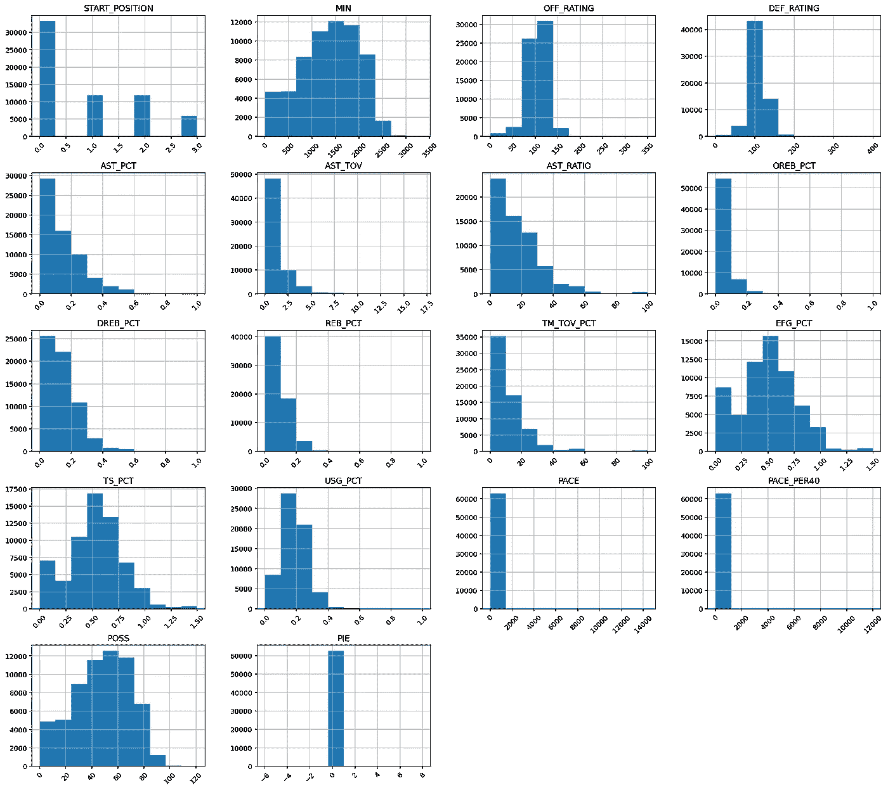*

*特征直方图*

*然而，它们中的许多都包含了任一侧的异常值。这是意料之中的，因为我们处理的是真实的游戏，没有人(甚至是不同游戏中的同一玩家)能够总是在一个固定的性能“范围”内表现。*

*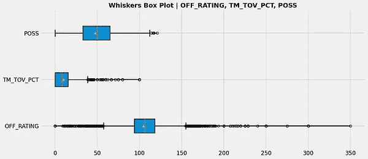**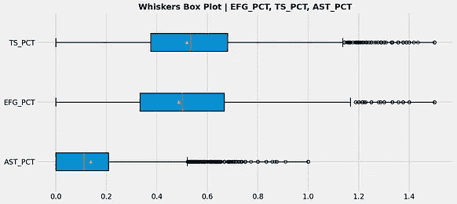**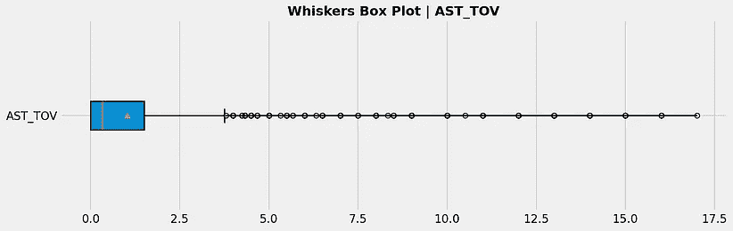*

*特征的须盒图*

*关于关键的一组`group_1`特征，它们在左右倾斜之间几乎是平衡的。然而，占主导地位的因素是超出相关上限的异常值的大量存在。有许多球员经常表现出色，超出预期，这一事实符合我们最初的结论:*

> ***归纳#1** :我们必须深入研究`group_1`，不仅要保证各自特性的显著水平，而且不能损害(尽可能多的)其他特性。*

*考虑到这一点，我们启动了一种简单的方法，通过主特征(`AST_PCT`)对数据集进行排序，取其较高的部分(第 95 百分位)并“水平地”(跨所有特征)评估剧本。*

*`plays_df`描述性统计(人口)*

*`plays_df`描述性统计(第 95 百分位)*

*结果令人失望。通过将人口与第 95 百分位的平均特征进行比较，我们看到随着`AST_PCT`的最大化，许多剩余的特征变得更差，违反了假设 2。另外，我们也不愿意买一个助攻率很高但投篮表现很差的 SG(`EFG_PCT`)！*

*因此，很容易想到，我们无法基于简单的探索技术完成构建最佳 SG 轮廓的任务。因此:*

> ***归纳#2** :我们必须在现有数据的基础上建立更好的直觉，并使用更先进的技术，有效地对其进行细分并捕捉潜在的模式，这可能会引导我们找到最佳的 SG 档案。*

*集群拿起火炬…*

# *3.使聚集*

*【*参考*[*01 _ 聚类【kmeans_gmm】。ipynb*](https://github.com/makispl/ml-nba-transfer-suggestion-app/blob/main/notebooks/01_clustering%5Bkmeans_gmm%5D.ipynb)*

## *k 均值*

*我们从流行的 **K-Means** 算法开始，但是首先实现 PCA，以便降低数据集的维数，同时保留大部分原始特征的方差[1]。*

*pca4clustering.py*

*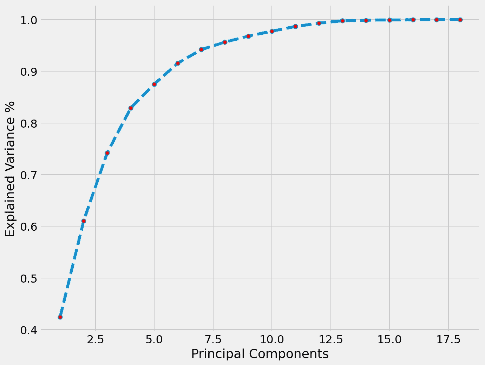*

*PCA ~解释方差*

*我们选择一个 4 部分的解决方案，因为它解释了至少 80%的人口方差。接下来，我们通过使用[肘形法](https://en.wikipedia.org/wiki/Elbow_method_(clustering))并绘制 WCSS 线，找到最佳的簇数(k ):*

*locate _ 肘部. py*

*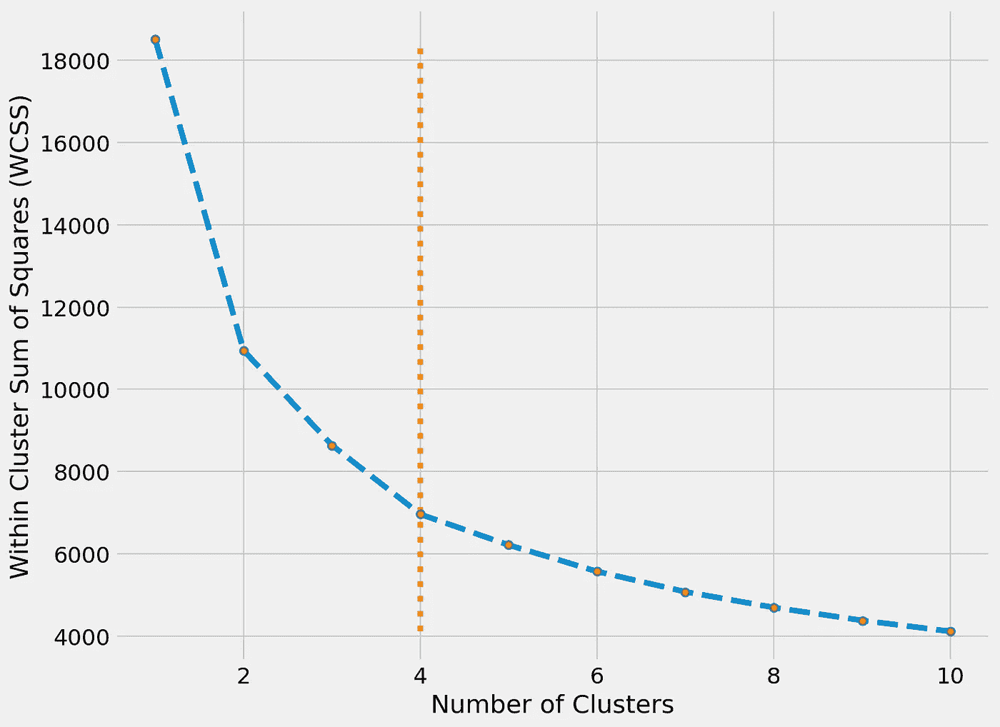*

*WCSS ~团簇图*

*最佳聚类数是 4，我们准备好拟合 K 均值。*

*kmeans.py*

*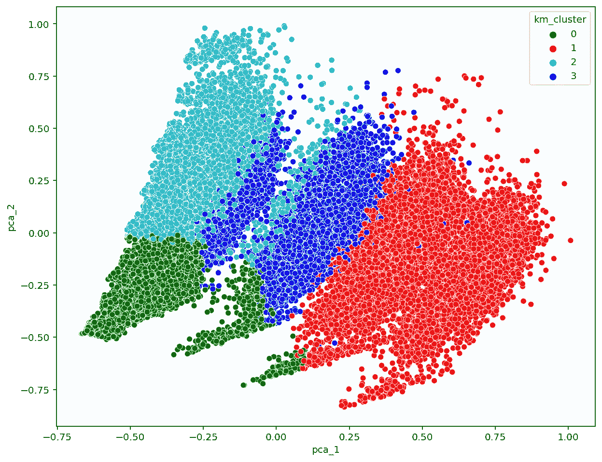*

*k-均值聚类*

*得到的聚类还不错，但是分别有许多`cluster_2`和`cluster_3`蓝绿色&蓝色的重叠点。为了寻求潜在的增强，我们将研究另一种聚类算法。这次不是基于距离，而是基于分布；**高斯混合模型**【2】。*

## *戈-梅-莫三氏:男性假两性畸形综合征*

*一般来说，GMM 可以处理更多种类的形状，而不需要假设聚类是圆形的(像 K-Means 那样)。此外，作为一种概率算法，它为数据点分配概率，表示它们与特定聚类的关联有多强。然而，没有免费的午餐；GMM 可能会很快收敛到局部最小值，从而恶化结果。为了解决这个问题，我们可以用 K-Means 初始化它们，通过调整各自的类参数[3]。*

*为了挑选合适的聚类数，我们可以利用 Scikit 中的[贝叶斯高斯混合模型](https://scikit-learn.org/stable/modules/generated/sklearn.mixture.BayesianGaussianMixture.html)类——了解哪些权重聚类，将错误的聚类拉平为零或接近零。*

*贝叶斯 _gm.py*

```
*# returns
array([0.07, 0.19, 0.03, 0.14, 0.19, 0.09, 0.06, 0.18, 0.05, 0.01])*
```

*显然，只有 4 个集群超过 0.01 阈值。*

*gmm.py*

*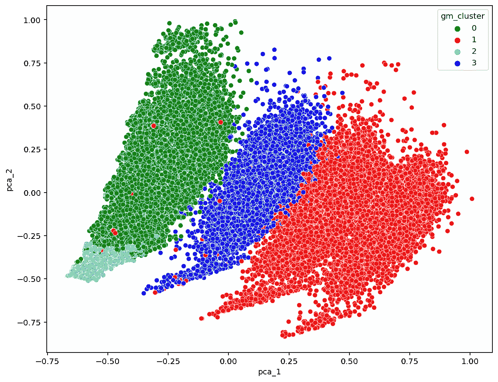*

*GMM 星团*

*就是这样！`cluster_3`(蓝色)这次更好分离，而`cluster_2`(青绿色)也更好包容。*

## *聚类评估*

*为了增强聚类评估，我们引入了一个新的变量，它描述了被检查特征的净得分。对每组进行加权，以便更好地表达其对最终性能的影响，并计算它们的代数和。我将权重分配如下:*

```
*NET_SCORE = 0.5*group_1 + 0.3*group_2 + 0.2*group_3 - 0.3*group_5# group_4 (START_POSITION) shouldn't be scored (categorical feature)
# being a center ‘5’ doesn't mean to be ‘more’ of something a guard ‘1’ stands for!# group_5 (DEF_RATING) is negative in nature
# it should be subtracted from the Net Score*
```

*那么，让我们对集群进行评分和评估。*

*net_scoring.py*

*通用汽车集群得分由`NET_SCORE`*

*显然，`cluster_3`的表现优于其他产品，其`NET_SCORE`为 aprox。662.49，而`cluster_1`紧随其后。但是，这里值得强调的是第 95 百分位和新引入的`cluster_3`之间的量化比较:*

*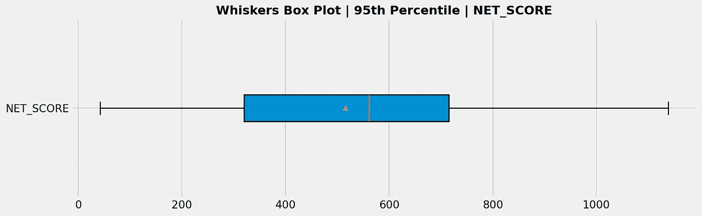**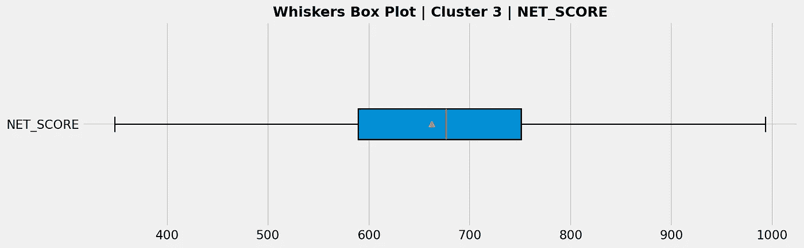*

*`NET_SCORE`第 95 百分位& cluster_3 的须盒图*

*通过注意 146.5 个`NET_SCORE`单位的增加，可以清楚地看到`cluster_3`在第 95 百分位段中占主导地位！因此:*

> ***归纳#3** : `Cluster_3`以一种真正平衡的方式概括了那些源自 SG 出色表现的“剧本”——`group_1`特性达到了较高水平，而其余大部分保持了不错的平均水平。该分析考虑了比最初尝试更多的特性(参考文献 1)。EDA)，它利用了一个主导者(`AST_PCT`)。这证明了…*
> 
> ***归纳#4** :聚类促进了更全面的数据分离，这些数据来自更多组件的信号，沿着这些思路，我们设法揭示了顶级 SG 的预期性能的更清晰指示。*

*现在，我们能够操纵标记的(具有聚类)数据集，并开发一种方法来预测新样本(未标记的“播放”)所属的聚类。*

# *4.分类器*

*【*参考*[*02 _ 分类【logres_rf_xgboost】。ipynb*](https://github.com/makispl/ml-nba-transfer-suggestion-app/blob/main/notebooks/02_classifying%5Blogres_rf_xgboost%5D.ipynb) ]*

*我们的问题属于多类分类的范畴，要采取的第一步是选择一个验证策略来解决潜在的过度拟合。*

```
*# check for the clusters' balance
0    27508
1    17886
3    11770
2     5729*
```

*偏斜的数据集意味着必须选择一个**分层 K 倍**交叉验证，而不是随机验证。这将使标签的比率在每个折叠中保持不变，无论我们选择什么度量来评估，它都将给出相似的结果[4]。说到指标，F1 分数(精确度和召回率的调和平均值)看起来比准确度更合适，因为目标是倾斜的[5]。*

*创建 _ 折叠. py*

*接下来，我们**标准化**数据，以便训练我们的(基线)逻辑回归模型。请注意，这里首先要适合训练数据集，然后转换训练和测试数据。这对于避免数据泄露至关重要[6]！*

*基线 _ 模型. py*

```
*# returns
Mean F1 Score = 0.9959940207018171*
```

## *特征重要性*

*如此惊人的准确性从一开始就令人生疑。在检查特征重要性的可用方法中(例如 MDI)，我选择了**置换特征重要性**，它是模型不可知的，因此我们能够对所有模型使用任何结论【7】。*

*置换 _ 专长 _ 重要性. py*

*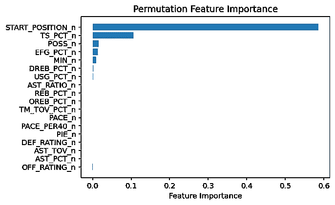**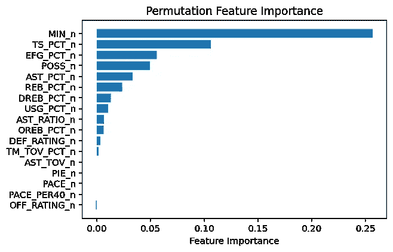**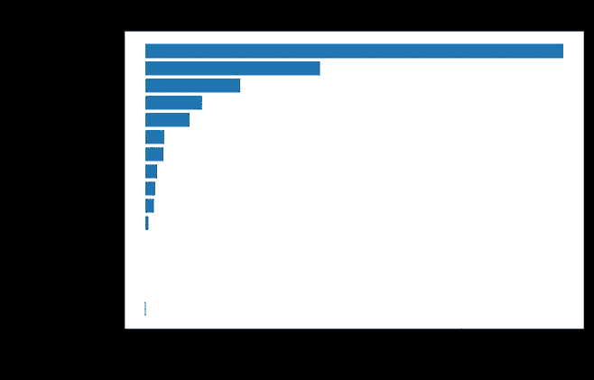*

*排列特征重要性为:(a)所有特征，(b)所有**≦**`START_POSITION`，(c)所有**≦**`START_POSITION`，`MIN`*

*`START_POSITION`贡献的重要性极高(*单独计算，得分 F1=0.865* )。如果我们检查相关的描述性统计，我们看到所有的`group_1`特征在`START_POSITION`为 0(即 NaN)时得到最低水平。*

*`START_POSITION`描述性统计*

*这*暴露了*这些玩家没有开始游戏，所以他们很有可能比其他人玩的时间少，因此他们的统计数据更差！这同样适用于`MIN`变量——它精确地表达了一名球员在球场上花费的时间。因此两者都会导致**数据泄漏**，我们忽略它们。除此之外，我们还区分了最重要的特征。*

## *特征工程*

*此外，我们试图通过构建一个新的、数量更少的变量来减少特征的数量，这些变量捕获了原始信息的重要部分。我们再次将 PCA 置于聚光灯下，这一次尝试 9 和 7 组分。注意只使用剩余的标准化特征(≦`START_POSITION`，`MIN`)！*

*最终，我们产生了以下特征“桶”:*

```
*all_feats   = [all] - [START_POSITION,MIN]
sgnft_feats = [all_feats] - [OFF_RATING,AST_TOV,PACE,PACE_PER40,PIE]
pca_feats   = [pca x 9]
pca_feats   = [pca x 7]*
```

## *超参数优化*

*在考虑了特征选择之后，我们开始优化每个模型的超参数。 [GridSearch](https://scikit-learn.org/stable/modules/generated/sklearn.model_selection.GridSearchCV.html) 非常有效，尽管很耗时。该过程与所有模型相似——为了简单起见，我只给出 XGBoost 案例:*

*xgboost_grid_search.py*

```
*# returns
Best score: 0.7152999106187636
Best parameters set:
      colsample_bytree: 1.0
      lambda: 0.1,
      max_depth: 3,
      n_estimators: 200*
```

## *模型*

*现在，我们在 [model_dipatcher.py](https://github.com/makispl/ml-nba-transfer-suggestion-app/blob/main/src/model_dispatcher.py) 中声明每个模型的最佳超参数，它将我们选择的模型分派到 train.py 中。后者总结了整个训练过程，使训练具有每个特性“桶”的调整模型变得更加容易。我们得到:*

```
*## Logistic Regression ## used               num_feats            F1_weighted
=========      |      =========     |      ==========
all_feats      |         16         |        0.7144
sgnft_feats    |         11         |        0.7152
pca_feats      |          9         |        0.7111 # sweet-spot
pca_feats      |          7         |        0.7076## Random Forest ## used               num_feats             F1_weighted
=========      |      =========     |       ==========
all_feats      |         16         |         0.7213
sgnft_feats    |         11         |         0.7145
pca_feats      |          9         |         0.7100
pca_feats      |          7         |         0.7049## XGBoost ## used               num_feats             F1_weighted
=========      |      =========     |       ==========
all_feats      |         16         |         0.7238  #best
sgnft_feats    |         11         |         0.7168
pca_feats      |          9         |         0.7104  
pca_feats      |          7         |         0.7068*
```

****注*** *:由于模型的随机性质或数值精度，您的结果可能会有所不同。**

*引入了经典的*性能*与*简单性*的权衡；我选择了具有 pca_feats (x9)的逻辑回归的潜力来进一步进行。*

# *5.预言*

*现在，对于测试数据集的剧本，我们通过使用所选择的模型来预测它们的聚类。*

*预测. py*

## *确认*

*为了进行验证，*基本事实*标签是必要的。然而，这不是我们的情况，因为测试数据集(`test_proc.csv`)没有被标记。您可能想知道为什么我们不通过聚类来标记它，但这将引导我们执行完全相同的程序，交叉验证已经完成了 5 次—隔离一小部分数据并进行验证。*

*相反，我们将通过进行定性检查来进一步评估分类器。我们可以手动检查一部分数据的标签，以确保它们是好的，或者将预测值与训练聚类进行比较，并检查任何主要的描述性统计数据是否仍然有效。*

*通过`NET_SCORE`预测集群得分*

*事实上，`cluster_3`以 109.35 辆的`NET_SCORE`成绩再次领先于其他厂商，同时在大多数关键特性(`OFF_RATING`、`AST_PCT`、`AST_TOV`和`POSS`)上保持最高水平。*

## *交易*

*最后也是最有趣的部分涉及到决策。首先，我们对候选球员(**朱·霍勒迪**、**丹尼·格伦**、**博格丹·博格达诺维奇**)在 2020 年上半赛季的“发挥”进行预测，并用各自的聚类对他们进行标注。*

*然后我们检查它们在*`cluster_3`中的成员资格，根据各自的`cluster_3_plays` / `total_plays`比率对它们进行排序。因此，我们运行`predict.py`脚本并得到:**

```
**# Results
{
 '**Jrue Holiday**': **0.86**,
 'Bogdan Bogdanovic': 0.38,
 'Danny Green': 0.06
}**
```

**你猜怎么着？**

**密尔沃基雄鹿队关于朱·霍勒迪转会太阳队的推特**

**2020 年 11 月 24 日，雄鹿官方宣布朱·霍勒迪交易！你这样认为；一个**脱离现实的**验证…**

## ****结论****

**到目前为止，我们已经走了很长的路……从 Kaggle & NBA API 开始，我们建立了一个庞大的数据集，对它进行了聚类，并揭示了成为一名真正优秀的得分后卫所需要的深刻模式。然后，我们在带标签的数据集上训练各种分类模型，以相当高的精度预测新玩家条目可能注册的集群。通过这样做，我们成功地聚焦了密尔沃基雄鹿队的下一步行动。)拿着，去补 SG 的位置。**

**类似于 [DJ vs 数据科学家](/can-a-data-scientist-replace-a-dj-spotify-manipulation-with-python-fbbd4a45ffd5)的案例，几乎不可能武断地回答数据科学在球探领域的潜力。然而，时代的迹象再次表明了人工智能在体育产业决策领域实施的有利温床…**

****

**照片由[帕特里克·福尔](https://unsplash.com/@patrickian4?utm_source=unsplash&utm_medium=referral&utm_content=creditCopyText)在 [Unsplash](https://unsplash.com/photos/DVpn-Ot0fV4) 拍摄**

**我把这个项目献给我的好朋友[帕诺斯](https://medium.com/@djmouzz/about)——一个狂热的篮球迷、天文爱好者和 IT 专家。**

**感谢您的阅读&祝您度过愉快的一周！如果有任何问题，欢迎在下面留言或通过 [Twitter](https://twitter.com/MPlegas) / [LinkedIn](https://www.linkedin.com/in/gerasimosplegas) 联系我。无论如何…**

**坐下来，克隆[回购](https://github.com/makispl/ml-nba-transfer-suggestion-app)，开始下一步……行动🤝**

****参考文献****

**[1][https://machine learning mastery . com/dimensionally-reduction-for-machine-learning/](https://machinelearningmastery.com/dimensionality-reduction-for-machine-learning/)**

**[2][https://www . analyticsvidhya . com/blog/2019/10/Gaussian-mixture-models-clustering/](https://www.analyticsvidhya.com/blog/2019/10/gaussian-mixture-models-clustering/)**

**[3][https://towards data science . com/Gaussian-mixture-models-vs-k-means-one-to-choose-62f 2736025 f 0](/gaussian-mixture-models-vs-k-means-which-one-to-choose-62f2736025f0)**

**[4] A .塔库尔，[《接近(几乎)任何机器学习问题](https://www.amazon.com/Approaching-Almost-Machine-Learning-Problem/dp/8269211508/ref=tmm_pap_swatch_0?_encoding=UTF8&qid=&sr=)，第一版(2020)，isbn-10‏: 9390274435**

**[5][https://towards data science . com/comprehensive-guide-on-multi class-classification-metrics-af 94 CFB 83 FBD](/comprehensive-guide-on-multiclass-classification-metrics-af94cfb83fbd)**

**[6][https://machine learning mastery . com/data-preparation-without data-leaving/](https://machinelearningmastery.com/data-preparation-without-data-leakage/)**

**[7][https://sci kit-learn . org/stable/modules/permutation _ importance . html](https://scikit-learn.org/stable/modules/permutation_importance.html)**