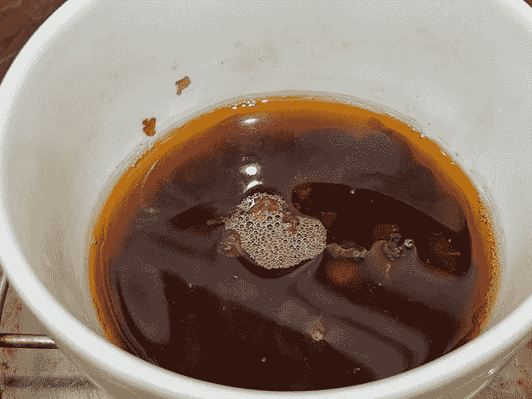
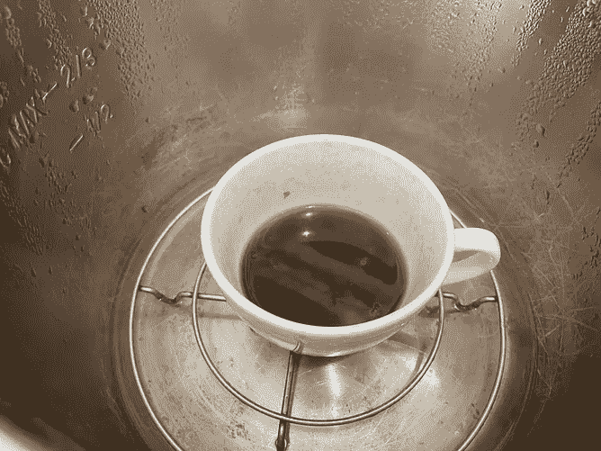

# 高压锅可以冲全豆咖啡吗？

> 原文：<https://towardsdatascience.com/can-a-pressure-cooker-brew-coffee-with-whole-beans-d28cf50b1d0f?source=collection_archive---------14----------------------->

## 咖啡数据科学

## 这可能是个坏主意

我没花太多心思在这上面。我想预先警告所有可能想玩巨魔的人。我有很多咖啡实验，非常酷和有趣，还有一些是因为我看着像我的火锅一样的东西，问自己，“我想知道我是否可以用它来煮咖啡，但不需要研磨？”所以我就这么做了。

> 首先，它不工作，但我很高兴这样做。

所有图片由作者提供

我将 18 克咖啡放入装有 54 克水的杯子中。我以为会吸收一些水分。我把它放入装有水的球拍上的火锅或速溶锅里，然后我打了蒸汽。

我想水应该是热的，有压力，这两样东西加上流量就成了浓缩咖啡。那么没有流量呢？而不磨呢？

使用折射仪测量总溶解固体(TDS ),该数字用于确定提取到杯中的咖啡的百分比，并结合一杯咖啡的输出重量和咖啡的输入重量，称为提取率(EY)。

2 分钟后，我测量了一下，只有 1.52 TDS。所以我又戴了 15 分钟。

仍然只有 4.43 TDS，所以我又做了 15 分钟，以 5.29 TDS 结束。这很难令人满意。

# 支点！

所以我想，为什么不把这整个混合物扔进维生素 a 混合物里呢？因为如果你想变得古怪，那就试试吧！

好吧，也许这是个糟糕的主意，咖啡没有磨好。大概是因为是刀片研磨机，液体不够。

> 使用毛刺研磨机！

# 再次旋转！

所以我把它废弃了，我把它放进了我全新的零号位置！

> 开个玩笑！

我疯了，但不傻。我把它放进一个杯子里，用我的浸泡式搅拌机多加了一点水。

然后我需要过滤这种混合物，所以我把它倒进我信赖的 Kompresso。首先，我过滤掉所有的液体:

然后我加入了剩下的大块咖啡。

虽然颜色不吸引人，但我尝了第一半，尝起来像是未充分提取的酿造品。我还做了一些 TDS 测量来估算提取率。

从数字来看，咖啡没被充分提取。我想知道根据云量，TDS 测量是否关闭。

就像随机实验一样，有时它们不起作用。然而，我已经进入了发布我正在尝试的任何东西的模式，以防万一。

这个故事的寓意是，你应该在冲泡之前研磨咖啡豆，以防这还不明显。

如果你愿意，可以在 Twitter 和 YouTube 上关注我，我会在那里发布不同机器上的浓缩咖啡视频和浓缩咖啡相关的东西。你也可以在 [LinkedIn](https://www.linkedin.com/in/robert-mckeon-aloe-01581595?source=post_page---------------------------) 上找到我。也可以关注我[中](https://towardsdatascience.com/@rmckeon/follow)。

# 我的进一步阅读:

[个人故事和关注点](https://rmckeon.medium.com/personal-stories-and-concerns-51bd8b3e63e6?source=your_stories_page-------------------------------------)

[乐高故事启动页面](https://rmckeon.medium.com/lego-story-splash-page-b91ba4f56bc7?source=your_stories_page-------------------------------------)

[浓缩咖啡系列文章](https://rmckeon.medium.com/a-collection-of-espresso-articles-de8a3abf9917?source=your_stories_page-------------------------------------)

[一台用于制作优质浓缩咖啡的叶片研磨机](https://medium.com/overthinking-life/a-blade-grinder-for-great-espresso-cf4f5a561ba6?source=your_stories_page-------------------------------------)

[浓缩咖啡:群头水温分析](https://medium.com/@rmckeon/espresso-grouphead-water-temperature-analysis-25cc00556d5c?source=your_stories_page-------------------------------------)

[真空罐能更快去除咖啡豆中的气体吗？](/can-vacuum-jars-remove-gas-from-coffee-beans-faster-4a5a40981be2?source=your_stories_page-------------------------------------)

在水中跌跌撞撞:浓缩咖啡水实验

克莉玛，嗯，它有什么用？

[南印度咖啡](https://medium.com/@rmckeon/southern-indian-coffee-b363b08b6d8b?source=your_stories_page-------------------------------------)

[重新研磨用过的咖啡，制成意式浓缩咖啡](/re-grinding-used-coffee-for-espresso-3f6d06318f8b?source=your_stories_page-------------------------------------)

[冲泡咖啡渣](https://medium.com/@rmckeon/brewing-coffee-residue-c8ba9b8bb7bb?source=your_stories_page-------------------------------------)

[咖啡水果茶 via Flair Espresso](https://medium.com/overthinking-life/coffee-fruit-tea-via-flair-espresso-88717ff07e9c?source=your_stories_page-------------------------------------)

[强迫症工具对浓缩咖啡不起作用](/ocd-tools-dont-work-for-espresso-5b2f988af495?source=your_stories_page-------------------------------------)