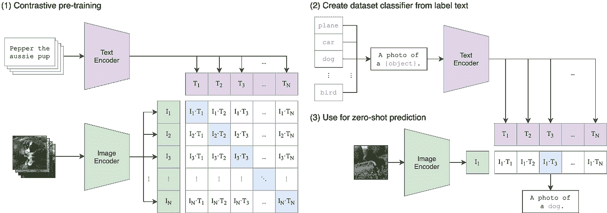
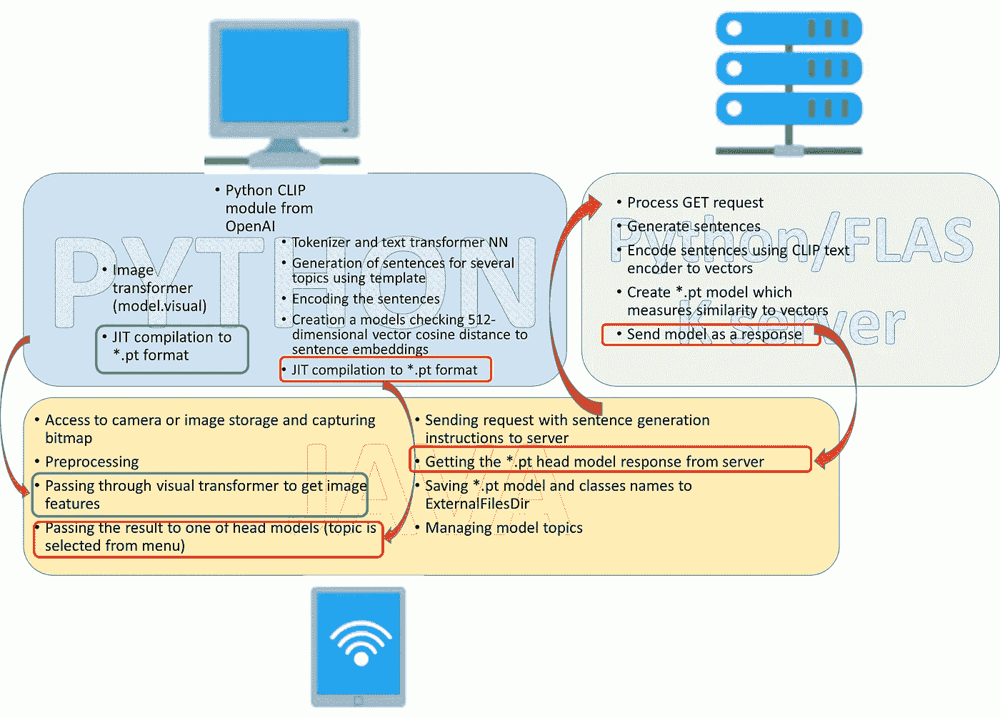
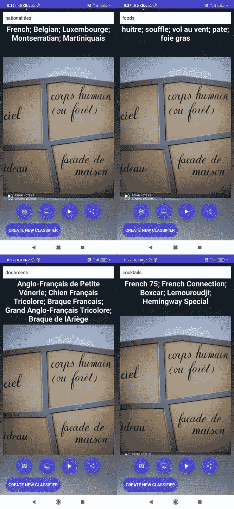
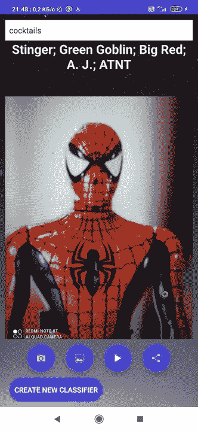
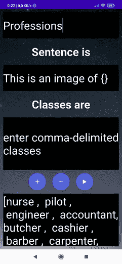
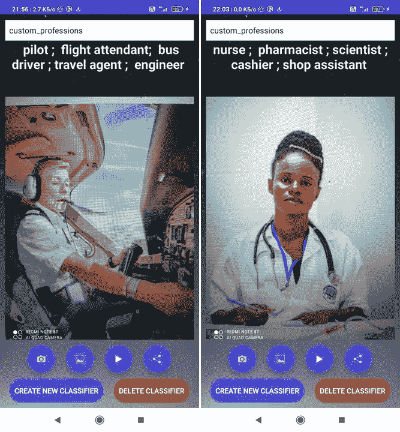
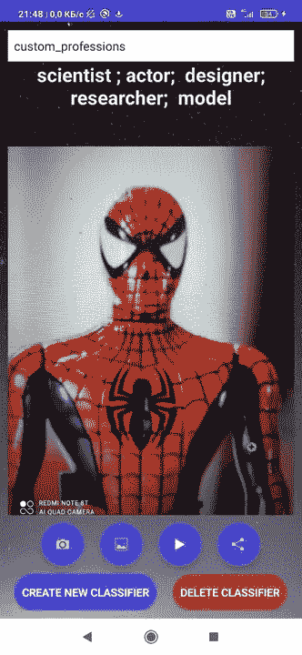
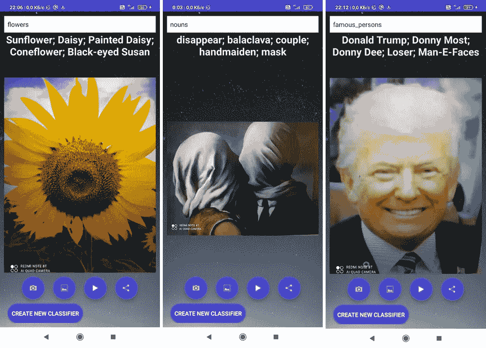
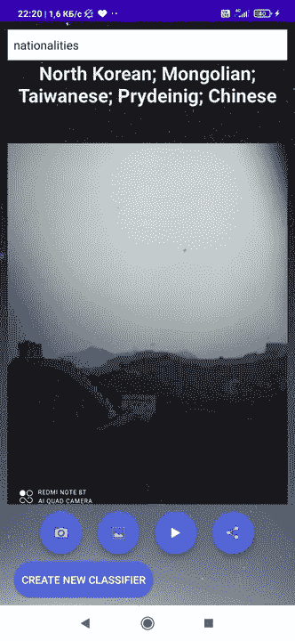
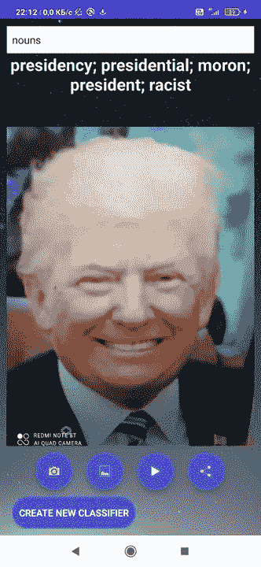

# 单个 app 能代替所有图像神经分类器 app 吗？一个有趣的夹子

> 原文：<https://towardsdatascience.com/can-a-single-one-replace-all-image-neural-classifier-apps-a-fun-with-clip-cdaa4c4edd84?source=collection_archive---------31----------------------->

## Android 设备上零镜头学习的 OpenAI CLIP 模型部署。TL DR:app 在这里[这里](https://play.google.com/store/apps/details?id=com.clipclassifier.universalclip)，随意试验一下吧！

通用分类器适用于概念概括(作者拍摄的应用程序截图)。灵感来自 [unsplash](https://unsplash.com/photos/UUdJ-0LQs0M) (中)和 [unsplash](https://unsplash.com/photos/Oklzj82ffsQ) (右)的 [Ed van duijn](https://unsplash.com/@eddyvanduijn)

# 什么是剪辑，为什么有趣？

今年 1 月，图像处理领域取得了一项重大突破——open ai 展示了一种新的神经网络生成器 [Dall-E，](https://openai.com/blog/dall-e/)它可以根据文本描述生成图像。尽管名为 OpenAI，但它并没有开源。然而，我对一个作为 Dall-E 训练和最佳生成范例选择的辅助神经网络非常感兴趣。与 Dall-E 相反，CLIP 是一个在 MIT 许可下发布的开源项目，因此人们可以在任何地方轻松使用它。这个神经网络可能不太适合演示，但它让我印象深刻。总的来说，这是一个两个模块的项目。第一个模块是一个非常有效的图像转换器神经网络。该深度神经网络使用最先进的注意力机制将图像编码到 512 维嵌入空间中。另一个部分是文本转换器，它将文本转换成向量，再转换成同样的 512 维空间。

零镜头学习的剪辑工作和 it 应用方案(图片来自剪辑 [github](https://github.com/openai/CLIP)

我没有找到任何关于训练过程的数据，但我认为这是对 cosface/arcface loss 的一些修改，对这两个模块采用了不同的训练机制。至于数据，尽管模型本身的大小相对较小，但训练这样的模型所需的数据是巨大的。因此，CLIP 在大量签名图像上进行训练，这些图像可能是在整个互联网或维基上解析的。然而，每个人都可以使用预训练剪辑。

# 为什么剪辑让我印象深刻？

由于它有效地将图像和文本转换到一个空间(CLIP 意味着对比语言-图像预训练)，因此使用它可以容易地执行零镜头学习。如果我们生成类似“这是一张猫的照片”和“这是一张狗的照片”的文本，并将它们转换为矢量(对它们进行编码)，我们可以检查任意转换的图像是更接近“猫”还是“狗”矢量。正如 OpenAI 博客文章中所示，这种分类方式甚至比针对特定分类任务在大数据集上预先训练的经典卷积神经网络更有效。我检查了这个事实，发现它对我尝试过的大多数任务都是正确的。在极少数任务中(例如，照片中的矿物名称)，经典搜索结果显示稍好的结果。我在玩 CLIP 的过程中发现的第二个令人印象深刻的事实是预测的灵活性，我甚至发现 CLIP 的图像部分能够识别一些文本的照片(它在英语照片上工作得很好，其他语言感觉更差)。这种能力来自注意力机制，它允许更复杂的特征估计。几天前 OpenAI 发表了另一篇关于在剪辑的图像部分探索神经元激活的精彩帖子，显示相同的神经元在完全不同的图像中被激活，对应于[相同的概念。](https://openai.com/blog/multimodal-neurons/)例如，类似的神经元在蜘蛛的图像、蜘蛛侠的图画和文字“蜘蛛”的照片上被激活。
第三，CLIP 的图像转换器部分相对较轻。它甚至可以在 CPU 上实时工作。在 GPU 工作显示出非常高的帧率。另一方面，Textual transformer 没有这么快。
我已经测试过，发现 CLIP 图像转换器部分可以很容易地在 android 设备上运行，我决定创建一个应用程序，可以使用 CLIP 的转换器部分进行分类。

# 应用架构

我实现了图像转换器以及图像预处理部分，可以访问图像存储和 android 应用程序的设备摄像头。图像转向其 512 维嵌入。还有，我有几组对应不同概念的向量(在 pc 上预生成)。每个集合可以对应一个特定的主题(例如宠物品种、食物、国籍、年龄、名人等)
之后，我将该图像与集合中的每个向量进行比较(使用余弦相似度的 softmax ),并显示得分最高的前 5 个答案。为了扩展分类器的可能性，增加了用于生成新集合的模块。新分类器的类别列表可以从应用程序发送到服务器。服务器使用文本转换器部分将概念转换为向量，并将其返回给应用程序。用户获得了一个新的分类器！开发部署方案如下所示:

应用程序的流水线和架构(图片由作者提供)

# Python 部分

我用过 python 的 Anaconda 发行版。让我们从虚拟环境的创建和调整开始

安装所有软件包后，让我们开始工作！在 jupyter 笔记本中导入所有必需的包:

比我载入模型

选择和编译可视转换器部件“aardvark.jpg”可以是任何图像:

然后我寻找一些与主题相关的列表(大部分来自 wiki ),并使用该功能从模板中创建句子:

该函数将模型保存为*。pt 文件，并为 android 的进一步使用创建 XML。该 XML 包含所有的类名。csv 列出了 4000 个最常用的英语名词

# Java 部件(应用程序)

尽管 Kotlin 语言更容易用于 android 开发，但我更喜欢 Java，因为我在这方面有一些经验，而在 Kotlin 方面完全没有经验。

不幸的是，Java 代码太重，可读性差，所以我将只展示 2 个重要的部分

1.  加载可视转换器和顶级模型(这里我还添加了传统训练的头部模块，用于在 X 射线上检测肺部肺炎，以显示额外的可扩展性):

2.然后我添加一个重要的客户端部分(服务器部分)。这是一个用于服务器请求并将响应(头模型)保存到 ExternalFilesDir 的模块。类和模型名称的 Dir 列表保存在这里:

请求的 URL 是基于要扩展的类和句子构建的。代码的另一部分以及接口部分在当前的出版物中没有显示。

# Python Flask 服务器部分

我在其中一个网站上租了 VPS。关于系统——我已经在 Centos 7 下用 WSGI/Flask 启动了一个 apache 2.0 服务器(对我来说这是最难的部分，因为我以前从未使用过服务器部署，所以需要几天的 googling 和 StackOverflow 搜索)
Python 服务器部分类似于 cerate_xml 函数。唯一的区别是处理请求和发送回生成的模型文件。不幸的是，服务器的运行速度没有我希望的那么快。如果该应用程序将会流行，我应该将一些计算转移到 AWS Lambda:

app 修改方案(图片作者提供)

# 好玩的部分！测试！

该应用程序运行得非常好。首先，让我们重复一下 OpenAI 的惊人结果，它在一个由不同方式表示的概念上发现了相似的神经元激活:

通用分类器适用于概念概括(作者拍摄的应用程序截图)。作者打印的左侧图像。中央图片由[艾德·范·杜伊因](https://unsplash.com/@eddyvanduijn)从 [unsplash](https://unsplash.com/photos/UUdJ-0LQs0M) 拍摄。右图由[hello ' mnik](https://unsplash.com/@helloimnik)从 [unsplash](https://unsplash.com/photos/Oklzj82ffsQ) 拍摄

通用名词分类器使用由模板“这是名词的图像”生成的 4000 个最常用的英语名词和句子

该应用程序明确“理解”所有这些概念都与蜘蛛有关。有趣的是，它可以识别文本，所以我决定在比利时艺术家雷内·玛格利特的作品上测试它，他的作品充满了文字和图像的互动:

雷内·玛格利特艺术品描述(autor 截图)

没什么特别有趣的。但有趣的是，当我试图用国籍或用鸡尾酒名或狗品种来描述这张图片时:

不同的分类器处理同一个图像示例(作者制作的截图)

这里肯定有法国的东西)。我还发现用鸡尾酒的名字来描述图像特别有趣:

有限选择的关联搜索示例(作者截图)图片来自 [unsplash](https://unsplash.com/photos/Oklzj82ffsQ) 的 [HelloI'mNik](https://unsplash.com/@helloimnik)

绿魔？真的吗？这里我真的被联想思维的那个变形金刚给打动了)。有人可能会说，这是一个又红又大、会飞、甚至类似昆虫的东西的图像。为了测试服务器部分，我创建了一个自定义分类器，通过图像来确定职业。我从一些英语教科书上找到了 30 种职业的清单，并把它们加了进去。模型已在服务器上成功生成并下载。不幸的是，这需要几分钟(

自定义模型创建图像模板和类的界面可以更改(作者截图)

让我们测试新的分类器:

用户创建的职业分类器工作的例子(作者制作的截图)。左图 iby [westwindairservice](https://unsplash.com/@westwindairservice) 发自 [unsplash](https://unsplash.com/photos/_TUvJQS9Aoo) 。右图来自[Francisco venncio](https://unsplash.com/@franciscovenancio)来自 [unsplash](https://unsplash.com/photos/M4Xloxsg0Gw)

帕克先生是谁？

蜘蛛侠先生是谁？(作者截图，图片由[hello ' mnik](https://unsplash.com/@helloimnik)来自 [unsplash](https://unsplash.com/photos/Oklzj82ffsQ) )

至于其他类型的分选机机头，它们可以按预期工作:

不同分类器工作的结果(作者截图)，左图由
[吉拉辛·约斯里](https://unsplash.com/@weburus)来自 [unsplash](https://unsplash.com/photos/nLBw1ZMyPQg) 右图由[历史高清](https://unsplash.com/@historyhd)来自 [unsplash](https://unsplash.com/photos/05QvOWAzN3I)

或者，正如 OpenAI 研究人员发现的那样，我们可以用它们来捕捉一些明显的关联:

中国风景描述(作者截图，landskape 作者 [Alice Triquet](https://unsplash.com/@alicetricky) 来自 [unsplash](https://unsplash.com/photos/eq4OpDuGN7w) )

但是另一方面，剪辑网络继承了关联，包括来自训练数据集的一些预先判断:

分类器的预判断存在于图像转换器中(作者制作的截图，图像来自高清的[历史记录](https://unsplash.com/@historyhd)来自 [unsplash](https://unsplash.com/photos/05QvOWAzN3I) )

# 应用程序部署到 Google Play

我已经将应用程序发送到 Play market，但它正在 1 周的检查过程中，所以一旦它通过，我会在这里添加一个链接。尽管如此，如果你不害怕，你可以在这里使用 [alpha 版本 apk](http://friendgame.byethost24.com/clipapp/12.apk)(广告尚未添加，所以我计划在 Google play 版本发布后关闭 alpha 应用的服务器部分)。更新:[在 Play Market 上！](https://play.google.com/store/apps/details?id=com.clipclassifier.universalclip)

# 货币铸造

我将从 AdMob 添加几个横幅来获得一些钱)

# 问题

在描述的应用程序中有几个问题。首先，我发现由于应用程序启动时图像转换器加载到 RAM，几个设备出现了缓慢的(5s)冷启动。第二个问题是服务器对新分类器请求的响应缓慢。可以通过把计算搬到云端来解决(我考虑的是 AWS lambda 服务)，但是现在我在纠结 AWS lambda 价格的估算和 app 的受欢迎程度。我可能应该限制每个用户对服务器的每日请求，或者向用户收取限制增强费，以弥补 AWS 的开支并提供更好的 UX(

# 未来的改进

我还在考虑增加一次拍摄模式(用于分类器创建的单张照片)。这种改进很容易在应用程序中实现。此外，我还尝试了很多 CLIP 和 BERT 的组合来生成图像的自然语言描述，并已经获得了一些有希望的结果。但是 BERT 肯定不能在手机上运行，甚至不能在我的 rtx3080 GPU 上运行，这种透视系统的快速原型化存在一些问题。

谢谢大家！

如果有新想法、提议或问题，请随时联系我！

## 有用的链接:

关于达尔-e:

<https://openai.com/blog/dall-e/>  

关于剪辑:

<https://openai.com/blog/clip/>  

剪辑 github:

<https://github.com/openai/CLIP>  

关于 CLIp 和多模态中的神经元激活:

<https://openai.com/blog/multimodal-neurons/> 