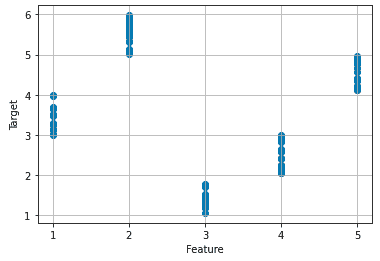
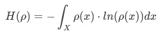
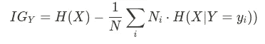
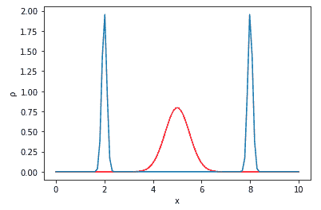
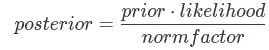
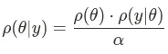
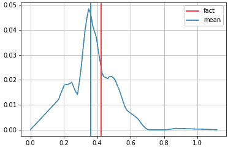
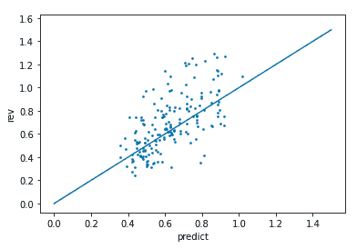

# 贝叶斯统计能给出和 ML 一样质量的预测吗？

> 原文：<https://towardsdatascience.com/can-bayesian-statistics-give-predictions-of-the-same-quality-as-ml-bc0f9c886819?source=collection_archive---------14----------------------->

## 在某些情况下是的。这就是方法。

巴勃罗·加西亚·萨尔达尼亚在 [Unsplash](https://unsplash.com/s/photos/direction?utm_source=unsplash&utm_medium=referral&utm_content=creditCopyText) 上拍摄的照片

最大似然算法是当今解决预测问题的主要方法。这种算法可能易于使用，并且通常提供更准确的预测。另一方面，统计方法提供了关于过程的更多信息，另外，由于算法更加透明，结果对最终用户来说似乎更加可靠。但是精度上的差距是不是太大了？

## 介绍

任务如下:给我们一个数据集，代表 400 家商店。对于每个商店，都有其 3 年的收入，以及一组反映内部因素的特征，如商店的外观、可达性等。以及外部因素，如行人流量、该地区的房地产价格等。目标是根据商店的特征预测商店的日收入。

在一次头脑风暴会议期间，我们的团队决定开发两种方法:基于 ML 树的方法和使用贝叶斯统计并比较结果的方法。

统计方法包括 3 个步骤:

1.  线性回归并通过将收入除以相关特征来构成新的目标。
2.  从与新目标不相关的特征中，我们根据它们提供的信息增益挑选出最有用的特征。
3.  基于所选特征的值，用贝叶斯分析对新目标进行预测。以及使用先前计算的线性回归系数来计算收入预测。

现在，让我们更深入。

## 1.线性回归

首先，我们需要找出哪些特征与目标相关，从而适合线性回归。不出所料，他们人数很少。基本上，我最后只得到一个——商店的工作时间，但它的相关系数为 0.7。

我认为这里可能会出现一个正反馈循环:不仅商店营业时间越长，产生的收入越多，而且管理层也倾向于减少不太成功的商店的工作时间，以削减开支。所以工作时间短可能说明店铺业绩不好。

无论如何，在计算线性回归系数后，我可以通过将收入除以工作时间来生成一个新的目标。实际上，我最终得到的是商店的每小时收入，这反映了它的核心业绩。这个目标似乎与任何特征都没有很强的相关性，

在进入下一步之前，我们要做的一切就是从数据集中删除所有相关的要素，只留下独立的要素。

## 2.复杂依赖关系，差分熵

现在是最有趣的部分。我们有一组独立的特征，它们既不与目标相关也不彼此相关。

如果特征与目标不相关，并不一定意味着它没有给出关于它的信息。让我用下面的例子来说明:

让我们生成一个数据集:

这是它看起来的样子

这个特征告诉我们很多关于目标的信息，但并不与目标相关(图片由作者提供)

这里的相关指数是-0.18，这意味着基本上没有依赖性，但很明显，该特征具有很高的信息量。

有一种度量随机变量不确定性的方法叫做熵。对于连续变量，它可以计算为:

其中ρ(x) —概率密度函数

为了挑选最有信息的特征，我们可以简单地根据它们提供的信息增益对它们进行分类

其中
y-要素
nᵢ-数据集中具有要素 Y = yᵢ值的条目数

基本上，信息增益是数据集的初始熵和由特征值选取的子集的熵的加权平均值之间的差。

在这一点上，可能不清楚为什么不使用标准差？事实上，在上面的图片中，每个子集的标准偏差比整个数据集的标准偏差小 5 倍，这也同样有效。

但是让我们考虑下面的例子:

信息越丰富的要素标准偏差越大(图片由作者提供)

在上图中你可以看到两个分布，一个是宽高斯分布，另一个是两个窄峰。第一个分布的标准差是 0.5，而另一个分布的标准差是 3。但是让我们计算熵，我们得到 1.04 和-0.27(是的，熵可以是负的)。第二个分布提供了更多关于变量的信息，尽管有更大的标准差。

## 3.贝叶斯分析介绍，部分分布→可能性

现在让我们试着做一些预测。首先，快速提醒一下贝叶斯推理是如何工作的。主要的想法是你用基于你的观察的可能性因子来更新你先前的信念。

可能性是假设你先前的信念，观察给定证据的概率。现在，用概率分布来改写它:

α—归一化常数

为了获得观察到具有特定收入的商店的特定特征的概率，我们需要计算在显示该收入的所有商店中拥有该特征的商店的分数。

为了让这个技巧发挥作用，我们需要把一个连续的特征变成一个分类的特征。我用 pd.qcut()把所有的连续特征分类成 8 个八分位数。常规线性宁滨似乎不适用于此目的，因为大多数要素的分布并不均匀。这意味着，虽然 2-3 个箱将包含几乎所有的商店，但其他箱将包含很少的商店，并且很难评估此类箱的部分收入分布。

作为先验分布，使用数据集中收入的总体分布是合理的。

现在，我们要做的就是用所有特征的似然因子更新先验分布，并计算结果的平均值。当然，在计算部分分布之前，有必要将商店本身从数据集中排除。

贝叶斯推理后得到的收益分布(图片由作者提供)

为了获得对初始目标的预测，我们需要将从步骤 1 中获得的预测乘以车间的工作时间。

## 预测和结果分析

在下图中，你可以看到预测与事实的散点图。为保密起见，预测和实际收入均以常规单位表示。

作者图片

实现了以下性能指标:

MAPE — 23.1
MdAPE — 20.0

出现错误的店铺数量:
错误< 10% — 14
错误< 20% — 29
错误< 30% — 43
错误> 50% — 5

同时，基于树的 ML 模型已经在具有以下性能指标的相同数据集上被训练:

MAPE — 22.5
MdAPE — 19.2

误差店铺数:
误差< 10% — 17
误差< 20% — 30
误差< 30% — 43
误差> 50% — 5

从误差分布可以看出，ML 在小误差领域表现更好。ML 模型预测了 17 家商店的收入，误差小于 10%，而 Bayesian 只对 14 家商店达到了这一分数。不管怎么说，ML 只比 MAPE 好 0.6，比 MdAPE 好 0.8。

总的来说，ML 模型提供了更好的准确性。但是该实验表明，对于 0.6 MAPE 的价格，人们可以获得概率分布以及获得该结果的更透明的算法，这在某些情况下对于最终用户是至关重要的。

感谢阅读！

 [## 丹尼尔·维蒂亚泽夫培养基

### 数据和业务分析师。我制作业务流程的数学模型，并帮助人们做出决策。

vityazevdanil.medium.com](https://vityazevdanil.medium.com/)