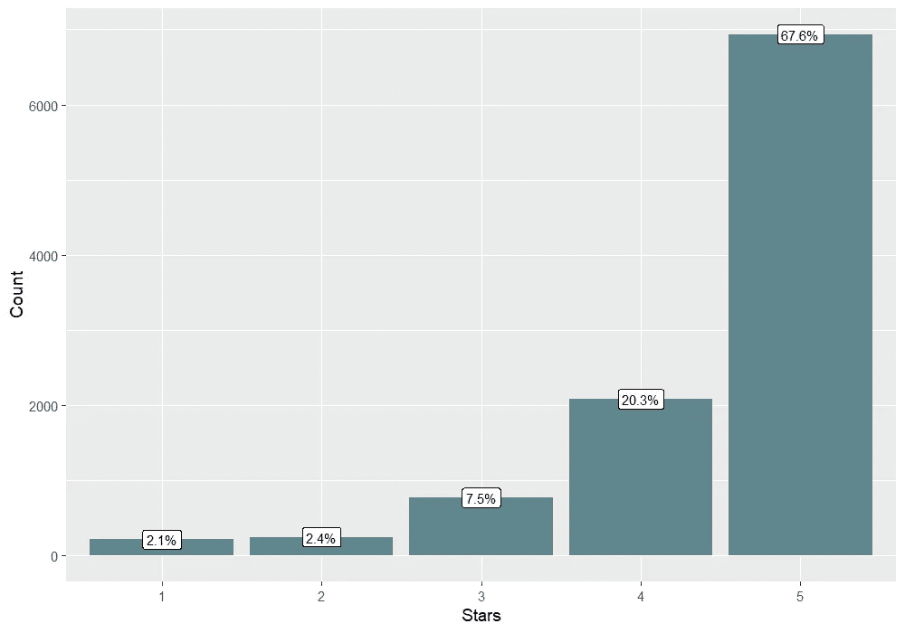
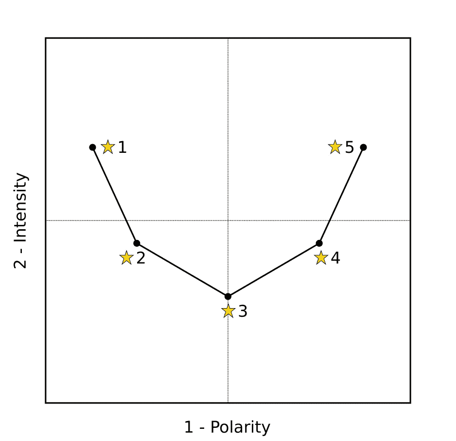
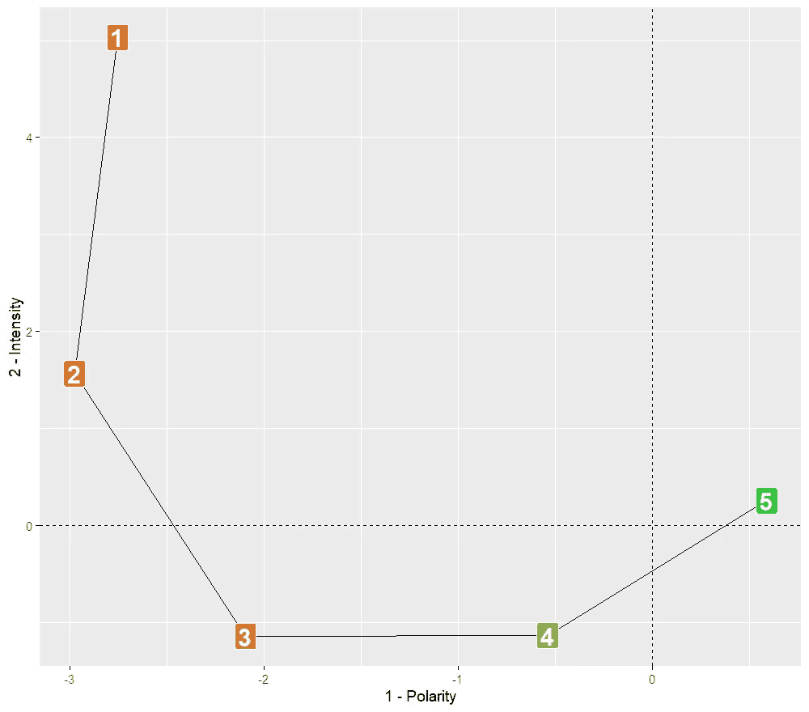

# 消费者的评分可以认为是等距的吗？

> 原文：<https://towardsdatascience.com/can-consumers-ratings-be-considered-equidistant-457f90155661?source=collection_archive---------35----------------------->

## [行业笔记](https://towardsdatascience.com/tagged/notes-from-industry)

## 从亚马逊数据的对应分析中寻找答案


图片由[图米苏在 Pixabay](https://pixabay.com/photos/review-opinion-feedback-stars-5207277/) 上提供

量化一个观点意味着将一个无限连续的心理概念投射到一个测量尺度上。尽管*潜在的观点*在心理测量术语中可能具有连续性，测量要求限制了它的*显式表达*。这些要求因收集数据所采用的方法而异，每种方法都有机器学习模型应该面对的陷阱。

通常，像电子商店这样的在线平台通过使用评级量表来调查意见。分析评级数据的一个常见问题是将每个定性判断与一个数值联系起来。由于不清楚评级是否等距，数字分配可能会导致复杂的任务。在本文中，我尝试将心理测量学中的一些概念引入到评分数据的分析中，测试对应分析的有效性，以探索反应量表各步骤之间的距离。

# 通过评级衡量意见

在心理测量学中，**李克特方法**是一种广泛收集观点、态度和行为的方法。李克特方法强迫把一个“连续的”观点投射到一个由有限的有序选项集合构成的离散尺度上。这种预测将潜在的连续体分解为区间，而这些区间的大小可以根据回答者对反应量表的步骤的理解而变化。

李克特的方法只是用来量化观点和态度的众多方法之一，它是一个很好的提示来探索我们可以控制来调整观点投射过程的评级尺度的**特征。**

*   **长度。**我们可能认为，与少数选项相比，许多响应选项允许捕捉更精细的措施。这可以是真的，但不一定。太多的选项会产生混乱，不同的响应者可能会有不同的解释。因此，该指标应该足够宽泛，允许消费者表达自己的意见，但仅限于绝对必要的情况。
*   **居中。**奇数步或偶数步会有所不同。中间类别可以用作“避难所”来提供不极化的响应。然而，中心类别可能会被一个极性同化，使天平失衡。
*   **贴标。**评定等级的每一步可能有也可能没有标记。标签向应答者暗示每个评估代表什么，有助于在不同的人之间统一量表的使用。有时，心理测量量表只对极端类别(“锚”)使用标签。

李克特方法中固有的一个古老问题是将定性意见转换成定量值，因为标度的原点是任意的，并且因为标度的步长并不总是被认为是等距的。我们在分析星级时发现了同样的问题。

## **星级**

我们非常熟悉使用星级来评估产品。通常，星级由五个选项组成，因此它们有一个中心类别。星星没有标签；然而，每个人都不清楚每一步应该代表什么。明星把答案集中在几个选项上，避免混淆；此外，它们的数量足以区分不同层次的意见。

星级评定在全球范围内被广泛用于收集消费者对产品和体验的意见。然而，有一些**限制**要考虑。

*   一个相关的担忧是关于在线评论的自我选择偏差。只有受限制的一部分消费者来表达一种观点，而这种对样本的自我选择并不是随机的，而可能恰恰取决于判断。因此，在反常的角色互换中，意见既可以是措施的目标，也可以是措施的原因。一个有趣的结果是 [**漏报偏差**](https://www.sciencedirect.com/science/article/abs/pii/S1569190X17300874) :极端的经历(无论是正面的还是负面的)比一般的经历更有可能被报道；因此，她们的人数过多。
*   另一个有趣的现象是由于审查制度的 [**顺序性**](https://www0.gsb.columbia.edu/mygsb/faculty/research/pubfiles/6006/besbes_Scarsini.pdf) 导致的意见扭曲。由于在线考核是按顺序报告的，而不是并行报告的，因此每位评核人都会看到以前的考核。这种阐述可能会创建一个依赖于数据的结构。
*   作为一名具有心理测量学背景的数据科学家，另一个问题让我着迷:评级之间的**等距**假设的失败。我们说过，在评级尺度上投射一个连续的观点会将潜在的连续体分解成多个区间。这些间隔可能不相等，这取决于反应等级的特征。因此，台阶之间的距离(“星”)可能不一致。

在下文中，我集中讨论等距问题，这代表了机器学习和心理测量评估之间共有的技术问题。

# 评定等级的步骤可以被认为是等距的吗？

我不认为这个问题有一个明确的答案。然而，在分析数据集之前至少获得一个想法可能有助于设置有效的算法。老实说，这个问题超出了机器学习，因为评级之间的等距是许多汇总指标的基本假设。

一些作者(见参考书目)试图用一种有趣的方法提供一个答案:对应分析。尽管这种方法并不新鲜，但似乎并不广为人知。接下来，我得到了一个网店评论的数据集，并测试了这个方法。

## 亚马逊乐器评论

与许多其他电子商店一样，亚马逊要求顾客使用五星评级来评价产品。我分析了[这个由 Kaggle 提供的数据集](https://www.kaggle.com/eswarchandt/amazon-music-reviews)，它包含了 900 种乐器的 2440 条评论(数据是在 CC0 许可下公开发布的)。

<https://www.kaggle.com/eswarchandt/amazon-music-reviews>  

我用来导入数据和获得初步计数的 **R 代码**如下所示。

下面的柱状图恢复了意见，绘制了评定等级中每一级的观察频率。总体而言，数据严重偏向于正面判断。



我重新整理了数据，将产品按行排列，将评分按列排列，在每个单元格中报告评论的数量。换句话说，我建立了一个应急矩阵。

然后，我应用了对应分析。

## 对应分析

对应分析(CA)是一种数据压缩技术，用于处理列联表。CA 可以应用于通过两个标称或顺序变量获得的频率数据。该分析的工作方式类似于主成分分析(PCA)，并且，从某种角度来看，CA 就像非度量数据的 PCA。

远不是在这里提出一个关于 CA 的手册，你需要知道 CA 在几个维度上减少数据，解释观察到的方差的更大可能比例。CA 提取的分量和 *min* ( *r-1* ， *c-1* )一样多，其中 *r* 是列联表的行数， *c* 是列数。像 PCA 一样，当只有两个组件可以用来表示数据时，多亏了二维图，我们可以可视化行和列类别。

将 CA 应用于像亚马逊乐器那样的权变矩阵，我们应该找到两个组件:

*   第一个代表判断的**极性**(从负到正)；
*   第二个代表判断的**强度**(从低到高)。

我们可以构建一个二维映射，将第一个组件的主列坐标放在横轴上，将第二个组件的主列坐标放在纵轴上。如果步骤是等距离的，那么我们应该找到一个对称的 U 形。下图显示了这种理论模式。



图片由作者提供—在 CC0 许可下发布

## 结果

不幸的是，前两个因素解释了相对较低的方差百分比(不到 60%，见下表)。最后的组件仍然解释了太多的差异，没有任何断点(著名的[肘形](https://en.wikipedia.org/wiki/Elbow_method_(clustering)))。因此，CA 提供的数据压缩并不像希望的那样有效。

```
dim | eigenvalue | % explain | cumulated %
  1 |   0.149205 |      33.5 |        33.5
  2 |   0.110787 |      24.9 |        58.4
  3 |   0.095135 |      21.4 |        79.8
  4 |   0.090116 |      20.2 |         100
```

无论如何，下面的图显示了使用前两个组件的坐标创建的地图。正如预期的那样，数据画出了一个近似 U 形的曲线，但这个曲线远非对称。



关于极性(x 轴)，与评级之间的其他步骤相比，该图显示一颗星和两颗星之间的差异非常小。标度的两个最低点在极性上看起来非常相似，但它们在兴趣强度(y 轴)上有所不同。

三颗和四颗星在极性上被正确分类，但在强度上完全重叠；其实它们好像是一个四分音阶的两个中枢！

考虑到上面提到的前两个维度，计算了评级之间的**欧几里德距离**。应用了[重新缩放程序](https://www.researchgate.net/publication/300782793_Putting_Correspondence_Analysis_to_use_with_Categorical_Data_in_Market_Research)，将每个距离 *d* 乘以(*k*-1)/*sum*(*d*)，其中 *k* 是步数(因此， *k* -1 是可用距离数)。

```
1->2   2->3   3->4   4->5
1.44   1.18   0.64   0.74
```

如果最高等级(3、4 和 5)之间的距离大致相似，则 1、2 和 3 之间的距离显示出一些重要的差异，尤其是在等级的最低部分。

# 我们能得出什么结论？

结果表明，消费者对回应量表的态度可能与我们的预期不同。CA 显示了低评级和高评级之间的不对称性。特别是，一星评级代表了一种非常极端的判断，五星的对立面似乎是二星而不是一星。显然，结果可能依赖于产品，不能被认为是决定性的。

CA 远不能提供通用的答案，它可以代表一种探索评级的有趣方法。该技术有助于研究标度步骤之间的距离，例如，选择[回归或分类方法](/1-to-5-star-ratings-classification-or-regression-b0462708a4df)。

# 最后，我们可以做些什么来提高数据质量？

一般来说，非线性评级不是一种测量工具的“缺陷”，而是一种“特征”。前一句话可能看起来像是机会主义，但却是事实:尽管这个体系可能不完美，但它可能是好的。

为了改进评定等级，我们可以研究前面描述的三个主要属性，即长度、中心和标签。当然，**长度**是一个非常关键的属性，可以很容易地操作。一个有趣的方法是引入**部分星星**。


图片由作者提供—在 CC0 许可下发布

部分星级的优势在于没有扩大范围，因为每个评级都固定在一个参考支点上。此外，他们让回答者明白，每个部分的评价只是一个“父亲”判断的色调。通过这种方式，你可以提供更多的选择，而不会让回答者感到困惑，限制了评分者之间获得不同量表用法的风险。

# 基本书目

*   d bkowska k .(2014 年)。应用对应分析确定波德拉斯基地区电子服务部门企业经济状况的决定因素。*经济与管理 I zarządzanie*， *6* (1)，38–56。[ [链接](http://yadda.icm.edu.pl/yadda/element/bwmeta1.element.baztech-aea351b9-4df3-4347-91a0-0db11a317030)
*   达比希尔 p .麦克唐纳 H. (2004 年)。选择反应量表标签和长度:研究人员和客户指南。*澳大拉西亚市场研究杂志 I* ， *12* (2)，17–26。[ [链接](https://www.researchgate.net/publication/292745709_Choosing_response_scale_labels_and_length_Guidance_for_researchers_and_clients)
*   肯尼迪、里基耶、夏普(1996 年)。对应分析在市场研究中对分类数据的实际应用。*营销目标测量与分析杂志*， *5* (1)，56–70。[ [链接](https://www.researchgate.net/publication/260554970_Practical_Applications_of_Correspondence_Analysis_to_Categorical_Data_in_Market_Research)
*   绿色体育，塔尔 D.S .，阿尔巴姆 G. (1988 年)。*营销决策研究*(第 5 版)。普伦蒂斯-霍尔国际版:新泽西。