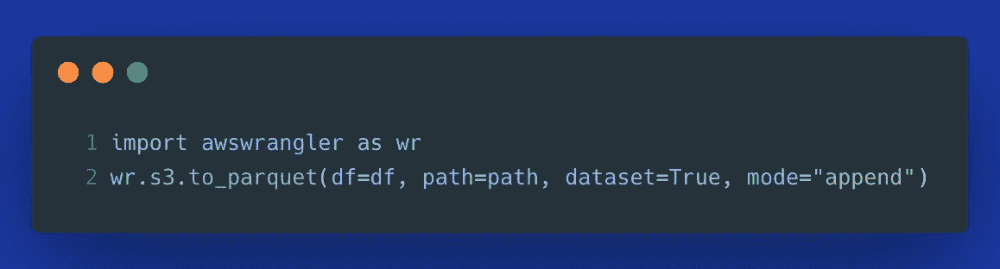
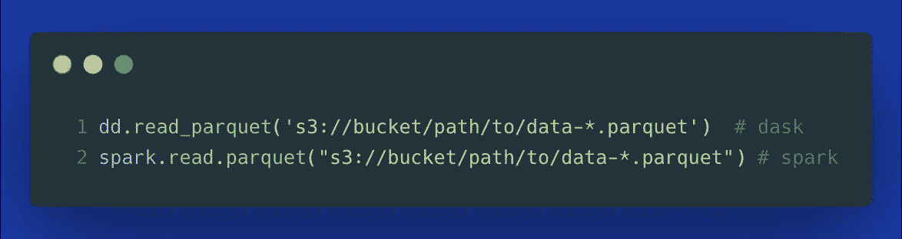
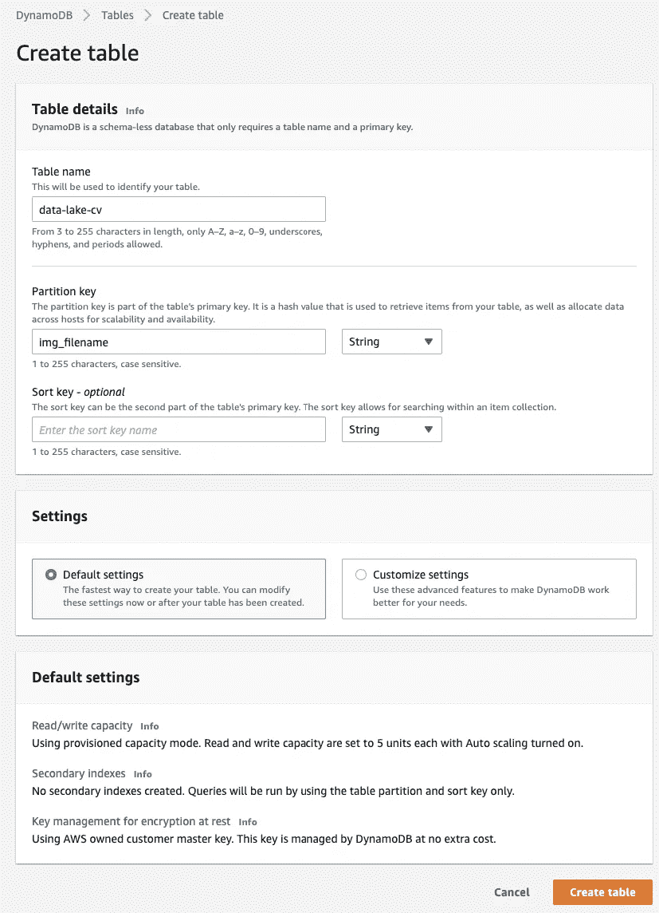
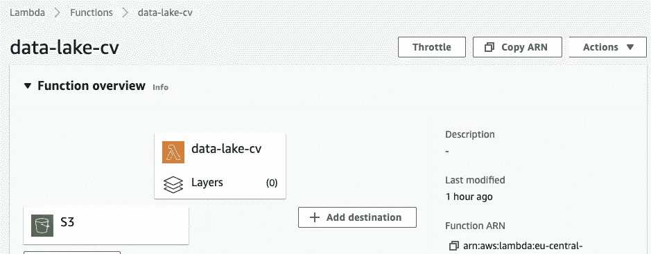
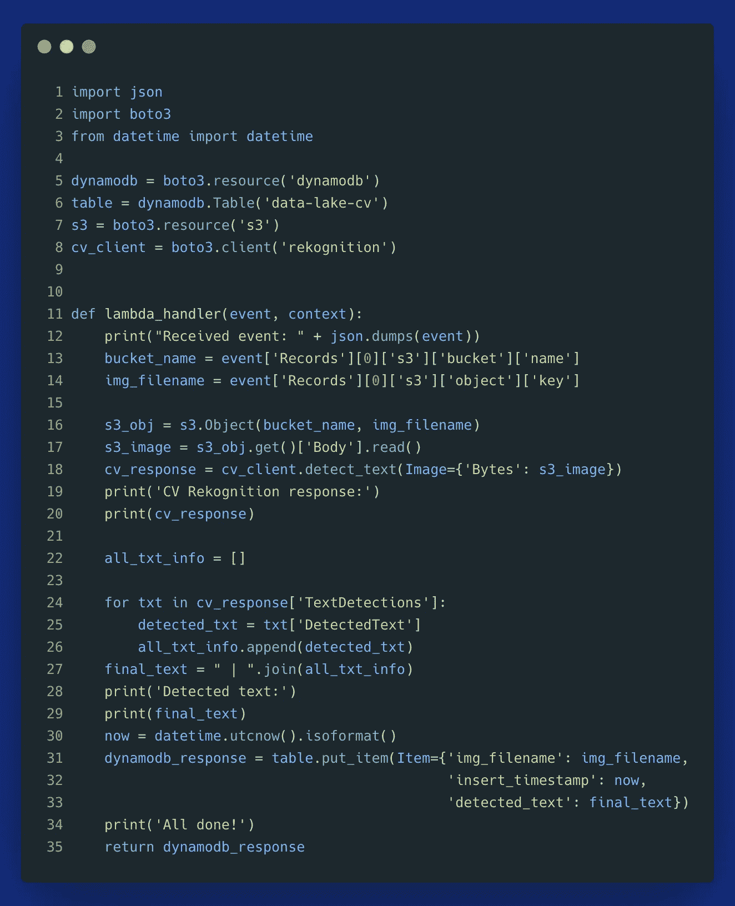
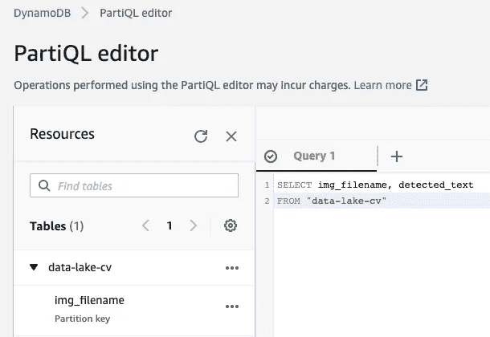
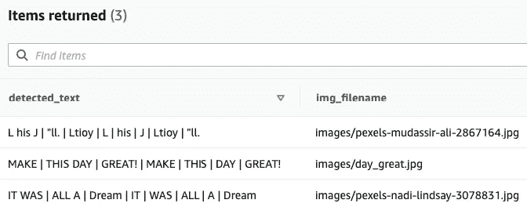
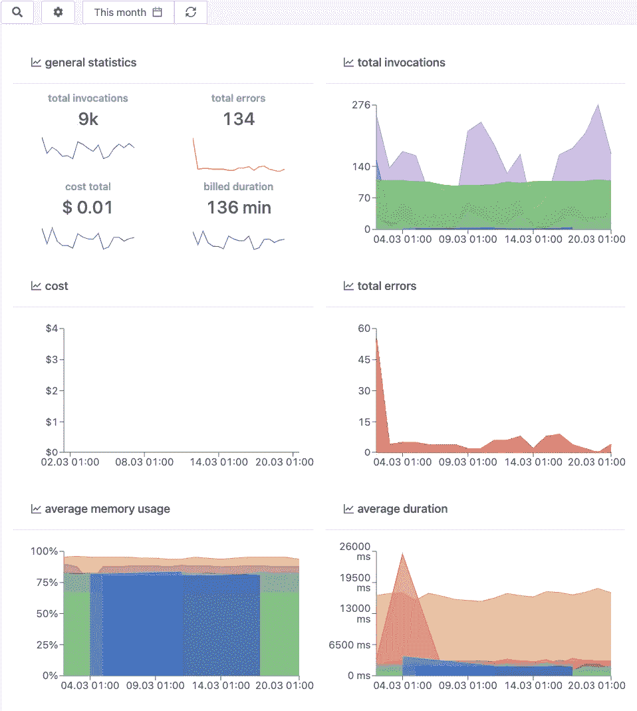
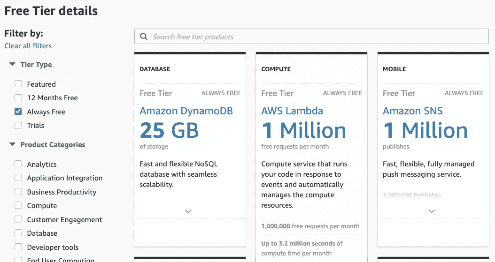

# 数据湖能加速构建 ML 数据管道吗？

> 原文：<https://towardsdatascience.com/can-data-lakes-accelerate-building-ml-data-pipelines-86d63934ec3f?source=collection_archive---------20----------------------->

## 通过数据湖和数据仓库研究数据科学的洞察时间

照片由 [Emil Jarfelt](https://unsplash.com/@emiljarfelt?utm_source=medium&utm_medium=referral) 在 [Unsplash](https://unsplash.com?utm_source=medium&utm_medium=referral) | [品牌内容披露](https://www.annageller.com/disclosure)上拍摄

数据工程中的一个常见挑战是将传统的数据仓库和 BI 报告与实验驱动的机器学习项目相结合。许多数据科学家倾向于更多地使用 Python 和 ML 框架，而不是 SQL。因此，他们的数据需求往往与数据分析师不同。在本文中，我们将探索为什么拥有一个数据湖通常会为数据科学用例提供巨大的帮助。我们将以一个有趣的计算机视觉演示结束，从存储在 S3 数据湖中的图像中提取文本。

# 1.数据湖是数据不可知的

仅拥有*纯关系型数据仓库限制了该数据平台能够支持的**多种数据格式**。许多数据仓库解决方案允许您分析嵌套的类似 JSON 的结构，但是它仍然是数据湖可以支持的数据格式的一小部分。*

*虽然对于分析来说，没有什么比关系表结构更好的了，但拥有一个允许您做更多事情的额外平台仍然是有益的。数据湖是数据不可知的。它们支持对数据科学至关重要的大量数据:*

*   *不同的**文件类型** ( *csv、tsv、json、txt、parquet、orc* )、数据加密、**压缩格式** ( *snappy、gzip、zlib、lzo* )，*
*   ***图像、音频、视频**文件通过计算机视觉算法实现深度学习用例，*
*   ***模型检查点**由 ML 训练岗位创建，*
*   *跨越**关系型**和**非关系型**数据的连接，两者都是服务器端的( *ex。Presto 或 Athena* )和客户端( *ex。你的 Python 脚本*)，*
*   *来自 **web** 的数据:点击流、购物车数据、社交媒体( *ex。tweets、Reddit、博客帖子和新闻文章抓取自然语言处理分析*)，*
*   ***时序数据**:物联网和传感器数据、天气数据、金融数据。*

# *2.提高开发效率*

***将原始数据**手动摄取到**数据仓库**是一个相当**繁琐**且缓慢的过程。您需要预先定义一个模式并指定所有数据类型，创建一个表，在您的脚本或 ETL 工具中打开一个 JDBC 连接，然后最终您可以开始加载您的数据。相比之下，**数据湖**中的加载步骤通常就像**单个命令**一样简单。例如，用一行 Python 代码就可以将一个 Pandas 数据帧接收到一个基于 S3 的数据湖中(Pyspark 和 Dask 中的语法非常类似):*

**

*摄入 S3 数据湖——图片由作者提供*

> *如果您主要使用 **Python** 进行分析和数据工程，您可能会发现使用数据湖比使用数据仓库更容易读写数据。*

# *3.支持更广泛的数据处理工具*

*我们讨论了数据湖支持的各种数据，但是它们也支持各种处理框架。虽然数据仓库鼓励主要使用 SQL 和 UDF 在内存中处理数据，但数据湖使用编程语言或您选择的平台检索数据变得容易。因为没有强制实施专有格式，所以您有更多的自由。通过这种方式，你可以利用一个 **Spark** 或 **Dask** 集群的能力，以及在它们之上构建的大量非常有用的库，只需使用 **Python** 。参见下面的示例，演示如何在 Dask 和 Spark 中读取拼花文件:*

**

*注意**这不是一个非此即彼的决定**，一个好的数据工程师可以同时处理两者( *DWH 和数据湖*)，但是数据湖使那些分布式处理框架更容易使用数据。*

# *4.数据管道中的故障变得更容易修复*

*修复传统的 **ETL** 数据管道既困难又耗时，其中只有“加载”部分失败，因为您必须从头开始整个管道。数据湖鼓励并支持 **ELT** 方法。您可以将提取的数据以原始格式直接加载到数据湖中，然后在同一个或完全独立的数据管道中进行转换。有许多工具可以让您将原始数据同步到数据仓库或数据湖中，并在以后需要时进行转换。**从转换中分离原始数据摄取**可带来更具弹性的数据工作负载。*

# *演示:使用数据湖提供 ML 即服务*

*为了说明数据湖对数据科学项目的好处，我们将做一个简单的 AWS Rekognition 服务演示，从图像中提取文本。*

*我们的用例是什么？我们将图像上传到存储原始数据的 **S3** 桶**中。这触发了从这些图像中提取文本的 **Lambda 函数**。最后，我们将提取的文本存储到一个 **DynamoDB 表**中，并使用 SQL 检查结果。***

*如何在你的架构中使用它？除了 DynamoDB，您还可以使用一个数据仓库表或另一个可以使用 Athena 查询的 S3 存储桶位置。此外，除了使用 AWS Rekognition 的`detect_text`方法(在下面的代码片段中的*第 18 行)，您可以将代码修改为:**

*   *`detect_faces`*
*   *`detect_custom_labels`*
*   *`recognize_celebrities`*
*   *…以及更多。*

***如何实现这一点？首先，我们创建了一个 S3 桶和一个 DynamoDB 表。该表配置有`img_filename`，即上传图像的文件名，作为分区键，这样重新运行我们的函数就不会导致任何重复(*等幂*)。***

**

*为我们的演示创建 DynamoDB 表—图片由作者提供*

*我们已经有一个名为`images`的文件夹的 S3 桶:s3://data-lake-bronze/images。*

*我们还需要创建一个带有 IAM 角色的 **Lambda 函数**，我们将 IAM 策略附加到这个函数上，用于 S3、Rekognition 和 DynamoDB。下面显示的函数有一个名为`lambda_function.lambda_handler`的 lambda 处理程序和运行时`Python 3.8`。它还附带了一个 S3 触发器，该触发器在任何 PUT 对象操作时调用该函数，即在任何文件上传到文件夹`images/`时。*

**

*Lambda 函数用于检测上传到数据湖的图像中的文本—按作者分类的图像*

*函数的代码:*

*   *为 Rekognition 创建一个**客户端**以及相应的 S3 和 DynamoDB 资源对象，*
*   ***从事件触发器中提取**S3 桶**名称**和**关键字** ( *文件名*)。*
*   ***读取图像**对象并将其传递给 Rekognition 客户端，*
*   *最后，它检索**检测到的文本**，并将其上传到我们的 DynamoDB 表。*

**

*让我们用一些图片来测试一下:*

******

*左:来自[佩克斯](https://www.pexels.com/photo/illuminated-neon-sign-3078831/?utm_content=attributionCopyText&utm_medium=referral&utm_source=pexels)的[纳迪林赛](https://www.pexels.com/@nadi-lindsay-1130679?utm_content=attributionCopyText&utm_medium=referral&utm_source=pexels)的照片，中:来自[佩克斯](https://www.pexels.com/photo/make-this-day-great-quote-board-2255441/?utm_content=attributionCopyText&utm_medium=referral&utm_source=pexels)的[阿列克萨斯福托斯](https://www.pexels.com/@alexasfotos?utm_content=attributionCopyText&utm_medium=referral&utm_source=pexels)的照片，右:来自[佩克斯](https://www.pexels.com/photo/is-this-just-fantasy-neon-sign-2867164/?utm_content=attributionCopyText&utm_medium=referral&utm_source=pexels)的[穆达西尔阿里](https://www.pexels.com/@pixelcop?utm_content=attributionCopyText&utm_medium=referral&utm_source=pexels)的照片*

*在将这些图像上传到我们在 Lambda 触发器中定义的 S3 桶之后，Lambda 应该为每个图像上传调用一次。一旦完成，我们可以在 DynamoDB 中检查结果。*

**

*DynamoDB (1)中的 PartiQL 查询编辑器—作者图片*

**

*DynamoDB (2)中的 PartiQL 查询编辑器—作者图片*

*看起来前两个图像被很好地识别了，但是右边的困难图像(“*这仅仅是幻想吗*”)没有被识别。*

# *我们怎样才能做到规模化？*

*如果你想大规模实现一个类似的用例，那么**监控**那些资源并实现适当的**错误警告**可能会变得很有挑战性。在这种情况下，你可能要考虑一个无服务器的可观测性平台，比如 [Dashbird](https://dashbird.io/) 。您可以将所有的 **Lambda** 函数和相应的 **DynamoDB、ECS、Kinesis、Step 函数、SNS、**或 **SQS** 资源分组到一个**项目仪表板**中，让您可以一目了然地看到您的微服务和 ML 管道的当前状态。*

**

*[Dashbird](https://dashbird.io/) 中所有无服务器资源的项目视图—图片由作者提供*

*每种颜色代表不同的资源，例如特定的 Lambda 函数。将鼠标悬停在它们上面，可以看到更多细节。然后，您可以深入了解更多信息。*

> ***边注:**上图中的零成本可以通过 AWS Lambda 和 DynamoDB 的始终免费层来证明。在过去的两年里，我一直在我的个人项目中使用 Lambda，到目前为止还没有收到过 Lambda 的账单。*

**

*AWS 始终免费层。[来源](https://aws.amazon.com/free/?all-free-tier.sort-by=item.additionalFields.SortRank&all-free-tier.sort-order=asc&awsf.Free%20Tier%20Types=tier%23always-free) —作者截图*

# *结论*

*从题目来回答问题:是的，一个数据湖肯定可以加快数据管道的发展，尤其是那些与数据科学用例相关的。处理各种数据格式的能力以及将这些数据与分布式处理和 ML 框架轻松集成的能力使得数据湖对于大规模进行数据科学研究的团队特别有用。尽管如此，如果使用来自数据湖的原始数据需要太多的清理，数据科学家和数据工程师可能仍然更喜欢使用来自 DWH 的已经预处理和历史化的数据。像往常一样，仔细考虑什么最适合您的用例。*

***感谢您的阅读！如果这篇文章有用，** [**关注我**](https://medium.com/@anna.anisienia) **看我下一篇帖子。***

***参考资料&其他资源:***

*[1] [我之前的一篇关于数据湖的好处的文章](/7-reasons-why-you-should-consider-a-data-lake-and-event-driven-etl-7616b74fe484)*

*[2]AWS ML 工具列表(2021 年)——[dash bird](https://dashbird.io/blog/aws-machine-learning-tools-2021-edition/)*

*[3] [使用 AWS Lambda 的机器学习](https://dashbird.io/blog/machine-learning-in-aws-lambda/) — Dashbird*