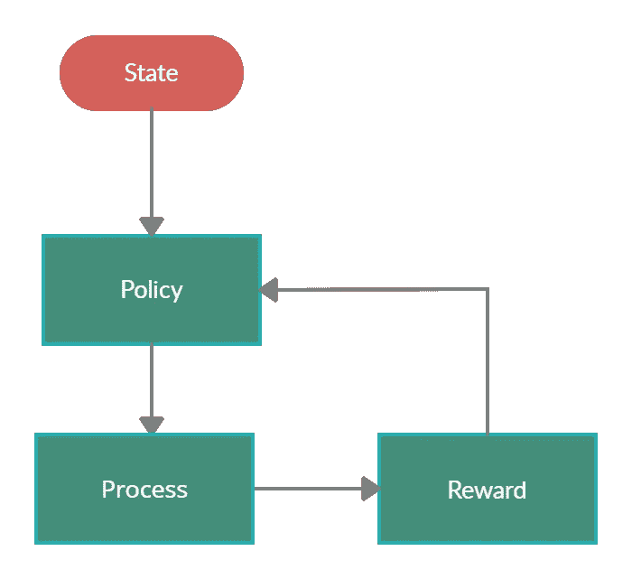
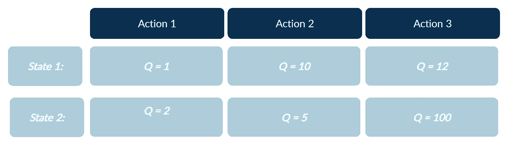
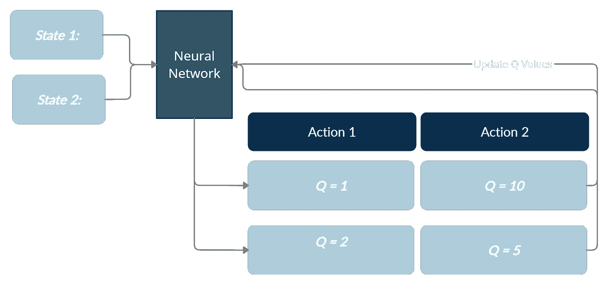
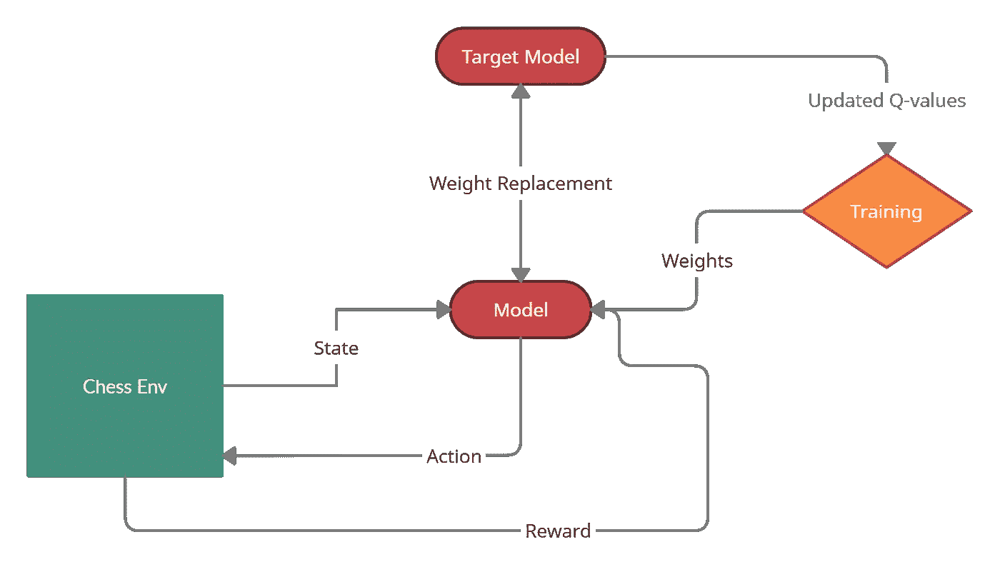
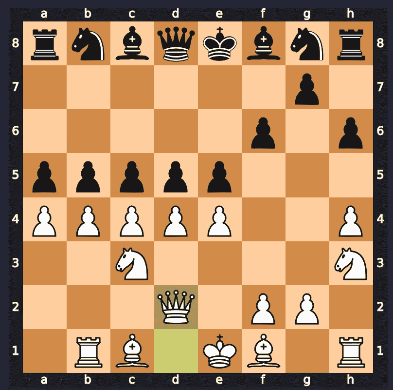

# 深度强化学习能解决象棋吗？

> 原文：<https://towardsdatascience.com/can-deep-reinforcement-learning-solve-chess-b9f52855cd1e?source=collection_archive---------11----------------------->

## 实践教程

## 经典和深度强化学习速成班，用 Python 实现

照片由来自 [Pexels](https://www.pexels.com/photo/robot-pointing-on-a-wall-8386440/?utm_content=attributionCopyText&utm_medium=referral&utm_source=pexels) 的 [Tara Winstead](https://www.pexels.com/@tara-winstead?utm_content=attributionCopyText&utm_medium=referral&utm_source=pexels) 拍摄

# 目录:

*   **DRL 简介**
*   **实现 DRL**
*   **分析结果**
*   **结论**

***注意:所有代码都是片段形式，单独执行时无法工作。完整代码可以在我的***[***Github repo***](https://github.com/victorsimrbt/chess_rl)***上找到。***

# 深度强化学习简介:

作者提供的图片:显示环境的高级定义的流程图

强化学习是对一个 ***智能体*** 在一个 ***环境*** 中进行决策的训练。代理部署在环境中。在任何给定的帧，代理必须使用来自环境的数据来行动。这个动作会产生一个 ***奖励*** 值，它代表了 ***动作*** 的质量。然后，代理将相应地更新其流程，以最大化此奖励。

作者图片:Q 表示例

一个基本的强化学习算法是 Q 学习。在 Q 学习中，会创建一个 Q 表。Q 表的行将代表环境的可能状态，而列将是环境中的行动所产生的回报。代理将与环境交互，并在 Q 表中记录奖励值。最终，代理会填写表格。然后，当面对环境时，代理可以选择具有最高奖励值的行动。

尽管该算法在某些情况下确保了完美的策略，但是这些算法的实际应用很少。复杂的环境通常不会对每一步都产生直接的回报，因此在填写 Q 表时会产生问题。

环境中有天文数字般多的状态是很常见的。国际象棋估计有大约 10 个⁰可能的位置。由于一个位置的平均移动次数是 30 次，国际象棋的 Q 表将会太大而无法存储，更不用说完成了。

作者图片

深度强化学习是深度学习在强化学习中的应用。虽然深度学习可以以许多不同的方式应用，但它通常涉及训练深度神经网络，以逼近它尚未看到的状态的 q 值。

然而，需要做出许多假设以允许深度强化算法工作。以反向传播奖励为例。我们知道，导致获胜位置的移动一定有利于最终位置，但我们如何评估它对将死的重要性？我们只能假设越接近胜利位置的移动对胜利有越大的利害关系，所以我们对较早移动的奖励打折扣。

# 实施深度强化学习:

这个 [**链接**](https://github.com/victorsimrbt/chess_rl/tree/main/v2.4.0) 将把你传送到包含我的实现的完整代码的仓库的子部分。

作者图片

这个图是程序的主要部分之间的可视化表示，主要是环境、模型和目标模型。

环境给模型一个状态向量，模型输出一个动作。模型向模型返回一个动作。更新的 Q 模型然后将更新的 Q 值返回给训练函数，训练函数改变模型的权重。每隔一段时间，来自目标模型的权重被设置为模型权重。

# 环境:

这是描述模型与之交互的象棋环境的代码的设置。我们已经知道它必须执行的主要功能:

1.返回状态

这个函数简单地返回一个向量，该向量完全表达了代理环境可访问的信息，可以插入到神经网络中。

2.接受行动

这个函数接受一个动作，并通过这个动作改变环境的状态。

3.回报奖励

应该有一个适当的系统，允许代理直接从每个行动中获取奖励。

## 返回状态:

这个要点展示了将 python-chess board 对象转换成矩阵的函数。它将棋盘转换为行和列，并找到棋盘上的每个方块。

然后，它对所有变量进行一次性编码，使其成为形状为 8，8，12 的数组。该函数与国际象棋环境相关，因此当调用该函数时，类中国际象棋棋盘的变化将会反映出来。

## 接受行动+回报奖励:

这个要点描述了阶跃函数，它在接受一个动作时推进环境。

虽然播放动作只需要一行代码，但该函数还必须记录所有关于状态的数据和动作的回报，以便对 Deep-Q 算法进行训练。

值得注意的是，我们记录奖励、状态、未来状态以及环境事件是否结束。

# 更新 Q 值:

事实上，我还编写了函数来更新环境中的 q_values，因为从函数内部访问这些值要容易得多。

作者图片

这是用于评估更新后的-q 值的公式。更新的 q 值等于在状态 *s* 下执行动作 *a* 获得的奖励加上未来奖励的最大值，乘以超参数γ。超参数γ可以被认为是未来回报对实施环境的重要性的度量。

# 型号:

左边的要点描述了 Q_model 类。它包含三个功能，允许它与环境互动。

为 DQN 创建的模型是一个简单的卷积网络，具有 3 个带有 relu 激活功能的卷积层。最后一层包含 4096 个神经元，代表可以在任何给定位置进行的 4096 种可能的移动(64 个用于开始方块，64 个用于结束方块，得到 4096)。

预测函数将棋盘转换为张量，并调用模型来预测输入的输出。它输出总和为 1 的概率分布。我们假设每个值映射到一个移动，较大的概率表示模型的置信度。然后，它应用一个掩码，从分布中删除所有非法移动。然后，通过预定义的字典，该移动被转换为国际象棋移动。

在强化学习中，模型需要探索环境以收集更多的洞察力。探索功能选择随机的合法移动来玩。这允许打破局部最小值的可能性，但是会在开始时减慢训练进度。

# 执行剧集:

这个 github gist 完全执行算法。它建立在我前面解释过的 q-network 和 chess_env 模块之上。

它还需要一个 variable_settings 文件，其中包含算法的所有超参数，如ε和ε衰减率。它还包括损失函数(Huber 损失)和项目的优化器设置。将文件分开会使配置变得更加容易。

ε用于在勘探和开发之间进行选择。它以变量设置文件中定义的速率衰减。

我没有仅仅使用 model.fit()，而是使用 tensorflow 渐变带特性来更新模型的渐变。

经过一定数量的时期后，目标模型将配置主模型的权重。

# 结果:

作者图片

从这张截图可以看出，深度强化学习无法正常进行。我最初对结果非常失望和沮丧，并尝试了许多不同的方法来改进算法。

但是，在网上看了别人的证词后，我终于找到了我问题的根源:稳定。

强化学习中的自我游戏是出了名的不稳定，因为模型的回报不是游戏质量的决定性衡量标准。

由于两个模型是相同的，这将导致非常弱的播放，并可能导致模型的播放质量停滞在一个非常低的水平。

# 深度强化学习能解决象棋吗？

这篇文章提出的问题的答案不是一个明确的否定，而是一个可以用来解决稳定问题的解决方案列表。

## 1.稳定的对手:

如果我们实现一个稳定的对手，比如 stockfish，我们可能会用我们的算法得到很好的结果！

## 2.稳定算法:

我们可以使用不同的算法来获得更好的结果，只要我们在新算法中有一些稳定方法。因为我对这个项目的结果非常不满意，所以我从头开始实现了 Google DeepMind 的算法。我将很快发布一篇关于结果的文章。