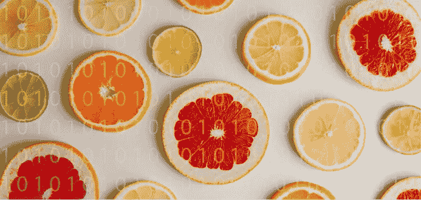
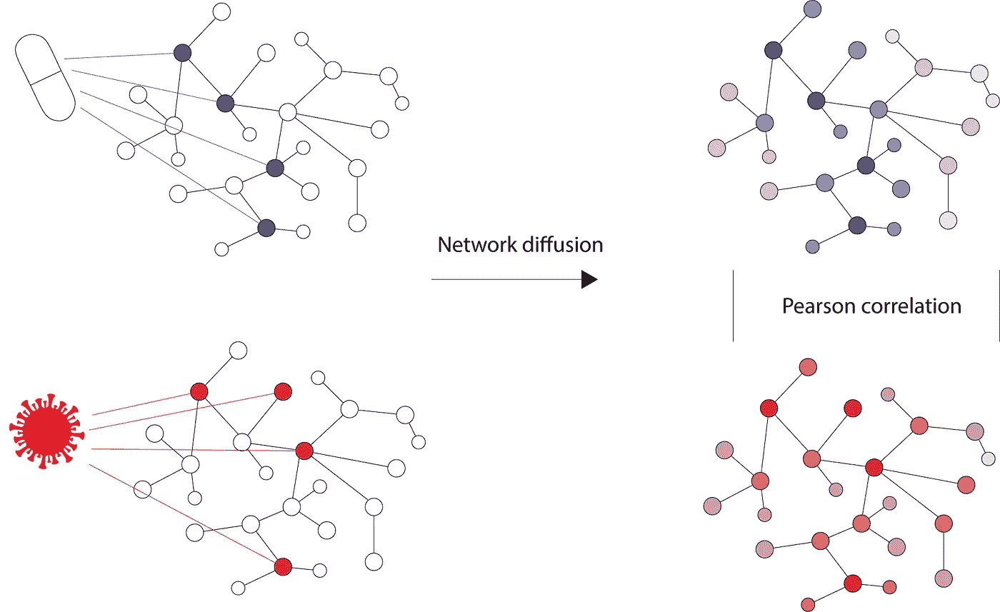
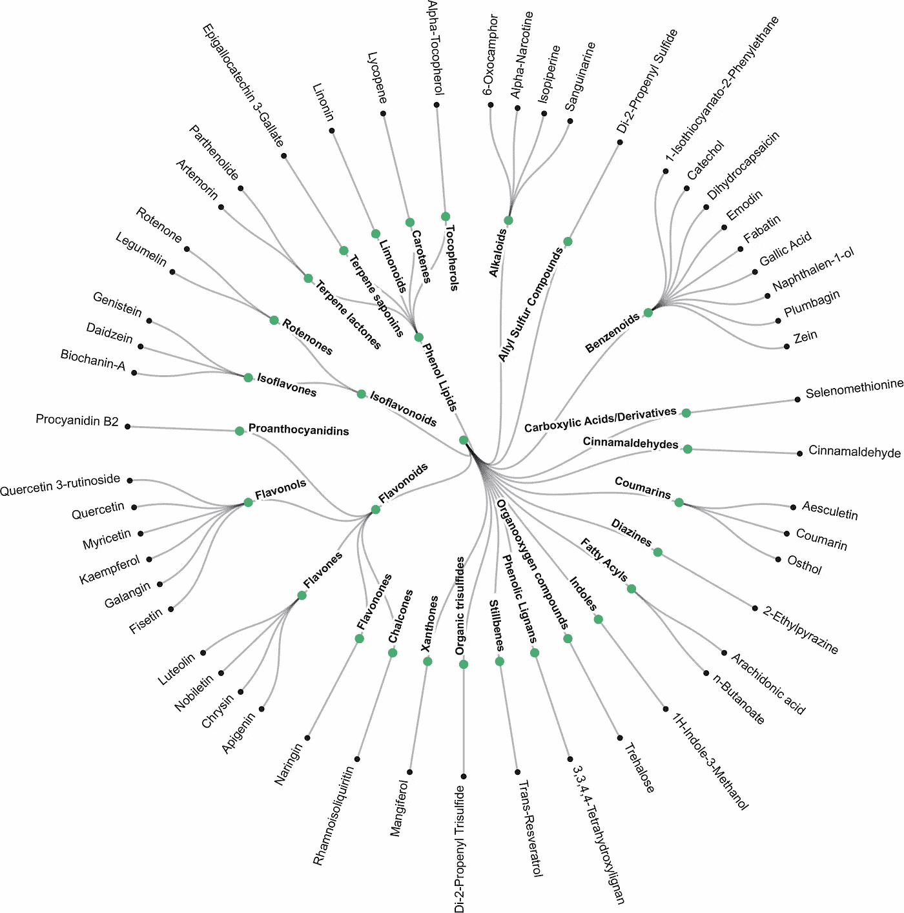
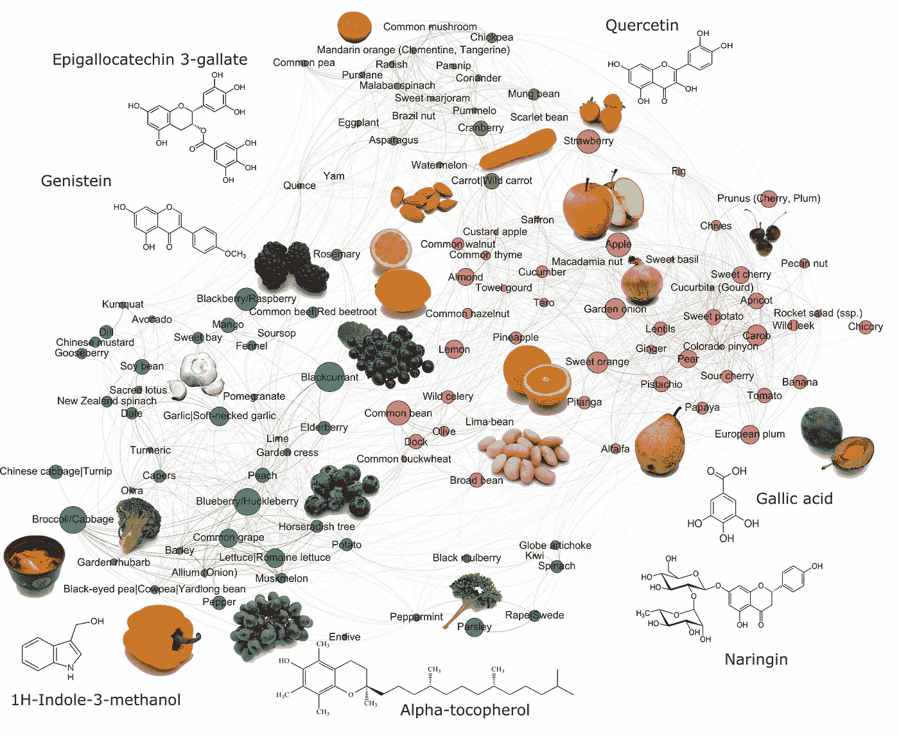

# 食物能帮助我们对抗新冠肺炎吗？

> 原文：<https://towardsdatascience.com/can-foods-help-us-fight-covid-19-3331e296158c?source=collection_archive---------38----------------------->

## 答案可能是肯定的:基于机器学习的技术可以识别具有抗病毒特性的食物中的生物活性分子

由[埃斯特迪奥·布鲁姆](https://unsplash.com/@estudiobloom?utm_source=unsplash&utm_medium=referral&utm_content=creditCopyText)在 [Unsplash](https://unsplash.com/s/photos/lemon?utm_source=unsplash&utm_medium=referral&utm_content=creditCopyText) 上拍摄的照片

这篇文章基于今年早些时候发表的论文。

新冠肺炎的持续爆发对全球经济、医疗保健、教育、精神健康和整个社会都有破坏性影响。在开发疫苗方面已经付出了巨大的努力。2020 年下半年几个疫苗的批准代表了疫情终结的开始。然而，在疫苗接种工作完成之前，卫生保健系统和个人健康的压力仍然存在。

对于那些受到严重影响的人，有一个明确的治疗过程，包括住院和开出最近批准的或改变用途的抗新冠肺炎药物。然而，由于住院率仅为 3.5% [1]，成千上万感染新冠肺炎的人并没有严重到需要住院，但他们发现自己正在努力控制自己的症状，因为除了休息和服用非处方药以缓解流感样症状外，没有明确的行动方案。

然而，在食物中，或者更准确地说，在超级食物中，可能会找到那些独自与新冠肺炎抗争的人的线索。在今年早些时候发表的一篇论文中，我们应用图形机器学习来预测食物中具有抗新冠肺炎特性的分子，基于它们靶向新型冠状病毒-宿主基因-基因(蛋白质-蛋白质)相互作用组的能力。为此，我们首先校准了一种机器学习算法，以预测实验和临床批准药物中的抗新冠肺炎候选药物。

> 对于那些独自与新冠肺炎抗争的人来说，线索可能在食物中找到，或者更准确地说，在超级食物中。

为了校准机器学习模型，药物-蛋白质和新型冠状病毒-宿主蛋白质相互作用被表示为人类蛋白质-蛋白质相互作用(PPI)网络上的二进制信号，并且应用网络扩散算法来模拟对药物和疾病干预的系统基因组范围的反应。药物化合物和新冠肺炎病的扩散分布图之间的皮尔逊相关系数用于排列靶向新型冠状病毒-宿主相互作用组网络的化合物。

PPI 上的药物-蛋白质和新型冠状病毒-宿主蛋白质相互作用(左)使用扩散算法传播，以模拟对药物和疾病干预的全基因组反应(右)

机器学习算法的参数经过校准，用于预测针对新冠肺炎的实验验证药物，在交叉验证设置中，该模型的准确率达到 80–84.9%。模型校准后，食品中的近 8000 种生物活性分子通过校准的机器学习算法运行，该算法确定了 52 种预测以新型冠状病毒-宿主相互作用网络为目标的生物活性分子。

> 预测 52 种生物活性分子靶向新型冠状病毒-宿主相互作用网络。

## 具有抗新冠肺炎特性的食品生物化学“暗物质”的预测

营养机构认识到植物性食物的价值，但是，他们通常专注于跟踪矿物质、维生素和宏量营养素，而忽略了食物中可能具有保护或抗病作用的非营养分子。因此，这些化合物常被视为营养科学的“暗物质”。然而，它们是最重要的分子。

已确定的抗新冠肺炎分子属于多种化学类别，属于这种“暗物质”，包括(异)黄酮类、萜类、酚类和吲哚类。有趣的是，由于它们的苦味，食品工业通常会通过选择性育种或改善味道的过程来去除其中的一些化合物。

图片来源:Laponogov 等人— [链接](https://humgenomics.biomedcentral.com/articles/10.1186/s40246-020-00297-x#Sec8)

## 超级森林对抗新冠肺炎

当前食物推荐的一个关键限制是专注于食物中的单个植物化学物质，其中某些食物因其特定植物化学物质的高含量而被作为“超级食物”进行营销(例如，葡萄中发现的有效抗氧化剂白藜芦醇)。在这里，我们假设食品的潜在治疗效果取决于战胜疾病的生物活性分子的多样性和可用性。

因此，使用公开可用的食物和食物中生物活性分子的数据库，我们建立了一个*食物图*，其中每种成分的理论抗新冠肺炎能力根据反映生物利用度和具有抗病毒特性的预测生物活性分子多样性的*富集分数*进行排名。我们称这些食物为*抗病毒超级食物。*

图片来源:Laponogov 等人— [链接](https://humgenomics.biomedcentral.com/articles/10.1186/s40246-020-00297-x#Sec8)

排名最靠前的*抗病毒超食物*包括不同的浆果(黑加仑、蔓越莓和蓝莓)、十字花科蔬菜(卷心菜、西兰花)、苹果、柑橘类水果(甜橙和柠檬)、洋葱、大蒜和豆类。

有趣的是，黑醋栗不仅具有潜在的抗病毒作用，而且对流感具有潜在的消毒和杀菌作用[2]——尽管它对新冠肺炎的具体保护能力还有待评估。同样，最近的一项研究强调了新冠肺炎食用卷心菜和发酵蔬菜在减少不良后果方面的潜力[3]。

## 带回家的信息

使用基于机器学习的技术，我们根据其在基因组水平上与实验性抗新冠肺炎药物的共性，确定了食品中具有抗新冠肺炎特性的生物活性分子。然后，我们建立了一个*食物地图*根据预测的抗病毒分子的生物利用度和多样性对食物进行排序。

尽管我们离设计既美味又健康的食谱还有一段距离，但我们的研究结果表明，我们有望为管理非重症新冠肺炎病例开发出一条更清晰的道路，在这条道路上,*抗病毒超剂量*将被“开出”以帮助患者更快更好地康复。

*感谢 Ivan Laponogov 校对本帖。此处提供的结果是理论工作的一部分，正在进行临床验证，并不打算取代认证的医疗建议。这项工作是帝国理工学院 Hyperfoods 项目的一部分，由 Kirill Veselkov 与沃达丰基金会和厨房理论合作领导。*

如果你想了解更多关于我的研究，请关注我，查看我的[个人页面](https://www.guadalupegonzalez.io/)，或者在 twitter 上关注我[！](https://twitter.com/guadagonzalezzp)

## 参考

[0]拉波诺戈夫一世 *** ，冈萨雷斯 G *** ，谢泼德 m .等人(2021)。网络机器学习绘制“超级森林”对抗新冠肺炎。人类基因组学 15(1): 1。 **等额出资。*

[1] ES Knock，LK Whittles，JA Lees *等*。2020 年英国的新型冠状病毒疫情:关键的流行病学驱动因素和干预措施的影响。伦敦帝国理工学院(2020 年 12 月 22 日)，doi:【https://doi.org/10.25561/85146 

[2] Ikuta K，Mizuta K，Suzutani T .来自新西兰和波兰的黑加仑(Ribes nigrum L .)的两种提取物的抗流感病毒活性。福岛医学科学杂志。2013;59(1):35–8.doi: 10.5387/fms.59.35

[3] Bousquet J .等,《卷心菜和发酵蔬菜:从国家死亡率的异质性到严重新冠肺炎缓解策略的候选人》。过敏。2020;00:1–16.【https://doi.org/10.1111/all.14549】T4。