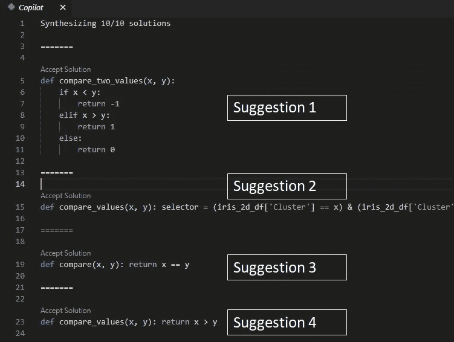
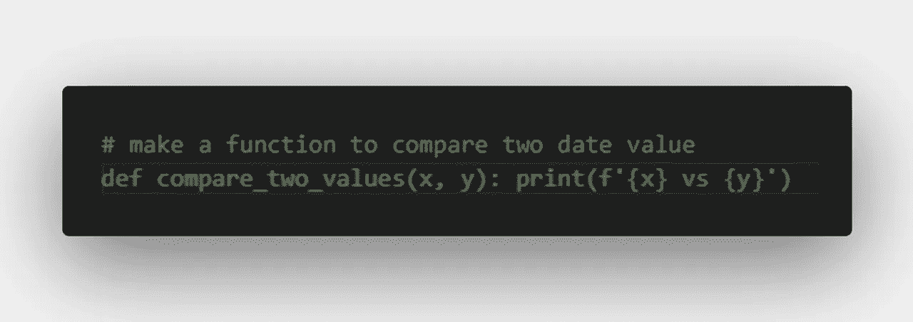
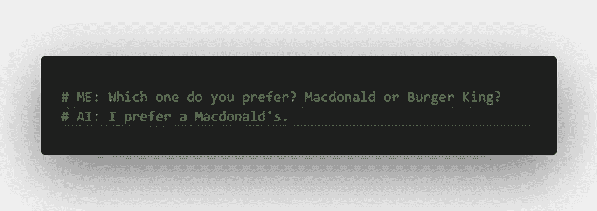
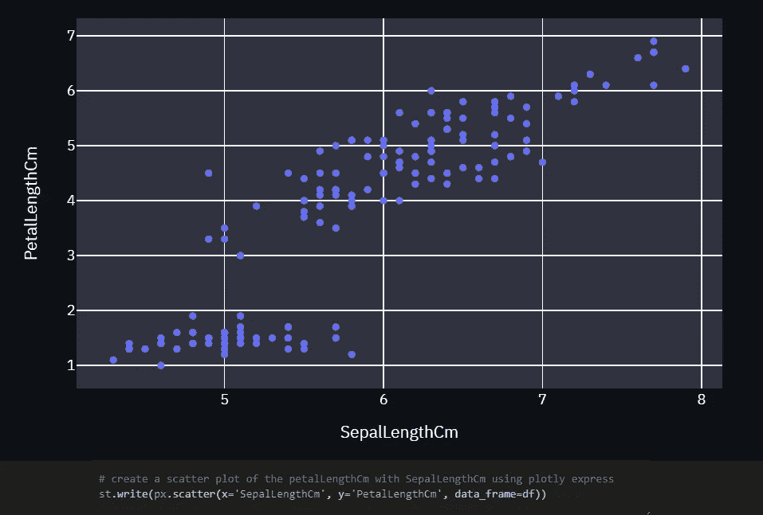
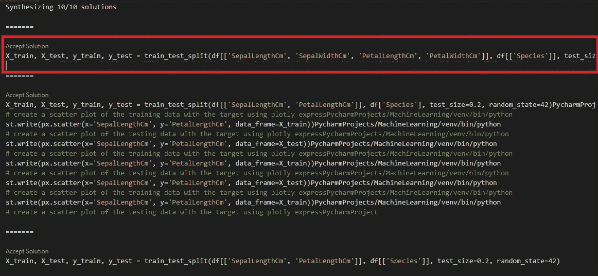
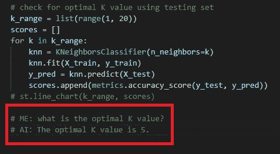

# Github Copilot 能让你成为更好的数据科学家吗？

> 原文：<https://towardsdatascience.com/can-github-copilot-make-you-a-better-data-scientist-6fd751fb38ce?source=collection_archive---------7----------------------->

## 人类对抗人工智能

## 让我们用 Github Copilot 完成一个数据科学项目吧！


来自 [Pexels](https://www.pexels.com/photo/engineers-in-flight-simulator-3862143/?utm_content=attributionCopyText&utm_medium=referral&utm_source=pexels) 的 [ThisIsEngineering](https://www.pexels.com/@thisisengineering?utm_content=attributionCopyText&utm_medium=referral&utm_source=pexels) 摄影

Github Copilot 是最近编程界的炒作，许多文章和 youtube 视频都显示了 Copilot 的惊人能力。我最近获得了 Github Copilot 技术预览版的访问权限，我很好奇**Copilot 如何在数据科学项目**中帮助数据科学家。

# 什么是 GitHub Copilot？

> GitHub Copilot 是一个 AI pair 程序员，可以帮助你以更少的工作量更快地编写代码。GitHub Copilot 从注释和代码中提取上下文，并立即建议单独的行和整个功能。[3]

Copilot 接受了来自 GitHub 知识库和其他网站的大量公开编码数据的培训。所以基本上是比你我更好的程序员。

## 如何使用 Copilot？

目前，Copilot 技术预览版作为 VS 代码扩展提供，并且只限于一小部分测试人员预览该扩展。可以试试在这里报名[。成功批准后，您将看到如下屏幕:](https://github.com/features/copilot/signup)


Copilot 预览版注册成功。作者图片

Copilot 的工作就像你的谷歌自动完成。代码建议将显示为暗淡的颜色短语，当指向建议的代码时，您将获得一个鼠标悬停标签。


副驾驶显示。作者图片

Copilot 将为您提供大量代码建议，只需按下 *Alt + ]* 和 *Alt + [* 更改建议的代码，然后按下“ *Tab* 接受它。您可以预览多个建议代码，只需按下 *Ctrl+Enter* 即可得到如下视图:



多个代码建议。作者图片

Copilot 能够识别您的评论并根据您的评论生成功能，您可以向 copilot 发出指令以生成功能，如下例所示:



副驾驶看了你的评论。作者图片

P.s:对于 Q & A 车型，还可以通过键入 *ME:* 和 *AI:* 与副驾驶聊天。



与副驾驶聊天。作者图片

我们对 Copilot 的简短介绍到此结束，让我们继续讨论我们的主要问题:

> Copilot 能帮助数据科学家做出更好的数据科学项目吗？

我们试试吧！


准备好和你的副驾驶一起飞行了吗？照片由 [Rafael Cosquiere](https://www.pexels.com/@rafael-cosquiere-1059286?utm_content=attributionCopyText&utm_medium=referral&utm_source=pexels) 从 [Pexels](https://www.pexels.com/photo/two-pilots-sitting-inside-plane-2064123/?utm_content=attributionCopyText&utm_medium=referral&utm_source=pexels) 拍摄

# 实验:

在这个实验中，我们将使用著名的虹膜数据集；我们的目标是 ***使用 Copilot 执行探索性数据分析，并使用纯粹的建议代码*** 训练 k-NN 模型。我们将制定如下规则:

1.  仅使用建议的代码，仅修复打字错误和特定于数据的问题。
2.  每一个动作都应该伴随着一个明确的`comment/command`给副驾驶。
3.  只有 3 个顶级代码建议将被采纳。

截止到写*的时候，VS 代码的 Python 笔记本用 Copilot* 相对不稳定，所以我会用 Streamlit 作为我的平台。Streamlit 提供了一个类似 Jupyter 笔记本的实时代码更新 web 应用程序，可以帮助我们探索数据科学项目。想了解更多关于 Streamlit 的信息，你可以在这里阅读我的文章。

导入库包:

```
import streamlit as st
import pandas as pd
import numpy as np
import plotly.express as px
```

# 💡数据加载

```
# load iris.csv into dataframe
```


副驾驶的代码建议。作者图片

# 💡带副驾驶的 EDA

```
# print the dataframe column names and shape
```

给我留下深刻印象的是，Copilot 自动理解了 streamlit 中的打印机制，它使用了 *st.write()* 而不是 *print()* ，因为 Streamlit 是 python 中相对较新的包。

接下来，我尝试用:

```
# create a scatter plot of the petal length and petal width using plotly express
```

这是我得到的，看起来 Copilot 不够聪明，无法理解数据帧中的上下文😂：


接下来，我尝试精确命名，得到了一个很好的精确图形:

```
# create a scatter plot of the petalLengthCm with SepalLengthCm using plotly express
```



Copilot 创建的 Plotly 图形。作者图片

# 💡使用 scikit 建模-了解:

接下来，为了创建一个测试和训练数据集，我编写了以下代码:

```
# splitting the data into training and testing sets (80:20)
```

这些是我得到的建议:

印象深刻！Copilot 甚至知道哪一个是我的目标类，并为我编写了完整的代码，我需要做的只是选择建议！

完整的代码建议返回如下:



接下来，我用这个命令试试运气:

```
# check for optimal K value using testing set
```

出乎我的意料，副驾驶可以返回给我这个代码:

这在编码方面节省了大量时间；Copilot 甚至会在最后帮你绘制图表。嗯，图表没有成功，所以我必须使用创建的列表对我这边的代码做一点修改。但是它仍然节省了我很多时间去检查代码的堆栈溢出。

> 出于好奇，**我问副驾驶，“最佳 K 值是多少？”**



**副驾驶无需绘制图表就将答案返回给我**😲😲

这启发了我的下一个命令，我想:

```
# create a classifier using the optimal K value
```

然后，我只需按 enter 并接受建议的注释和代码就可以继续了。下面是我得到的代码:

**注意，我只键入 1 条命令，其余的由副驾驶建议。**


建议代码的结果

在 5 个建议的代码中，3 个工作正常，2 个建议: *metrics.f1_score* 和 *metrics.precision_score* 不工作。

我用 Copilot 进行的简单代码测试到此结束。我已经在 [Github](https://github.com/manfye/streamlit-copilot) 上发表了这个建议，可以随意看看。

# 最终想法:

在本文中，我演示了 copilot 如何在数据科学过程中提供帮助，Copilot 犯了一些错误，但使用它的好处更多。另一个问题是，我使用的数据集是 Iris 数据集，因此它在更大的数据集中可能不太有效。

编程的新范式来了，不用在 StackOverflow 等问答网站里搜索，Copilot 会节省你大部分 googling 的时间，直接给你多个解决方案。我猜它**将来会减少编程相关问题对 StackOverflow 和 Google** 的依赖。

嗯，在目前阶段，我们的工作仍然是安全的，因为 Copilot 仍然需要一些基本的知识来执行，如指导项目的方向，告诉 Copilot 该做什么。

在我看来，Copilot 肯定会让你成为更好的数据科学家。*但它会在未来取代你作为数据科学家的工作吗？*随着反馈和大量数据输入 Copilot，它肯定会在未来成为更好的 AI，谁知道它会不会接管程序员和数据科学家的工作？🤔🤔

最后，我仍然在#TeamHumanity:凭借我们的创造力，我们将接管对人工智能的控制，并利用人工智能改善我们的生活。非常感谢你看我的文章。

## 旁注:

以下是我的一些文章，希望你也喜欢:

[](/turn-excel-into-a-beautiful-web-application-using-streamlit-7a18516ca01a) [## 使用 Streamlit 将 Excel 变成漂亮的 Web 应用程序

### 使用 python 库 Streamlit 将数据呈现为交互式仪表盘 web 应用程序

towardsdatascience.com](/turn-excel-into-a-beautiful-web-application-using-streamlit-7a18516ca01a) [](/automate-google-sheet-reporting-in-5-minutes-8bbdc1f8e293) [## 5 分钟内自动完成谷歌表单报告

towardsdatascience.com](/automate-google-sheet-reporting-in-5-minutes-8bbdc1f8e293) 

## 参考资料:

1.  [来自 Kaggle 的虹膜数据集](https://www.kaggle.com/uciml/iris)
2.  [https://towards data science . com/github-copilot-a-new-generation-of-ai-programmers-327 E3 C7 ef 3 AE](/github-copilot-a-new-generation-of-ai-programmers-327e3c7ef3ae)
3.  [https://copilot.github.com/](https://copilot.github.com/)