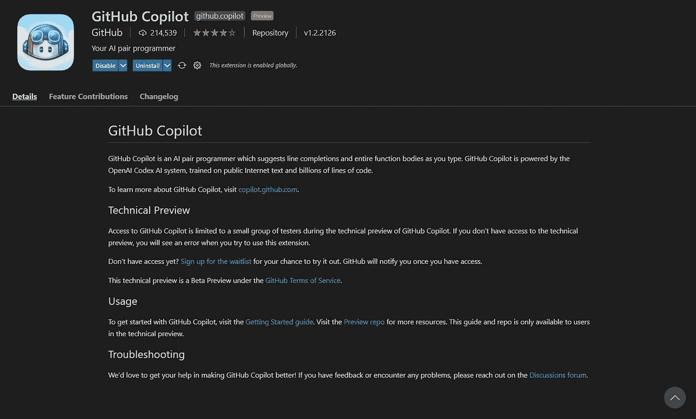
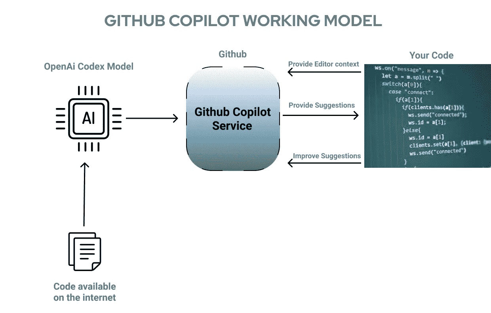

# Github Copilot 能代替开发者吗？

> 原文：<https://towardsdatascience.com/can-githubs-copilot-replace-developers-b89f28007c05?source=collection_archive---------7----------------------->

## 自从发布以来，copilot 已经成为开发者们谈论的话题。使用它有许多优点和缺点。

作者图片

自从我接触到 Github Copilot 的技术预览版，我就被问了很多次这个问题。我会尽我所能回答这个问题。最后，我会诚实地评价我们是否应该使用它。

**简短回答:**需要时间。当然，每个人都必须成为[无用阶层](https://ideas.ted.com/the-rise-of-the-useless-class/)的一部分，开发者也是如此——但最终。为了获得更清晰的想法，请继续阅读。

> 让我们首先了解什么是 Github Copilot 以及它是如何工作的——它将帮助我们评估代码自动完成的未来。

# **Github 的副驾驶是什么？**

> 据 Github 报道， *Copilot 由 Codex 提供动力，Codex 是 OpenAI 创造的新 AI 系统。GitHub Copilot 比大多数代码助手理解更多的上下文。GitHub Copilot 经过数十亿行公共代码的训练，让您所需的知识触手可及，节省您的时间并帮助您保持专注。*

作者 Gif

简单来说，Copilot 真的理解你下一行要编码什么。在我的情况下，它甚至可以完美地理解不好的评论。有时，它会犯一些愚蠢的错误，比如重复声明同一个变量；这种类型的错误是预料之中的，这就是为什么 Github 最初允许开发者给出反馈。我对它的理解能力感到非常惊讶。你只需要给它一些例子，剩下的就会完美地自动生成。

**到目前为止，我想提及 3 个主要特性:**

1.  将注释转换为代码。

> Github Copilot 可以理解不好的注释和函数名。

2.没有辛劳的测试。

> 这是我推荐大家在 Github Copilot 中使用的唯一功能。

3.重复代码的自动填充。

> Github Copilot 是现有自动建议插件的更高级形式。这对于有经验的开发人员来说显然是好事，但对于新手来说却不是。

> 但是 Github Copilot **并不是**每次都能写出完美的代码。正如 Github 所说，它的副驾驶总是尽力理解你的意图，但它建议的代码可能并不总是有效，甚至没有意义。随着时间的推移会有所改善。

# 它是如何工作的？

根据 Github Copilot 的说法，它已经在互联网上接受了一系列英语和源代码的培训，包括所有 Github 库(私人库除外)。

图片作者|设计于 [Figma](https://www.figma.com)

上图不言自明。Codex 检索与编码相关的文本和互联网上可用的公共代码(Github ),并使用其算法将其传递给 Github Copilot 服务。这个服务然后为我们的私有代码提供建议，实际上这不是私有的，因为它将改进建议发送回服务 Github Copilot。:)

> 抄本理论但很有趣。

根据一周前发布的一篇 35 页长的论文[Codex paper](https://arxiv.org/pdf/2107.03374.pdf),*Codex 是一个 GPT 语言模型，对来自 Github 的公开可用代码进行了微调，并研究其 Python 代码编写能力。*“Codex 比 GPT-3 更有效率和改进，因为它已经在 Github 上的许多公共存储库上进行了训练。

[***论文***](https://arxiv.org/pdf/2107.03374.pdf) ***还声称已经解决了 10000+的竞技编程问题。***

**关于数据收集，文中说:**

> 我们的训练数据集是在 2020 年 5 月从 GitHub 上托管的 5400 万个公共软件存储库中收集的，包含 179 GB 的 1 MB 以下的唯一 Python 文件。我们过滤掉了可能是自动生成的、平均行长度大于 100、最大行长度大于 1000 或包含少量字母数字字符的文件。过滤后，我们的最终数据集总计 159 GB”

**最后，******本文得出结论:****

> **通过在 GitHub 的代码上对 GPT 进行微调，我们发现我们的模型在一组难度与简单的面试问题相当的人工编写的问题上表现出了很好的性能**

**这都是关于 Codex 的数据和事实，它是 Github Copilot 的支柱。论文明确说未来会产生更准确有效的结果，这意味着 Github Copilot 会越来越强。**

# **人工智能工具将如何影响开发者**

**关键时刻到了。Github Copilot 将大大提高开发人员的工作效率。这也将有助于降低软件生产的成本。我认为 Github Copilot 可以取代编写代码的人(程序员)，但首先要取代开发人员需要的时间太多了。我使用两个不同的头衔——程序员和开发人员——因为美国劳工统计局(Bureau of Labor Statistics，BLS)将计算机程序员和软件开发人员分开分类，开发人员的薪酬高于程序员，因为他们有更多与编写代码和与代码交互间接相关的任务。**

**正如我在介绍部分提到的，每个人都要成为[无用阶层](https://ideas.ted.com/the-rise-of-the-useless-class/)的一部分，但与计算机交互的人会最后加入。在无用阶级时代，如果你生活在一个发达国家，或者你的政府足够好，那么你什么都不做也会得到报酬。**

> **[这篇论文](https://arxiv.org/pdf/2107.03374.pdf)还声称，食品法典委员会将为补充改变的工作流程的工作创造新的市场。在 GPT-3 发布后，一些公司开始在工作列表中加入与 GPT-3 的合作和编写提示。也有可能像 Codex 这样的模型会为那些熟练使用这些工具的工程师带来新的工作类型。**

# **应该用 Github Copilot 吗？**

**我用 Github Copilot 的体验没那么好。当报纸声称 Codex 已经解决了超过 10，000 个竞争性编程问题时，我正在解决一个[螺旋数](https://cses.fi/problemset/task/1071)问题。Github Copilot 提出了一些与 if 逻辑无关的非常尴尬的陈述，这意味着 Copilot 必须学习很多东西。我用 Copilot 只是为了测试，但是在竞技编程中使用 AI 工具就是**欺骗自己**。**

**千万不要用这样的工具来解题，会对你的解题技巧产生高度负面的影响。如果你是一个有经验的开发者，那么你应该利用 Github Copilot 来处理重复的代码。如果你是一个新手，你必须避免这样的人工智能工具，即使是 IDE 的自动建议，它们会破坏你的概念。**

**但是不管你是什么，甚至不要想到在竞争性编程中使用人工智能工具，它们可以帮助你获胜，但你不会获得内心的平静。**

****这篇文章是根据我与副驾驶的经验，研究，和** [**抄本论文**](https://arxiv.org/pdf/2107.03374.pdf) **。是否使用 Github Copilot 这样的工具是你的选择。但是你肯定会用到它们，如果不是今天，那么就是明天。****

> **请让我知道你对 AI 自动完成工具的想法，比如 Gitub Copilot，以及你对开发者未来的看法。**