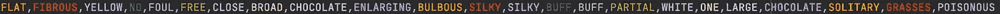
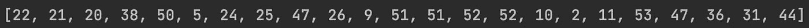
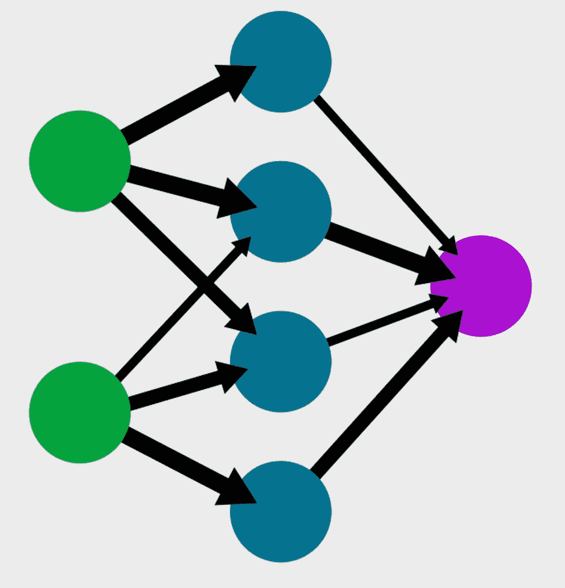
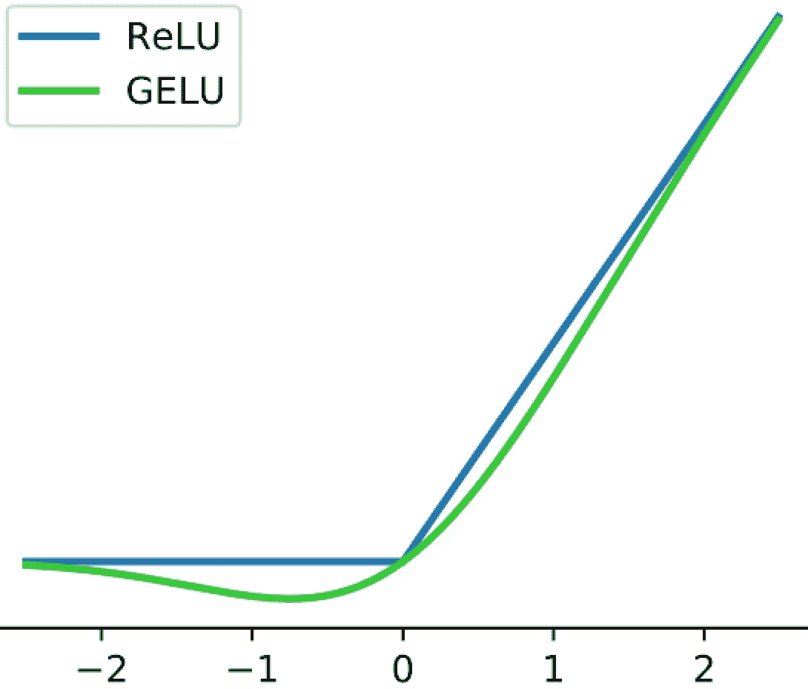
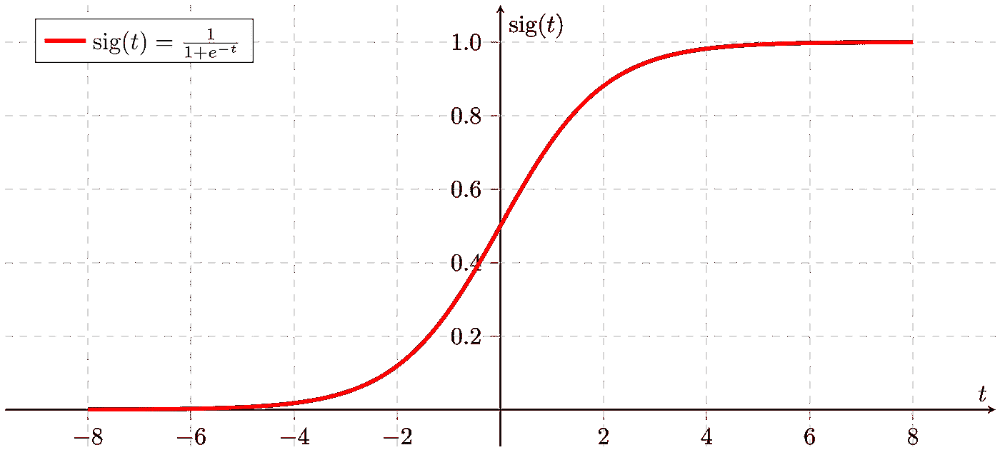

# 我能吃那个蘑菇吗？

> 原文：<https://towardsdatascience.com/can-i-eat-that-mushroom-fc84e5b6b2c4?source=collection_archive---------66----------------------->

## 神经网络可以有所帮助


这些蘑菇有些可以食用，有些不可以。你能分辨出哪个是哪个吗？图片由[安德鲁·雷德利](https://unsplash.com/@aridley88)在 [Unsplash](https://unsplash.com/photos/bx0a2yq2hxs) 上拍摄

想象一下，你在森林里呆了一个晚上，你只能吃你在周围找到的东西。你偶然发现了一片蘑菇。问题解决了！不完全是。**用肉眼来看，几乎不可能判断一家餐馆是否安全。然而，通过机器学习，我们可以创建一个人工智能来预测给定的蘑菇是否可以食用。**最近我分别用 Tensorflow 和 Keras，一个 Python 神经网络(NN)库和它的 API，开发了这样一个算法。让我们来看看它到底是如何工作的，以及它最终执行任务的效果如何。

# 该方法

## 数据

为了开始这项任务，我们需要找到一个大型数据集，其中包含数以千计的蘑菇，它们的一些特征，以及它们是否可以食用。我在这里发现了这样一个数据集[。文件蘑菇 _weka_dataset.csv *(csv 是列表****c****omma****s****separated****v****alues)*，我在我的 Python 编辑器中将其重命名为 data.csv，包含关于 **8417 蘑菇**的信息利用这些知识，**我们可以教会我们即将诞生的神经网络蘑菇的哪些特性表明它们是安全的。**](https://www.mldata.io/dataset-details/mushroom/)



data.csv 中的第 5015 行；它描述了一种不可食用的(有毒的)蘑菇。作者图片

在很高的层面上，我们的网络通过**浏览数据，首先随机猜测每个特征如何决定可食用性** *(是的，就是* [*一个词*](https://www.merriam-webster.com/thesaurus/edibility) *，对于那些想知道的人)* **，然后根据它的表现逐渐调整猜测。最终，所有这些调整都是为了使损失函数最小化，损失函数是衡量网络性能好坏的指标。**在这种情况下，损失函数将输出网络与食用蘑菇有毒的接近程度，反之亦然。*(关于 NN 如何工作的深入解释，请阅读本文*

## *翻译数据*

*仅仅找到一个我们想要的 CSV 文件是不够的。数据科学很大一部分是处理数据，这个项目也不例外。我们必须将文件翻译成我们的网络能够理解的语言。也就是说，语言是数学，单词必须变成数字。现在，data.csv 只是一个单词集合。它告诉我们瓶盖的表面是“光滑的”，但是我们的代码不知道如何解释这一点，除非它采用一些数值。*

*为了执行这种转换，我首先**将文件转录成一个名为*蘑菇*的 Python 列表**。这也使得最终将数据输入我们的网络变得更加容易。*

```
*from csv import reader #Module to read CSV files

#Read data from file into a list
mushrooms = []
with open("/Users/yamanhabip/PycharmProjects/Mushrooms network/data.csv", mode = "r") as file: #open *data.csv* in read mode

    to_read = reader(file) #create a CSV reader
    next(to_read) #skip the first line

    for line in to_read: #loop through the file
        mushrooms.append(line) #add each line to *mushrooms**
```

*这段代码跳过了文件的第一行，因为它包含了属性的描述。然后，**简单地获取 CSV 文件的每一行，自动将其转换为一个列表，并将该列表添加到更大的主列表**中，即蘑菇列表。*

*之后，实际的翻译就可以开始了。为了完成这个任务，我创建了一个名为*替换* **的 Python 字典**，并给文件中出现的每个单词分配了一个相应的编号。下面是实际的代码:*

```
*#Turn strings in list into numerical values
replacements = {} #create a running dictionary
num = 0 #create a counter to generate numbers for the word-number switches

for i in range(len(mushrooms)): #loop through *mushrooms*
    for j in range(len(mushrooms[i])): #loop through the sub-list that represents each individual mushroom #if the word in the sub-list has been encountered before, replace it with the corresponding value in *replacements* if mushrooms[i][j] in replacements: 
            mushrooms[i][j] = replacements[mushrooms[i][j]]#otherwise, create a new entry in replacements where the word corresponds to the value of the variable *num* and then replace the word.Then increase *num* by one to avoid one number representing two words.         else:
            replacements[mushrooms[i][j]] = num
            mushrooms[i][j] = replacements[mushrooms[i][j]]
            num += 1*
```

*正如代码中的注释所解释的，**上面的软件在 *replacements* 中为它遇到的每个唯一的单词创建一个新条目，同时遍历 data.csv 中的每个条目，将单词映射到一个数字。然后，它利用这种映射将每个单词转换成由*替换给它的数字。举例来说，这个过程的结果是“可食用”变成了 16 个，“有毒”变成了 44 个。因此，每当单词“可食用”出现时，网络将“看到”16，并且它可以利用这一点来训练自己基于这些数字表示做出准确的预测。下面是一个完整的、经过翻译的行:编号 5015，与上图相同，来自我们数据的新的和改进的版本。****

**

*第 5015 行是数字。作者图片*

## *拆分数据*

*既然我们已经把数据从机器乱码变成了机器可读的，我们必须把它分成两个部分:**输入/输出和训练/测试。**这里的第一步是将它分成输入和输出数据，因为一旦我们完成了，Python 就有了一个很好的模块来为我们进行训练测试分割。**分离输入和输出数据只是意味着将我们正在使用的预测器放入一组，而将我们试图预测的东西放入另一组。**对于蘑菇，这意味着我们需要创建一个列表，列出它们的特征(回想一下，这些特征是颜色、形状等。)和另一个说明它们是否有毒。这是 Python 中的样子:*

```
*#Split data into inputs and outputs
input_data = [] #a list for inputs
output_data = []#a list for outputs

for i in mushrooms: #loop through each individual mushroom in *mushrooms* input_data.append(i[:-1]) #add everything except the last item to inputs #add the last item to outputs as a one or a zero
    if i[-1:][0] == 16:#edible mushrooms have the last item as 16, we turn this into a one
        output_data.append(1)
    else: #otherwise the mushroom is not safe, and we represent this with a zero
        output_data.append(0)*
```

*该代码为蘑菇的特性及其可食用性创建了空列表(*也作* [*一词*](https://www.merriam-webster.com/dictionary/edibleness) *)。*由于数据文件中除了最后一列之外的所有内容都是为了帮助我们确定最后一列是“可食用”还是“有毒”*(或者对于我们的网络 44 或 16)* ，**除了最后一行之外，每个蘑菇的所有数据都放入输入列表，最后一个数字放入输出列表。**代码通过循环遍历*蘑菇*并根据条件将数据分发到*输入 _ 数据*和*输出 _ 数据*中来实现这一点。至关重要的是， *input_data* 的第一行与*output _ data*的第一行匹配，以此类推，**因此我们的网络能够使用这两个列表来查看它在预测蘑菇的安全性方面做得如何，并逐渐调整自己。***

*您会注意到，对于输出列表，我分别使用 1 和 0，而不是 16 和 44；这是为了利用 Tensorflow 的能力来模拟输出为 1 或 0 的二元函数。*

*在我们能够建立我们的网络之前，我们必须做的最后一块蛋糕切割是训练测试分割。这仅仅意味着，在我们用另一部分数据来训练我们的网络之后，我们留出一部分数据来测试我们的网络。 **这种分割有助于捕捉和避免过度拟合，**这是一个陷阱，我们的网络太擅长对一组数据进行评估，以至于它不再能很好地预测一般情况。好消息是:这种拆分并不简单，使用 sklearn 的 *train_test_split* 函数，两行代码*变得简单了。它是这样工作的:**

```
*#import train_test_split
from sklearn.model_selection import train_test_split#split the data
input_training, input_testing, output_training, output_testing = train_test_split(input_data, output_data, test_size = 0.2)*
```

*该函数返回四个列表，我将它们命名为 *input_training、input_testing、output_training、*和 *output_testing。*我选择将参数 *test_size* 设置为 0.2，这意味着返回的涉及培训的部分包含 80%的数据，涉及测试的部分包含 20%。现在我们终于完成了所有无聊的数据操作，我们可以开始创建一个网络。*

## *构建网络*

*我决定为我们的网络使用一个非常简单的模型，叫做*顺序模型*。它可以容纳我们想要的任意多的层，在这个模型中**每一层都从上一层获取数据，并输入到下一层。**此外，我使用了*密集*层，这意味着**每个节点都连接到** *(通过一个权重)* **到它之前和之后的层中的每个节点**，如果像那样的层存在*(第一层和最后一层分别没有它们之前和之后的节点)。**

**

*回想一下，神经网络有各种带有输入、输出和隐藏层的节点。注意:这张图片并不代表我在蘑菇数据中使用的网络，它只是一个网络一般结构的图解。在 [Wikimedia Commons](https://commons.wikimedia.org/wiki/File:Neural_network_example_mk.svg) 上公开的图片*

*也就是说，数据已经为我们的层做出了一些决定，还有一些决定需要我们自己做出。**我们知道输入层必须有 22 个节点**，因为我们有 22 个不同的可食用性潜在预测值。**我们还知道，我们的输出层只需要有一个节点** *(我将称之为输出节点)*，因为我们唯一可能的输出是 1，表示可食用，零，表示有毒。当然，输出节点的值不会总是 1 或 0；更确切地说，它将是一个可以解释为 1 或 0 的值。例如，我们的网络可能会计算出，如果输出节点的值大于 0.5，蘑菇就可以食用，否则就是有毒的。稍后，我们将通过输出节点的 sigmoid 激活函数来帮助我们的网络做到这一点。*

*我们能决定的是我们有多少个隐藏层，以及这些层中有多少个节点。这里有一个内在的权衡:**我们拥有的隐藏层和节点越多，我们的网络可以模拟的函数就越复杂，但它也将越慢**，因为它必须计算出更多的权重，从而进行更多繁重的数学运算。每个数据集的正确平衡会有所不同。对于我们的蘑菇例子，我发现两个隐藏层，每个有四个节点，足够有效和准确。*

*所以，总结一下:我们需要一个四层的网络。第一层是输入层，有 22 个节点，第二层和第三层都是隐藏层，各有 4 个节点，最后一层是输出层，只有一个节点。这里最后的决定点是每一层使用什么激活函数。激活函数只是告诉我们的网络如何评估输入层之外的每个节点*(输入层中的节点只是我们给网络的值，因此我们可以告诉它如何读取没有激活函数的节点)*。*

**

*用蓝色标出。图片由 [Ringdongdang](https://www.wikidata.org/wiki/Special:CentralAuth?target=Ringdongdang) 在 [Wikimedia Commons](https://commons.wikimedia.org/wiki/File:ReLU_and_GELU.svg)*

*对于这个网络，我使用 **ReLu** ，或者整流线性单元，来激活隐藏层。ReLu 只是获取隐藏层中每个节点的值，如果它是负数，就将其设置为零。否则，它返回值本身。ReLu 很有用，因为它允许我们**处理更少的数据，**提高效率，**并为我们的神经网络创建一个线性度更低的模型，以更好地模拟曲线。**此外，为 ReLu，f(x) = *max* (0，x)建模的函数对于 Python 来说非常容易计算，并且占用很少的处理能力，因此非常高效。*

**

*乙状结肠图。图片来自[马丁·托马斯](https://commons.wikimedia.org/wiki/User:MartinThoma)在[维基共享资源](https://commons.wikimedia.org/wiki/File:Sigmoid-function-2.svg)*

*我为输出层使用了 **Sigmoid** 激活函数，它获取它的值，然后**将其归一化到 0 到 1 之间。这允许我们的网络设置一个阈值，它可以合理地确定所有的输出将符合蘑菇是否安全。如果这有点抽象，请这样想:如果没有 Sigmoid，我们可能到处都是输出，并且不可能做出类似“所有低于 0.5 的输出*(或任何其他数字)*构成毒蘑菇”的声明，因为当输出范围可以从-789 到 1234 时 **0.5 将是这样一个任意的阈值。**然而，当输出只能在 0 和 1 之间时，to 数字会使我们的网络大吃一惊，因此很容易创建阈值。请注意，Sigmoid 使用分数指数函数来建模，因此计算量相当大。幸运的是，我们只需要将它用于网络中的一个节点。***

*让我们看看所有这些是如何用 Tensorflow 和 Keras 实现为代码的。为了简单起见，我在这里将它们导入并重命名为 *tf_k* 。*

```
*#Import keras, an API for tensorflow
from tensorflow import keras as tf_k#Create a network with a sequential model
network = tf_k.Sequential()

#Add 2 hidden, dense layers to the network, each with four nodes and relu activation
network.add(tf_k.layers.Dense(4, activation = "relu", name = "hidden1"))network.add(tf_k.layers.Dense(4, activation = "relu", name = "hidden2"))

#Add an output node with sigmoid activation
network.add(tf_k.layers.Dense(1, activation = "sigmoid", name = "output"))*
```

*有了它，我们就能构建上述网络。**使用 *network.add* 我们将所有需要的密集层添加到我们的顺序模型中，**并且我们能够使用第一个参数*设置节点的数量(或者* ***超参数*** *，因为这是编码器设置的值，而不是网络学习的值)*。我还将激活函数描述为每一层的参数，并为每一层命名以供将来参考，也许是为了可视化或调试*

*你可能已经注意到了**我们没有添加输入层。我们不需要一个，因为我们简单地把列表 *input_training* 给 tensorflow，它直接把它输入到我们的第一个隐藏层。***

## *训练网络*

*在我们的网络开始运作之前的最后一步是培训它。要做到这一点，我们必须将它放在一起，并用下面的两行代码使其符合我们的数据:*

```
*#put the network together
network.compile(optimizer = "adam", metrics = ["accuracy"], loss = tf_k.losses.binary_crossentropy)

#Train the network with out training data and 20 epochs through the data
network.fit(input_training, output_training, epochs = 20, verbose = 2)*
```

***这些线中的第一条将我们所有的层集合到一个统一的模型**中，该模型将使用 Tensorflow 的内置优化器 *adam* ，该优化器使用**梯度下降**，一个更新我们网络权重的函数。它还告诉我们的网络，我们正在**努力实现高精度**，以此作为我们评估的标准。最后，网络知道它应该使用*binary _ cross entropy*loss 函数，它通过告诉我们**它离输出错误的二进制变量**有多近，简单地计算出我们的网络做得有多好。顾名思义， *binary_crossentropy* 专门用于二元预测，如毒蘑菇和食用蘑菇的区别，完全符合我们的目的。像我之前解释的，网络通过尝试最小化这个损失函数来“学习”。*

***当查看数据集 *input_training* 和 *output_training 时，第二行实际上通过拟合其权重来训练网络，以最小化损失函数***。参数 **epochs** 允许我们指定**网络遍历数据的次数，并优化其权重。这里，我们必须在效率和准确性之间做出选择。我发现 20 次以上为这个特殊的网络创造了一个很好的平衡。Verbose 简单地给出了一些不同的选项，关于网络如何向你显示它的学习。我喜欢 verbose = 2 的可视化方法，尽管其他方法可能适用于不同的个人。***

## *添加测试步骤*

*我需要的最后一行代码是**使用测试数据来确保网络能在一般情况下工作。***

```
*#Test the network with the testing data
network.evaluate(input_testing, output_testing, verbose = 2)*
```

*与其他一切相比，这是一件轻而易举的事情。**我们所要做的就是告诉网络使用哪些数据来评估自己，**因此参数*输入 _ 测试*和*输出 _ 测试，*以及我们希望看到的结果。这里，我再次使用 verbose = 2 作为我首选的可视化方法。*

# *结果呢*

*好吧。我们努力工作，建立了我们的神经网络。是时候带它出去兜兜风了。经过 20 个时期的训练和查看测试数据，我们从我们的程序中得到以下结果。为了避免本文中大量繁琐的编程输出，我只显示了第 1、10 和 20 个时期以及测试阶段的结果。*

```
***Epoch 1/20** loss: 2.6525 - accuracy: 0.6885
**Epoch 10/20** loss: 0.0562 - accuracy: 0.9813
**Epoch 20/20**
loss: 0.0188 - accuracy: 0.9949
**Testing** loss: 0.0152 - accuracy: 0.9923*
```

*随着时代的推移，网络变得越来越好。起初，网络只比随机猜测好一点点，当然比熟练的人类差，得出关于蘑菇的正确结论的概率只有 69%。然而，我们必须相信这个过程，因为随着**的消逝，损失函数返回越来越小的值，网络的准确度接近 100%。***

*现在，我们还不能太兴奋，因为如此高的精度**可能表明过度拟合。如果网络从未在训练数据上出错，那么它可能只是简单地掌握了这些数据。我们不知道这种优势是否会转化到其他蘑菇上。但幸运的是，**该网络似乎也非常擅长一般情况，因为它在测试数据上也获得了超过 99%的准确性。**有趣的是，似乎有一点点过度拟合，因为网络测试比它在最终训练时期测试的要差一点点。虽然，它实际上在测试集上损失较少，所以这可能只是一个巧合，而不是常见陷阱的结果。***

# *更多应用*

*现在，如果你认为机器学习真的很酷，但认为你永远不会遇到野生蘑菇，不要害怕！**本文概述的技术几乎可以应用于任何存在因果关系的领域。**例如，用户可以输入一部电影的评论以及卖出了多少张票，以尝试并计算出它是否会收支平衡。需要做的只是改变输入的数据集，也许还需要调整超参数。更发人深省的前景包括预测信用卡欺诈、医疗疾病诊断、新的破解蛋白质折叠之谜就在上个月，关于神经网络的陈词滥调“可能性是无限的”听起来很真实。*

# *关键要点*

*   ***神经网络使用输入、输出和隐藏层**对现实世界进行预测。*
*   *他们几乎可以解决任何有因果关系的问题。*
*   *其中一个应用是根据蘑菇的一些特性来预测它是否可以食用。*
*   *要构建神经网络，必须:*

1.  ***收集并翻译数据**以便网络能够理解。*
2.  ***将数据**分成**输入和输出**以及**测试和训练**数据。*
3.  ***建立一个网络**并决定**隐藏层数、** **这些层中有多少节点**，以及使用什么**激活函数**。*
4.  ***用训练数据训练网络。***
5.  ***用测试数据测试**网络，确保它没有**过拟合**。*

# *进一步阅读*

**本文源代码在* [*本*](https://github.com/Yaman-Habip/Mushrooms-Network) *Github repo 中。**

*如果你想了解更多，网上有很多资源。我特别推荐 edx 的 CS50:AI 入门课程。如果你想跟我跟进、交谈或有进一步的问题，这是我的联系方式:*

*[*邮箱*](http://yamanhabip@icloud.com/)*|*|[*Linkedin*](https://www.linkedin.com/in/yaman-habip-51a5491b6/)*|*[*Github*](https://github.com/Yaman-Habip)*

**并请* [*订阅*](https://yamanhabip.substack.com/subscribe?utm_source=menu&simple=true&next=https%3A%2F%2Fyamanhabip.substack.com%2Faccount%2Flogin%3Fredirect%3D%252Fpublish%253Futm_source%253Dmenu%26error%3DPlease%2520log%2520in%2520to%2520access%2520this%2520page.) *我的月报！**