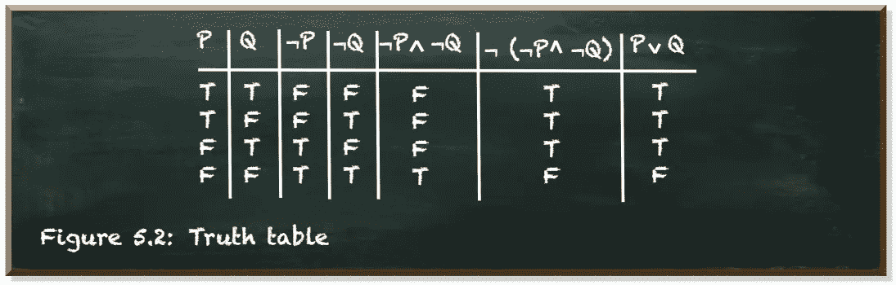
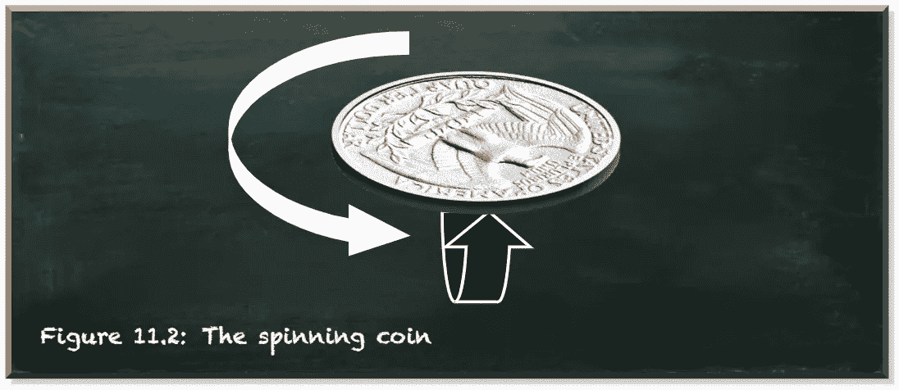
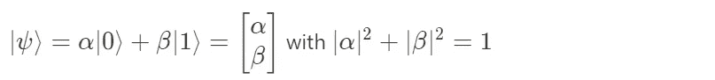
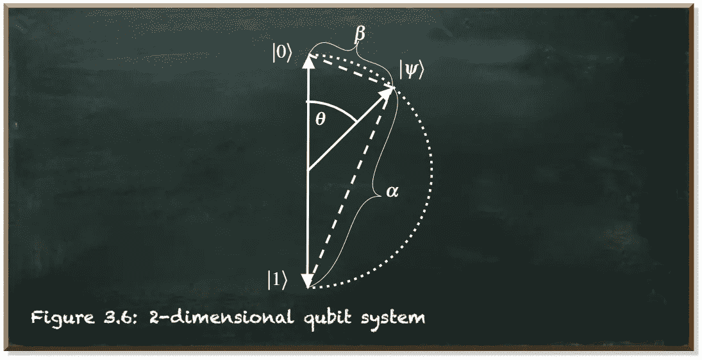
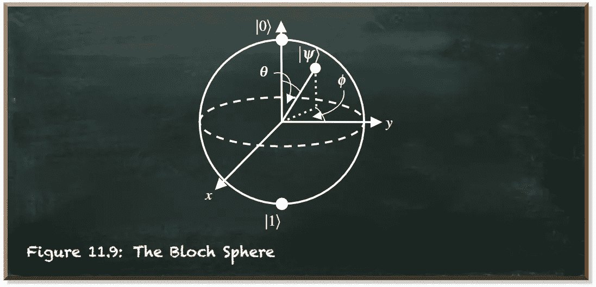
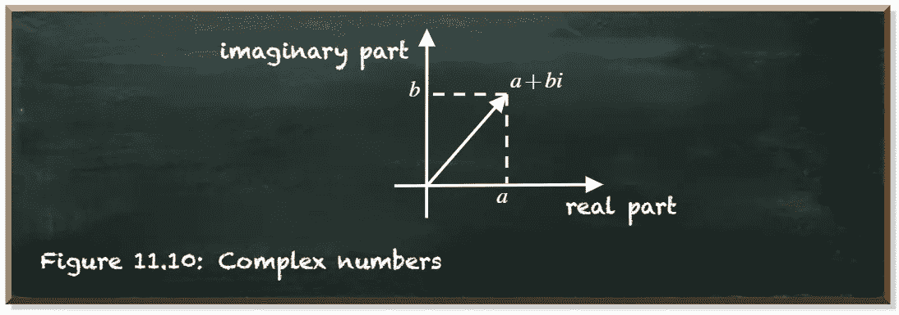
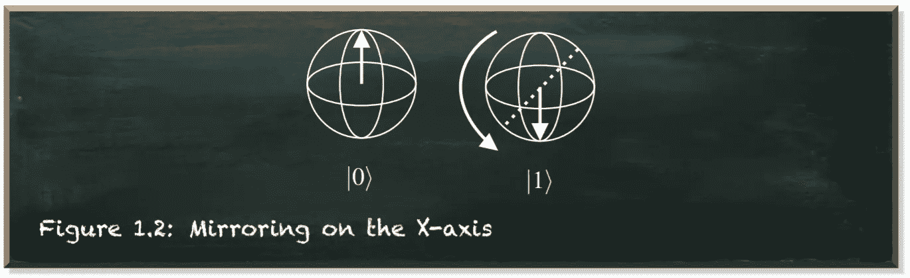
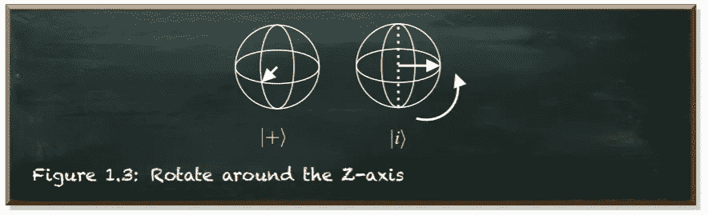

# 不用那么多数学可以学习量子计算吗？

> 原文：<https://towardsdatascience.com/can-i-learn-quantum-computing-without-using-so-much-math-ae85838e6f51?source=collection_archive---------36----------------------->

## 你不需要成为数学家来理解量子计算，但当事情变得棘手时，数学是你的盟友。

量子机器学习要不要入门？看看 [**动手量子机器学习用 Python**](https://www.pyqml.com/page?ref=medium_womath&dest=/) **。**

在经典计算中，我们习惯于在布尔状态下思考。一个术语是真还是假。某个位是关(0)还是开(1)。就是这样。这是我们所有算法的基础。

有了布尔逻辑，只需要很少的运算符，比如*而不是*、*和*以及*或*，我们就可以开发出相当复杂的程序。如果某项为真，就这样做，否则就那样做。因为这个术语是真的，重复做某件事。

作为一名程序员，你可能整天都在脑子里想着真值表。

作者图片

在量子计算中，我们的比特是量子比特(量子比特的缩写)。它不是 0 或 1，而是 0 和 1 的复合(如在复数中)线性组合。

假设我们有一枚硬币。当你把硬币放在桌子上，你有一个古典位。要么正面朝上，要么反面朝上。你可以用布尔术语来定义你的逻辑。你可以指定硬币正面朝上时会发生什么，或者硬币反面朝上时你该做什么。当然，你可以用硬币工作。你可以把它放在桌子上任何你喜欢的方向。你的指示是这样的:“如果硬币是正面朝上，那么拿着它，反面朝上地放在桌子上。”

在量子计算中，我们抛硬币。它在空中旋转。它是头和尾的组合。当且仅当你抓住它，看着它，它决定一个值。一旦落地，就是一枚正面朝上或者反面朝上的普通硬币。

硬币放在桌子上时有两种状态，正面或反面。在空气中，我们的量子硬币处于两种状态的叠加状态。让我们仔细看看这枚硬币。它不断地在正面和反面之间翻转。一旦硬币落地，这个旋转决定了我们看到的是正面还是反面。再仔细看看。这枚硬币也沿着它的边缘旋转。

作者图片

问题是，我们不能再用一个简单的布尔值来描述这种状态了。我们需要描述它的旋转，以及它如何影响正面朝上或反面朝上着陆的概率。

因此，在量子计算中，我们用向量来代表量子位元的状态。当量子位处于叠加态(硬币在空中)时，我们还不知道我们是将它分别测量为 0 还是 1(它是正面着地还是反面着地)。但是我们知道，某些自旋会影响我们是否用其中一个值来测量它的概率。我们知道所有概率的总和是 1。

因此，我们用一个归一化的矢量来表示量子位的自旋。我们称之为|𝜓⟩(“psi”)。这是狄拉克符号，它简单地表示一个列向量。

这个公式意味着量子比特的叠加态是一个归一化的矢量。所有可能的状态都起源于同一点，并且长度相同。因此，它们形成一个圆，如下图所示。

作者图片

矢量头到极点的距离表示将该特定量子位测量为 0(到南极的距离或接近北极)或 1(到北极的距离或接近南极)的概率。

量子位状态向量可以直接指向北极。这是|0⟩.那么，有 1 (=100%)的概率测得为 0。如果量子位状态向量指向南极，那么有 1 的概率测得为 1。量子位状态向量可以指向圆心周围的圆上的任何一点，|𝛼|测量它的概率为 0，|𝛽|测量它的概率为 1。我们通过𝜃，北极|0⟩和状态向量之间的角度来区分状态向量。

𝜃角代表硬币两面的旋转。它不断地从正面翻转到反面。

就像硬币可以沿着边缘旋转一样，量子位也可以沿着不同的方向旋转。我们使用希腊字母“phi”(𝜙)来围绕中心跨越另一个与第一个圆正交的圆。

作者图片

这两个圆围绕中心形成一个球体。这个球面被称为布洛赫球面。布洛赫球提供了单个量子位的视觉参考。布洛赫球是一个很好的工具，可以让量子比特算符变得有意义。

布洛赫球有三个轴。Z 轴是垂直的，包含极点。记住，|0⟩州描绘的是北极。我们在这种状态下测量一个量子位为 0——总是这样。在南极的|1⟩状态下，我们测量一个量子位总是为 1。我们水平绘制 Y 轴。最后，X 轴是图中的对角线。

表示球体的一种方式是三维坐标系。然而，在量子计算中，我们只使用二维向量。但是向量里面的数字是复数。

复数是一个可以用𝑎+𝑏⋅𝑖形式表示的数，其中 *a* 是实部，𝑏⋅𝑖是虚部。𝑖表示满足等式*𝑖= 1*的虚数单位。因为没有实数满足这个方程，所以𝑎和𝑏⋅𝑖是相互独立的。因此，复数是二维的。

作者图片

因为𝛼和𝛽是复数，它们跨越一个平面。而一个二维数的二维向量可以组成一个三维球体。

当然，我们也可以使用量子位。但是，我们不能直接控制量子位是 0 还是 1。相反，我们控制量子位元在不同方向的旋转。我们在空中控制它。这里事情变得有点复杂。我们可以增加或减少旋转。我们可以完全逆转它们。我们可以从不同的角度来做这件事。有无数种方法可以改变量子位的自旋。因此，量子位元的运算子比传统位元的运算子多得多。

假设我们在|𝜓⟩.态有一个任意的量子位怎么才能改变呢？

首先，我们可以在其中一个轴上镜像它。这些操作符通常具有我们用作镜像的轴的名称。例如，X 操作符在 X 轴上镜像量子位状态向量。下图以图形方式描述了该运算符的效果。

作者图片

X 运算符的一个重要作用是，它将测量量子位的概率翻转为 0 和 1。因此，我们也知道 X 算子是非算子。

改变量子位状态的另一种方法是旋转。我们可以围绕任意轴旋转量子位状态向量任意角度。当然，我们通常使用三个主轴(X、Y 或 Z)中的一个。但是，我们并不局限于此。

作为一个例子，让我们围绕一个标准轴，Z 轴旋转我们的量子位。我们可以逆时针旋转四分之一圈，就像这样:

作者图片

我们称这个算符为 S 算符。我们也可以把它转回来(顺时针)。这是 S^T 的接线员。上标的 *T* 代表“转置”转置是我们用来变换矩阵的一个操作符。它翻转矩阵的对角线。简单地说，它切换矩阵的行和列索引。我们用矩阵符号来命名量子比特算符的原因很简单。它们是矩阵。

正如我们上面提到的，量子位状态是一个矢量。还有，有很多处理向量的方法。但是我们在量子计算中有一种特殊的方法。这就是矩阵乘法。如果我们用一个输入向量乘一个矩阵，输出就是另一个向量。矩阵乘法使我们能够改变量子位的叠加态，而不会使它崩溃。

# 结论

基本上，这就是为什么量子计算中有这么多数学的原因。量子态是矢量，算符是矩阵，我们用复数。

任何状态及其任何变化都涉及线性代数和矩阵计算。这与经典计算形成对比，在经典计算中，状态是二进制的(0 或 1)，运算符(*不是*、*和*、*或*等)。)非常直观，也很容易在头脑中推理。

好消息是我们有电脑。没有人需要手动乘矩阵。甚至我们的经典电脑也很擅长这个。正如这两个例子所示，我们可以不用解公式或乘矩阵就能推理量子算符。

作者图片

所以，[理解量子计算](/you-dont-need-to-be-a-mathematician-to-master-quantum-computing-161026af8878)不需要成为数学家。但是你将不得不应付线性代数，因为它是量子计算的基础。通过一点点练习，你将能够在不咨询数学的情况下说出许多变换的效果。然而，当事情变得棘手时，数学是你的盟友。

量子机器学习要不要入门？看看 [**动手量子机器学习用 Python**](https://www.pyqml.com/page?ref=medium_womath&dest=/) **。**

免费获取前三章[这里](https://www.pyqml.com/page?ref=medium_womath&dest=/)。