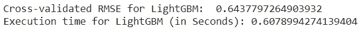
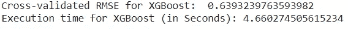
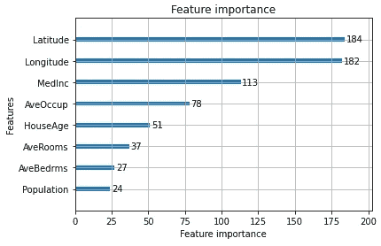

# LightGBM 能跑赢 XGBoost 吗？

> 原文：<https://towardsdatascience.com/can-lightgbm-outperform-xgboost-d05a94102a55?source=collection_archive---------24----------------------->

## 助推技术

## 机器学习中的助推算法——第五部分


道格·达菲在 [Unsplash](https://unsplash.com/?utm_source=unsplash&utm_medium=referral&utm_content=creditCopyText) 上拍摄的照片

到目前为止，我们已经讨论了 3 种增强技术: [AdaBoost](/how-do-you-implement-adaboost-with-python-a76427b0fa7a) 、[梯度增强](/under-the-hood-of-gradient-boosting-and-its-python-implementation-99cc63efd24d)和 [XGBoost](https://rukshanpramoditha.medium.com/unlock-the-power-of-xgboost-738536b9f36f) 。我们已经知道 XGBoost 比我们到目前为止讨论过的其他 boosting 算法更强大。

LightGBM(光梯度增强机)是 XGBoost 的一个很好的替代品。它是由微软开发的，在几年前的 2016 年发布。

由于 LightGBM 在集合中创建新树时采用了不同的方法，因此 LightGBM 具有以下独特的功能:

*   运行速度比 XGBoost 快
*   使用较少的内存
*   可以处理大型数据集
*   可以处理数据集中缺失的值
*   可以处理尚未编码的分类特征

今天，我们将学习 LightGBM 库的安装，并探索它的 Python API。关键部分是我们将使用 XGBoost 和 LightGBM 算法在同一个数据集上创建两个模型，并比较每个算法的性能和执行时间。

我们开始吧！

# 照明设备的安装

我们可以通过在 Anaconda 提示符或 Google Colab 编辑器中运行以下命令来安装 LightGBM。

```
**pip install lightgbm**
```

然后运行以下命令并验证安装。

```
**import lightgbm**
```

如果您没有收到任何错误消息，那么您已经成功安装了 LightGBM！

# LightGBM 的 Python API

LightGBM 的 Python API 由几个子 API 组成。我们将讨论其中的两个:

## sci kit-学习 API

该 API 用于通过 Scikit-learn **实现 LightGBM 算法。fit()/。预测()**范式。这个 API 中最重要的类是:

*   [LGBMClassifier()](https://lightgbm.readthedocs.io/en/latest/pythonapi/lightgbm.LGBMClassifier.html)**—light GBM 用于分类**
*   **[LGBMRegressor()](https://lightgbm.readthedocs.io/en/latest/pythonapi/lightgbm.LGBMRegressor.html)**—light GBM 用于回归****

## ****绘图 API****

****LightGBM 包在这个 API 下提供了一些绘图方法:****

*   ****[plot_importance()](https://lightgbm.readthedocs.io/en/latest/pythonapi/lightgbm.plot_importance.html) —绘制 LightGBM 模型的特征重要性****
*   ****[plot_metric()](https://lightgbm.readthedocs.io/en/latest/pythonapi/lightgbm.plot_metric.html) —在训练期间绘制一个度量****

# ****LightGBM 与 XGBoost****

****现在我们就来对比一下 LightGBM 和 XGBoost 的 ***性能*** 和 ***执行时间*** 。为此，我们使用[加州房价数据集](https://drive.google.com/file/d/1Kees3lk-Zo7AsrYz7svcj8Hnbr6gHok6/view?usp=sharing)执行回归任务。****

## ****LightGBM****

****这里，我们使用 **LGBMRegressor()** 类及其相关的超参数。我们还使用五重交叉验证来评估模型的性能。****

****LightGBM —性能和执行时间****

********

****(图片由作者提供)****

****LightGBM 的执行时间是 0.608 秒。数据集有 20640 行和 8 个特征！所以，LightGBM 真的很快。****

## ****XGBoost****

****这里，我们使用 **XGBRegressor()** 类及其相关的超参数。我们还使用五重交叉验证来评估模型的性能。****

****XGBoost —性能和执行时间****

********

****(图片由作者提供)****

****XGBoost 给出的 RMSE 略好于 LightGBM 给出的 RMSE。但是，XGBoost 任务需要 4.660 秒才能执行。比 LightGBM 慢了 7.66 倍！****

# ****LightGBM 的绘图功能重要性****

****这里，我们使用 LightGBM 绘图 API 的 **plot_importance()** 类来绘制我们之前创建的 LightGBM 模型的特性重要性。****

```
**lgbm.fit(X, y)
lightgbm.plot_importance(lgbm)**
```

********

****(图片由作者提供)****

****特征**人口**和 **AveBedrms** 对模型来说似乎不太重要。因此，您可以删除这些要素并重新构建模型以降低 RMSE。****

# ****结论****

******light GBM 能跑赢 XGBoost 吗？** 答案在这里。****

> ****就性能而言，LightGBM 并不总是优于 XGBoost，但它有时会优于 XGBoost。至于执行时间，LightGBM 比 XGBoost 快 7 倍左右！****

****除了更快的执行时间，LightGBM 还有另一个很好的特性:我们可以在 LightGBM 中直接使用分类特性(不需要编码)。但是，数据类型转换(*对象*数据类型→ *类别*数据类型)需要手动完成。****

****在下列情况下，LightGBM 优于 XGBoost。****

*   ****你想在比赛中快速训练模型。****
*   ****数据集很大。****
*   ****您没有时间对数据集中的分类要素(如果有)进行编码。****

****今天的帖子到此结束。在第 6 部分的[中，我们将讨论 **CatBoost(分类增强)**，XGBoost 的另一种替代方案。下一个故事再见。祝大家学习愉快！](/how-do-you-use-categorical-features-directly-with-catboost-947b211c2923)****

****我的读者可以通过下面的链接注册成为会员，以获得我写的每个故事的全部信息，我将收到你的一部分会员费。****

****<https://rukshanpramoditha.medium.com/membership>  

非常感谢你一直以来的支持！

特别要感谢 Unsplash 网站上的**道格·达菲**，为我提供了这篇文章的封面图片。

[鲁克山普拉莫迪塔](https://medium.com/u/f90a3bb1d400?source=post_page-----d05a94102a55--------------------------------)
**2021–10–29******