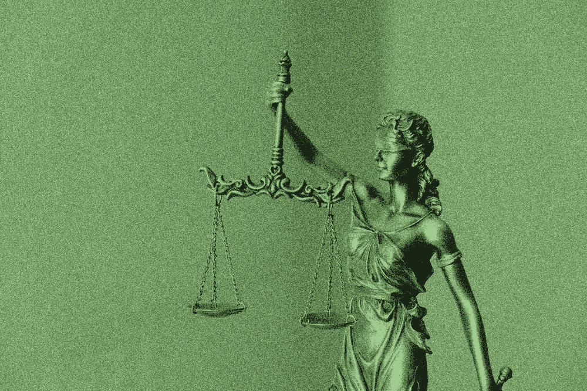
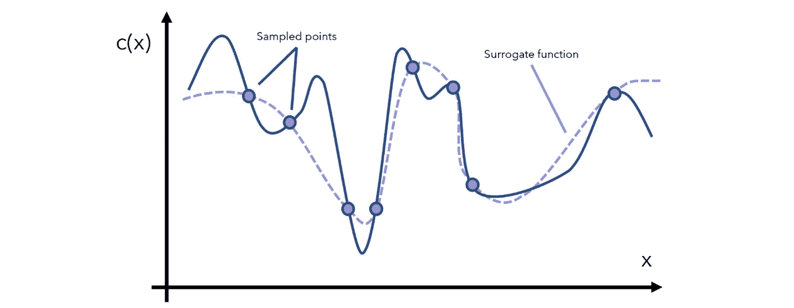

# 机器学习可能“公平”吗——这到底意味着什么？

> 原文：<https://towardsdatascience.com/can-machine-learning-ever-be-fair-and-what-does-that-even-mean-b84714dfae7e?source=collection_archive---------45----------------------->



来源: [Unsplash](https://unsplash.com/photos/yCdPU73kGSc)

## 对一个有争议问题的技术探讨

机器学习已经开始渗透到生活的方方面面——甚至是那些受反歧视法保护的领域。它被用于招聘、信贷、刑事司法、广告、教育等等。

然而，让这成为一个特别困难的问题的是，机器学习算法似乎更具流动性和无形性。复杂机器学习算法的部分设计在于它们难以解释和监管。机器学习公平性是一个新兴领域，旨在将抽象的“公平”原则融入机器学习算法中。

我们将从三个方面来看待“公平”的概念和观点。虽然还有很多要探索，这三个代表了公平研究中三个有趣的发展和观点:一个统计的单一模型解决方案；机器学习公平性的更多模型和更像人类的概念；质疑公平是否可能。

1.  “无知的公平”和人口均等的不足:一个统计解决方案
2.  可解释的公平:超越一种模式扩展公平
3.  机器学习公平是不可能的吗？可能

# “无知的公平”和人口均等的不足:一个统计解决方案

假设有一群狗住在小狗城；一家公司的客户支持代表的新工作已经开放，该公司希望使用机器学习来做出招聘决定。该公司表示，通过使用机器学习，他们将能够减少招聘经理决策过程中的偏见。

但是有一个问题——小狗城市反歧视法禁止根据狗的品种进行雇佣。因此，该公司做出了一个简单的解决方案:他们只是不会将狗的品种作为机器学习模型的一个特征。因此，他们将狗的品种标记为受保护的 T2 属性 T3。这种策略被称为“无意识中的公平”。

然而,*冗余编码*的问题出现了——数据集中说明受保护属性的特征。例如，公司可能基于两个主要特征进行招聘:

*   狗狗大学 GPA(他们需要聪明，思维敏捷)
*   狗说话的音调和语调(它们将整天与顾客交谈)

然而，(举个例子)德国牧羊犬的声音更低沉，而吉娃娃的声音更高。在狗学院，德国牧羊犬通常比吉娃娃狗获得更好的 GPA，因为狗社会的不平等。因此，完全有可能根据现有的特征来预测狗的品种。

鉴于这些复杂的模型常常掩盖了它们复杂的内部思维过程，我们如何知道模型是否依赖于狗的品种来做决定呢？

人口统计均等是一种衡量受保护属性是否真正受到保护的方法。简单来说，目标属性 *y* 和被保护属性 *p* 之间应该没有关联。作为一个等式:

```
**probability** *y*=1 **given** *p*=0 **is equal to probability** *y*=1 **given** *p*=1
```

(注意——我们假设 *y* 和 *p* 在这里是二进制的。)

用人口均等来衡量公平有两个问题:

*   *不能保证公平*。我们可以在 *p=0* 和 *p=1* 中只接受不合格的候选人或拒绝合格的候选人，以使百分比匹配。如果一个组中缺少训练数据，这很容易发生。
*   *它限制了性能。*尽管事实上我们需要机器学习模型才能公平，但它们需要表现良好。如果 *p* 真的提供了预测 *y* 的重要信息呢？—优化人口统计均等将显著降低绩效。

在《监督学习中的机会均等》一书中，莫里茨·哈特、埃里克·普莱斯和内森·斯雷布罗提出了另一种保护受保护属性的方法。它试图通过允许高性能同时防止受保护属性 p 方面的歧视来解决人口均等的两个限制。

他们引入了*均等赔率*的概念，即

```
**probability** *y = 1* **given** *p = 0* **and** *actual y = Y* (the real target)**is equal toprobability** *y = 1* **given** *p = 1* **and***actual y = Y* (the real target)
```

本质上，在 *p=0* 和 *p=1* 之间，模型应该具有相同的*真阳性率*和*假阳性率*。当它预测 *y=1* (通常类似于“是的，雇用”或“是的，批准贷款”)时，它应该在每组中做出与错误预测一样多的正确预测。

与人口均等或“无意识公平”相比，均等机会是一种更微妙的公平观；它允许模型使用受保护属性 *p* 中的信息，同时防止模型以歧视的方式滥用 *p* 。

通过在均等赔率上优化模型，该模型将在能够达到良好性能的同时相对于 *p* 更加公平。

这是考虑到关于受保护属性的公平性的更统计的观点；然而，它有一种机器学习的味道，因为它还允许模型从受保护的属性中提取更多潜在的洞察力。虽然这肯定不是一个完美的解决方案，但肯定是一个有效的解决方案。

均衡赔率的一个变体，*机会均等*，现在是机器学习模型中衡量公平性的标准。

*在这里阅读全文:* [*监督学习中的机会均等*](https://arxiv.org/pdf/1610.02413.pdf)

# 可解释的公平:超越一种模式扩展公平

看待公平还有许多其他方式。“可解释的公平”是一种更少依赖于统计测量的方法——不像均等的优势——而是利用更多的机器学习。

如果一个代理模型——一个与原始模型相似的模型——不能产生一组解释*来反对模型的公平性，那么这个模型就是*可解释公平的*。*

首先需要理解什么是代理模型。就像代孕母亲怀上另一对夫妇的孩子一样，代孕模特 *S* 模拟另一个模特*c*的结果

代理模型可以通过几种方式导出，但通常是通过重复采样数据点，查看模型 *C* 预测什么，并尝试模仿 *C* 的预测行为来完成的。



由作者创建。

然而，仅仅因为代理模型 *S* 模仿模型 *C* 的输出并不意味着它们的“思维过程”是相似的。(最近对[欠规范](/underspecification-the-dangerously-underdiscussed-problem-facing-machine-learning-4882292c67c1)的研究证明情况往往如此。)

例如，一个阿拉斯加人和一个厄瓜多尔人可能都不想在温和的天气外出，但出于不同的原因:阿拉斯加人认为天气太热，而厄瓜多尔人认为天气太冷。

的确，这既可以是弱点，也可以是优势。通过使用代理模型，我们掩盖了特定模型背后的“思考过程”。与此同时，我们也允许不同类型的模型——具有不同“经验”和“思维方式”的模型——提供关于公平的输入。

事实上，这可以被认为是一个力量的来源:如果我们对原始模型有多个代理模型，我们可以为一个模型的行为找到许多解释，因为代理模型从来都不是完美的。每种类型的代理模型在算法和特征上应该是不同的，因此它们对原始模型的决策做出不同的假设和解释。

这种更“全球化”的看待公平的方式可能更符合人类对社会公平的观念。例如，人 B、C 和 D 可能认为人 A 说的话是冒犯性的，即使人 A 不是故意的。在这种情况下，社会团体可能会谴责个人 a。毕竟，我们是社会动物——我们的观点经常受到周围其他人和社会的影响。

(虽然，这个*是否应该*是这样是一个有趣的争论。)

在代理模型被导出之后，它的均衡优势——或者任何其他种类的公平性度量——被测量。如果代理模型发现代理模型是公平的，那么原始模型*被认为相对于代理模型*是可解释公平的。如果使用多个代理模型来确定可解释的公平性，这种方法是强有力的。

“可解释的公平”并不能保证统计上的公平——正如引入这一概念的论文作者所承认的那样。然而，它确实将公平的作用扩展到一个算法或模型之外，并使公平的愿景变得复杂，可以用一个单独的指标来表达。

*在这里阅读全文:* [*通过可说明性和对抗性实现公平的 SHAP 学习*](https://arxiv.org/pdf/2003.05330.pdf)

# 机器学习公平是不可能的吗？可能

当然，这些公平的观点和概念都是以机器学习可以公平为前提的。然而，有些人认为这可能不是一个有效的假设。

Soralle A. Friedler、Carlos Scheidegger 和 Suresh Venkatasubramanian 在他们的论文《论(不)公平的可能性》中提出了这一主张，并断言…

> “…为了证明整个决策过程的理想属性，不同的公平机制需要对从构造空间到决策空间的映射性质做出不同的假设。”

论文依赖于*空间*的概念。

*   *构建空间*包含我们希望决策所基于的特征。例如，智力可能是我们希望招聘工作的一个特征。
*   O *观察空间*是我们可以观察到的关于构造空间的不完美特征。例如，平均绩点、智商或标准化测试分数可能是智力的近似特征。
*   *决策空间*包括可能的结果。例如，招聘的决策空间可以是雇佣/不雇佣。

决策算法的目标是将构造空间映射到决策空间。然而，由于构造空间只能由观察空间真正测量，第一步是通过将构造空间映射到观察空间来“提取”使用数据。简单来说:

```
Construct space → Observed space → Decision space
```

每个`→`代表前一个空间到下一个空间的某种*变换*。

现在，考虑两个关于公平的基本世界观:

1.  *所见即所得(WYSIWYG)* 。建构空间和观察空间本质上是相同的；*失真*(信息从一个空间移动到另一个空间被改变)是最小的。例如，SAT 分数和高中 GPA(观察到的空间特征)可能与申请人在大学取得成功的能力(构建空间特征)密切相关。
2.  *结构性偏差*。建构空间和观察空间被严重扭曲。我们希望捕捉组之间的相对失真，而不是以同样影响所有组的方式缩放。
    这里的假设是*我们都是平等的*(WAE)——所有的组在构造空间看起来都是一样的，即使组在观察空间看起来不是这样。
    例如，持有结构偏见的世界观，我们会断言耷拉着耳朵的小狗和竖起耳朵的小狗都能够变得友好，即使在观察空间中耷拉着耳朵的小狗被报道为更加友好。

考虑到这两种世界观，在 WYSIWYG 下，模型总是公平的，因为我们假设构造空间可以以最小的失真映射到观察空间。(这一主张——以及所有其他主张——在论文中得到了更严格的证明，论文链接如下。)

与此同时，在 WAE 下，这种模式可以永远是非歧视性的。*组公平机制*可用于将构造空间映射到观察空间，使得即使给定结构偏差，也能校正组之间的距离*。在小狗的例子中，这意味着竖起耳朵的小狗群体会像观察空间中松软的小狗群体一样友好。*

请注意，不歧视不同于公平。在统计方面，不歧视更多地适用于群体，而公平更多地适用于个人。

作者得出结论*公平只能发生在所见即所得的世界观下*。

在 WAE 和结构偏差的情况下，必须应用一个*组公平机制*-而不是一个单独的机制，以使算法是非歧视性的。如果我们不应用群体公平机制，那么我们就违背了我们首先人人平等的主张，因为群体差异没有得到纠正。

在结构性偏见的世界观下，只有群体公平机制才能实现非歧视，而个体公平机制则具有歧视性。另一方面，在所见即所得的世界观下，只有个体的公平机制才是公平的。

因此，每一个试图将建构空间映射到观察空间的机制——以测量决策所需的真实特征——都明确地与两种矛盾的世界观之一联系在一起。因此，一个机制不可能既在个人意义上公平，*又*无歧视。

*在这里阅读全文:*[](https://arxiv.org/pdf/1609.07236.pdf)*【论公平的(im)可能性】*

# *结论*

*公平的问题已经伴随人类很长一段时间了，因为我们仍然在努力理解它的含义，我们正试图将其形式化，供我们的机器学习对手使用。关于机器学习中的公平性，在机器学习社区中仍然存在长期的激烈争论和辩论。*

*本文介绍了三种实现公平的方法:*

1.  *作为更传统的人口统计均等和“无知的公平”观点的一种替代，均等的机会。允许模型从受保护的属性中学习，同时不歧视它。*
2.  *更加基于机器学习的公平概念依赖于试图模仿原始模型的其他代理模型的解释和审计的角色。*
3.  *将算法理解为空间之间的映射的理论方法，表明所有不同的公平和不歧视概念依赖于矛盾的世界观。*

*我很想听听你们的回答:*

1.  *这样的标准真的公平吗？如果一个受保护的属性包含在模型的训练数据中，那么它甚至有可能保护该属性吗？处理“不知不觉中的公平”的缺点是否比冒险将模型暴露给受保护的属性更好？*
2.  **关于可解释的公平性* —使用代理模型假设全球解释的某些方面对公平性很重要。是这样吗？这是某种道德相对主义吗？代理模型*带来的这种增加的噪声是否在某种程度上降低了*公平性？*
3.  **论公平的不可能性*——依赖于矛盾假设的不同公平概念实际上否定了公平的可能性吗？这篇论文本身是否做了任何假设？再者，这篇论文非常理论化——这种形式化和僵化是否限制了它对公平和歧视的理解？*

# *感谢阅读！*

*我最近推出了一个新的播客，ML & DS Papers On The Go。播客的目标是让您在旅途中也能听到最迷人和最新的进展——这是一个赶上最新研究趋势和发展的好时机！*

*点击 [Spotify](https://open.spotify.com/show/0wUzfk9C6nnH9G0tKXudUe) 查看。请随时联系[LinkedIn](https://www.linkedin.com/in/andre-ye/)——我仍在探索如何导航播客空间，所以我很乐意与你联系并听取你的反馈。请关注不久的将来的一集，作为对本文所讨论主题的进一步探索。*