# 机器会做梦吗？

> 原文：<https://towardsdatascience.com/can-machines-dream-2fdf7afa7fdb?source=collection_archive---------30----------------------->

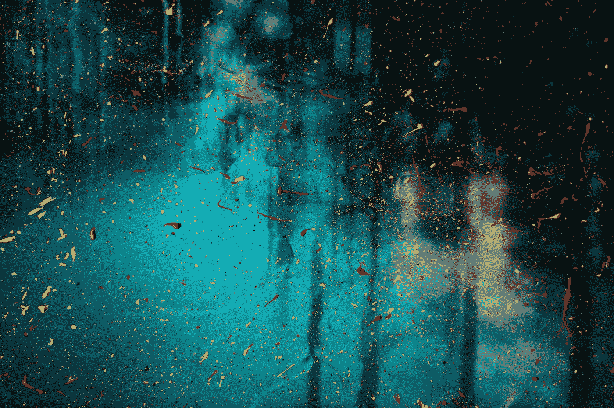

Jr Korpa 在 [Unsplash](https://unsplash.com?utm_source=medium&utm_medium=referral) 上拍摄的照片

## 围绕风格转移的理论和概念的描述和实现(以几个例子为特色)。

*查看我的* [*GitHub*](https://github.com/jamie-mcg/deep_dreams) *的工作风格转移代码库。*

一个你肯定没想过要问的问题。当然，除非你和一个朋友在凌晨 4 点刚刚看完 iRobot。

然而，我们现在……在一个机器在做梦的世界里……有点。

好消息是你不需要担心。虽然这些算法的输出可能非常怪异(我鼓励你谷歌搜索“深度梦境”)。它们完全依赖于输入，这是机器学习的准则。

所以我们不会做任何邪恶的梦，除非我们一开始就给它灌输一些非常恶心的东西。

我们用来描述这种行为的术语是神经风格转移[1]。

它包括给神经网络一个内容图像和一个样式图像。然后要求它以样式图像的样式重建内容图像。

## 动机

我发现任何深度学习概念的一个迷人之处是它的生物学根源。

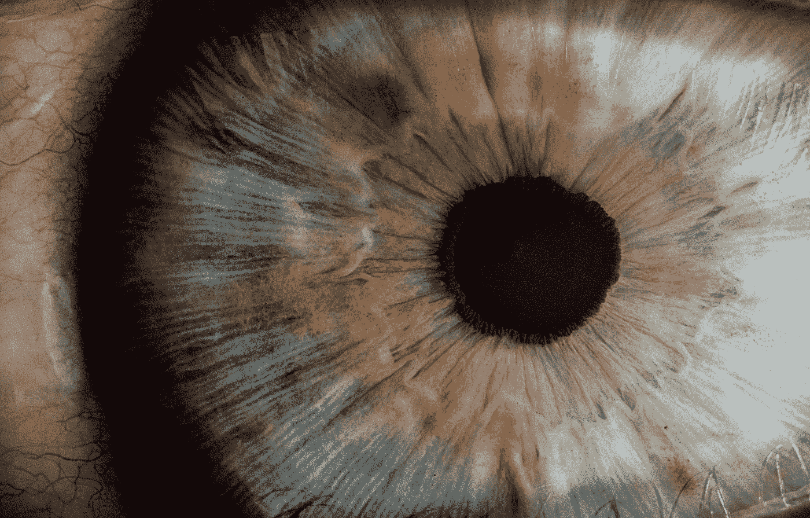

照片由 [v2osk](https://unsplash.com/@v2osk?utm_source=medium&utm_medium=referral) 在 [Unsplash](https://unsplash.com?utm_source=medium&utm_medium=referral) 上拍摄

为了理解神经风格转移如何工作，我们需要理解卷积神经网络(CNN)如何工作。为了理解 CNN，我们需要了解我们自己的视觉皮层是如何工作的。

这听起来像是一项巨大的工作，但老实说，理解起来超级简单。还有很多听起来很聪明很酷的词，这样你就能给最好的人留下深刻印象！

## 眼睛和大脑

我们的眼睛不可思议，更不可思议的是我们的大脑。我们的大脑是我们意识和潜意识的中心。

你可能已经知道，眼睛通过我们的视觉皮层向大脑提供信息，然后大脑皮层形成我们的视觉。

但是真正有趣的是大脑如何建立我们的视觉。


Robina Weermeijer 在 [Unsplash](https://unsplash.com?utm_source=medium&utm_medium=referral) 上拍摄的照片

有无数的神经元连接着眼睛和我们的视觉皮层。一端是单个细胞(视杆细胞和视锥细胞),每个细胞负责我们视觉的一小部分。而在另一端，我们对世界有一个完全成形的、无缝的(在大多数情况下)视觉感知。

Hubel 和 Wiesel 在 20 世纪 60 年代和 70 年代发现了我们的视觉是如何形成的线索。他们用猫做实验，给猫看一条不同角度的光。当分析 V1 神经元(连接到初级视觉皮层的神经元)的放电率或激活时。他们发现这种神经元的放电频率和光条的旋转之间存在相关性。

这是一个如此惊人的发现，因为它表明不同的神经元负责从我们从眼睛接收的视觉输入中检测不同的模式。

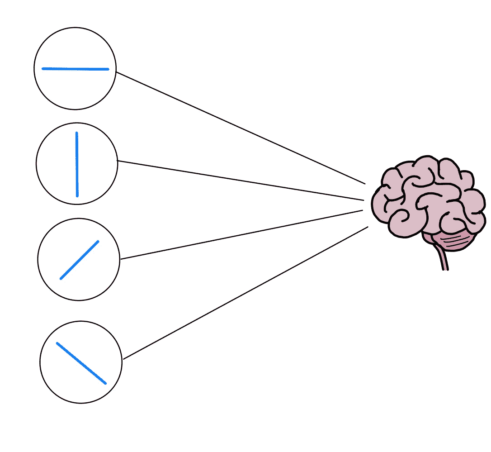

图 1:大脑的视觉输入图。

图 1 显示了我试图解释的内容的一个粗略的手绘示意图。这里我们有 4 个不同的神经元连接到大脑，每个神经元对一条线的特定方向做出反应。

在我们继续之前，让我们把一些机器学习术语放入其中……神经元发现的这些非常简单的特征就是我们所说的，*低级*特征。与更复杂的*高级*功能相反。

所以我们有一些低级的特征，这些特征是我们所看到的一切的基本组成部分。你可以想象有数百万个这样的特征。


照片由[哈维·卡夫雷拉](https://unsplash.com/@xavi_cabrera?utm_source=medium&utm_medium=referral)在 [Unsplash](https://unsplash.com?utm_source=medium&utm_medium=referral) 拍摄

这有点像当你打开一个新的乐高玩具时，你有上百万种不同类型的砖块可以玩，并放在一起，以构建高水平的功能。

这正是我们的大脑所做的。这些神经元连接到更多的神经元，这些神经元已经学会识别从其输入建立的特征，如图 2 所示。

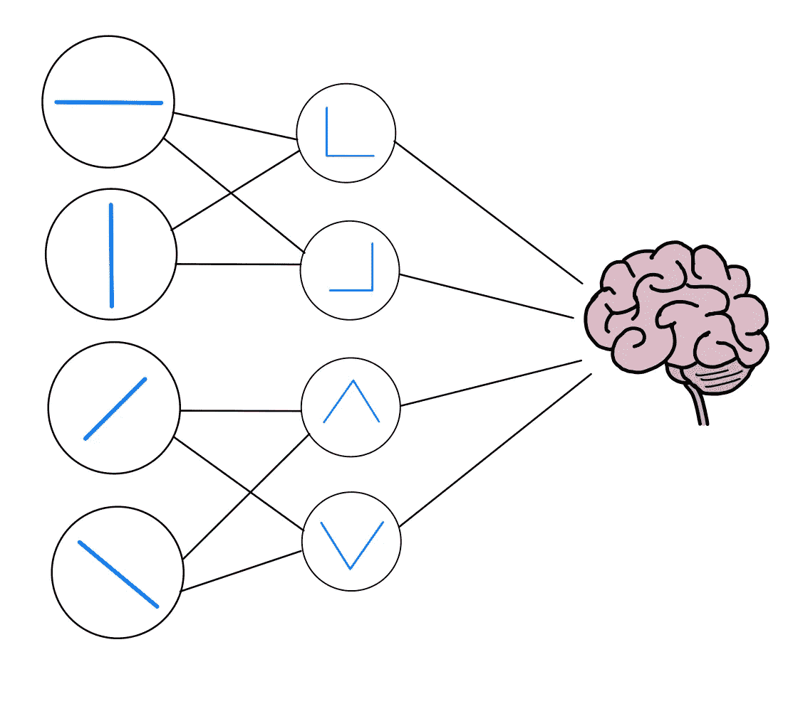

图 2:显示构建更高级特征的两层神经元的图。

图 2 向我们展示了一个非常简单的例子，展示了我们可以利用低级特征构建的一些结构。

就我们的乐高套装而言，我们正在组装第一对积木，并想象我们可以建造什么！

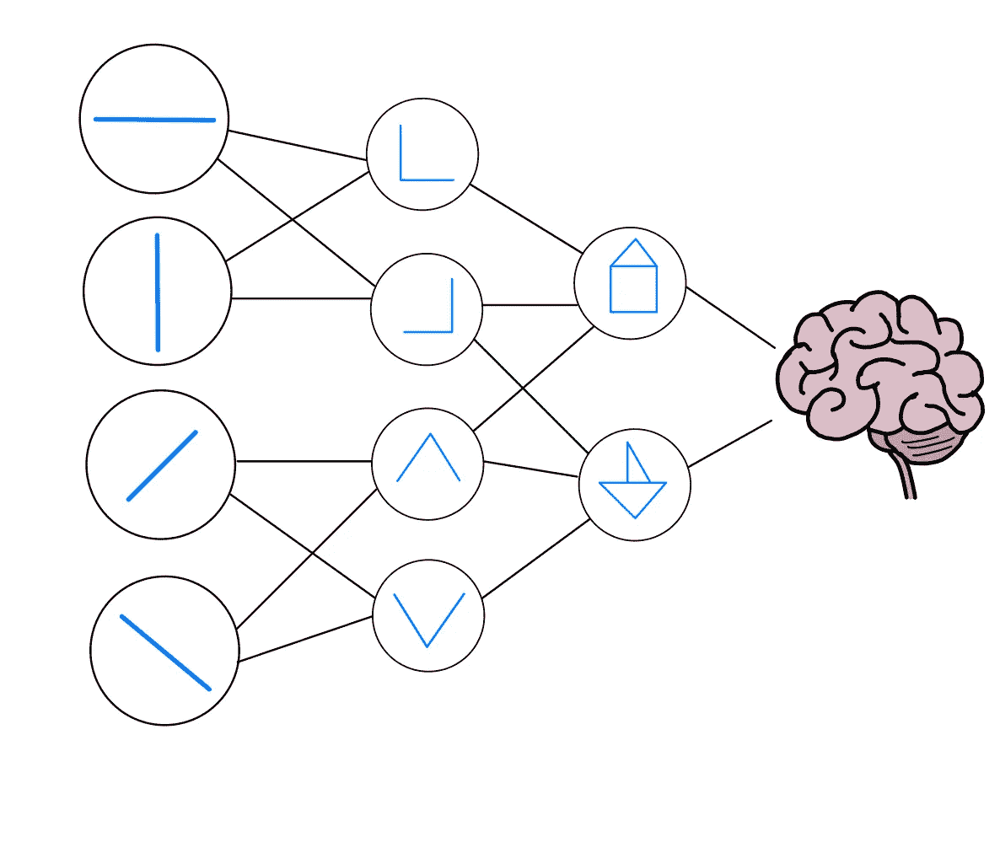

图 3:显示简单的房子或船如何被视觉通路中的高级神经元识别的图。

更进一步，我们可以看到每一层新的神经元是如何构建更复杂的(或更高级别的)结构的。

这里我们有几张相当不错的房子和船的画。这是我们的三级视觉通道现在能够识别的。

因此，当大脑通过这两个神经元接收到一个脉冲(或动作电位)时，这意味着在我们的视觉感知中，有一所房子*和一艘船*。或者如果这只是一个冲动，那么它要么是一栋房子*或*一艘船取决于哪一个，你明白了吗？

随着每一个新的层次，我们允许我们的大脑开始构建我们的完整视觉。或者完成我们的千年猎鹰乐高套装，如果我们回到乐高类比。

## 从眼睛到…CNN？

是的，这里还有更多好消息！

如果你看了最后一部分(希望你看了)，那么你已经知道 CNN 是如何工作的了！

回过头来看一下图 3…我们需要做的就是给这个图添加一些数学符号，并将其重新构建为机器学习和 viola 中的神经网络！

CNN 的来龙去脉是一些广泛研究的主题，我们不会在这里深入探讨。但是有几篇优秀的媒体文章和发表的论文围绕这个主题，所以如果你感兴趣，我鼓励你四处搜索。

对于本文，您只需要知道 CNN 通常由几个卷积层组成，这些卷积层负责构建我们上面探讨的更高级的功能。然后通常是一些*池*层，用来缩小图像的尺寸，迫使 CNN 寻找更高层次的特征。

## 图像的风格和内容

再看图 3，你认为内容和风格存在于这个非常基本的神经网络中的什么地方？

这里要考虑的更明显的是内容，因为像房子和船这样的高级特征最有可能代表图像的内容。而不是一行或一些非常低级的细节。

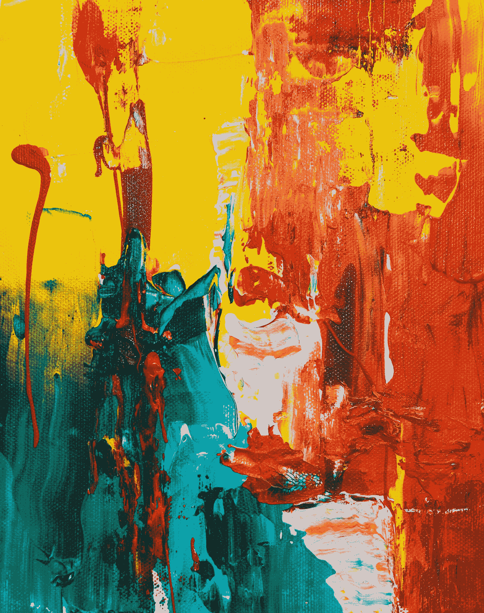

照片由[斯蒂夫·约翰森](https://unsplash.com/@steve_j?utm_source=medium&utm_medium=referral)在 [Unsplash](https://unsplash.com?utm_source=medium&utm_medium=referral) 上拍摄

另一方面，让我们想想图像的风格是什么…想象一下我刚刚画了一幅绝对的杰作，就像这里看到的一样…

这幅图像风格的一大贡献者是笔触。

笔画可以是图像的大特征，然而与图像的内容相比，它们是相对低级的特征。

因此我们可以想象图像的更多的*样式表示*将位于图 3 的左侧。或者 CNN 中每个卷积层的较低层。

现在让我们来看看一个实际的 CNN 架构。


图 4:来自[2]的 VGG-19 架构。

图 4 显示了在[3]中开发的著名的 VGG-19 模型的架构。输入从左边输入，输出在右边反馈给我们。在中间，我们所有的神经元结合在一起识别低级到高级的特征。

在每个卷积层(图 4 中的绿色阴影)，我们重复前面描述的过程。在卷积层的第一维(低级)中搜索简单特征，直到卷积层的最后一维(高级)中的更复杂特征。然后，我们有一个最大池层，减少了图像的大小，我们再次重复这一过程。


照片由 [Siora 摄影](https://unsplash.com/@siora18?utm_source=medium&utm_medium=referral)在 [Unsplash](https://unsplash.com?utm_source=medium&utm_medium=referral) 拍摄

这些最大池层是非常重要的，因为当他们减少了图像的大小，我们失去了图像的细节。因此，在每一步中，我们自然会看到更大的特征。

这些最大池层是非常重要的，因为当他们减少了图像的大小，我们失去了图像的细节。因此，在每一步中，我们自然会看到更大的特征。

我们还注意到，每个卷积层的深度从左向右增加。这是因为我们在更大的尺度上发现了更复杂的特征，这些特征对图像内容来说比在较低的级别上更重要。例如，一个真正复杂的笔触或铅笔标记没有画出的整体形状重要。

很明显，每个图像都是不同的，所以不容易定义一个特定的层，每个层都是不同的，也不容易在 CNN 中定义一个特定的点来最好地定义图像的内容。然而，作为一个经验法则，我们通常不期望内容在非常小的范围内，或者在非常大的范围内。介于两者之间通常是一个很好的起点。

关于风格，这可以在任何尺度上表现出来，因此在每个卷积层进行一些加权是一个好主意。然而，正如我们有希望证明的那样，在卷积层开始变得更加复杂和更加基于内容的表示之前，尽早在卷积层中选择样式层也是一个好主意。

## 生成图像

为了生成图像，我们必须首先选择包含我们的内容和风格的图层。我们将选择我们的:

```
content = "conv4_2"style = {
        "conv1_1": 1.0,
        "conv2_1": 0.75,
        "conv3_1": 0.2,
        "conv4_1": 0.2,
        "conv5_1": 0.2
    }
```

*注意，这些对应于图 4 中的标记。*

与样式层相关的数字是我们希望赋予每一层的权重。所以我们希望风格更多地由最底层的`conv1_1`层决定，而不是其他层。但是同样，这是可以根据您的输入和偏好来玩的东西。


由[克莱门特·赫拉尔多](https://unsplash.com/@clemhlrdt?utm_source=medium&utm_medium=referral)在 [Unsplash](https://unsplash.com?utm_source=medium&utm_medium=referral) 拍摄的照片

现在，我们将把我们的内容和风格图像分别传入我们的 CNN。当我们这样做时，我们可以找到内容层`conv4_2`的*基本表示*，以及分别用于内容和样式图像的每个样式层。

现在我们有目标了！

基本上，我们希望有一个通过 CNN 的图像，并再现我们在通过样式图像时为我们选择的样式层找到的相同样式表示。然后，当通过内容图像时，我们为我们选择的内容层找到了相同的内容表示。

这就是乐趣的开始…

首先，我们需要一个形象的起点。由于我们最有可能尝试制作一个看起来更像我们的内容图像但风格不同的最终产品，我们将继续为我们的初始输入制作一个内容图像的副本。

在这一点上，我们稍微偏离了你可能习惯的通常的机器学习设置。我们实际上不是在训练模型，我们实际上是在训练图像。

因此，我们没有将反向传播图与 CNN 的权重联系起来，而是实际上将它与输入图像(单个像素)的权重联系起来。

这样，当我们发现从输入图像中找到的所选特征和我们之前准备的基本特征之间的内容和风格损失时。执行反向传播将导致输入图像略有变化，而不是 CNN。

*这不是一件容易解释的事情，所以我鼓励你花几分钟时间浏览一下我的*[*GitHub*](https://github.com/jamie-mcg/deep_dreams/blob/main/code/algorithms/style_transfer.py)*上的代码示例，特别是在 algorithms/style_transfer.py 文件中。*

## 我们会失去什么？—更数学一点…

我们现在只需要一个损失函数。

我们将从内容损失开始，因为这稍微更容易解释，因为它只是来自具有基本内容图像(C)和新图像(X)的“conv4_2”的特征映射之间的均方误差。

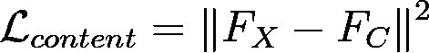

图 5:内容损失方程

这仅仅是惩罚与内容图像的基本表示中发现的特征的任何偏离。

现在对于图像的风格，我们需要简单介绍一下 *Gram 矩阵*。这些听起来比它们实际上要复杂得多，所以为了本文的目的，我将简单地把它们描述为*高维点积*。

直觉告诉我们，对于风格，我们并不真的想要在我们图像的完全相同的地方重新创建完全相同的笔触。我们只是想在整个图像中有一个类似的风格。因此，最好根据样式表示的相似程度来计算损失，就像余弦相似度或点积一样。

当然，我们必须记住，我们使用的是特征地图，它的维度比通常的点积要高。所以我们实际上需要使用一个 *Gram 矩阵*来封装输入 X 的风格和基本风格图像 s 之间的相关性

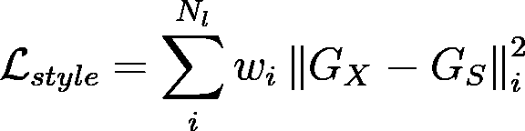

图 6:风格损失方程。

图 6 显示了封装到一个公式中的内容。其中每个选择的样式层的 gram 矩阵的 MSE 损失乘以它们的权重(在上面的代码块中定义),然后求和。

最后我们得到一个总损失函数，

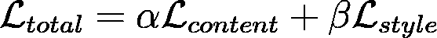

其特征在于α和β超参数乘以损耗。这些决定了风格在最终图像中的应用程度，留给我们自己去定义。

## 摘要

一旦我们具备了所有这些特征，我们就可以开始训练了，结果令人难以置信！

这里有几个空间主题的例子…

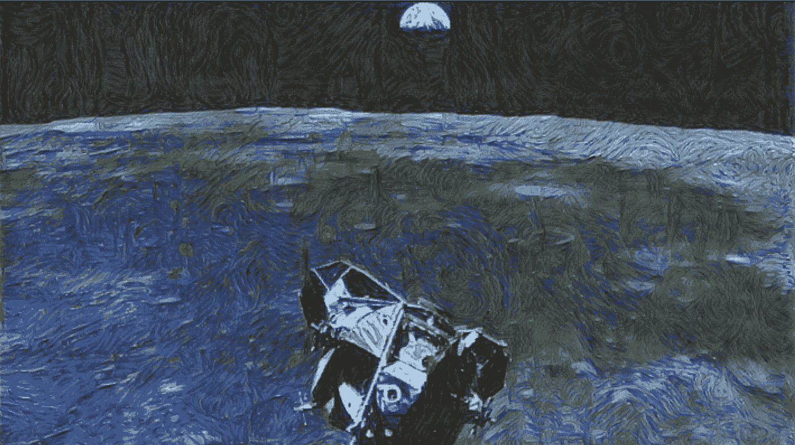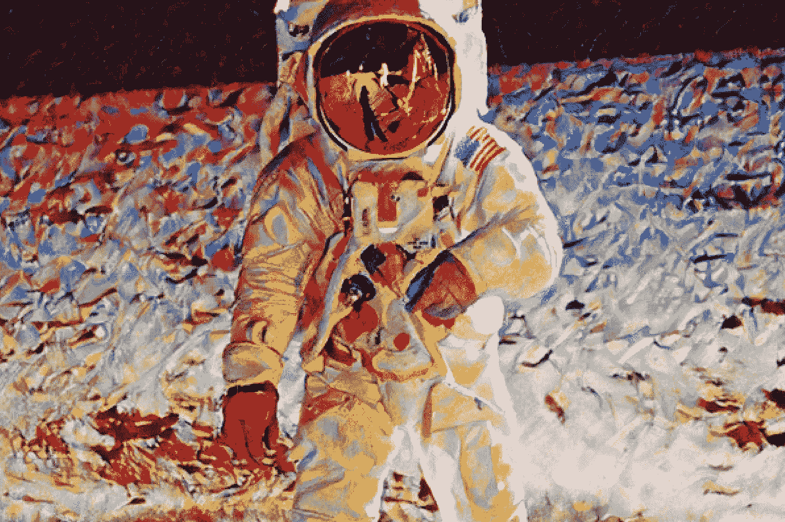

如果你想尝试一下， [GitHub](https://github.com/jamie-mcg/deep_dreams) 上的代码应该很容易使用。只需将您自己的图像添加到 content and style 文件夹中，然后使用新文件名运行代码。

一如既往，让我知道任何问题或意见！

## 参考

[1] — L. A. Gatys，A. S. Ecker 和 M. Bethge，[一种艺术风格的神经算法](https://arxiv.org/abs/1508.06576)，(2015)

[2] — D. H. Hubel 和 T. N. Wiesel，[猫视觉皮层的感受野、双眼互动和功能结构](https://www.ncbi.nlm.nih.gov/pmc/articles/PMC1359523/)，(1962)

[3] — K. Simonyan，A. Zisserman，[用于大规模图像识别的甚深卷积网络](https://arxiv.org/abs/1409.1556)，(2015)