# QR 分解实际上能更快吗？Schwarz-Rutishauser 算法

> 原文：<https://towardsdatascience.com/can-qr-decomposition-be-actually-faster-schwarz-rutishauser-algorithm-a32c0cde8b9b?source=collection_archive---------12----------------------->

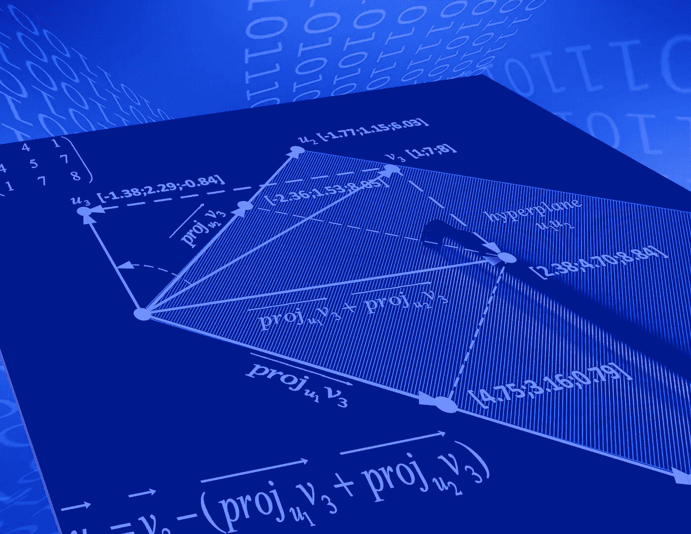

Arthur V. Ratz 摄于 Shotstash

## 在这个故事中，我们将讨论如何通过使用 Schwarz-Rutishauser 算法(已解释)有效地优化大型矩阵 QR 分解的性能，介绍其在 Python 3.9.x 和最新的 NumPy 1.20.x 库中的实现…

# 介绍

QR 分解是最新的，也可能是最有趣的线性代数算子之一，在科学和工程的许多领域有一些已知的应用。QR 分解方法的相关研究始于 XX 世纪初。

今天，一整类 QR 分解方法在数学中被有效地用于解决线性最小二乘(LS)问题，解线性方程组，以及特征值和奇异值分解(SVD)计算方法的基本步骤**【1】**。

在过去的几十年中，不断发展的计算机科学和 IT 领域影响了研究人员对 QR 类算法的潜在兴趣，这有利于解决许多现有的现实世界问题。

在 *AI* 和*数据挖掘*的时代，QR 算法在数据科学的各个领域得到了应用，例如*主成分分析(PCA)* ，作为一种在经济科学**【1，3】**中执行系统参数或总体估计的分析时，根据可能具有解释性的因素来表示参数幅度的方法。例如，因子分解可以有效地用于分析工业机器和机械装置的振动水平**【7】**。

以因子的形式表示各种类型的参数提供了一种能力来确定什么对总体评级和估计值具有特定的关键影响。具体而言，因子分解技术提供了获取知识和见解的能力，这些知识和见解在数据挖掘中常用的统计数据集上展示。

在电子商务和在线交易中，统计数据分解方法被应用于各种基于人工智能的分析软件功能的开发，被商家用来有效地涵盖他们的业务，从而增加受欢迎程度并降低数字内容和服务的成本，向数十亿在线客户做广告**【8】**。

然而，现有的大多数 QR 算法都具有非常高的计算复杂度，对大规模矩阵和其他大数据分解过程产生负面影响。显然，这些算法是为了在数据分析中使用它而优化的。

在这个故事中，我们将深入讨论如何优化著名的 Gram-Schmidt 正交化过程**【1】**，在即将推出的 Schwarz-Rutishauser 修正**【5】**的基础上显著降低其复杂度。

此外，我们将调查 Schwarz-Rutishauser 算法的复杂性，将其与其他现有的 QR 分解方法进行比较，如经典的 Gram-Schmidt 过程和 Householder 反射**【1，4】**。

此外，这个故事在底部包含了工作示例和到一个开源项目的 *GitHub* 库的链接，这个开源项目包含了 *Python 3.9.x* 和最新的 *NumPy 1.20.x* 库，实现了所讨论的 Gram-Schmidt、Householder 和 Schwarz-Rutishauser 算法，提供了所有这些方法性能的总结。

# QR 分解

QR 分解是将实数或复数矩阵 **A (m x n)** 分解成正交矩阵 **Q** 和上三角矩阵**R【1】**的乘积，例如:

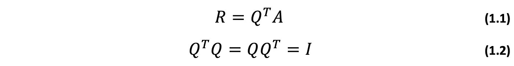

通常，矩阵𝙌的计算产生矩阵𝘼**【1，4】**的因式分解，例如:

在下面的段落中，我们将彻底讨论矩阵𝙌和𝙍最常见的性质**【4】**。

## 正交矩阵 Q:

通常，正交矩阵𝙌的计算导致矩阵𝘼**【4】**的分解，因此完全分解和部分分解都存在。QR 分解不仅可以应用于正方形矩阵，也可以应用于矩形矩阵，即使矩阵不具有满秩。大多数情况下，𝘼的完全因式分解给出了与𝘼矩阵形状相同的𝙌矩阵，或者至少𝙌和𝘼的列数相等**【5】**。矩阵𝘼的因式分解是 QR 分解的一个有用属性，只要𝘼的元素必须用因式**【1，3】**表示，就可以应用该属性。

根据其定义**【1】**，𝙌是一个对称矩阵，由于正交特性 **(1.2)** ，与其转置相乘是一个单位矩阵𝙄。𝙌中的每个列向量都与其他向量正交。所有这些列向量构成了𝘼的标准正交基，这非常类似于将欧几里得空间ℝₙ中的每个列向量映射到不同空间ℝ'ₙ.的坐标系中术语“标准正交”是指𝙌中的正交列向量通过除以其欧几里德范数**【1，2，6】**而被归一化。

## 上三角矩阵 R:

反过来，上三角矩阵𝙍可以很容易地作为矩阵𝙌's-transpose 和𝘼的乘积得到，所以𝙍是一个矩阵，它的所有子对角线都是**0**。具体来说，𝙍的计算导致𝘼的高斯消除，将其减少到行梯队形式**【1，4，5，6】**。为了消除𝙍中对角线元素之后的元素，标量元素𝒓ᵢₖ、𝒓ₖₖ乘以希尔伯特环境空间ℋ**【2】**中子空间ℏ的相应单位基向量𝒆ₖ。

上面提到的𝘼's 上三角矩阵𝙍被有效地用于求解线性最小二乘(LS)问题，以及寻找𝑨𝒙=𝒃线性方程组**【1】**的单个非平凡解。

一个普通的 2 乘 2 r eal 矩阵𝘼的 QR 分解可以描述为:

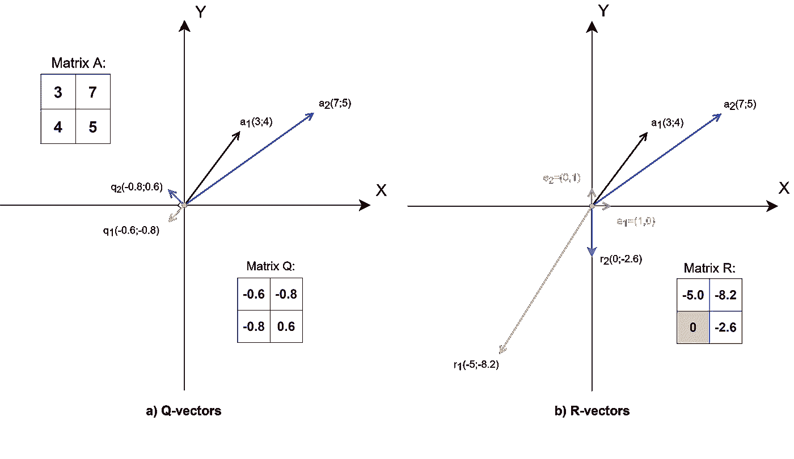

2 乘 2 平方实矩阵 A 的 QR 分解

第**列第一个**和第**列第二个**列向量**a₁(3；4)** 和**a₂(7；5)** 、(红色)和(藏青色)，如上图所示。

图 **a)** ，从左起，说明了列向量 **q₁(-0.6,-0.8)** 和 **q₂(-0.8,0.6)** 、(金色)和(蓝色)，作为矩阵𝘼分解的结果而获得。这些向量的长度必须总是等于 **|** 、𝙦 **|=1** ，因此是正交单位向量𝙦.

向量 **q₁** 和 **q₂** 彼此垂直，因此是正交的。在最简单的情况下，这些向量中的每一个都可以通过将𝘼中的每一个列向量旋转 90°角来获得。具体的旋转可以通过将平凡的雅可比旋转矩阵乘以多向量𝘼.中的每一列来完成

对应的向量**r₁(-5；——8.2)**，**r₂(0；-2.6)** 在𝙍，(金色)和(蓝色)，分别标绘在图 **b)** 中，从右侧开始。与多向量𝙌的列不同，这些向量不是正交的。如上所述，这些向量是作为𝙍中的每个列向量分别与希尔伯特环境空间ℋ中的每个子空间的相应单位基向量𝒆₁和𝒆₂(绿色)的标量乘法的结果而逐列获得的。

## 已知的 QR 分解方法

目前，至少有三种现有方法广泛用于计算实矩阵和复矩阵的 QR 分解:

*   **格拉姆-施密特正交化**
*   **户主的感想**
*   **吉文斯旋转**

上述每种方法都有自己的优点和缺点。例如，当用于复矩阵的 QR 分解时，Householder 反射通常非常复杂。反过来，Givens 旋转方法导致最终迭代次数的精度损失，并且在将其用于大型矩阵分解时效率低下。

在这个故事中，我们将讨论经典的 Gram-Schmidt 过程和 Rutishauser 算法。我们将以 Householder 反射法和 Givens 旋转法为例，仅用于评估目的，将这两种方法的复杂性与正在讨论的 Schwarz-Rutishauser 算法的复杂性进行比较。

在接下来的段落中，我们将讨论 Schwarz-Rutishauser 算法，它是 Gram-Schmidt 正交化过程中最成功的变体之一。

# 格拉姆-施密特正交化

Gram-Schmidt 过程于 50 年代中期提出，是用于实矩阵或复矩阵正交化的首批成功方法之一**【1，4，5，6】**。

这种方法广泛用于递归地寻找𝑨的正交矩阵𝑸，基于每个向量𝒂ₖ ∈ 𝑨，𝒌=𝟏的正交投影..𝒏到跨度矢量𝗾 **ᵢ** ∈ 𝙌(𝒌)、𝒊=𝟏..𝒌，这是众所周知的。每个新的正交向量𝙦 **ₖ** ∈ 𝙌被计算为投影的和，从相应的向量𝒂ₖ ∈ 𝑨.中减去它最后，通过使用上面的等式 **(1)** ，可以容易地获得作为𝑸's-transpose 和矩阵𝑨的乘积的上三角矩阵𝑹。

通过使用下面的等式**(2)**获得𝒂到𝒒的正交投影:

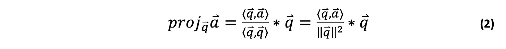

通常，整个 Gram-Schmidt 过程产生一个正交矩阵𝙌，可以表示为:

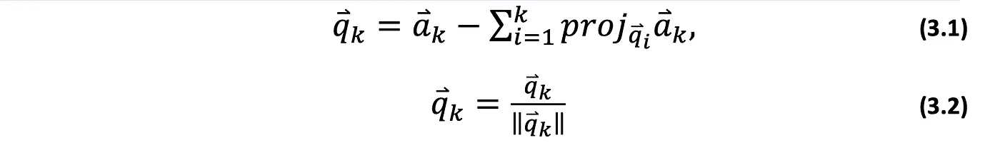

，或者:

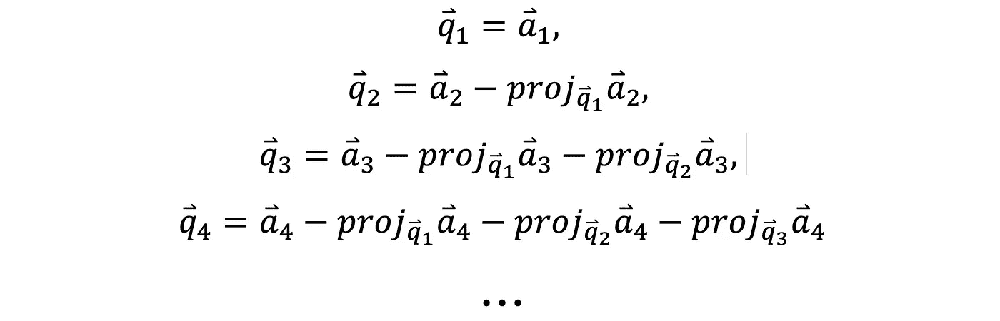

每个新的向量𝙦ₖ ∈ 𝙌最后通过除以它的欧几里德 norm|𝙦ₖ|.来归一化

下面的一段代码演示了经典的 Gram-Schmidt 过程的实现:

事实上，Gram-Schmidt 正交化过程比 Householder 反射或 Givens 旋转方法更直观简单。虽然，当应用于大规模矩阵的正交化时，它有许多缺点，例如数值不稳定，以及明显高于𝑶❨𝟐𝒎𝒏 ❩的高计算复杂度。此外，它需要基于确定矩阵的前导维数进行修改，以提供矩形 *m 乘 n* 矩阵正交化**【4】**的能力。

# Schwarz-Rutishauser 算法

您可能已经注意到，经典的 Gram-Schmidt 正交化是一种非常复杂的算法，它是由每个向量𝒂ₖ ∈ 𝑨到向量𝗾 **ᵢ** ∈ 𝙌(𝒌).的正交向量投影的计算引起的在这种情况下，正交投影算子的复杂度大约为𝑶❨𝟑𝒎❩，并且通常对 Gram-Schmidt 过程本身的整体复杂度有负面影响**【4】**。

显然，我们需要一种稍微不同的方法来进行𝑨的正交化，而不是计算𝒂ₖ-vectors 投影到𝙌(𝒌).上的倍数和

Schwarz-Rutishauser 算法是经典的 Gram-Schmidt 正交化过程的修改，由 H. R. Schwarz、H. Rutishauser 和 E. Stiefel 在他们的研究论文*“Numerik symmetrischer Matrizen”(Stuttgart，1968)***【6】**中提出。以下研究旨在降低现有基于 Gram-Schmidt 投影方法的复杂性，并提高其数值稳定性**【5】**。

Schwarz-Rutishauser 算法背后的主要思想是，与原始的 Gram-Schmidt 过程𝑶❨𝟐𝒎𝒏 ❩和 Householder 反射𝑶❨𝟐𝒎𝒏 -𝟬.相比，𝑨's 正交基计算复杂度可以大大降低𝟔𝒏 ❩方法**【5】**。

为了更好地理解 Schwarz-Rutishauser 算法，让我们从右边更仔细地看一下等式 **(2** )和 **(3.1)** ，如上图所示。

在计算𝒂's 在跨度𝙌(𝒌上的投影和时，我们必须将向量的标量积除以范数|𝙦ₖ|的平方，实际上是将乘积**【2】**归一化。然而，这是不必要的，因为每个向量𝗾 **ᵢ** ∈ 𝙌(𝒌)已经在之前的𝒌-th 算法步骤之一中被立即归一化。

据此，等式 **(3.1)** 可以通过从右侧的投影**【5】**的和中去除除以平方范数来简化:

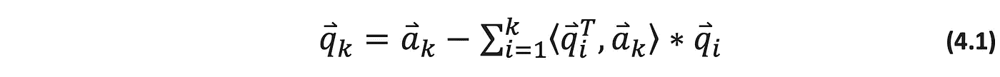

由于𝑹是𝑸's-transpose 和𝑨的内积，那么我们可以很容易地计算每个列向量𝒓ₖ的𝒊-th 元素为:

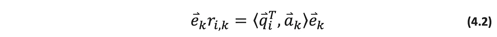

这里𝗾 **ᵢ** - 和𝒂ₖ-vectors 的标量积乘以希尔伯特环境空间ℋ**【2】**中对应平面的单位基矢𝙚ₖ。

最后，让我们将等式 **(4.2)** 代入 **(4.1)** ，这样我们就有了:

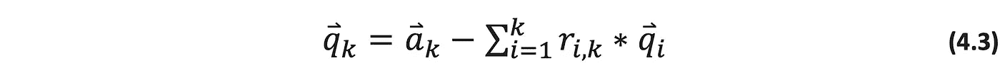

由于我们承认𝑸最初等于𝑨 ( 𝑸 =𝑨)，基于上述等式 **(4.2)** 和 **(4.3)** 的𝗾和𝒓的计算可以递归地进行**【5】**:

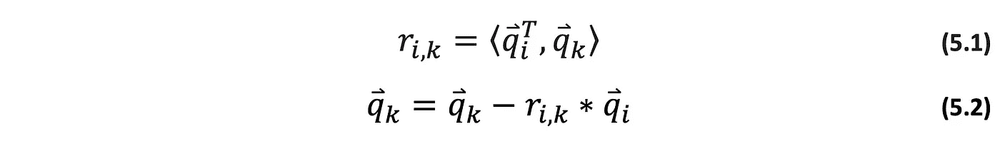

根据向量算术，为了得到每个新的𝒌-th 列𝙦ₖ ∈ 𝙌，我们从向量𝙦ₖ中减去向量𝗾 **ᵢ** ∈ 𝙌(𝒌)和𝒓ᵢₖ的乘积，这是向量的拒绝。让我们回忆一下，向量𝙦ₖ最初等于𝒂ₖ (𝙦ₖ=𝒂ₖ).这就是为什么求和算子最终可以从方程 **(4.3)** 中去掉。

除了𝙦ₖ，我们还需要计算𝑹的𝒓ₖₖ 𝒌-th 对角线元素，如范数|𝙦ₖ|:

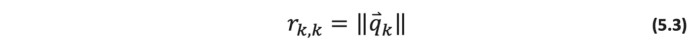

，然后，归一化新𝒌-th 列向量𝙦ₖ ∈ 𝙌，除以其范数，等于对角元素𝒓ₖₖ**【5】**。

最后，我们可以用公式表示 Schwarz-Rutishauser 算法:

1.  初始化矩阵𝙌，等于𝑨 (𝙌=𝑨)，𝑹为 **0s** 的矩阵；

2.对于每个𝒌-th 列向量，𝙦ₖ ∈ 𝙌，𝒌=𝟏..𝒏，请执行以下操作:

2.1.对于向量的跨度𝗾 **ᵢ** ∈ 𝙌(𝒌)、𝒊=𝟏..𝒌，这是众所周知的:

*   得到𝒌-th 列向量𝒓ₖ ∈ 𝑹的𝒊-th 元𝒓ᵢₖ，方程**(5.1)**；
*   更新𝒌-th 列向量𝙦ₖ ∈ 𝙌，方程**(5.2)**；

2.2.继续前面的步骤 2.1，对向量𝙦ₖ进行正交化，得到𝒌-th 列向量𝒓ₖ；

3.计算对角元素𝒓ₖₖ作为𝙦ₖ-vector's 范数𝒓ₖₖ=|𝙦ₖ|，方程**(5.3)**；

4.归一化𝒌-th 列向量𝙦ₖ ∈ 𝙌，除以其范数，等于上一步 3 的𝒓ₖₖ；

5.继续进行步骤 1-4 中执行的𝑨正交化，以计算𝑨'正交基𝙌和上三角矩阵𝑹；

6.一旦完成，从过程返回负的合成矩阵-𝙌和-𝑹；

与原始的 Gram-Schmidt 过程相比，Schwarz-Rutishauser 算法的实现非常简单。此外，它提供了就地计算𝑹和𝙌向量的能力，降低了算法的复杂性**【5】**。

下面列出了演示 Schwarz-Rutishauser 算法实现的一段代码:

# 数值的稳定性

在许多情况下，由于浮点算术溢出问题**【1】**导致的持续舍入误差，使用计算机获得的最高精度近似值在数值上是不稳定的。

本身，实矩阵或复矩阵分解的稳定性很大程度上取决于其元素的数值表示(实矩阵或复矩阵)以及它们的数量。

根据最佳实践，为了避免执行 QR 分解时显著的精度损失，建议使用 Python 和其他编程语言的各种现有多精度库(如 **mpmath** 或 **GMPY** )将实数或复数矩阵的元素表示为有理数。

# 复杂性

最后，让我们花点时间来看看 Schwarz-Rutishauser 算法的复杂性。在大多数情况下，与经典的 Gram-Schmidt 和 Householder 反射方法**s【4，5】**相比，它的复杂度评估为𝑶(𝙢𝙣)并且减少到至少两倍 **(2x)** 。此外，使用 Gram-Schmidt 和 Householder 方法的复矩阵的 QR 分解需要转置共轭的计算，这又大大增加了总体复杂度，至少增加了𝙣-times。

所有三种 QR 算法的复杂性如下表所示:

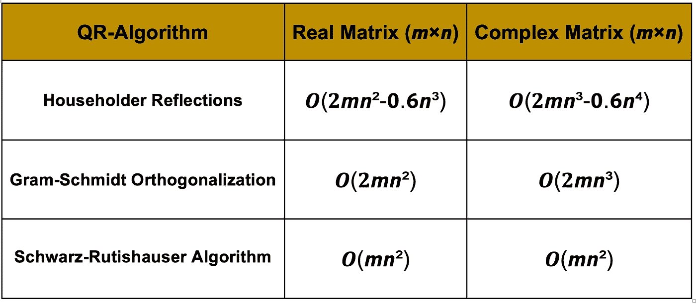

QR 算法计算复杂度

Schwarz-Rutishauser 算法的复杂度对于实矩阵或复矩阵 QR 分解的情况保持不变，因为以下算法不额外需要计算矩阵的复转置共轭，并且基于相同的正交化过程，应用于任何矩阵，而不管数据类型**【5】**。

Schwarz-Rutishauser 算法和其他现有 QR 算法的复杂性调查如下图所示:

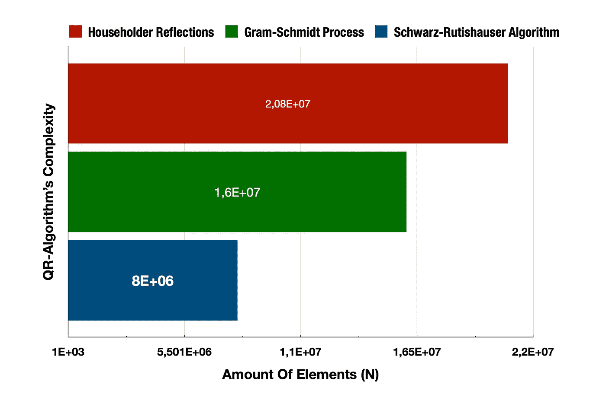

QR 算法复杂性综述

如您所见，与 Householder 反射(红色)相比，Schwarz-Rutishauser 算法(navy)的整体复杂度降低了近 61%，与经典的 Gram-Schmidt 正交化过程(绿色)相比，复杂度降低了 50%。

# 总之…

最后，正在讨论的 Schwarz-Rutishauser 算法在用于任意形状的大规模实数和复数矩阵的因式分解时是非常有效的，这些矩阵在每个维度上具有超过𝟏𝟎元素的大小。此外，它被认为具有更好的数值稳定性，对于并行运行因式分解过程是有吸引力的，可以在多节点计算集群中的多个 CPU 之间进行扩展。

与经典的 Gram-Schmidt 过程相比，Schwarz-Rutishauser 算法的总体复杂度仅为𝑶(𝙢𝙣，𝑶(𝒏)-times 更小，并且非常接近矩阵内积复杂度。

***Python 3.9 . x 和 NumPy 1.20.x 中的 QR 分解完整源代码项目可从我的 GitHub 资源库下载，网址为***[***https://github.com/arthurratz/qr_decomposition***](https://github.com/arthurratz/qr_decomposition)

# 参考

1.  [*“QR 分解”——来自维基百科，免费百科*](https://en.wikipedia.org/wiki/QR_decomposition)
2.  [*《投影(线性代数)》——来自维基百科，免费百科*](https://en.wikipedia.org/wiki/Projection_(linear_algebra)#:~:text=self%2Dadjoint).-,Orthogonal%20projections,%2C%20for%20every%20and%20in%20%2C%20.)
3.  [*“因式分解”——来自维基百科，免费百科*](https://en.wikipedia.org/wiki/Factorization#:~:text=In%20mathematics%2C%20factorization%20(or%20factorisation,objects%20of%20the%20same%20kind.)
4.  [*“ECE 133 a—应用数值计算(6。QR-因子分解)”，美国加州大学洛杉矶分校 L. Vandenberghe 教授，2019 年秋季*](http://www.seas.ucla.edu/~vandenbe/133A/lectures/qr.pdf)
5.  [*【QR 分解算法】作者 Walter Gander，Fuer Angewandte Mathematik eidgeneessische Technische Hochschule CH-8092 ZUERIC，1980 年 4 月*](https://people.inf.ethz.ch/gander/papers/qrneu.pdf)
6.  [*《Numerik symmetrischer Matrizen》，H. R. Schwarz、H. Rutishauser 和 E. Stiefel 著，斯图加特，1968 年*](http://www.sam.math.ethz.ch/~mhg/pub/mhg-published/Rutishauser-LoNM.pdf)
7.  [*“利用 QR 分解和无约束优化减少多旋翼飞机的振动”，Bechhoefer，Eric Robert，西蒙兹精密产品公司，美国专利 USP2009037512463，2005 年 2 月 16 日*](https://scienceon.kisti.re.kr/srch/selectPORSrchPatent.do?cn=USP2009037512463)
8.  [*《Netflix 奖与奇异值分解》，NJIT，cs 301-2021 春*](https://pantelis.github.io/cs301/docs/common/lectures/recommenders/netflix/)