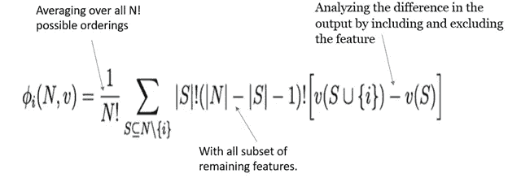
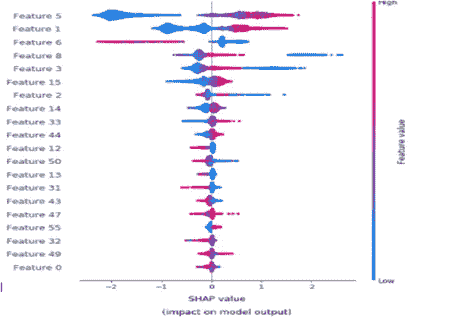
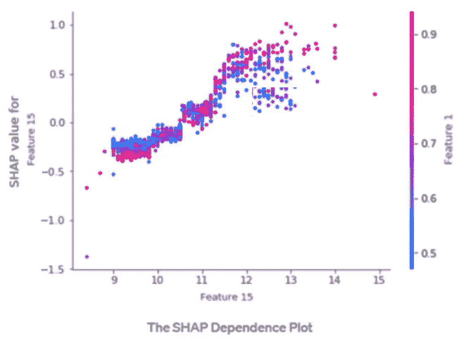
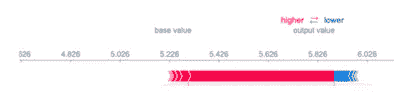

# SHAP 能引发风险分析的范式转变吗？

> 原文：<https://towardsdatascience.com/can-shap-trigger-a-paradigm-shift-in-risk-analytics-c01278e4dd77?source=collection_archive---------55----------------------->

## [意见](https://towardsdatascience.com/tagged/opinion)

## 可解释的人工智能不再是一个理论了！！

由 [Chandan Durgia](https://medium.com/u/25a92c29cc1?source=post_page-----c01278e4dd77--------------------------------) 和 [Prasun Biswas](https://medium.com/u/1454a5b0169f?source=post_page-----c01278e4dd77--------------------------------) 撰写

如果按照应用的多样性来排列经济理论，“博弈论”肯定会排在前百分之一。和其他理论一样，博弈论在解释和应用方面也有所发展。从“代理人将如何在考虑竞争对手观点的不同选项之间进行选择”的基本假设开始，到像“纳什均衡”(约翰·纳西— 1994 年)和“市场设计的稳定分配和实践”(沙普利和阿尔维姆·罗斯— 2012 年)这样的诺贝尔奖得主。

来自政治、游戏、营销、哲学等领域。博弈论有助于定义人们如何在与其他合作/竞争参与者互动的情况下做出更好的决定。

在我们深入研究之前，让我们先了解一下 Shapley 等人提出的问题。(此后称为沙普利)试图用博弈论来解决。简而言之，Shapley 设计了一个独特的解决方案(以下称为“定理”或“Shapley 定理”)来回答“给定一项‘工作’,当相关人员有不同或相似的目标时，奖励/成本的份额是多少”的问题。换句话说，对于一个有特定目标的游戏的玩家来说，回报/成本的边际贡献是多少。

可以利用该定理的一些有趣的问题陈述是:

1. [**机场问题**](https://en.wikipedia.org/wiki/Airport_problem#:~:text=In%20mathematics%20and%20especially%20game,Owen%20in%201973.) :每个代理人要为共同跑道付多少钱？

2.**出租车费用问题:**在拼车的情况下，每个乘客到底应该分摊多少费用？

3.将**总团队奖金**分配给团队成员的最佳方式是什么？:)(如果一个免费午餐者吃了你的信用卡，你是如此渴望得到它。)

该定理的使用案例非常广泛。

然而，令人着迷的是，即使在人工智能/机器学习(AI/ML)领域，这也留下了不可磨灭的痕迹。从建模的角度来看，Shapley 值有助于确定每个特征的“贡献”以及影响因变量的特征的“方向性”。

对于一个给定的价值模型，Shapley values 按照下面的等式在代理人之间分配报酬/成本:

从概念上来说，沙普利是相当直观的。对于给定的模型，特性的边际贡献计算如下:

通过包含和排除特征来分析输出的差异

求所有 N 的平均值！可能的订单

具有剩余特征所有子集。

所有这三个组成部分都在上面的公式中突出显示。

此外，这些 Shapley 值必须具有几个关键属性:

1.**相加:**Shapley 值的总和应为 100%。即，以总边际贡献的总和为 100%的方式在所有参与者之间划分贡献。

**2。** **单调性:**如果一个特定的特性有较高的贡献，那么它应该总是有较高的 Shapley 值/报酬。

从 Python 的角度来看,“shap”包用于计算 Shapley 值。此外，它还提供了 3 个关键图:

1.**概要图**:这个图有助于理解

a.每个特性的相对重要性:例如，在下面的摘要图中，特性 5 最重要，其他特性依次递减。

b.方向性:平均而言，特征的高/低值是否会增加/减少模型输出。例如，对于下图中的要素 1，蓝色/低值通常意味着模型输出的负 SHAP 值，反之亦然。

SHAP 摘要情节

2.**依赖关系图**:这提供了 SHAP 和变量值之间关系类型的视图，即关系是否单调、呈 U 形等。除此之外，它还提供与给定特征最相关的变量。在下图中，特征 15 具有单调关系，特征 1 与特征 15 强相关。

SHAP 依赖图

3.**力图**:这非常类似于常用的瀑布图，其中突出显示了每个特征的贡献，这导致了 SHAP 值从其基础值到输出值的变化。

原力图

已经相当详细地介绍了 SHAP，现在让我们来谈谈房间里的大象。

## 它会对垂直风险分析领域产生影响吗？

信用风险分析(监管)作为一个领域，在分析方法的使用方面受到了很大的限制。主要原因是金融风险法规要求的“模型的可解释性”。这些法规背后的想法是确保管理层清楚地理解模型和特征，并且模型特征不会遗漏任何风险驱动因素。可以理解，这对核心 AI/ML(黑盒)模型的使用是一个很大的障碍。如果我们要分解，这里的可解释性意味着:

1.了解模型中的特征/变量。

2.理解模型变量的“方向性”。

3.理解每个模型变量的“贡献”。

4.知道变量的参数(包括激活函数)。这基本上意味着知道这个等式。

在很长一段时间里，研究人员只能获得 AI/ML 模型中的功能名称(# 1-上面的列表)，但这些黑盒模型中的功能发生了什么仍然是未知的。虽然 Shapley 定理已经存在了相当一段时间，但只是在最近几年，Shapley 定理才被用来理解每个特征的“方向性”(上面列出的第 2 条)和“贡献”(上面列出的第 3 条)。考虑到这一点，剩下的唯一问题就是不知道这个等式(上面的第 4 条)。

尽管可解释性问题仍未完全解决，但从信用风险分析的角度来看，利用这个 Shapley 定理和导出的 Shapley 值可以开辟新的途径:

**1。** **可靠的挑战者模型(监管模型):**虽然部分银行一直使用 AI/ML 复杂模型作为挑战者模型。然而，建模者和管理层都不能充分依赖这些模型。这主要是因为在给定产品组合的情况下，无法保证在模型中，功能是否被赋予正确的权重，以及功能的标志/方向性是否直观。随着 Shapley 值的引入，现在建模人员和管理人员可以更加依赖模型，因为他们知道正确的特征被赋予了适当的重要性，并且这些特征的方向性也是正确的。

**2。** **挖掘正确的特征(监管模型):**在许多信贷组合中，通过特征工程来获得可靠的模型既困难又耗时。在这种情况下，建模者现在可以利用 AI/ML 复杂模型和 Shapley 值来理解因变量的主要驱动因素。一旦建模者对主要特征、它们的贡献水平和它们的方向性有了更好的理解，相同的特征可以用于非 AI/ML 方法中，以获得更有意义、可靠和敏感的模型。

3.**对非监管模型的影响:**AI/ML 在信用风险分析的另一个领域找到了自己的空间，那就是应用/行为/收款记分卡。尽管金融行业在这些案例中使用人工智能/人工智能模型已经有一段时间了，但是，围绕可解释性的关键问题仍然存在。例如，围绕申请记分卡，如果贷款被拒绝—一方面，客户希望知道贷款被拒绝的依据，另一方面，管理层希望了解拒绝客户的财务风险。因为 Shapley 值有助于理解每个特征的贡献和方向性，所以建模者更容易合理化模型产生的决策。

尽管如此，要让这些黑箱模型完全符合监管者的预期，还需要做更多的工作；然而，Shapley 值无疑有助于在提高 AI/ML 模型在风险分析领域的可接受性方面取得重大进展。

约翰·纳西曾经说过“我可以观察到博弈论在经济学中的应用非常多。一般来说，尽可能合理地研究数学是明智的，因为使用更多数学的经济学家比那些较少使用数学的经济学家更受尊敬。这就是趋势。”作为风险分析从业者，我们很高兴也很感激该理论找到了数学的道路，并因此创造了 Shapley values 这样的属性，这有可能在风险分析领域产生范式转变。

虽然还有很长的路要走，但是充满希望也无妨！！

*免责声明*:本文所表达的观点是作者以个人身份发表的观点，而非其各自雇主的观点。