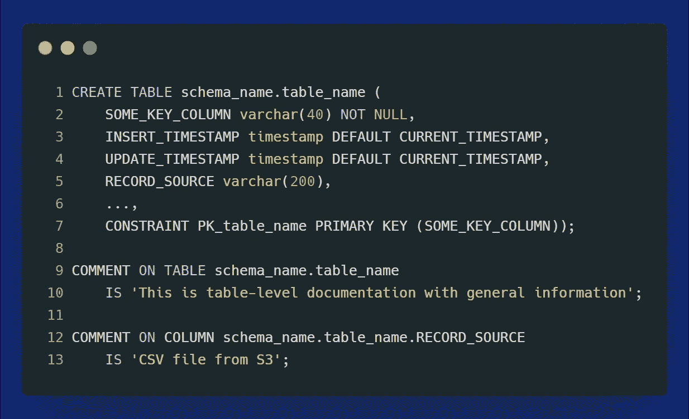
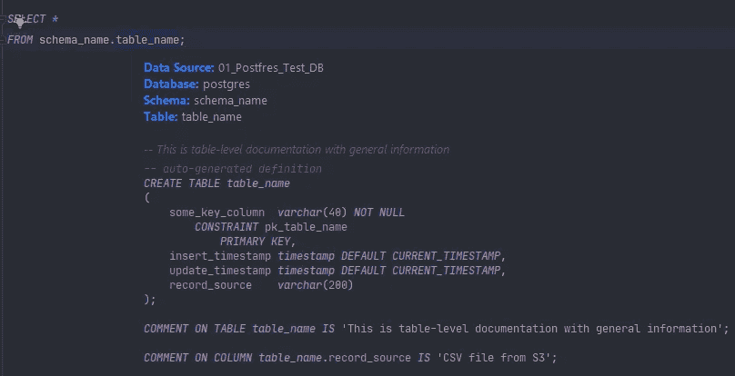

# “不要重复自己”不仅在软件工程中是有益的

> 原文：<https://towardsdatascience.com/can-we-apply-the-dry-principle-to-business-intelligence-68c4cfe25669?source=collection_archive---------34----------------------->

## 我们可以将 DRY 原理应用于商业智能吗？


照片由 [Pixabay](https://www.pexels.com/@pixabay?utm_content=attributionCopyText&utm_medium=referral&utm_source=pexels) 拍摄来自 [Pexels](https://www.pexels.com/photo/woman-holding-umbrella-268791/?utm_content=attributionCopyText&utm_medium=referral&utm_source=pexels) | [品牌内容披露](https://www.annageller.com/disclosure)

您是否遇到过在各种仪表板中反复应用相同查询的情况？还是几乎每份报告都在计算相同的 KPI？如果你的答案是肯定的，你并不孤单。业务用户通常只是简单地复制粘贴相同的查询、数据定义和 KPI 计算。但是有更好的方法。

# 知识重复的危险

大多数软件工程师从第一天起就被教导“干燥”原则:不要重复自己。这项原则规定:

> “每一项知识都必须在一个系统中有一个单一的、明确的、权威的表示”。— [务实的程序员](https://en.wikipedia.org/wiki/The_Pragmatic_Programmer)

尽管大多数数据和软件工程师知道如何编写枯燥的代码，但许多数据分析师和业务用户并没有意识到复制粘贴他们的查询和数据定义的危险。因此，我们经常在商业智能报告中结束，这些报告对 KPI 和业务逻辑有不同的表示。为了使论点更加具体，下面是分析工作负载中代码重复的一些**后果:**

*   如果你的代码需要修改，你需要在 X 个不同的地方进行修改。
*   如果一个“副本”被修改，而另一个没有被修改，那么就有定义冲突的风险。
*   最后，没有人知道什么是真实的唯一来源，因为任何时候你使用相同的 KPI，它都是以不同的方式计算或定义的。
*   如果您在一个地方向重复的代码、查询、代码或数据定义添加文档，那么在另一个地方就缺少该文档，从而导致进一步的不一致。

我记得当我的团队讨论数据字典的最佳位置时。其中一个建议是使用 Confluence ( *或共享电子表格*)来实现这个目的。这个建议有什么问题？它违反了 DRY 原则，因为它本身会导致重复:一个定义在数据库中，另一个在外部文档中。**手动创建的数据字典永远不会保持最新**——不要相信任何人的说法。

一个潜在的更好的解决方案是通过使用代码注释直接在数据库(*或数据仓库*)中应用所有数据定义。下面是它可能的样子:



在数据库中直接应用数据定义的示例—作者图片

如今，许多 SQL 客户端都可以轻松查看作为代码注释实现的数据字典。例如，当使用 Datagrip 时，我们可以简单地使用 Ctrl + Q ( *或 Mac 上的 command+Q*)来查看完整的表格定义，包括表格和列注释。



在 Datagrip 中显示数据字典-按作者显示图像

当然，您可能有不止一个数据仓库。如果您使用数据湖，您最有可能利用一些集中式元数据存储库，比如 AWS Glue，它提供了数据字典功能。不管你选择什么样的实现，重要的是在遵循 DRY 原则的同时，为你的用例考虑**正确的方法。**

***边注:*** *如果您对如何利用 AWS Glue 元数据进行数据发现感兴趣，我构建了一个数据发现 API 的简单 MVP*[](/how-i-built-a-data-discovery-api-for-aws-data-lake-5d2813f794bf)**。**

# *我们如何应用软件工程原理来减轻重复的问题？*

*这个问题的一个可能的解决方案是利用版本控制系统作为用于报告的所有查询和 KPI 定义的单一真实来源。您可以将代码推送到 Git 存储库，并确保在 BI 工具中应用这些代码之前，遵循 Git 流程、代码评审和所有良好的工程实践。然而，这样，我们仍然违反了 DRY 原则，因为我们是将代码从版本控制复制粘贴到 BI 工具。此外，这种方法容易出现人为错误:每当我们在 BI 工具中手动更改某些东西，而不是在 Git 存储库中，我们就会陷入我们试图使用 Git 解决的同样的问题。如果一些查询或 KPI 从未被提交会怎么样？*

# *有没有更好的方法？*

*另一个可能的解决方案是利用理解这个问题的 BI 工具。其中之一就是 GoodData。该平台允许构建可跨仪表板和分析应用程序重用的小组件。允许这一切发生的关键组件是[语义数据模型](https://www.gooddata.com/blog/how-build-semantic-layers-massive-scale-analytics/?utm_source=mediumcom&utm_medium=referral&utm_campaign=gdcn&utm_content=anna-dry)。一旦定义了数据的结构和来源，就可以开始创建干巴巴的见解了。任何类型的指标、KPI、可视化或表格都可以保存并在多个仪表板中重用。此外，如果您的任何 KPI 达到关键阈值，您可以[添加电子邮件提醒](https://help.gooddata.com/doc/enterprise/en/dashboards-and-insights/kpi-dashboards/add-an-alert-to-a-kpi?utm_source=mediumcom&utm_medium=referral&utm_campaign=gdcn&utm_content=anna-dry)。*

*下面的短片演示了如何开始构建 DRY 兼容的 KPI 和可视化。只要您使用“另存为新的”选项，您将创建可以跨多个仪表板重用的新见解。*

# *平台怎么入门？*

*GoodData 作为一个分析平台已经存在很长时间了。但最近以来，有一个[云原生选项](https://www.gooddata.com/developers/cloud-native-community-edition/?utm_source=mediumcom&utm_medium=referral&utm_campaign=gdcn&utm_content=anna-dry)，允许您使用打包到一个[单 Docker 容器](https://hub.docker.com/r/gooddata/gooddata-cn-ce?utm_source=mediumcom&utm_medium=referral&utm_campaign=gdcn&utm_content=anna-dry)中的整个分析平台。您可以使用以下命令在本地计算机上运行它:*

```
*docker run --name gooddata -p 3000:3000 -p 5432:5432 \
  -e LICENSE_AND_PRIVACY_POLICY_ACCEPTED=YES gooddata/gooddata-cn-ce:latest*
```

*然后，您可以使用[**http://localhost:3000/**](http://localhost:3000/)在浏览器中查看 UI。您必须通过电子邮件:`demo@example.com`和密码:`demo123`登录。*

*关于更详细的概述，在本文中，您可以找到逐步说明，展示如何构建语义数据模型、创建洞察和构建强大的可视化。*

*对于 Kubernetes 部署，请看一下[掌舵图](https://www.gooddata.com/developers/cloud-native/#plans?utm_source=mediumcom&utm_medium=referral&utm_campaign=gdcn&utm_content=anna-dry),它包含了扩展生产环境所需的一切。*

# *结论*

*在本文中，我们研究了如何避免分析报告中的重复。我们研究了为什么重复的 KPI 定义是危险的，以及我们如何防止它们。**感谢您的阅读！***