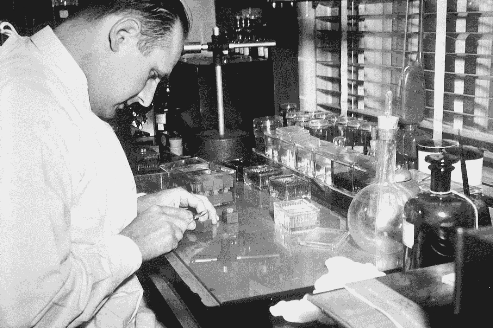
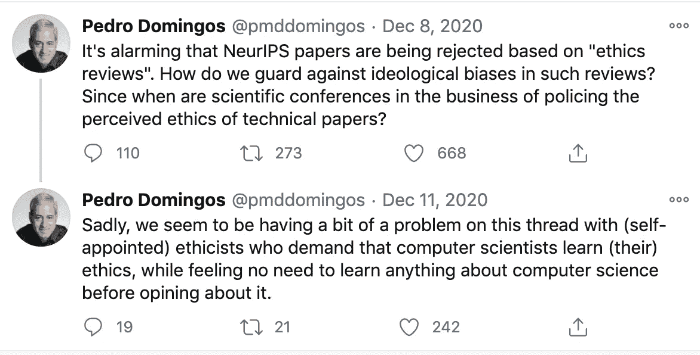
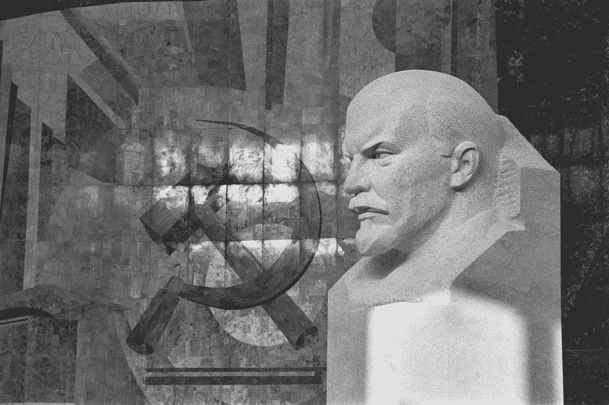

# 我们能沟通数据科学的“两种文化”吗？

> 原文：<https://towardsdatascience.com/can-we-bridge-the-two-cultures-of-data-science-710f0109f7b9?source=collection_archive---------26----------------------->

## 事实和价值在科学中的作用，Twitter 战争，以及数据科学如何因道德声明而面临分裂成两种文化的风险

[国家癌症研究所](https://unsplash.com/@nci?utm_source=medium&utm_medium=referral)在 [Unsplash](https://unsplash.com?utm_source=medium&utm_medium=referral) 上拍摄的照片

在他 1917 年的演讲*科学是一种职业*中，德国社会学家马克斯·韦伯认为事实问题与价值问题是分开的。给定某些预先指定的 ***目的*** ，科学的任务就是找到实现它们的最佳 ***手段*** 。但是问要达到什么目的是一个价值问题，只能用哲学或宗教来回答。在这一点上，韦伯并不孤单。杰出的科学家和数学家，如亨利·庞加莱，对科学和价值观的不可通约性持类似观点。这篇文章检验了将这个想法扩展到数据科学的(不)合理性。

新兴的数据科学领域面临着分裂成两个对立派别的风险，这两个派别基于相互冲突的科学哲学。一个支持——含蓄地或明确地——事实是并且应该与价值(本身就是价值的一种表达)分开的观点。).让我们称他们为*原子论者*。另一个提出了一个观点——含蓄地或明确地——事实和价值是而且应该是不可分割的。让我们称他们为*整体主义者*。

问题是这样的:当思想领袖和知名学者坚持数据科学的原子主义哲学时，作为 T21 科学的数据科学有可能将自己与其他学科和整个社会隔离开来。由于在与社会相关的问题上缺乏经验，下一代数据科学家将接受培训，专注于与业务需求相关的应用和技术(例如广告优化)，而不是社会公益。

如果原子论占了上风，数据科学就有被公众以今天看待核能的方式看待的风险:可能非常有用，但最终太危险而不实用。面向公众的机器学习应用甚至可能会出现类似于 [NIMBY](https://en.wikipedia.org/wiki/NIMBY) 运动的东西。为了克服这一点，数据科学领域可能会借鉴和学习定性研究的关键原则，我在最后回顾了这些原则。

## 数据科学家是价值中立的工具制造者

1959 年，在冷战最激烈的时候，随着美国军工复合体的建立，英国科学家和作家 C.P .斯诺描述了实践科学家的一个普遍观点。当被问及科学家在社会中的作用时，斯诺想象着科学家说:

> 我们生产工具。我们就此打住。应该由你们——世界上的其他人、政治家们——来决定如何使用这些工具。这些工具可能被用于我们大多数人认为不好的目的。如果是这样，我们很抱歉。但是作为科学家，这不关我们的事。

我们可以想象 2021 年的数据科学家会说类似的话:

> 我们生产最大化点击量的算法工具。我们就此打住(在非专业人士无法理解的技术期刊上发表了我们的结果之后)。应该由你们——世界上的其他人——来决定如何使用算法工具来最大化点击量。最大化点击率的算法工具可能被用于我们大多数人认为不好的目的(如政治极化、激进化或年轻人的社交媒体成瘾)。如果是这样，我们很抱歉。但是作为数据科学家，这不关我们的事。

## 分裂事实和价值:学科分歧

事实和价值是独立的——并且应该保持独立——这一观点在学术界由来已久，特别是在“硬科学”领域:物理、工程、计算机科学和数学。观点大致是这样的。

用托马斯·库恩的话说，在“正常科学”时期工作的科学家仅仅是一个“解谜者”科学家作为一个理性的、有能力的优化者，对其研究领域所定义的预先指定的目标函数进行优化。她按照更广泛的科学家群体给她的范式工作，拥有自己的本体论、认识论和方法论。但是一个科学范式是否也需要一个 ***价值论*** :一个证明为什么某些方法比其他方法更好，或者为什么某种分类法比另一种更好的价值体系？还是这样的元问题毫无意义，超出了科学本身的范围？

库恩把典型的科学家想象成一个由预先建立的科学家群体挑选出来的拼图拼在一起的人。这个谜题是一个世界观的隐喻，这个世界观通知了范式(谜题本身)内的所有方法和证据解释。马库斯·温克勒在 [Unsplash](https://unsplash.com?utm_source=medium&utm_medium=referral) 上拍摄的照片

至少在 20 世纪 40 年代和 50 年代的一个短暂时期，在目睹了原子弹的破坏力之后，事实-价值的区分似乎受到了杰出科学家的攻击。罗伯特·奥本海默、阿尔伯特·爱因斯坦和诺伯特·维纳对他们在创造这种装置中的科学作用表达了道德关切。但是，无价值科学的理念，以及相应的价值中立的科学家，一直坚持到今天，特别是在学生很少或根本没有接触到人文科学、社会学和哲学的学术领域。

## 官僚科学和灵魂的划分

事实与价值的区别是西方思维更深层症状的表现。韦伯，斯诺想象中的科学家，以及西蒙的观点反映了现代自由民主国家中更广泛的官僚化趋势。官僚化描述了这样一个社会，在这个社会中，以效率和技术能力的名义，脑力、道德和体力劳动的分工越来越细分。

19 世纪晚期，后现代主义的梅毒祖父弗里德里希·尼采，著名地宣布*上帝已死。* 指导人类目标并赋予公共生活意义的传统价值来源不再可行。市场的经济逻辑取代了文化和宗教价值观，并消除了目的论、价值或目标的问题。效用的概念取代了道德的问题。宇宙中可观察到的现象只能用遵循普遍自然法则的相同粒子的随机碰撞来解释。

卡尔·马克思谴责这一工业化和全球化进程，声称这导致了异化。对于社会学家埃米尔·杜尔凯姆来说，这个过程导致了失范。马克思认为西方工业化的新兴市场意识形态使人类脱离了他们作为社会性、创造性和表达性的本质。当然，马克思借用了黑格尔对科学和人类理性的目的论观点。尽管他坚持事实和价值之间不可逾越的鸿沟，韦伯悲叹这种狭隘和放弃技术能力的道德责任的趋势是“ ***”灵魂的分隔*** 如果没有航向修正，学术数据科学将会继续这一趋势。

[拉尔夫·沃尔多·爱默生](https://en.wikipedia.org/wiki/Ralph_Waldo_Emerson)在其经典的 1837 年演讲中总结了这种学术的条块化过程，[美国学者 :](http://digitalemerson.wsulibs.wsu.edu/exhibits/show/text/the-american-scholar)

> …人不是农民、教授或工程师，但他是一切。人是牧师、学者、政治家、制片人和士兵。在分裂的或社会的状态下，这些职能被分配给个人，每个人的目标是做好他份内的共同工作，而其他人则各司其职。社会的状态是这样的:社会成员遭受了躯干截肢，并趾高气扬地面对如此多的行走的怪物——一个好手指、一个脖子、一个胃、一个肘，但从来没有一个人。

尽管马克思、爱默生、斯诺和其他人提出了这些批评，但这种更加整体化的科学哲学的支持者可能会根据其在技术应用方面的实际成功来捍卫其有效性。毕竟，看看我们已经走了多远！如果这些技术被限制在研究型大学的大厅里，这可能是一个合理的论点。但 AI/ML 现在是以无数方式影响我们日常生活的商业化技术，从在线购物和信用评分，到算法交易，警务，假释决定和判决，驾驶，在线约会和社交，以及越来越多的军事应用。

> 是时候接受对自己创造的应用和效果的责任了。

## 自然主义谬误？

等等，但是你不是想从和*中推导出一个*应该是*吗？你不就是在描述这些技术是如何使用的吗，然后试图宣称，这个*描述*暗示或需要一个*处方*——这些技术*应该如何构建*。是的，我是。事实确实会影响价值观，反之亦然:价值观会影响事实。*

枪支死亡人数应告知枪支政策(年龄限制、安全锁、彻底禁止)，健康结果数据应告知吸烟和营养政策，飞机失事数据应告知飞机安全政策(更好的自动驾驶仪、飞行前清单)，致命火灾应告知建筑设计(所需的紧急出口)，车辆碰撞数据应告知汽车设计(例如安全带、摩托车头盔、光滑的仪表板和方向盘，感谢[拉尔夫·纳德](https://en.wikipedia.org/wiki/Ralph_Nader)！).也许更有争议的是，关于人类福祉的实证社会科学、心理学和神经科学的发现应该为公共政策提供信息，而不是藏在只有少数人才能阅读的神秘学术期刊中。

不了解事实，我们甚至无法开始围绕什么是重要的保护来形成我们的价值观。相反，我们的价值观引导我们关注相关事实:如果我们不重视人的生命，我们就不会首先收集枪支死亡统计数据或飞机失事信息。伊曼纽尔·康德曾经说过类似的话:*没有内容的思想是空洞的，没有概念的直觉是盲目的。*

照片由[🇨🇭·克劳迪奥·施瓦茨| @purzlbaum](https://unsplash.com/@purzlbaum?utm_source=medium&utm_medium=referral) 在 [Unsplash](https://unsplash.com?utm_source=medium&utm_medium=referral) 上拍摄

## 数据科学中的文化战争:Twitter 和 NeurIPS

鉴于 AI/ML 社区最近发生的两起事件，上面概述的哲学思想值得再次审视。第一个是关于华盛顿大学教授 Pedro Domingos 在 Twitter 上抱怨大会要求的新 NeurIPS 道德影响声明后引发的 Twitter 战争。第二件事，当然是谷歌解雇蒂姆尼特·格布鲁。

我关注多明戈斯，因为他关于科学和伦理的观点很可能被 AI/ML 的许多人所认同。见[几位 AI/ML 研究者签名的公开信](https://researchers.one/articles/20.12.00004)。

多明戈斯在 Twitter 上对 NeurIPS 要求道德影响声明的回应，引发了一场巨大的 Twitter 战争。

最终，多明戈斯的评论导致他在 AI/ML 伦理社区的 Twitter 上受到许多人的攻击，“对话”迅速转移。

学术数据科学中文化战争的一个片段。[https://twitter.com/pmddomingos/status/1337615171166998529](https://twitter.com/pmddomingos/status/1337615171166998529)

## 我们需要谈论科学和价值观

在这个特殊的问题上，我不同意多明戈斯的观点，但我确实认为他提出了一个必须解决的有效观点，而不是诉诸人身攻击或情绪驱动的呼吁来“取消”他和他对数据科学的贡献。他的评论应该被仔细考虑，因为否则数据科学有分裂成两种文化的风险:一种是价值问题不可回答且重要的(原子论者阵营)，另一种是价值问题可回答且重要的(整体论者阵营)。

为了描述下面的争论范围，让我先给出一个我所说的数据科学家的大致工作定义。我指的是这样一个人，他的工作职责包括产生新的、*系统的、可概括的知识、*通常以在同行评审期刊上发表研究文章的形式出现*。*我冒昧地猜测，很少有人没有经过博士水平的培训就能够在同行评审会议(如 NeurIPS)或期刊(如《机器学习研究杂志》( JMLR ))上发表文章。

## “无价值”科学的现代理念从何而来？

根据科学哲学家[休·莱西](https://philpeople.org/profiles/hugh-lacey)的说法，无价值科学的概念至少可以追溯到[弗朗西斯·培根](https://en.wikipedia.org/wiki/Francis_Bacon)和伽利略的归纳经验主义。就培根而言，基于感觉的经验主义者警告我们不要盲目地交出我们先天认知偏见或“心灵偶像”的钥匙，而伽利略则喋喋不休地说自然事实是如何“对我们的愿望充耳不闻，无法抗拒”。

实验和干预自然是经验主义者工具箱中的关键工具。越来越多的感觉数据的积累(当然是通过仪器的改进，如显微镜和望远镜等等)成为科学进步的模式。我们在启蒙运动对分类法和百科全书的痴迷中看到了这种死记硬背的数据收集和分类的倾向。今天，ML 延续了经验主义的传统，用“大数据”取代了“感觉数据”。

## 逻辑实证主义&价值自由理想的历史

培根和伽利略的经验主义将在 20 世纪以逻辑经验主义(或逻辑实证主义)的名义复兴。由哲学家和逻辑学家鲁道夫·卡尔纳普领导的逻辑实证主义者试图系统地将科学的基础建立在逻辑上。

哲学无私地将自己定位为科学女王，而数学是科学之王。哲学家们剥离了“特殊”科学(即物理学、经济学、社会科学等)的普通语言主张。)转化为符号逻辑的统一语言，其结构反映了与现实的一致性。

任何不符合这种“图景”的东西，比如形而上学或伦理价值观，都被认为是无意义的——毕竟，在现实世界中，没有任何东西可以让伦理价值观“映射”到，独立于人类的存在。实证主义者声称，即使承认这种映射的存在，它们也永远无法通过实证调查来验证或确认。

因此，科学(拉丁文 *Scientia* ，意为*知识*)在于提炼这种有限但严格的图景，从而在极限中并通过实证科学的方法，它将最终反映自然本身，使“表现”自然的需要变得多余。一旦根据它的公理被揭露和组织，符号逻辑的运算就可以被应用，新的、可检验的假设就可以得到经验的证实，所有科学知识的不容置疑的基础就可以得到保证。至少这是维也纳圈子的梦想。

哲学家和逻辑学家[希拉里·普特南](https://en.wikipedia.org/wiki/Hilary_Putnam)在他 1983 年的文章[中解释了客观性和科学/伦理的区别](http://citeseerx.ist.psu.edu/viewdoc/download;jsessionid=E5B25249AAF08C4D86098BE02F5D26C8?doi=10.1.1.642.7638&rep=rep1&type=pdf)这种科学哲学是如何迅速传播到其他喜欢公理化理论模型的领域(如经济学)的:

> 逻辑实证主义者以一种非常简单的方式为尖锐的事实-价值二分法辩护:他们说，科学陈述(在逻辑和纯数学之外)是“经验可验证的”，而价值判断是“不可验证的”。这一论点继续对经济学家(更不用说外行人)具有广泛的吸引力，尽管多年来它一直被哲学家视为天真。

价值观必须指导科学，但我们必须通过自由、公正和透明的辩论来防范教条主义，讨论这些价值观的理由和合理性。照片由[史蒂夫·哈维](https://unsplash.com/@trommelkopf?utm_source=medium&utm_medium=referral)在 [Unsplash](https://unsplash.com?utm_source=medium&utm_medium=referral) 上拍摄

## 价值导向的科学？谨防教条主义

尽管言过其实，多明戈斯的评论并非毫无根据。有很好的理由对将伦理和社会价值作为决定什么算作科学研究的标准持怀疑态度。

众所周知，苏联科学受到其对马克思主义哲学的解释的影响。任何与苏联对辩证唯物主义的解释不一致的东西都会受到怀疑。同样，达尔文进化论一度被李森科反对遗传学的运动所掩盖。当然，我们不能忘记伽利略是如何在天主教会的宗教裁判下被迫放弃对哥白尼学说的支持的。这些都是盲从教条主义阻碍科学进步的真实例子。

但是教条主义也走了另一条路。通过宣称其明显的“无价值”本质，“科学”被用来为殖民主义、奴隶制、种族灭绝甚至世界大战辩护。种族的概念本身是随着现代科学的制度和实践而出现的，根据假定的表型和基因型标记，种族的等级制度和人的不同种族群体的分类(*颅相学*)有人知道吗？).培根以及后来的弗朗西斯·高尔顿和他的学生卡尔·皮尔逊推广的“无理论”归纳科学的思想被用于[支持种族主义和优生学政策](https://pubmed.ncbi.nlm.nih.gov/22164927/)，包括对所谓的“退化物种”进行强制阉割和绝育

如果没有伦理来指导科学，纳粹人体实验、苏联毒药实验室、日本在中国囚犯身上进行的人体实验、美国关于原子辐射对其士兵的影响的实验以及塔斯基吉梅毒实验可能仍然被视为可以接受，以及无数其他违反我们今天所珍视的基本人权的行为。事实上，我们今天拥有这些权利*是因为*我们知道在表面上追求无价值的“科学”中一些人愿意对其他人做什么

对于那些进行这些“科学”实验的人来说，他们的科学判断当然不是基于虚无缥缈的“价值观”，而是简单明了的自然事实，对任何愿意仔细观察的人来说都是不言而喻的。对他们来说，科学真的是没有价值的。正如伽利略所说，自然的事实“对我们的愿望充耳不闻，无法抗拒。”大自然本身只是在等级尺度上创造了不同的人类种族:他们是“自然种类”，是通过在大自然的关节处雕刻而发现的。

你真的认为他们的科学是无价值的吗，或者你认为他们只是被自己的偏见和当时的流行信仰蒙蔽了双眼？你是否认为，那些认为奴隶制在道德上是错误的人被认为是“有偏见的”，通过他们的道德信仰和价值观来看待这个世界？

## AI/ML 出版物中道德影响声明的好处

如果多明戈斯的“原子主义者”阵营失败，并且在人工智能/人工智能研究出版物上包含伦理声明的趋势继续下去，这将如何影响研究和整个社会？我在下面概述了一些潜在的影响。

道德影响声明有助于:

1.  鼓励 ML 研究人员进行广泛和全面的思考，而不是狭隘和原子式的思考。这可以打破跨学科的学术壁垒和目前将研究人员隔离在基于 ML 的技术和应用的公共辩论之外的微观领域。如果公众对人工智能/人工智能的理解仅仅基于网飞的*社会困境*，那不是一个好的迹象。
2.  减少不相关的、有害的研究和浪费数学天赋的机会。 [杰夫·哈默巴赫尔](https://www.bloomberg.com/news/articles/2011-04-14/this-tech-bubble-is-different)，脸书第一批数据科学家之一，*曾经说过，“我们这一代最聪明的人都在想如何让人们点击广告……真糟糕。”*如果很明显某些技术正不断被用于有害的目的(侵蚀个人自主和民主，增加自杀和抑郁等)。)，为什么还要继续在他们身上投入研究资金、时间和学术培训呢？如果年轻的数据科学家利用他们的编程和统计知识在物理、生物或疫苗试验设计方面取得进展，而不是广告投放优化，会怎么样？从稍微不同的角度看辛西娅·鲁丁关于 ML 内爆的视频。
3.  **促进跨学科合作。为什么不包括一个哲学家来帮助想象你的算法的伦理影响？谁知道呢，通过借鉴其他领域的想法，这甚至可以带来新的方法和视角。虽然我不期望人工智能研究人员一夜之间变成亚里士多德、康德和边沁，但如果他们至少尝试与人文学科和相关学科的思想打交道，社会会变得更好。**
4.  **提高公众利益相关方的参与度。**去找各种社会利益相关者，用简单明了的语言解释你的算法是做什么的，它是如何工作的，并问他们它会如何影响他们。你的祖母会关心脸书的新闻提要中出现了哪些新闻吗？美国最近的政治暴力凸显了理解算法如何通过社交网络传播虚假信息的重要性。通过包括伦理声明，学术 ML 研究对于外行和关心的公民来说变得更加容易和重要。
5.  **激发新的** [**数据科学造福社会**](https://www.dssgfellowship.org/) **项目和关于社会公益的讨论。在这里，来自哲学家约翰·杜威和尤尔根·哈贝马斯的观点可以为发展公共辩论和言论自由的民主原则提供有益的基础——这些原则建立在个人权利的基础上——可以用来促进公开和公平的讨论，讨论追求哪种善以及为什么追求善，而不诉诸于刻薄的谩骂。**

## 数据科学能从定性研究中学到什么

数据科学可以从更具包容性的研究范围中受益，这些研究范围同等重视事实和价值。这样做需要明确承认人类意识和主体性在科学知识生产中的作用。 ***研究员是仪器*** *，*也是。如果人工智能/人工智能研究要真正拥抱伦理，那么过时的实证主义科学观就不再站得住脚了，因为它从一个无处不在的视角呈现“事实”*。让我们更清楚我们的工作可能会促进谁的观点、利益和公共政策。*

*下面是一些定性研究数据的关键方面，科学家可能会用它们来思考自己的研究(改编自[莎拉·j·特雷西](https://journals.sagepub.com/doi/10.1177/1077800410383121))。*

****真实研究:*** 你希望将各种分类算法、推荐系统、可解释性或数据收集方法的哪些改进和改变应用于你自己、你的家人和朋友或你的社区？就说服性技术而言，你自己会接受这样的说服吗？你愿意在此基础上制定社会政策或立法吗？作为公共政策，你个人愿意推荐你的工作成果吗？*

****自反性:*** 鱼没有意识到自己生活在水中，然而水影响着它们的一切经历。我的偏见和动机是什么？作为一名数据科学家，我的优势和劣势是什么？对于这类问题，哪些方法和模型的效果更好或更差？背后的假设是什么？将同样的假设用于模拟不知名的、相同的物理粒子，应用到有希望、梦想和欲望的个人、自我意识的人身上，有意义吗？行为被模仿的人会同意你对她的行为的假设吗？*

****参与式设计*** :最终用户如何参与你的研究，对你的最终产品提出问题或给予反馈？评估您的算法时使用了谁的个人数据，他们对算法的预期用途和对他们的影响有什么看法？这已经是人机交互研究中的一个新兴领域，但仍然是学术数据科学中的一个利基领域。*

****伦理:*** 定性研究将伦理问题置于前沿和中心，直到现在 AI/ML 社区才认识到这样做的类似需要。 [Abeba Birhane](https://abebabirhane.wordpress.com/about/) 和 Fred Cummins 为数据科学家撰写了一篇关于关系伦理的优秀论文，名为[算法不公正:走向关系伦理](https://arxiv.org/abs/1912.07376)。*

*为整体主义干杯。*