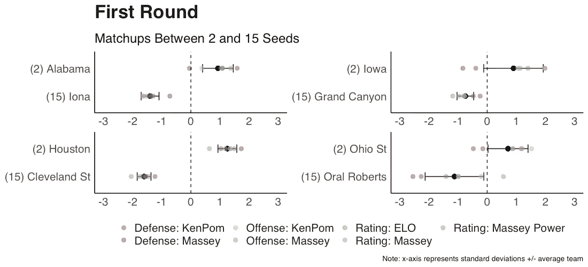
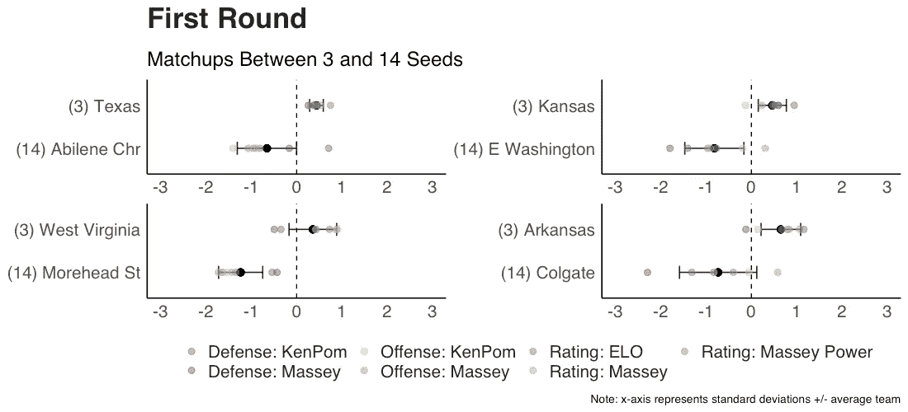
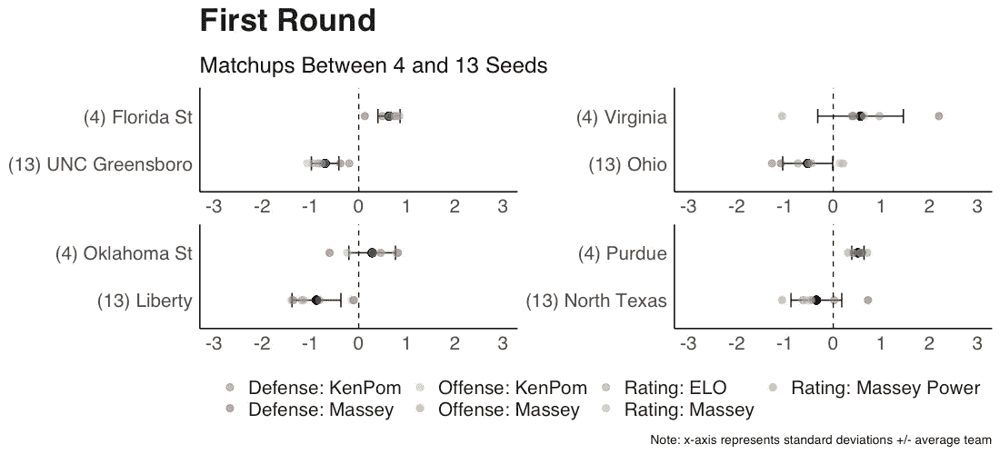
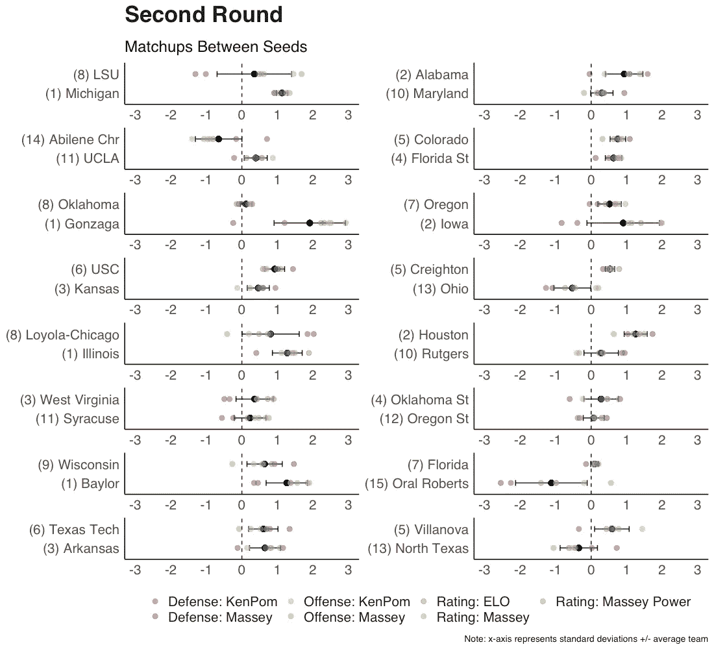

# 我们能在事情发生前看到它吗？

> 原文：<https://towardsdatascience.com/can-we-see-an-upset-before-it-happens-predicting-the-madness-of-march-b16e89d972ec?source=collection_archive---------22----------------------->

## 预测三月的疯狂

图片由[Izuddin Helmi Adnan(@ Izuddin Helmi)| Unsplash 图片社区](https://unsplash.com/@izuddinhelmi)

你以前见过。一个拥有高种子的球队在进攻和防守上打了一场坚实的比赛，击败了一个每个人都认为肯定会赢的低种子队。你的选择被破坏，灰姑娘继续前进。谁能预料到这种不安呢？也许你，明年，在这篇文章中学习了一种观察预测模型内部的新方法之后。

互联网上充满了对锦标赛的预测，给你一个队击败另一个队的预期概率。他们会告诉你他们运行的模拟，为模型提供的巨大数据集，以及他们模型的复杂性。但是每场比赛他们只给你一个概率。这种简单性很好，但会产生误导。这也是许多使用这些概率来选择赢家的括号的垮台。

从模型中得到的概率是单点估计。它本身并没有给出任何关于模型对预测的置信度的信息。如果不了解我们对估计有多大的信心，我们就无法知道我们对模型很好地模拟了不确定性有多大的把握。

> 在统计学中，点估计是可怕的东西，没有紧密的置信区间。

我认为解决的办法是在这些模型中寻找不确定性，并找到一种可视化的方法。最先进的模型可能包含深度学习算法或贝叶斯方法，但在它们的幻想罩下，它们都倾向于依赖相同的基本输入:对一支球队的进攻效率、防守效率和整体实力的估计。

模型使用不同的算法(数学)将这些参数与结果(即获胜)相匹配，但最终，他们试图做的是估计每个团队的真实实力之间的差异。我相信我已经想到了一个简单的方法来可视化这种差异，这也给了我们一个关于我们经常遇到的点估计的确定性的估计。所有这些都是利用频率统计进行简单的数学运算。

# 一种新模式——专注于可视化差异

为了直观地评估一个团队的真实实力，我收集了七个变量，用来评估代表一个团队真实能力的不同参数。其中四个，两个用于进攻，两个用于防守，评估了一支球队在两端的效率——肯·波默罗伊的调整后的进攻/防守和[梅西的](https://www.masseyratings.com/cb/ncaa-d1)进攻/防守评分。其他三个对团队采取更全面的观点，给出整体实力或权力的估计——五三十八的 [ELO](https://projects.fivethirtyeight.com/2021-march-madness-predictions/?ex_cid=rrpromo) ，梅西的权力，以及梅西的评级。

这些变量中的每一个都是评级，而不是排名，因此它们反映了团队之间在每个度量上的真实距离([顺序度量，就像排名是团队能力的混乱估计](https://www.google.com/books/edition/Who_s_1/4Q_akbxU5EQC?hl=en&gbpv=0))。通过标准化每个度量，我们得到每个团队在每个度量上的 z 分数[和](https://en.wikipedia.org/wiki/Standard_score)，然后可以直接比较。换句话说，我们对一个团队的实力有不同的估计，现在可以在一个统一的尺度上对一个团队的实力进行平均。因为这些度量可以直接比较，所以我们还可以计算每个团队综合得分的置信区间，这给了我们圣杯——对每个团队实力的单一估计，以及我们对该估计的确定性的想法。瞧。现在，我们对每个团队的实力有了一个概念，其中还包括一系列可能的值，这些值表明我们有多大的信心，我们已经抓住了团队的真正能力。

为了完成这项任务，我的模型只需计算这七个标准化分数的平均值，将该值绘制为整体团队能力的点估计值，并使用每个团队数据的可变性在该估计值周围添加 95%的置信区间。在下图中，概述了该模型对 2021 年 NCAA 锦标赛数据的有效性，零表示平均水平的球队(在所有 350+I 级球队中)，正值/负值表示高于/低于平均水平。x 轴上的值[-3，3]表示高于/低于平均值的标准偏差。创建分析和绘图的数据和代码可在我的 [GitHub](https://github.com/dhutexas/finding_upsets) 上获得。但是现在，让我们看看思考不确定性是否有助于我们通过回顾(最近的)过去来发现未来的烦恼。

# 可视化预测的不确定性:两个种子对十五个种子——第一轮

想想在 2021 年男子 NCAA 锦标赛中被评为 2 号种子的四支球队。诸如 FiveThirtyEight 的预测模型(T1)给出了两个排名第二的种子队相似的获胜概率:阿拉巴马州(95.19%)、休斯顿(96.40%)、爱荷华州(94.39%)和俄亥俄州(94.38%)。这些大致对应于两个种子获胜的历史平均水平([他们赢得 94.28%的时间](https://www.ncaa.com/news/basketball-men/article/2021-03-19/history-2-seeds-vs-15-seeds-march-madness#:~:text=Nine%2015%20seeds%20have%20upset,2s%2C%20a%205.71%20win%20percentage.&text=Only%20one%20No.%2015%20seed,the%20Sweet%2016%20in%202013.))。它们也与选择俄亥俄州获胜的人数非常接近(ESPN.com 上近 1500 万个括号中的 [95.2%](https://twitter.com/MatthewBerryTMR/status/1373026040524705798?ref_src=twsrc%5Etfw%7Ctwcamp%5Etweetembed%7Ctwterm%5E1373026040524705798%7Ctwgr%5E%7Ctwcon%5Es1_&ref_url=https%3A%2F%2Flarrybrownsports.com%2Fcollege-basketball%2Fhow-many-brackets-oral-roberts-busted-upset-win%2F575641) )。然而，奥拉·罗伯茨在加时赛中上演了戏剧性的逆转。我不认为这些模型是“错误的”，但也许它们过于简单的输出隐藏了相关的不确定性，这是我们在做出选择时应该考虑的。

虽然每一个复杂的模型对每两个获胜的种子给出了相似的估计，但我的估计，带着一种不确定感，揭示了一个不同的画面。每支球队之间没有明显的差异，只有两场比赛看起来像是大获全胜(无论是置信区间还是评分都没有重叠)。然而，爱荷华州似乎有一个低于平均水平的防守(0 是平均防守)，这在下一轮困扰着他们，俄亥俄州的比赛看起来很有趣。在俄亥俄州立大学的比赛中，看起来俄亥俄州立大学的防守低于平均水平，他们的对手是奥罗尔·罗伯茨，他的进攻高于平均水平。还要注意的是，Oral Roberts 置信区间的上限非常接近俄亥俄州置信区间的下限。这表明有可能这两个队在现实中的能力非常相似。从前景来看，阿拉巴马州估计比爱奥那岛好近两个标准差，这表明他们获胜的概率应该比俄亥俄州高得多。用置信区间对实力进行点估计，可以发现，虽然我们不能确定罗尔·罗伯茨会获胜，但俄亥俄州接近 100%的估计显然太高了。如果说这一批人中有谁看起来是时候翻盘了，那就是俄亥俄州。

但也许这只是一个巧合。这种团队力量及其不确定性的模型在其他游戏中也成立吗？让我们对照另外两块选秀权(3 号和 4 号种子)和第二轮比赛来检查一下。

# 可视化预测的不确定性:三粒种子对十四粒种子——第一轮

今年，这些比赛中令人惊讶的是德克萨斯州输给了阿比林·克里斯蒂安。团队实力指标对德州的得分估计很有信心(所有指标都位于略高于每个类别平均水平的狭窄范围内)。虽然阿比林·克里斯蒂安可能是一支低于平均水平的球队(完全置信区间低于零)，但他们似乎有高质量的防守，这一点德克萨斯州现在可以证明，在对阵野猫的比赛中出现了 23 次失误。同样，这种形式的可视化/建模团队不会预测阿比林·克里斯蒂安会成为这场比赛的赢家，但它似乎表明 [84.59%](https://projects.fivethirtyeight.com/2021-march-madness-predictions/?ex_cid=rrpromo) 的德克萨斯获胜概率对于这场比赛来说太高了。堪萨斯和阿肯色都面对一支进攻强大的球队，但是在这个画面中，很容易看到双方都有很强的防守来反击这些进攻。

# 可视化预测的不确定性:四粒种子对十三粒种子——第一轮

今年的 4 粒种子产生了两个冷门。让我们看看是否有迹象表明我们已经意识到了这个漏洞。在(4)弗吉尼亚和(13)俄亥俄州的情况下，有一个明确的迹象表明弗吉尼亚不太可能在这场比赛中获胜，因为置信区间之间有重叠(表明两个队可能是相等的)。此外，弗吉尼亚的进攻的一个衡量标准是低于平均水平的完全标准差。这里的不安看起来很合理。此外，(4)普渡大学和(13)北得克萨斯州看起来很像(3)得克萨斯州和(14)阿比林基督教。对普渡真实能力的估计紧紧排列在略高于平均水平，而北德克萨斯是平均水平或低于平均水平，但北德克萨斯的防守几乎是平均水平之上的标准差。其他比赛都没有很强的重叠或突出的进攻或防守能力，这可能对特定的对手造成威胁。如果你要在这里挑选冷门的话，那就是那两场比赛，这也表明了这种比较球队的方法是有价值的。

# 可视化预测的不确定性:第二轮

根据这个模型，在第二轮中，南加州大学对堪萨斯州的大胜并不意外。其他一些冷门，如(8)洛约拉-芝加哥对(1)伊利诺伊，(11)锡拉丘兹对(3)西弗吉尼亚，或(7)俄勒冈对(2)爱荷华，看起来也不那么令人惊讶，因为当考虑他们估计实力的置信区间时，这些球队似乎非常势均力敌。有些不被看好的对手甚至有明显的实力优于被看好的对手(罗耀拉-芝加哥的防守，罗尔-罗伯茨的进攻)或者被看好的有明显的弱点(爱荷华的防守)。再一次，这种可视化/建模数据的形式提供了额外的洞察力来预测团队超越今天的标准模型的获胜机会。

# 总结想法

理解预测的确定性或不确定性是很重要的。如果不知道你对预测有多有信心，你可能会感到惊讶，并且不确定如何解释意外的结果(比如你的括号坏了)。对于 NCAA 锦标赛，使用 95%置信区间的标准化聚合点估计可视化团队差异提供了关于团队比赛的重要附加知识，可用于识别可能比最先进的模型指示更易受攻击的热门球队。