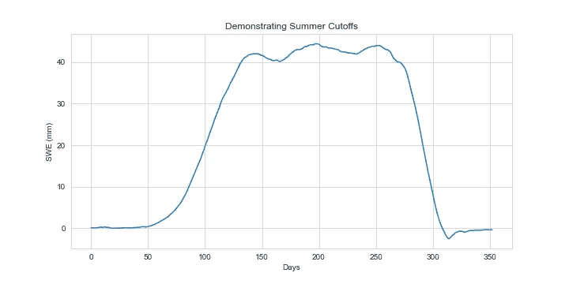

# 我们能用卫星研究积雪吗？

> 原文：<https://towardsdatascience.com/can-we-study-snowpack-with-satellites-e83d1f7720aa?source=collection_archive---------22----------------------->

## [变更数据](https://towardsdatascience.com/tagged/data-for-change)

## 测量积雪很困难，而且空间有限。有没有更好的办法？


由[埃罗尔·艾哈迈德](https://unsplash.com/@erol?utm_source=unsplash&utm_medium=referral&utm_content=creditCopyText)在 [Unsplash](https://unsplash.com/s/photos/snow?utm_source=unsplash&utm_medium=referral&utm_content=creditCopyText) 上拍摄的照片

积雪度量对于理解我们的气候和规划饮用水供应非常重要。根据美国地质调查局的数据，在美国西部，大约 75%的饮用水来自每年的冰雪融化。虽然积雪对世界许多地方都极其重要，但测量积雪却是一项艰巨的任务。尤其是在理解北极大片土地上的雪是如何变化的时候。

雪的空间变化很大，它的结构受许多因素的影响，这意味着我们不能只测量一个点，并假设周围地区是相似的。这听起来像是卫星的一项伟大任务，对吗？我们想研究一些从太空看得见的东西，这些东西我们在地面上很难测量；问题是为了测量雪中储存了多少水，我们需要知道深度和密度。知道一个地区何时被覆盖或未被覆盖是有用的，但是如果不了解不同地区积雪的深度和密度，我们就无法确定给定地区的积雪量。幸运的是，有一些有趣的方法可以利用被动微波成像来获得雪水当量或 SWE 的替代变量。在本帖中，我们将介绍 SWE 的传统测量方法，以及我们如何使用卫星来测量大面积的 SWE，否则是不可能测量的。

本文旨在向任何对数据科学和 python 感兴趣的人介绍一个有趣的遥感主题和一个具有挑战性的数据集。在我深入 Python 之前，已经有了相当多的背景信息，所以放松一下，泡一杯咖啡/茶，让我们了解一下如何用卫星数据测量积雪。

# 淡水是有限的

许多人没有意识到地球上的淡水是多么有限，我们的许多淡水储备都储存在冰雪中。事实上，地球上只有 2.5%的水是淡水。在这 2.5%中，只有 1%在地球表面！更进一步，在地表的 1%中，69%是冻土。这里的要点是，我们可用的淡水中有很大一部分以冷冻状态存在，不能立即供人类饮用。同样值得注意的是，占地球淡水储量很大一部分的冰川正在迅速融化。


来源于[美国地质调查局](https://www.usgs.gov/special-topic/water-science-school/science/where-earths-water?qt-science_center_objects=0#qt-science_center_objects)(原始图片来源)

# 我们如何研究积雪

大多数气象站位于城市和机场。当大量的雪倾向于落在偏远和高海拔的高山环境中时，获得积雪的精确测量是相当困难的。已经开发了几种测量积雪深度的方法，但我们的选择仍然相对较少。

## 斯诺特尔网站

在人们高度感兴趣并且步行可以到达的地区，我们用一种叫做斯诺特尔的东西来测量积雪。SNOTEL 是 SNOpack TELemetry 的缩写，本质上只是一个无线传输数据的远程气象站。在美国大约有 700 个 SNOTEL 站点。下面是科罗拉多州斯诺特尔遗址的地图，使用的是 Mapbox，这样您就可以看到斯诺特尔遗址是如何位于流域内和流域周围的。

科罗拉多州的斯诺特尔网站(作者使用 NRCS 数据创建)

SNOTEL 站点的主要目的是测量雪的深度，并估计雪体内储存的水量，这被称为雪水当量(SWE)。在 SNOTEL 站点可以找到多种传感器。所有站点都使用雪枕来测量 SWE 雪枕由一个装满水和防冻剂的气囊组成，可以测量上面的雪施加的压力。许多网站也有一个积雪深度传感器，向雪地发射光束，并测量光线反射回来所需的时间。深度传感器可能有点不稳定，因为雪在结构上非常不稳定；变化的结构导致光反射的不可预测的行为，我们将在用卫星测量 SWE 时更多地讨论这一点。

总的来说，SNOTEL 网站在为我们估算积雪方面做得很好。它们很小，这意味着它们可以安装在偏远地区，并且在冬季可能无法进入时需要最少的维护。然而，无限期地运行和维护它们是昂贵的，并且它们必须处于某种紧密的网络中，以便在一定的空间范围内很好地理解积雪。雪在空间上的变化令人难以置信，这意味着在 SNOTEL 站点可能会有很多雪，但仅仅几百米远的地方可能会有很大的不同。

# 利用卫星

我大学期间的第一份实习是作为地理空间统计学教授的研究助理。在我们的第一次会面中，他坐下来说，他有一个想法，使用一个新的重新采样的被动微波数据集，他认为我们可以利用这个数据集在比 Snotel 网站更大的空间范围内分析积雪。过去的研究显示了使用被动微波数据来创建积雪深度的代理变量的有效性，我将在下面解释，但没有任何新的重采样数据的主要用途，这些数据将每个像素的长度从 25 公里减少到 6.25 公里

## 测量数据

MEaSUREs 是美国宇航局为研究环境项目制作地球系统数据记录。国家冰雪数据中心(NSIDC)存档并分发了大量与冰冻圈相关的测量项目数据，冰冻圈是地球表面水冻结成固体的部分。我们感兴趣的特定数据集是测量校准的增强分辨率被动微波每日 EASE-Grid 2.0 亮度温度地球系统数据记录。这个数据集的缩写是 MEaSUREs CEBT，好得多。

亮温是对地球发出的微波辐射亮度的度量。亮温是用无源微波传感器测量的，用于获得不同频率的风、蒸汽、雨、雪和云的产品。使用被动微波辐射测量有很大的优势，比如可以在白天或晚上看穿云层。测量被动微波辐射的主要缺点是能量水平低；低能量的后果是我们必须测量相对大的区域以获得足够的信息，这降低了分辨率。尽管有分辨率的挑战，被动微波观测提供了最完整的积雪和海冰记录，可追溯到 20 世纪 80 年代。

我们之所以关注这个数据集，是因为使用无源微波传感器测量 19Ghz 和 37Ghz 亮度温度波段是唯一已知的遥感雪量的方法之一。当我们检查一堆雪时，发出的大部分辐射来自下面的地面。观察到的任何散射主要是由地表积雪造成的。我们关注 19 和 37Ghz 波长，因为发生的辐射散射与频率有关。随着雪的积累，每个波长的亮度温度都有可测量的变化；由于雪对 37Ghz 频段的散射大于 19Ghz 频段，因此这两个频段开始迅速分离。这种差异可以用来寻找 SWE 的代理变量，我们可以在下图中看到。


利用温度亮度寻找 SWE(由作者创建)

这张图描绘了阿拉斯加从一月份开始的一年中，单个像素的两种波长的亮度温度值。我们可以清楚地看到中间的夏季月份，这两个波长没有被积雪散射。然后我们可以看到这两个值是如何随着积雪的积累而开始下降和发散的。这种差异是对这个像素的积雪中储存了多少水的粗略估计。

# 获取我们的数据


我们在阿拉斯加的主题区域(来源:谷歌地球)

完整的 MEaSUREs CETB 数据集为 65TB！幸运的是，我们只需要全部数据的一小部分，但是下载 20 年时间序列的完整北半球图像仍然可以轻松占用 200GB 以上的空间。为了解决这个问题，我编写了一个 [Python 库](https://github.com/wino6687/SWEpy)，它抓取图像，然后每 10GB 对图像进行地理分组。这意味着我们可以选择一个坐标包围盒，并在进行过程中丢弃所有多余的数据，这极大地减小了文件大小。使用上面显示的阿拉斯加子集，从 1993 年到 2016 年的每日时间序列大约为 500MB，这比我的 90Gb 完整北半球时间序列好得多。

下载这个数据集需要相当长的时间，所以如果你想摆弄数据，就从短得多的时间序列开始。

# 清理我们的数据

我之前提到过我们的数据很乱，确实如此。存在缺失值和错误峰值的问题。这是单个像素的时间序列，您可以清楚地看到 SWE 值的两个瞬间峰值，然后瞬间回落。


数据中的错误峰值(由作者创建)

这些类型的尖峰随机出现在整个数据中，必须消除。你还会注意到，数据中有很多小的方差，我们也需要消除这些方差；遥感数据往往有很多噪声，平滑是非常常见的做法。为解决这些问题，我遵循的基本清洁步骤是:

1.  抛弃错误的价值观
2.  向前填充所有缺少的值
3.  应用 Savitzky-Golay (Sav-Gol)过滤器进行平滑
4.  将数值从 3 毫米降到 0 毫米

我已经在 SWEpy 中编写了处理所有这些步骤的函数:

Sav-Gol 过滤器非常适合平滑有许多小波动的数据，如我们的 SWE 曲线。Sav-Gol 滤波器的功能类似于移动平均，只是它不是在每一步取平均值，而是用多项式拟合窗口中的点。用户只需设置窗口的宽度和要使用的多项式的阶数。

以下是我们研究区域中单个像素平滑前后的影像外观示例:


平滑前后的 SWE 值(由作者创建)

最终曲线还不错。它在保持整体形状方面做得很好，因此我们可以更容易地获得像最大 SWE、初始零 SWE 日期和总积分季节 SWE 这样的指标。我特别感兴趣的一个指标是最初的零 SWE 日期，即记录零 SWE 的第一天。了解这一点有助于确定今年雪是否比过去更早地从表面融化。

# 可视化阿拉斯加上空的 SWE

现在我们已经下载并处理了我们的时间序列，我们终于可以看看它了！

绘制我们的学习区域


我们在阿拉斯加的研究区域图(由作者创建)

你会注意到山脉和陆地/海洋边界的形状与上面的谷歌地球图像非常相似，这意味着我们有正确的数据。我认为有趣的是，我们可以很容易地看到海岸线，即使它可能是冻结的，因为从地面发出的辐射与从水中发出的辐射是如此不同。

## 季节变化

我们学习的地方冬天会积很多雪。为了直观显示这种变化，我们可以绘制每个季节研究区域的 SWE，如下所示:


由作者创建

这四张图片都有如此大的比例并不理想，但这里的变化很有趣。在夏季图像中，我们可以看到陆地的 SWE 接近于零，由于海洋的高温，SWE 值为负值。在冬天，我们可以看到大量的雪降落在陆地上，海洋的温度也可能发生显著变化。因为这张照片是 1993 年的，所以也可能有海冰。在春天，尽管大量的雪已经融化，海洋仍然很凉爽。所以在一年的时间里，我们的学习领域经历了巨大的变化！

# 随时间变化

拥有相对较长时间序列的数据的最大好处是能够看到随时间的变化。自然，我们想知道从 90 年代到今天，积雪是否有所改变。有很多方法来看待这个问题，在这篇文章中，我将重点关注一些基本但有参考价值的指标。

## 总季节性 SWE 累积

我最喜欢用 snowpack 来衡量的一个指标是那个季节的积雪量。我们可以通过对我们的曲线进行积分来发现这一点，因为曲线下的面积等于总的季节性 SWE 累积。我们已经应用了 Sav-Gol 过滤器来平滑曲线，所以我们可以使用 Numpy 或 Scipy 来查找曲线下的区域。

在我们找到区域之前，我们必须首先确定每年的分裂时间。我们不能简单地在每年的 1 月 1 日分开，因为我们正在寻找季节性的 SWE，它在每年夏天的某个时候达到零。为了找到夏天的截止日期，我编写了一个简单的函数，它贪婪地搜索每年夏天的开始，并存储截止日期。

我肯定这不是这个问题的最佳解决方案，但是因为我们只需要将它应用于单个像素时间序列，所以我可以接受一些低效率。这就产生了每一季 SWE 的截止指数，我们可以用它来计算每一年的综合总 SWE。

```
plt.plot(swe[cutoff[8]:cutoff[9],25,28])
```



由作者创建

现在我们已经准备好了每年的临界值，我们可以找到每条曲线下的面积，看看总的 SWE 是如何随时间变化的。我编写了另一个简单的函数来处理这个问题:

由作者创建

我知道，我知道。三个嵌套的 for 循环，真的吗？我学过算法，但有时如果你循环而不是矢量化，会更容易看到地理空间数据发生了什么。通常有一种更快的方法来使用 Numpy 对类似这样的东西进行矢量化。此外，在较大的数据集上，对数据块采用多重处理可以大大减少计算时间。撇开低效率不谈，现在我们有了一个矩阵，它在 z 轴上显示了每年的综合 SWE，而不是每天的 SWE。我们可以用这个阵列来显示 SWE 在阿拉斯加的变化。


由作者创建


由作者创建


由作者创建

乍一看，这可能看起来不太糟糕。红色/橙色区域没有太大变化或者比以前有更多的雪，而绿色和蓝色区域 2008 年的雪比 1993 年少。对于北坡的这个子集，82%的像素在 2008 年的积雪量比 1993 年要少。这个特殊的差异图代表了~2，979，269 mm 的 SWE 丢失，相当大！

需要进行更详细的分析来确定随时间的真实变化，但这些初步结果符合我们可能期望看到的情况。总 SWE 变化的严重程度取决于你选择的年份组合。几乎 2005 年之后的任何一年与 2005 年之前的一年配对，都会显示该地区的降雪较少，但 2016 年是一个高 SWE 年。然而，高 SWE 年并不意味着这种情况会持续下去，变化是可以预料的。理想情况下，我们将扩展时间序列，以包括 1980 年代的数据，但是旧的数据更混乱，需要更多的工作来清理和处理。

## 初始零 SWE 日期

虽然总体积雪很重要，但另一个有用的衡量标准是初始零 SWE 日期。这是每年一个像素没有积雪的第一天。随着时间的推移进行跟踪可以帮助我们了解雪是否在一年中提前融化，这对市政集水规划有重大影响。一个地区每年夏天裸露的时间越长，也可能导致永久冻土退化。

幸运的是，我们已经有了大部分代码，可以从我们用来寻找夏季截止日的函数中找到初始的零瑞典日。然而，在夏季截止日，我们能够将一个像素推广到整个图像。对于初始零 SWE 日期，我们将需要单独循环每个像素的时间序列；为了加快处理速度，我使用了池多重处理，在空间上分割立方体。我选择展示一张来自俄罗斯不同研究领域的图片，因为这是一个很好的中间例子，说明了我所看到的那种变化。我选择将 1993 年与 2016 年进行比较，是因为 2016 年是继 2005 年之后下了一年多雪的一年。这是一个有趣的融化日期对比；正如你在下面看到的，尽管 2016 年的 SWE 像素水平相似，但融化的时间比 1993 年要早。


我们可以看到，最初的零 SWE 日期是随着时间而变化的。在 1993 年，像素在第 150 天左右大量融化。然而，在 2016 年，我们可以看到紫色箭头指向一大部分像素在这一年比 1993 年融化得更早。绿色区域还显示了在大约 160 天后几乎没有像素仍然没有达到零 SWE 这意味着大约 160 天后没有发生融化，这可能对径流行为产生重大影响。同样值得注意的是，与 1993 年相比，2016 年从未积累任何 SWE 的像素增加了大约 30%,这由橙色箭头表示。

# 包扎

这些数据有太多值得讨论的地方，这篇文章只是触及了我们可以探索的表面。希望读完这篇文章后，你对我们如何研究积雪以及我们如何利用卫星更好地研究大规模积雪有了新的理解。由于有太多的东西需要探索和讨论，我将会写几篇关于这些数据的文章。

正如我们在一些图表中看到的，s we 确实随着时间的推移而下降，这通常是我在处理这些数据时发现的结果。然而，某些地区的 SWE 在增加，如果没有更多的数据，就不可能对阿拉斯加北坡的积雪做出任何断言。像大型野火和全球天气模式变化这样的事件可能会逐年影响被动微波测量的 SWE，这意味着我们需要一种更复杂的方法来测量随时间的变化。我们将在未来的帖子中探索如何结合温度、植被指数和数字高程模型(DEM ),看看我们能否更好地了解正在发生的变化。

## 引文

布罗兹克，M. J .，D. G .龙，M. A .坚硬人，a .佩吉特和 r .阿姆斯特朗。2016，更新 2020。*测量已校准的增强分辨率无源微波每日 EASE-Grid 2.0 亮度温度 ESDR，版本 1* 。美国科罗拉多州博尔德。美国宇航局国家冰雪数据中心分布式活动档案中心。https://doi.org/10.5067/MEASURES/CRYOSPHERE/NSIDC-0630.001[。[4/25/2021]](https://doi.org/10.5067/MEASURES/CRYOSPHERE/NSIDC-0630.001)