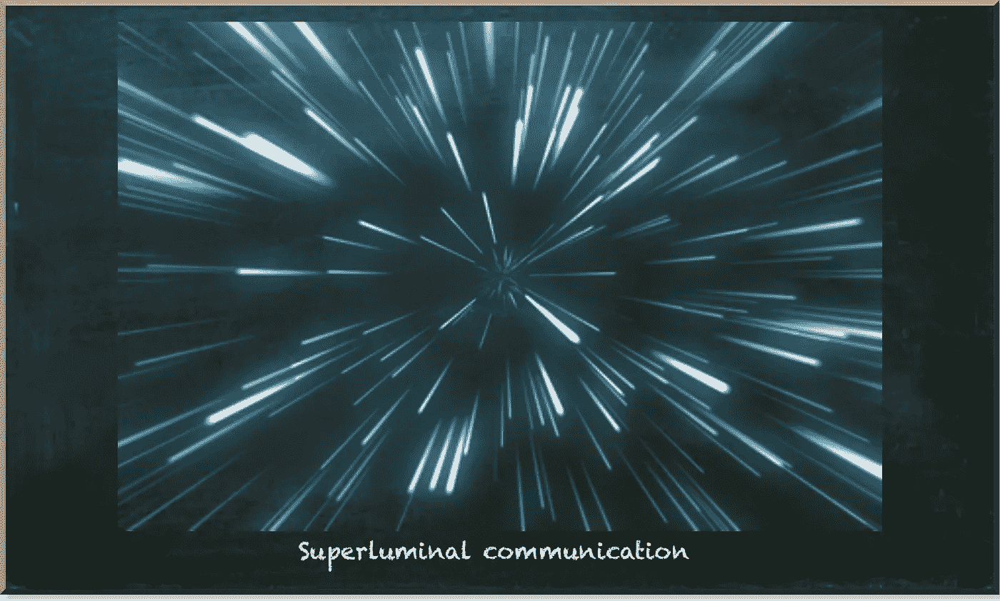
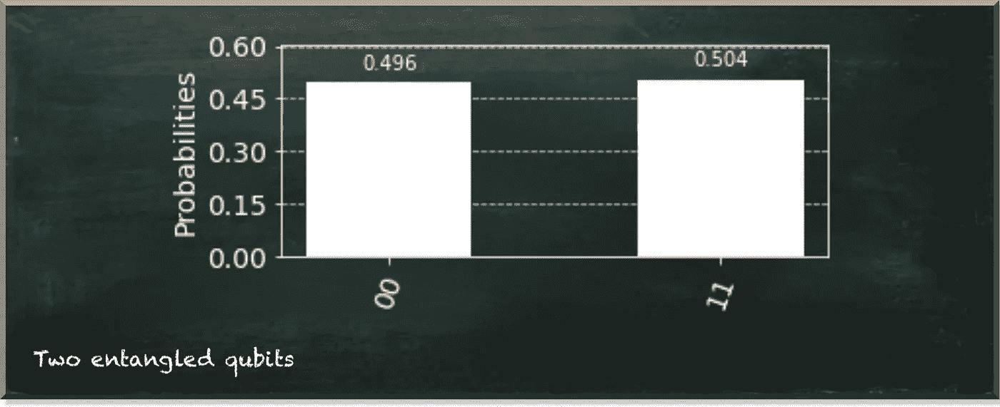
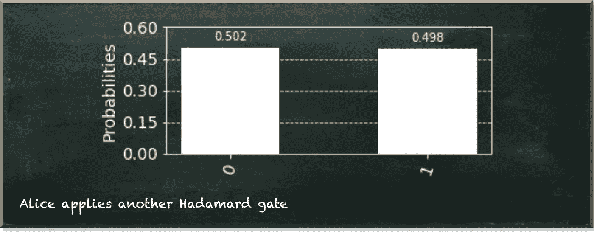
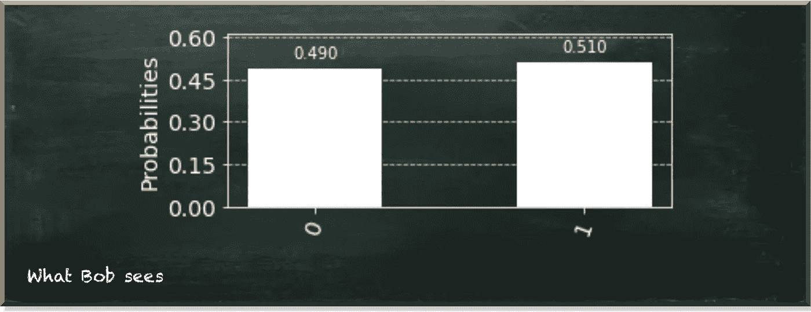
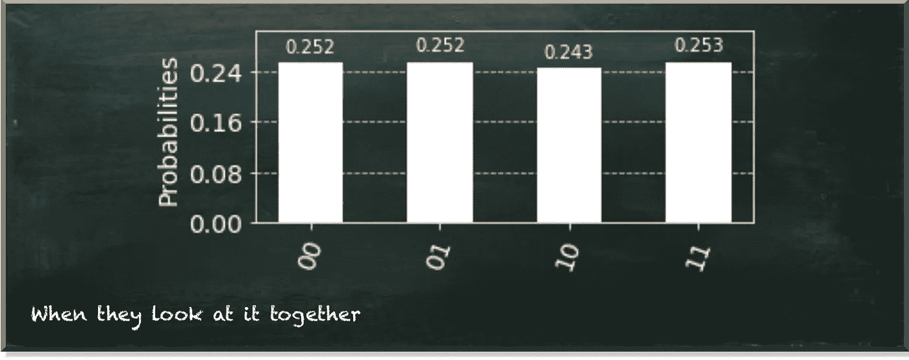
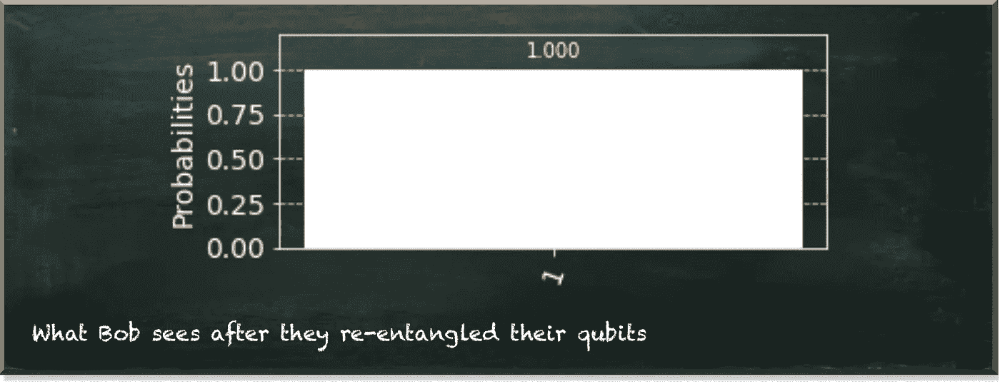

# 能否利用量子纠缠进行超光速通信？

> 原文：<https://towardsdatascience.com/can-we-use-quantum-entanglement-to-communicate-faster-than-the-speed-of-light-4446fc532259?source=collection_archive---------10----------------------->

## 对超光速通讯的探索

量子机器学习要不要入门？看看 [**动手量子机器学习用 Python**](https://www.pyqml.com/page?ref=medium_superluminal&dest=/) **。**

没有什么比光速更快了。我们都知道。好吧，这就是我们今天所相信的。这是一个理论——爱因斯坦的相对论。公平地说，这是一个很好的例子。

作者图片

如果一个东西的速度超过光速，我们就说它是超光速的。爱因斯坦告诉我们，如果你以光速旅行，时间就会停止。如果你的速度超过光速，时间就会倒流。

时间旅行导致矛盾。你可以回到过去，阻止一些改变历史的事件发生。而且，在数学和物理中，如果某样东西导致矛盾，我们就断定它是假的。

但是，我们的信念，甚至是最好的理论，都必须接受审查。我是说，你见过光速有多快吗？

我的日常经验表明，光根本没有那么快。当我打开电视时，我首先听到声音，然后过一会儿，我看到图像。

当我看电视时，我最终会看《星际迷航》或《星球大战》。但是，你猜怎么着，企业号有曲速引擎，千年隼号有超光速引擎。所以光速似乎不是一个大问题。

轶事和科幻小说说够了。**量子纠缠呢？**

纠缠描述了粒子之间极强的相关性。即使相隔很远，纠缠的粒子仍然保持完美的关联。

例如，我们有两个量子比特。我们用哈达玛门把一个放入相等的叠加态。如果我们测量它，我们会看到它要么是 0，要么是 1，各有 50%的概率。但是我们不测量它——因为测量一个量子位会瓦解它的叠加态。相反，我们用受控非门(CX)将它与另一个量子比特纠缠在一起。

无论我们多频繁地运行这个量子电路，我们总是看到两个量子位的值匹配。例如，下图描述了电路运行 10，000 次的结果。

作者图片

好吧，它们完全相关，那又怎样？

如果我们测量两个纠缠量子位中的一个，另一个会立即改变它的状态来解释我们测量的值。重点在于瞬间。

当我们说粒子的状态瞬间改变时，我们指的是瞬间。几秒钟后就不行了。不到一秒钟。但是瞬间。

状态的改变不依赖于从一个粒子发送到另一个粒子的任何信号——状态的改变是由于两个粒子共享一个状态。

因此，也许我们可以利用这一现象进行超光速通信——即比光速更快的通信。

让我们见见爱丽丝和鲍勃。他们是物理思想实验的超级明星。爱丽丝和鲍勃在宇宙的两端。然而，这两者都有一对纠缠量子位中的一个。此外，他们都知道他们的量子位是完全相关的。

所以，当爱丽丝查看她的量子位时，她得到了一个随机的结果。不是 0 就是 1。此外，鲍伯的量子位元会立即跳到一种状态，与爱丽丝看到的任何东西相对应。当他查看他的量子位时，他得到了同样的随机结果。

假设 Bob 在 Alice 之前测量了他的量子位。现在，爱丽丝的量子位改变了状态，与鲍勃的量子位相对应。但是，当爱丽丝测量她的量子位时，她现在得到了什么？同样，这是一个随机的结果。

当 Alice 和 Bob 获得相关的随机数时，没有信息从一方传输到另一方。似乎他们在回顾他们共同的过去。他们可以得出结论，各自的其他人知道同样的事情。但是分享知识不是交流。

不过，他们不会这么快放弃。他们尝试不同的东西。爱丽丝在测量量子位之前操纵它。她在其上应用另一个哈达玛门。

下面的代码创建了这样一种情况。

从爱丽丝的角度来看，结果一点也没变。

作者图片

她仍然看到一个随机的结果。

那么，让我们看看鲍勃看到了什么。

作者图片

鲍勃的结果也没有改变。

如果我们观察整个量子系统，我们只能看到发生了什么变化。当爱丽丝和鲍勃一起看结果时——这意味着他们交流了他们的结果——他们看到爱丽丝的行为改变了两个量子位之间的相互关系。

作者图片

当然，除了应用另一个哈达玛门，爱丽丝还可以用她的量子位做许多其他事情。但是无论她做什么都改变不了鲍勃的看法。只有当他们一起看他们的量子位时，他们才能看到效果。

所以，即使两个量子比特可以在很远的距离上纠缠在一起，我们也不能用它们进行即时通信！

无论爱丽丝和鲍勃用他们的量子位做什么，他们都不能互相发送信息。只有重新纠缠或解开量子位，它们才能交换信息。

例如，爱丽丝想给鲍勃发送一个 1。如果她在她的量子位上施加一个非门(X ),而他们在两个量子位上施加另一个纠缠门(CX ),那么我们可以看到鲍勃的结果发生了变化。

下图描绘了 Bob 看到的情况。

作者图片

因此，为了相互交流，我们需要纠缠量子位——或粒子。但是，纠缠行为本身就是一种交流。因此，到目前为止，爱因斯坦的相对论仍然成立。

我们不能用纠缠进行超光速通信。这是一件好事，因为我们不需要亲自旅行来改变历史的进程。如果我们能告诉我们早期的自己某些行为的结果，我敢打赌它会有戏剧性的变化。

量子机器学习要不要入门？看看 [**动手量子机器学习用 Python**](https://www.pyqml.com/page?ref=medium_superluminal&dest=/) **。**

在这里免费获得前三章。