# 我们可以在线性回归模型上使用随机梯度下降(SGD)吗？

> 原文：<https://towardsdatascience.com/can-we-use-stochastic-gradient-descent-sgd-on-a-linear-regression-model-e50327b07d33?source=collection_archive---------7----------------------->

## [思想和理论](https://towardsdatascience.com/tagged/thoughts-and-theory)

## 了解为什么在线性回归模型上使用 SGD 进行参数学习是*有效的*，然而，SGD 可能是低效的，并欣赏 Adam 优化器为提高 SGD 的效率所做的工作。

图片来自 [Unsplash](https://unsplash.com/photos/CyMd0vOYFfU)

我们被告知使用随机梯度下降(SGD ),因为它加快了机器学习模型中损失函数的优化。但是你想过为什么在你的模型上使用随机梯度扩张是可以的吗？

本文使用一个线性回归模型来说明何时使用随机梯度下降**有效**。然后，它指出了为什么随机梯度下降可能是低效的，并解释了 Adam 优化器如何使随机梯度下降更加有效。

# 线性回归模型中的参数学习

要了解线性回归模型 *f(x)=xᵀ w，*的参数值，其中 *x* 是特征， *w* 是模型参数，定义损失函数 *L(w)* :

并且相对于模型参数 *w* 最小化该损失函数。

上式中， *X* 和 *Y* 构成训练数据集 *(X，Y)*

*   *X* 是一个形状为 *n×p 的矩阵，*所以 *n* 个数据点， *p* 特征*。*
*   *Y* 是形状为 *n×1 的*矩阵。**
*   *w* 是参数的向量，形状 *p×1。*

*由于 L(w)* 是一个凸函数，最小化它的默认方式是计算它相对于 *w* 的导数，并将这个导数设置为零，以找到 *L(w)* 评估为最小值的位置。将导数设置为零会得到下面的标准方程，其左侧是导数:

线性回归模型的正规方程

法线方程是矢量形式，因为 *X* 和 *Y* 是矩阵，而 *w* 是矢量。求解该向量方程以获得参数值:

为了提醒自己关于正态方程的细节，文章[线性回归的置信区间来自哪里](/where-do-confidence-interval-in-linear-regression-come-from-the-case-of-least-square-formulation-78f3d3ac7117)是一个很好的阅读材料。

在实践中，求解正常方程可能具有挑战性，因为:

1.  矩阵求逆 *(XᵀX)⁻* 可能很贵。 *X* 是一个 *n×p* 矩阵， *XᵀX* 是一个 *p×p* 矩阵，其中 *p* 是特征的个数。矩阵求逆非常昂贵。在我的另一篇文章[稀疏和变分高斯过程——当数据很大时该怎么办](/sparse-and-variational-gaussian-process-what-to-do-when-data-is-large-2d3959f430e7)中，我生动地演示了矩阵求逆有多慢。因此，如果你的模型有成千上万的特征，这在今天是可能的，这种反演变得非常昂贵。
2.  正规方程解 *w=(XᵀX)⁻ XᵀY* ，通过提及完整的训练数据集 *(X，Y)* ，需要将整个数据集保存在内存中。如果数据集很大，可能会耗尽内存。

为了解决问题 1，我们可以使用梯度下降来最小化 *L(w)。*梯度下降算法只需要计算损失函数的梯度。渐变为*-2xᵀ(y-x w)*；它不涉及矩阵求逆。

但是梯度下降不能解决第二个问题。为了评估梯度 *-2Xᵀ(Y-X w)* ，梯度下降算法仍然需要将所有训练数据集保存在存储器中。这是因为梯度 *-2Xᵀ(Y-X w)* 提到了完整的训练数据集 *(X，Y)* 。

为了解决第二个问题，我们可以使用小批量随机梯度下降(我将简称为随机梯度下降)。随机梯度下降随机抽样，替换来自 *(X，Y)* 的一些数据点，并使用这个样本，称为 mini-batch(我将简称为 batch)，来评估梯度。我们可以通过改变批量大小来控制内存消耗。

# **在线性模型上使用随机下降的有效性**

随机梯度下降似乎不错，大多数人会理所当然地使用它。但是随机梯度下降有一个有效性要求:随机梯度的期望必须等于全梯度。在应用随机梯度下降来执行我们的线性回归模型的参数学习之前，我们需要证明这个有效性要求成立。

让我们首先了解有效性要求:

1.  全渐变是 *-2Xᵀ(Y-X w)的渐变。*因为提到了全训练数据 *(X，Y)* ，所以称为全梯度。
2.  随机梯度是从训练数据中采样的一批数据点计算的梯度，比如说 *(Xₘ，Yₘ)* ，其中*(xₘ，Yₘ)* 是 *(X，Y)* 的随机子集。
3.  随机梯度的期望:由于一批 *(Xₘ，Yₘ)* 是来自全部训练数据的随机样本，该批中的数据点具有随机性——特定的一批可能包括一些数据点而不包括其他数据点。由于随机梯度是提及这些随机采样数据点的表达式，因此它也变得随机。所以我们可以讨论那些随机梯度的期望。
4.  只有当线性回归模型的随机梯度的期望等于全梯度时，随机梯度下降才是模型参数学习的有效方法。

现在我们来证明有效性要求。为了使证明更具体，让我们证明这样的情况，我们有三个数据点，我们的 *w* 的维数为 2:

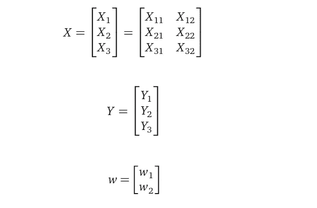

下面我们来介绍一下矢量 *U* :

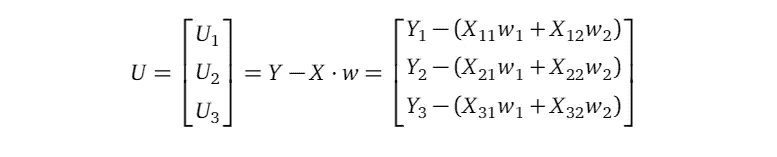

其中 *U₁、U₂、U₃* 根据他们对*uᵢ=yᵢ-xᵢw*u 是 *w* 的函数，因为它提到了 *w* 。

## 有效性证明

为了证明随机梯度的期望等于全梯度，我们首先写下全梯度，然后是随机梯度的期望，最后证明它们是相等的。

更准确地说:

*   在每个优化步骤中，随机梯度算法对单个批次进行采样，并使用该批次计算损失函数的随机梯度。
*   我们希望表明，在这一步，如果我们要抽取许多批次，并计算这些批次中每个批次的随机梯度，则这些随机梯度的期望值(或平均值)等于在这一步使用完整训练数据计算的完整梯度。

对于任何优化步骤，我们都需要证明上述内容。因为每一步的证明都是相同的，所以我们只需要处理一个单独的、任意的步骤。以下证明适用于任何步骤。

**全渐变**

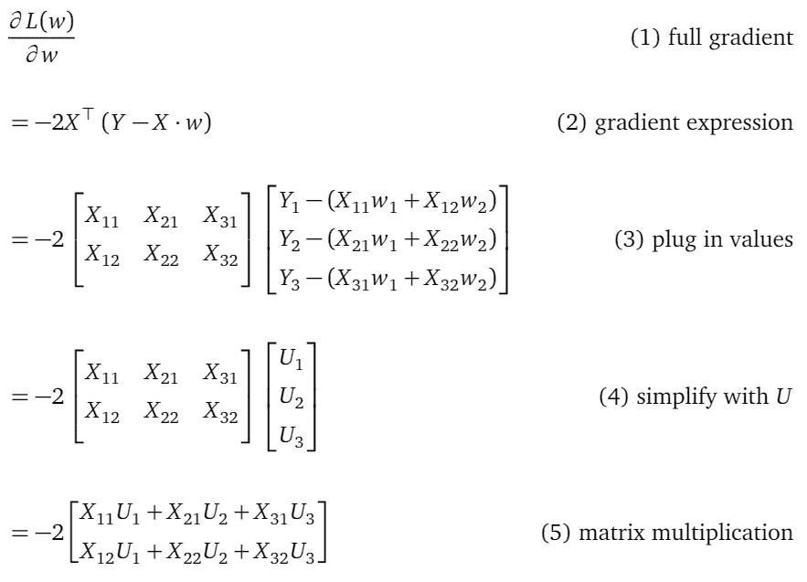

如果上面的步骤对你来说不简单，尤其是第(2)步，请看这里的[附录。](/where-do-confidence-interval-in-linear-regression-come-from-the-case-of-least-square-formulation-78f3d3ac7117)

让我们使第(5)行更明确，以帮助理解整个梯度:

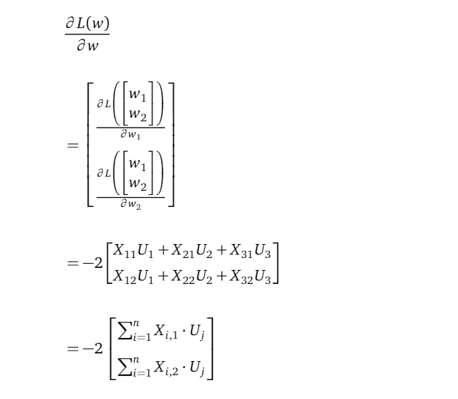

所以完整的梯度是一个长度为 2 的向量，每个参数一个， *w₁* 和 *w₂* 向量中的每一行都是单个参数的偏导数。该行汇总了 *X —* 中的一列，即 *X* 中的第 1 列为 *w₁* ，第 2 列为 *w₂* 。

例如，第一行是相对于第一参数 *w₁.的梯度*这个梯度对所有 3 个数据点 *i=1，2，3* 的 *Xᵢ,₁* *Uᵢ* 求和。它可以写成:

我引入名称 *G_first* 来表示完整渐变的第一行，以备后用。

*Xᵢ,₁* 中的逗号是为了明确区分字母和数字，即 *i* 引用 *X* 矩阵的行维度， *1* 引用列维度。如果两个维度的索引都是数字，我就写 *X₁₂* ，不带逗号。

**随机梯度**

随机梯度也是一个二维向量，与全梯度相同，不同之处在于随机梯度的每一行都是数据点子集的总和，即一批数据点。

让我们定义一个批次 *m* 作为该批次中训练数据点索引的集合。例如，如果在批次 *m* 中，有两个数据点(X *₁，Y₁)* 和 *(X₃，y₃)*，那么 *m={1，3}，*为第一个数据点的索引，3 为第三个数据点的索引。

使用该批次计算的损失函数，由 *Lₘ(w)* 表示，为:

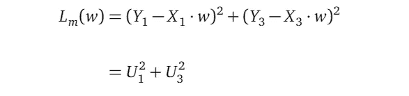

按照与计算全梯度相同的步骤，该批次的随机梯度为:

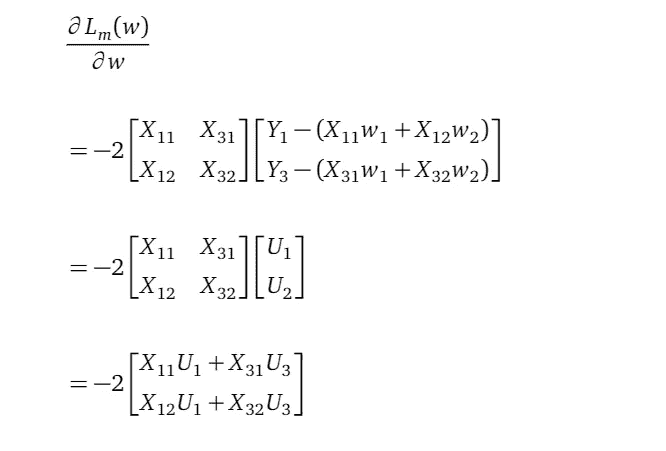

如果我们更明确地写下最后一行:

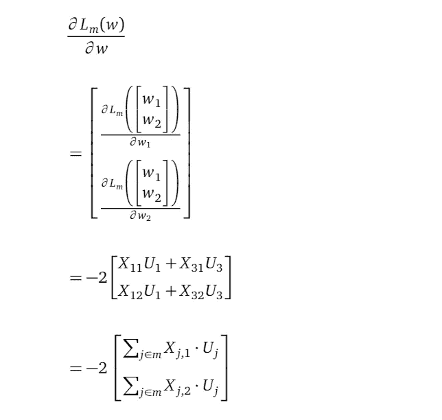

现在我们可以清楚地看到，随机梯度和全梯度的形状是一样的，随机梯度的每一行只是把批中的数据点相加，而不是像在全梯度中一样，把所有的数据点相加。

## **证明义务**

我们需要证明随机梯度的期望等于全梯度。由于在随机梯度和全梯度中有两行，证明义务是证明每行相等。事实上，每一行的证明都是一样的，所以我们只证明第一行的相等。

如前所述，我们可以将一批 *m* 表示为{ *j₁，j₂，…，jₘ* }。每个指标，比如 *j₁* ，都是来自均匀分布均匀 *(1，n)* 的随机变量，因为一个批次中的每个元素都可以等概率引用任意训练数据点。

随机梯度的第一行，即相对于第一个参数 *w₁* 、*、*的偏导数为:

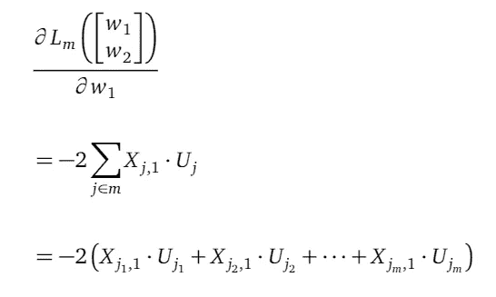

上面的表达式提到了 *j* ，一批 *m* 的指数。由于每个指标 *j* 都是随机变量，所以整个随机梯度也是随机变量。这个梯度提到了 *m* 随机变量: *j₁，j₂，…，jₘ.*

我知道上面公式中的下标很吓人，让我提供一些解释。在…里

“ *j，1* ”下标:

*   “*j”*部分是指训练数据 *X* 中的第*j*行。请记住 *j* 是一个整数，它引用的是被抽样成一批的训练数据集中的单个数据点。
*   “ *1* 部分是指 x 的第一列。这是因为我们在讨论损失函数相对于第一个参数 *w₁.的导数*

例如，由于我们的 *X* 是:

当 *j=3* 时，

而在

下标的 *j₁* 部分引用了批次 *m={j₁、j₂、…、jₘ}* 中的一个指标。

与 Uⱼ 中的下标含义相同。

## 随机梯度的期望

现在让我们算出参数 *w₁* 的上述随机梯度的期望值。期望值是相对于随机变量 *j₁，j₂，…，jₘ* :

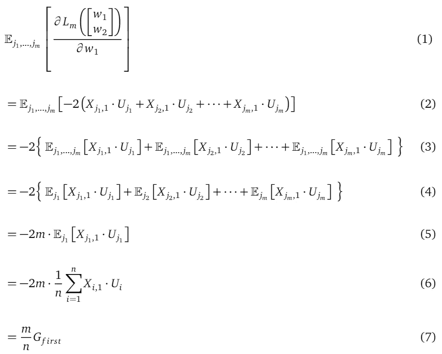

线(1)表示参数 *w₁.的随机梯度的期望值*符号显示期望是关于随机变量 *j₁，j₂，…，jₘ.*在计算期望值(本质上是平均值)时，知道你对哪些随机变量求平均值是至关重要的。

第(2)行插入了随机梯度的公式。

第(3)行使用期望的线性属性将单个大期望重写为 *m* 个小期望。

第(4)行删除了那些小期望中不必要的随机变量，因为每个小期望只提到一个随机变量——第一个小期望提到随机变量 *j₁* ，第二个小期望提到 *j₂* ，以此类推。

线(5)是**键**。注意，所有这些 *m* 小期望都有相同的结构，唯一的区别是它提到的随机变量。还要注意，所有这些随机变量 *j₁，j₂，…，jₘ* 都来自同一个均匀分布 Uniform(1， *n* )。所以所有这些小期望的值一定是一样的。我们可以用第一个小期望值的值来表示这个相同的值。有 *m* 个小期望值，所以整个公式简化为 *m* 乘以第一个小期望值的值。这种简化给了我们一个带有单个随机变量 *j₁.的公式*

线(6) *j₁* 是非均匀分布均匀(1， *n* )的随机变量。表达式相对于 *j₁* 的期望值是该表达式的平均值，是对 *j₁.所有可能值的平均*j₁*的所有可能值*只是 *1，2，3，…，n* ，概率相等。

第(7)行通过插入名称 *G_first* 简化了第(6)行的公式，我们引入该名称来表示整个梯度。

## 证明失败了吗？

现在我们已经证明了参数*w₁*t16】的随机梯度第一行的期望不等于全梯度 *G_first 的第一行。*

但是我们可以将这个随机梯度乘以 *n/m* 来创建一个随机梯度，其期望值等于 *G_first* 。

因此，我们已经证明随机梯度适用于我们的参数学习模型——我们只需将原始随机梯度缩放 *n/m* 即可将随机梯度转换为全梯度的无偏估计*。*直观地说，这意味着我们需要放大(因此随机梯度变得更大)原始随机梯度，以应对该随机梯度是从所有训练数据点的子集计算的事实。

以上证明是关于第一个参数 *w₁.的梯度*其他参数的证明都是一样的。

## 其他模型如神经网络也有同样的证明

虽然上述证明是在线性回归模型上完成的，但是你可以认识到许多神经网络模型的损失函数的结构与线性回归模型相同。这意味着上述证明也适用于那些神经网络模型，这就是为什么随机梯度下降或其变体(如 Adam)可以是神经网络的优化器的原因。

上面的证明是一个你会在机器学习证明中看到的模式。在我的另一篇文章[稀疏和变分高斯过程(SVGP)——当数据很大时做什么](/sparse-and-variational-gaussian-process-what-to-do-when-data-is-large-2d3959f430e7)中，在附录中，我给出了几乎相同的证明，表明随机下降适用于高斯过程模型。

你可能会问，有没有随机梯度下降不是有效参数学习算法的模型？是的。比如[高斯过程回归模型](/understanding-gaussian-process-the-socratic-way-ba02369d804)和[变分高斯过程模型](/variational-gaussian-process-what-to-do-when-things-are-not-gaussian-41197039f3d4)。两个模型都需要完整的训练数据 *(X，Y)* 作为它们的目标函数，以找到最佳的模型参数值。只有在[稀疏和变分高斯过程模型](/sparse-and-variational-gaussian-process-what-to-do-when-data-is-large-2d3959f430e7)中，目标函数才变成接受一批数据的形式。

# 随机梯度下降可能是低效的

现在我们知道，我们的基于批处理的随机梯度下降是一个有效的算法来执行我们的最小二乘线性回归模型的参数学习。但是这个版本的随机梯度下降是一个有效的算法吗，也就是说，它能足够快地找到合适的参数值吗？要回答这个问题，我们需要对随机梯度的方差进行推理。

随机导数是随机变量，随机梯度是随机变量的不同样本。我们不仅可以推理出它的均值(我们刚刚在上面的证明中做了)，而且可以推理出它的方差。

让我们用下面的例子来说明这一点:左边显示了完整渐变的方向；右手边是随机梯度。两者都是从外圈开始，走向内圈。外圈代表高损失函数值，内圈代表低损失函数值。梯度下降和随机梯度下降都从外到内移动，这意味着它们都最小化损失函数。

梯度下降(左)和随机梯度下降(右)之间的梯度方向比较

我们可以看到:

1.  平均而言，随机梯度与全梯度指向相同的方向。
2.  然而，任何具体的随机梯度偏离全梯度，形成之字形轨迹。

这些曲折的梯度方向，或者随机梯度的方差，使得随机梯度下降需要更多的优化步骤来找到最佳参数值，就像梯度下降一样。所以随机梯度下降有一个效率问题。

人们已经设计了随机梯度下降的变体来解决这个问题。Adam 优化器是一种广泛使用的优化器。

# Adam —平滑随机梯度

Adam 改进了随机梯度下降算法的两个方面:

1.  它平滑随机梯度。
2.  它对每个参数使用不同的学习率。

如果我们将之字形随机梯度的序列视为一个时间序列(时间维度是优化步骤，每次计算随机梯度)，这是一种减少之字形以平滑该时间序列的简单方法。指数衰减是一种流行的平滑器。

## 指数平滑法

给定一个原始值序列， *r₁，r₂，r₃* ，…，指数平滑序列 *s₁，s₂，s₃* ，…，由下式给出:

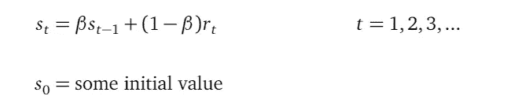

在上面的定义中， *β* 被称为平滑因子。下图以黑色显示了指数平滑对原始数据的影响。红色曲线是用系数 *β=0.5 平滑的。*蓝色曲线为 *β=0.9。*

我们可以看到平滑因子越大，得到的曲线越平滑。这是因为较大的平滑因子意味着更多的权重分配给平滑序列的前一个值，而较少的权重分配给原始序列的新数据点。

请注意，以下曲线与参数学习无关，它们只是向您展示指数平滑的样子。

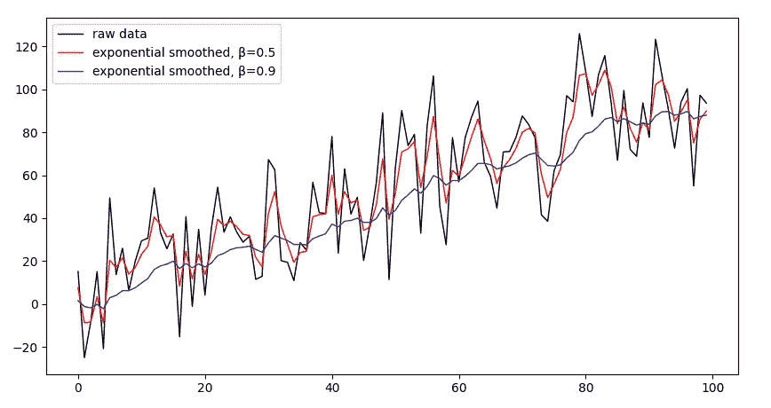

不同平滑因子对指数平滑的影响

## 亚当优化器

Adam 优化器使用指数平滑来减少随机梯度序列的曲折。

为了更好地说明这一点，让我们从正常随机梯度下降算法的参数更新规则开始。

**随机梯度下降中的参数更新规则**

假设我们有 *p* 参数， *w₁到 w* ₚ，在时间 *t* (即第*t*优化步骤)，第*I*参数 *wᵢ* 的更新规则为:

其中:

*   *wᵢ,ₜ* 是时间 *t.* 时第*个*参数 *wᵢ* 的更新参数值
*   *wᵢ,ₜ* ₋ *₁* 是上一次 *t-1* 相同参数 *wᵢ* 的值。
*   g *ᵢ,ₜ* 是 *wᵢ* 在 *t* 时刻的斜率。
*   *α* 是学习率。

我们已经说过随机梯度下降的问题是梯度 g *ᵢ,ₜ* 是曲折的，这意味着它有一个大的方差*。*

**Adam 算法中的参数更新规则**

在 Adam 算法中，第*个*参数 *wᵢ* 的更新规则为:

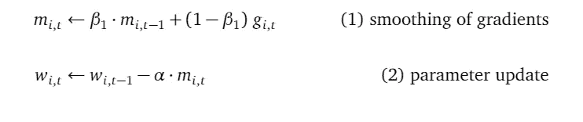

线(1)使用指数平滑因子 *β₁* 平滑随机梯度 g *ᵢ,ₜ* ，通常设置为 *0.9。*这产生了一系列平滑的随机梯度 *mᵢ,₁，mᵢ,₂* ，等等*。*初始值 *mᵢ,₀* 设置为 *0。*

线(2)是使用平滑梯度 *mᵢ,ₜ.的实际参数更新*

请注意，指数平滑不会改变数据点的数量。也就是说，平滑后的序列具有与原始序列相同数量的数据点。在 Adam 中使用平滑随机梯度的要点是:

*   我们知道，遵循真正的梯度曲线可以用最少的步骤达到最优。
*   平滑后的随机梯度曲线更接近真实梯度曲线。
*   因此，通过遵循平滑的随机梯度曲线，我们更有可能以**更少的**个优化步骤达到最优。
*   由于每个优化步骤都需要时间，因此步骤越少意味着优化越快。

## **自适应调整 Adam** 中每个参数的学习速率

除了平滑随机梯度，Adam 还包括另一个改进，它解决了为每个参数调整学习速率的问题。

上述参数更新规则对所有参数 *w₁、w₂* 等等*使用相同的学习率 *α* 。*学习率控制每次参数更新时参数值改变的步长。

不同的参数可能有不同的范围，一个参数的范围从 1 到 100，另一个从-1000 到 2000。单一的学习率不可能为不同尺度的所有参数提供合适的步长。

请注意，虽然从(随机)梯度下降的角度来看，每个参数都有全实数作为其理论范围，但在现实生活中，不同的参数确实倾向于具有不同的实际范围。

与范围相关的另一个问题是，根据损失函数和数据，在优化过程中，一些参数可能会缓慢变化(意味着参数值在每个优化步骤中仅发生少量变化)，而一些参数可能会快速变化。为了加快优化速度，如果我们看到一些参数变化缓慢，我们应该扩大它的步长。如果我们看到一些参数变化很快，我们应该减少其步长，以避免超调。

因此，我们希望有一种机制来自适应地决定步长或每个参数的学习速率，同时考虑范围差异和变化速度差异。Adam 通过引入第二个指数平滑来实现这一点，这一次，对随机梯度的平方序列进行平滑。

下面的公式显示了具有第一次和第二次平滑的完整 Adam 参数更新规则。

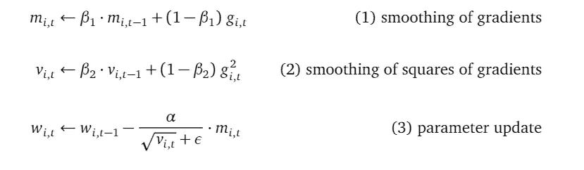

和以前一样，这三个公式仅适用于第 *i 个*参数 *wᵢ* 。

线(1)是如前所述的使用平滑因子 *β₁* 的随机梯度的平滑。

第(2)行是新的，它使用平滑因子 *β₂* 平滑随机梯度的平方，通常设置为 0.999。这个平滑的序列代表随机梯度的方差。初始值 *vᵢ,₀* 被设置为 *0。*

第(3)行被改变，单个学习率 *α* 现在被方差的平方根(这是标准偏差)反向缩放。 *ε* 是一个小正数，以避免在标准差为 0 时被零除。 *ε* 通常设置为 10⁻⁸.

从上面的公式我们可以看出，如果一个参数的值变化很大，那么它的方差很大，那么适应的学习速率就会降低，反之亦然。每个参数的学习速率的这种自适应调整导致不同参数的不同学习速率。

注意，实际的 Adam 算法对平滑的随机梯度和随机梯度的平滑平方有偏差校正。我决定不谈论偏差校正，因为这篇文章的目的是说明 Adam 解决随机梯度下降算法问题背后的直觉。如果你对亚当的完整版感兴趣，有很多很好的参考，比如这里的[这里的](https://ruder.io/optimizing-gradient-descent/)和[这里的](https://stats.stackexchange.com/questions/232741/why-is-it-important-to-include-a-bias-correction-term-for-the-adam-optimizer-for)。

# 结论

本文展示了我们如何证明随机梯度下降是否适用于我们的机器学习模型。在我们有了证明之后，我们知道使用随机梯度下降是正确的。但不一定是有效率的事情。然后，本文简要介绍了 Adam 优化器，并解释了它如何使随机梯度下降更有效。

# 支持我

如果你喜欢我的故事，如果你考虑支持我，通过这个链接成为灵媒会员，我将不胜感激:[https://jasonweiyi.medium.com/membership](https://jasonweiyi.medium.com/membership)。

我会继续写这些故事。