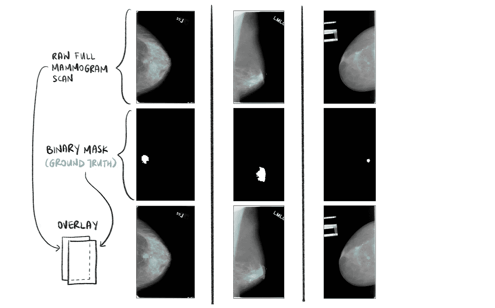

# 分割乳房 x 光片中的异常(第 1 部分，共 3 部分)

> 原文：<https://towardsdatascience.com/can-you-find-the-breast-tumours-part-1-of-3-1473ba685036?source=collection_archive---------10----------------------->

## 点击导航:第 1 部分-> [第 2 部分](/can-you-find-the-breast-tumours-part-2-of-3-1d43840707fc) - > [第 3 部分](/can-you-find-the-breast-tumours-part-3-of-3-388324241035)

## 在 TensorFlow 2 中对乳房 x 光片实施深度学习语义分割管道的分步指南


图片作者。从 [CBIS-DDSM](https://wiki.cancerimagingarchive.net/display/Public/CBIS-DDSM) 取回的乳房 x 光片和口罩。

如果你正在阅读这篇文章，很可能我们有着相似的兴趣，从事着相似的行业。所以让我们 [***通过 LinkedIn***](https://www.linkedin.com/in/cleonwong/) *连接起来，在这里我分享我关于 AI 和 ML 的想法和资源的花絮！*

# 文章结构

本文是一个 3 部分系列的第 1 部分，介绍了我如何解决一个深度学习项目**使用图像分割模型** *识别乳房 x 光扫描中的肿块异常。* 作为对项目进行详细分解的结果，这是对计算机视觉中的核心问题之一——**语义分割**的全面概述，也是对在 TensorFlow 2 中执行这个项目的技术细节的深入探究。

## 第一部分:

*   问题陈述。
*   什么是语义切分。
*   数据集下载指南。
*   你会在数据集中找到什么。
*   解开数据集的嵌套文件夹结构。
*   数据探索。

## 第二部分:

*   图像预处理流水线概述。
*   原始乳房 x 光片的一般问题。
*   深入研究原始乳房 x 光片的预处理流程。
*   深入到相应掩码的预处理管道。

## 第三部分:

*   介绍 VGG-16 U-Net 模型。
*   在 TensorFlow 2 中实现模型。
*   训练模型的注意事项。
*   结果和事后分析。
*   结束了。

## GitHub 知识库

这个项目的代码可以在[这个库](https://github.com/CleonWong/Can-You-Find-The-Tumour)的 [my Github](https://github.com/CleonWong) 中找到。

# 1.问题陈述

该项目的目标是**分割扫描的乳房 x 光片图像中的肿块异常**。

全乳房 x 线扫描将用作图像分割模型的 2D 输入，其各自的二元掩模作为基础事实标签。该模型将输出每个乳房 x 光片的预测掩模。


图一。模型管道、输入和输出图像以及输入标签的简要概述。从 [CBIS-DDSM](https://wiki.cancerimagingarchive.net/display/Public/CBIS-DDSM) 取回的乳房 x 光片和口罩。作者绘制的图像。

## 1.1.所选数据集-CBIS-DDSM

我选择使用 CBIS-DDSM 数据集，因为它适合中等复杂程度的计算机视觉项目。它拥有 2620 张扫描的乳房 x 光照片，足以进行像样的模型训练。此外，由于 CBIS-DDSM 数据集包含真实世界的乳房 x 线照片扫描，它们足够“杂乱”,因此需要进行鲁棒的和有意的图像预处理，以便在手边的任务中获得体面的结果。图像预处理在 [*第二部分*这里](/can-you-find-the-breast-tumours-part-2-of-3-1d43840707fc)有所涉及。

最有趣的是，数据集中的每张乳房 x 线照片都带有一个二元掩模，仅指示异常的大致位置。由于这些掩模不提供精确的分割，因此需要实现用于精确特征提取和诊断的分割算法。

这些是我选择 CBIS-DDSM 数据集来处理语义分割任务的主要原因。



图二。原始乳房 x 光扫描及其各自的二元掩模的例子。每列代表一个独特的患者。覆盖图(底行)由我生成，不在数据集中提供。从 DDSM CBIS[取回的乳房 x 光片和口罩](https://wiki.cancerimagingarchive.net/display/Public/CBIS-DDSM)。作者绘制的图像。

# 2.什么是语义切分？

简而言之，任何种类的分割(是的，存在不止一种分割，是的，除了分割还有其他方法，即定位和检测)都回答了以下问题:

> ***“感兴趣的对象位于图像的什么位置？”***

在场景理解的业务中，找到感兴趣的对象在图像中的位置是图像分类的自然步骤。图像分类告诉我们*“图像中有什么”* (即它对整个输入图像进行预测)。定位、检测和分割然后告诉我们*“[感兴趣对象]在图像中的位置”。*


图三。图像分类与分割。作者绘制的图像。

有两种主要形式的姿态信息告诉我们物体在图像中的位置——*边界框*和*遮罩*。**物体定位**模型和**物体检测**模型输出预测包围盒，而**图像分割**模型输出预测遮罩。图像分割可以进一步分解为**语义分割**模型和**实例分割**模型。因此，用于在图像中定位对象的四种主要类型的技术是:

*   **对象定位:**包括定位*一个对象类(又名标签)的一个实例*，通常是通过预测一个以实例为中心的紧密裁剪的边界框。它通常带有分类，你会遇到的常见术语是*‘分类+本地化’*。
*   **对象检测:**涉及检测图像中一个或多个对象类的多个实例*。类似于对象定位，它预测每个对象类的每个检测实例周围的*边界框*。*
*   ***语义分割:**为图像的每个像素预测其所属的对象类别(在两个或多个对象类别中)。模型必须知道所有的对象类。输出是预测的*屏蔽*。*
*   ***实例切分:**是语义切分的一种更精细的形式。区别在于它能够区分同一对象类的两个实例。例如，它能够在人行道的图像中将一个行人与另一个行人分开。输出也是预测的*屏蔽*。*

**

*图 4。上述 4 种技术的输出说明。注意语义分段和实例分段的区别。从 DDSM CBIS[取回的乳房 x 光片和口罩](https://wiki.cancerimagingarchive.net/display/Public/CBIS-DDSM)。作者绘制的图像。*

*以上是我对技术的理解。但是，请注意，这些术语在科学界的定义并不像我们所希望的那样清晰，因此您可能会遇到其中任何一个术语的略微不同的含义。你可以参考 [*这篇*](https://datascience.stackexchange.com/questions/52015/what-is-the-difference-between-semantic-segmentation-object-detection-and-insta) 、 [*这篇*](https://innodata.com/semantic-versus-instance-segmentation/) 和 [*这篇*](https://www.quora.com/What-is-the-difference-between-object-detection-and-localization) 文章，对以上四个概念有更透彻的理解。*

# *3.下载数据*

*数据集可以在[这里](https://wiki.cancerimagingarchive.net/display/Public/CBIS-DDSM)找到，来自[癌症成像档案](https://www.cancerimagingarchive.net/)。*

*如果您遵循下面的一般步骤，下载数据是非常简单的。请注意，我在 Mac 上工作，在其他系统上工作时可能会略有不同。*

***步骤 1—** 从 Mac App Store 安装 NBIA 数据检索器。详细说明请点击[链接](https://wiki.cancerimagingarchive.net/display/NBIA/Downloading+TCIA+Images)。*

***步骤 2 —** 将`.tcia`清单文件下载到您的本地计算机。*

***步骤 3 —** 使用 NBIA 数据检索器打开刚刚下载的`.tcia`清单文件。*

***步骤 4 —** 在 NBIA 数据检索器中，单击“浏览”选择您要保存数据集的目录。*

***步骤 5 —** 然后点击“开始”开始下载数据集。*

*注意，因为这个数据集大约有 160GB，下载可能需要一段时间。*

# *4.你会在数据集中找到什么*

*数据集包含含有**钙化**、**肿块异常**或两者的乳房。[这篇文章](https://www.sciencedirect.com/science/article/pii/S2211568413003872#:~:text=In%20mammography%2C%20a%20mass%20is,gland%2C%20without%20a%20defined%20contour.)很好的总结了什么是肿块和钙化。*

*您将在下载的数据集中看到的混乱和嵌套的文件夹结构将在 [*第 2 部分*](/can-you-find-the-breast-tumours-part-2-of-3-1d43840707fc) 中解释和解决。现在，我们将重点了解数据集中的数据类型。*

*数据集包含两种主要类型的文件——DICOM(`.dcm`)文件和`.csv`文件。*

**

*图五。可在 CBIS-DDSM 数据集中找到的文件类型汇总。从 DDSM CBIS[取回的乳房 x 光片和口罩](https://wiki.cancerimagingarchive.net/display/Public/CBIS-DDSM)。作者绘制的图像。*

## *4.1.`.dcm`文件*

*默认情况下，CBIS-DDSM 数据集中的图像被解压缩为 DICOM 格式。请参考[本](https://dicom.innolitics.com/ciods/cr-image/general-series/00200060)、[本](/understanding-dicom-bce665e62b72)和[本](https://hengloose.medium.com/a-comprehensive-starter-guide-to-visualizing-and-analyzing-dicom-images-in-python-7a8430fcb7ed)了解 DICOM 格式的简要概述以及如何在 Python 中使用 DICOM。*

*患者可以对同一个乳房进行两次乳房 x 线扫描，每次在不同的视图中(即 MLO 和 CC)。每张乳房 x 光照片都有以下 3 种图像:*

1.  ***全乳腺扫描:**实际乳腺照片。*
2.  ***裁剪图像:**质量异常的放大裁剪。*
3.  ***感兴趣区域(ROI)掩模:**定位肿块异常的基础真实二元掩模。*

*这些图像都被解压缩到各自的`.dcm`文件中。这 3 种图像各有一个单独的`.dcm`文件(即只有 1 个肿块异常的乳房将有 3 个`.dcm`文件，3 种图像各一个)。每个`.dcm`文件包含图像(以数组的形式)和其他关于扫描的信息，如`Patient's ID`、`Patient Orientation`、`Series Description`、`Modality`和`Laterality`。*

*你会发现乳房有 1 个以上的肿块异常。对于每个肿块异常，这些病例将有一个裁剪图像和一个 ROI 掩膜。*

## *4.2.的。csv 文件*

*`.csv`文件用作乳房 x 光扫描的目录。共有 4 个`.csv`文件:*

1.  *计算-测试-描述. csv*
2.  *计算-训练-描述. csv*
3.  *质量测试描述. csv*
4.  *Mass-Train-Description.csv*

*这些文件中的每一个都包含关于每张乳房 x 光照片的信息，例如乳房密度、图像视图和病理学。请注意，在下面的行中有重复的患者 ID。同样，这表明单个患者可以有多张乳房 x 光照片(同一个乳房的多个视图，左右乳房的乳房 x 光照片，或者两者都有)。*

# *5.解开数据集的嵌套文件夹结构*

*在使用 CBIS-DDSM 数据集的其他项目中，一个经常被忽视的解释是将文件夹结构重新组织成易于使用的结构。*

*从下面的片段中，我们看到下载数据集的原始文件夹结构是*嵌套*，有*非描述性的子文件夹名称*，有*非唯一的* `*.dcm*` *文件名*。这使得将图像输入图像预处理管道(以及最终的模型训练管道)变得极具挑战性。因此，我们将编写一些代码来创建一个新的文件夹结构来解决这些问题。*

## *5.1.解释原始文件夹结构*

```
*Folder structure BEFORE restructuring
=====================================**CBIS-DDSM**
│
├── **Calc****-Test_P_00038_LEFT_CC**
│   └── **1.3.6.1.4.1.9590...**
│       └── **1.3.6.1.4.1.9590..**
│           └── 1-1.dcm <--- full mammogram scan
│
├── **Calc****-Test_P_00038_LEFT_CC_1**
│   └── **1.3.6.1.4.1.9590...**
│       └── **1.3.6.1.4.1.9590...**
│           ├── 1-1.dcm <--- binary mask? cropped image?
│           └── 1-2.dcm <--- cropped image? binary mask?
...┌─────────────────┐│ **bold : folder** │
│ non-bold : file │
└─────────────────┘*
```

*患者 P_00038 的左 CC 乳房 x 光片扫描保存为父文件夹`Calc-Test_P_00038_LEFT_CC`下的`1-1.dcm`文件。分解父文件夹名称，我们有:*

*   *`Calc`(或`Mass`):乳房 x 光照片中出现的异常类型。*
*   *`Test`(或`Train`):乳房 x 光片属于测试集(CBIS-DDSM 已经将乳房 x 光片分为训练集和测试集)。*
*   *`P_00038`:患者的 ID。*
*   *`LEFT`(或`RIGHT`):左胸。*
*   *`CC`(或`MLO`):乳房 x 光扫描的方向。*

*患者 P_00038 的左 CC 乳房 x 光扫描有其相应的二元掩模和裁剪图像。这些文件保存在一个单独的文件夹`Calc-Test_P_00038_LEFT_CC_1`(注意文件夹名末尾的`_1`)。混乱的部分来了——仅仅从文件名中不可能分辨出`1-1.dcm`和`1-2.dcm`分别是二进制蒙版还是裁剪后的图像，反之亦然。如果乳房 x 光片有一个以上的异常，那么每个异常对应的掩模和裁剪图像将以类似的方式保存，但保存在以`_2`、`_3`等结尾的单独文件夹中。*

## *5.2.创建新的文件夹结构*

*下面的代码片段显示了重组后的新文件夹结构。现在*不再嵌套*和*单独的文件有唯一的和描述性的文件名*。*

```
*Folder structure AFTER restructuring
=====================================**CBIS-DDSM**
│
├── **Calc**
│   ├── **Test**
│   │  ├── Calc-Test_P_00038_LEFT_CC_FULL.dcm
│   │  ├── Calc-Test_P_00038_LEFT_CC_CROP_1.dcm
│   │  ├── Calc-Test_P_00038_LEFT_CC_MASK_1.dcm
│   │  ...
│   │  └── Calc-Test_P_XXXXX_LEFT_MLO_MASK_1.dcm
│   │
│   └── **Train**
│       ├── Calc-Train_P_XXXXX_LEFT_MLO_FULL.dcm
│       ...
│       └── Calc-Train_P_XXXXX_RIGHT_CC_MASK_1.dcm
│
└── **Mass**
    ├── **Test**
    │  ├── Mass-Test_P_XXXXX_LEFT_CC_FULL.dcm
    │  ...
    │  └── Mass-Test_P_XXXXX_LEFT_MLO_MASK_1.dcm
    │
    └── **Train**
        ├── Mass-Train_P_XXXXX_LEFT_MLO_FULL.dcm
        ...
        └── Mass-Train_P_XXXXX_RIGHT_CC_MASK_1.dcm┌─────────────────┐│ **bold : folder** │
│ non-bold : file │
└─────────────────┘*
```

*我创建了一组助手函数来实现上面的文件夹结构。*

*   *`new_name_dcm()`上面写着。并将它从`1-1.dcm`或`1-2.dcm`重命名为更具描述性的名称。*
*   *`move_dcm_up()`然后移动改名。dcm 文件从嵌套文件夹结构向上移动到其父文件夹中。*
*   *`delete_empty_folder()`然后删除任何空文件夹(在递归命名和移动。dcm 文件)。*

*在所有这些之上，`count_dicom()`统计了。重组前后的 dcm 文件，只是为了确保。重组前后的 dcm 文件是相同的。下面的代码片段显示了进行这种重组的主要函数。关于每个助手函数的详细信息，请参考[项目的资源库](https://github.com/CleonWong/Can-You-Find-The-Tumour)。*

*点击 [**此处**](https://github.com/CleonWong/Can-You-Find-The-Tumour/blob/master/src/modules/extractDicom/extractDicom.py) 查看全部三个功能的完整代码。*

# *6.数据探索*

## *6.1.处理不止一种异常情况*

**

*图六。包含钙化的乳房 x 光片和包含肿块异常的乳房 x 光片的分布。作者绘制的图像。*

*在数据集中的 2620 次乳房 x 光扫描中，有 1592 次包含肿块异常(其余的仅包含*钙化异常)。这 1592 张乳房 x 光照片是我们将要处理的。在这 1592 次扫描中，71 次包含 1 个以上的肿块异常。因此，这 71 张乳房 x 光照片将具有 1 个以上的二元掩模(每个异常 1 个)。**

**

*图 7。乳腺 x 线照片中肿块异常计数的分布(在 1 个肿块异常和> 1 个肿块异常之间)。作者绘制的图像。*

**

*图 8。有 1 个以上异常的乳房 x 线照片示例。从 DDSM CBIS[取回的乳房 x 光片和口罩](https://wiki.cancerimagingarchive.net/display/Public/CBIS-DDSM)。作者插图。*

*注意有 1 个以上肿块异常的乳房 x 线照片是很重要的，因为它们的遮罩不应该单独处理。直观地说，如果我们将每个遮罩视为同一图像的单独标签，那么每当模型看到不同的遮罩但用于同一图像时，它都会感到困惑。因此，我们应该将掩模相加为单个掩模，并且使用该相加的掩模作为乳房 x 光照片的唯一标签。关于如何对掩码求和的代码将在 [*第二部分*](/can-you-find-the-breast-tumours-part-2-of-3-1d43840707fc) 中介绍。*

**

*图九。具有 1 个以上肿块异常的乳房 x 线照片的加总遮罩示例。当训练分割模型时，总和掩模将被用作其相应输入图像的唯一标签。从 [CBIS-DDSM](https://wiki.cancerimagingarchive.net/display/Public/CBIS-DDSM) 取回的乳房 x 光片和口罩。作者插图。*

# *接下来，[第二部分](/can-you-find-the-breast-tumours-part-2-of-3-1d43840707fc):图像预处理*

*在本文中，我们讨论了问题陈述背后的动机，什么是语义分割，以及我们将使用的 CBIS-DDSM 数据集的重要数据。*

*在 [*第 2 部分*](/can-you-find-the-breast-tumours-part-2-of-3-1d43840707fc) 中，我们将分解我所采用的各种图像预处理技术的直觉，以及代码实现。*

*和往常一样，这个项目的代码可以在 [my Github](https://github.com/CleonWong) 的[这个库](https://github.com/CleonWong/Can-You-Find-The-Tumour)中找到。*

*见 [*第二部*](/can-you-find-the-breast-tumours-part-2-of-3-1d43840707fc) *和* [*第三部*](/can-you-find-the-breast-tumours-part-3-of-3-388324241035) ！*

# *谢谢你*

*如果你已经读完了这篇文章，我希望你喜欢这篇文章。如果这篇文章给你自己的项目带来了一些灵感、价值或帮助，请随意与你的社区分享。此外，任何建设性的问题、反馈或讨论都是绝对受欢迎的，所以请随时在下面评论，或者在 LinkedIn 上联系我，这里是 或[***Twitter @ CleonW _***](https://twitter.com/cleonw_?lang=en)。*

*请在 Medium ( [Cleon Wong](https://medium.com/u/25cfa5ca1084?source=post_page-----1473ba685036--------------------------------) )上关注我，了解我的下一篇文章！*