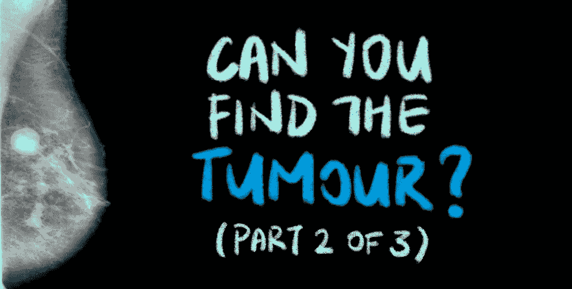
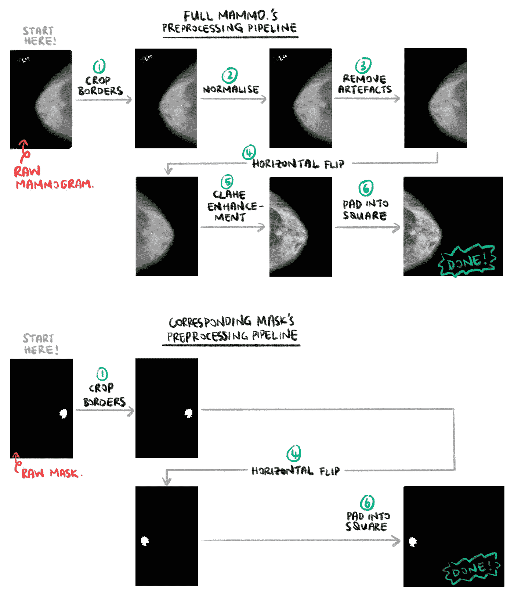
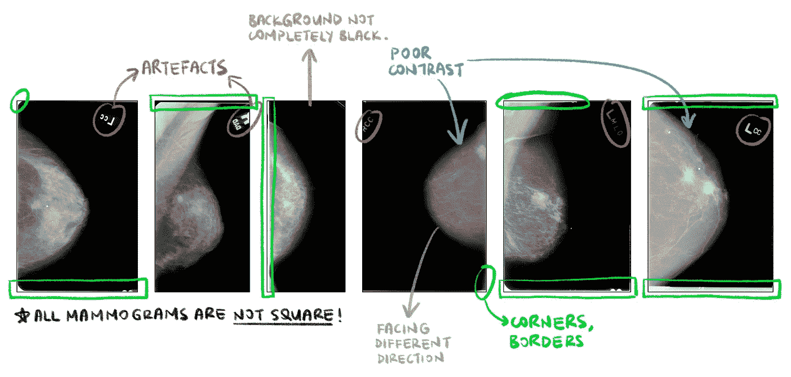
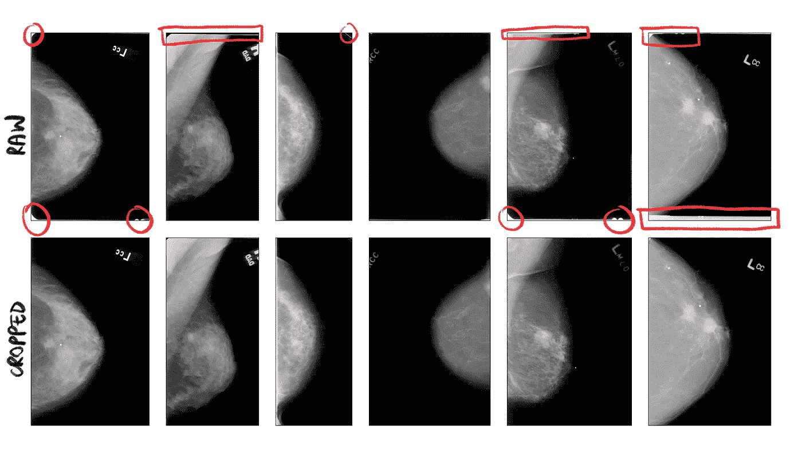
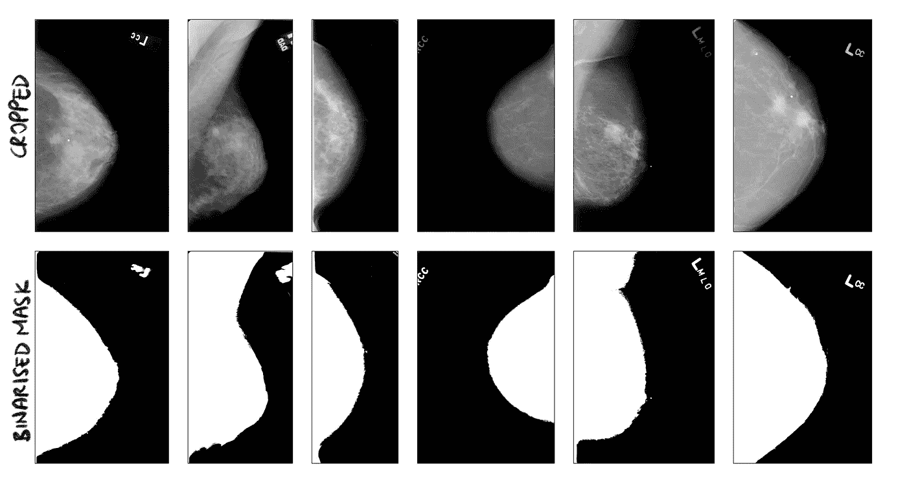
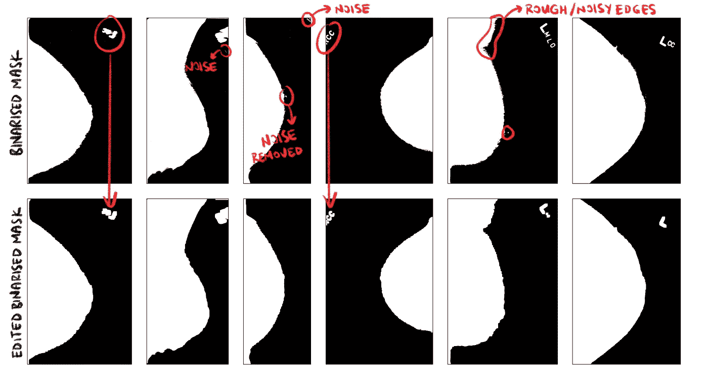
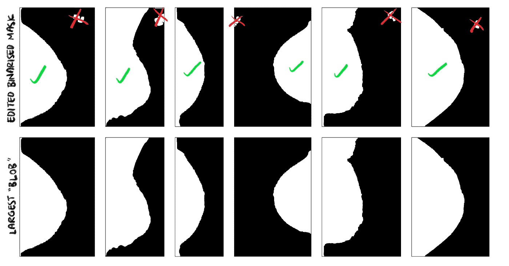
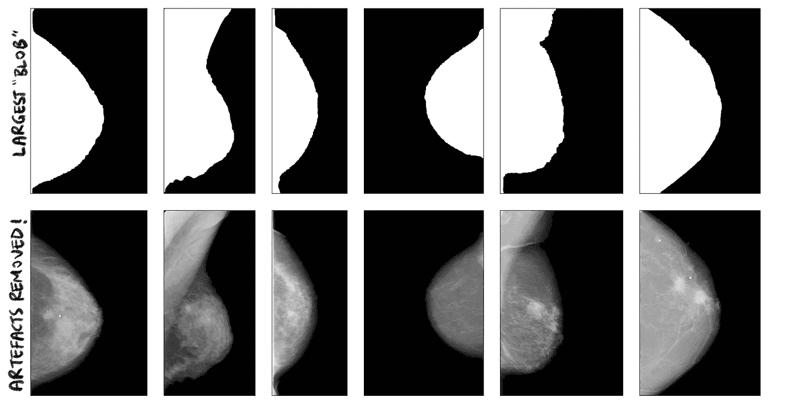
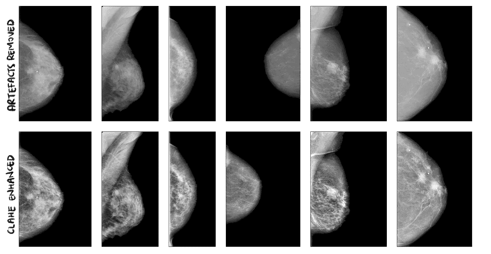
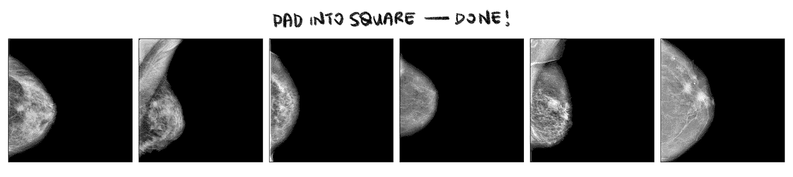

# 分割乳房 x 光片中的异常(第 2 部分，共 3 部分)

> 原文：<https://towardsdatascience.com/can-you-find-the-breast-tumours-part-2-of-3-1d43840707fc?source=collection_archive---------10----------------------->

## 点击导航:[第一部分](/can-you-find-the-breast-tumours-part-1-of-3-1473ba685036) - >第二部分->-[第三部分](/can-you-find-the-breast-tumours-part-3-of-3-388324241035)

## 在 TensorFlow 2 中对乳房 x 光片实施深度学习语义分割管道的分步指南。



作者绘制的图像。从 [CBIS-DDSM](https://wiki.cancerimagingarchive.net/display/Public/CBIS-DDSM) 取回的乳房 x 光片和口罩。

如果你正在阅读这篇文章，很可能我们有着相似的兴趣，从事着相似的行业。所以让我们 [***通过 LinkedIn***](https://www.linkedin.com/in/cleonwong/) *连接起来，在这里我分享我关于 AI 和 ML 的想法和资源的花絮！*

# 文章结构

本文是一个 3 部分系列的第 2 部分，介绍了我如何解决一个深度学习项目**使用图像分割模型** *识别乳房 x 光扫描中的肿块异常。* 作为对项目进行详细分解的结果，这是对计算机视觉中的核心问题之一——**语义分割**的全面概述，也是对在 TensorFlow 2 中执行这个项目的技术细节的深入探究。

## 第一部分:

*   问题陈述。
*   什么是语义切分。
*   数据集下载指南。
*   你会在数据集中找到什么。
*   解开数据集的嵌套文件夹结构。
*   数据探索。

## 第二部分:

*   图像预处理流水线概述。
*   原始乳房 x 光片的一般问题。
*   深入研究原始乳房 x 光片的预处理流程。
*   深入到相应掩码的预处理管道。

## 第三部分:

*   介绍 VGG-16 U-Net 模型。
*   在 TensorFlow 2 中实现模型。
*   训练模型的注意事项。
*   结果和事后分析。
*   结束了。

## GitHub 知识库

这个项目的代码可以在[这个库](https://github.com/CleonWong/Can-You-Find-The-Tumour)的 [my Github](https://github.com/CleonWong) 中找到。

# 上接[第 1 部分](/can-you-find-the-breast-tumours-part-1-of-3-1473ba685036)

我们结束了第一部分 ，很好地理解了问题陈述背后的动机，为什么选择 CBIS-DDSM 数据集，以及数据集中具体提供了哪些数据。在这一部分中，我们将涵盖整个图像预处理管道，它允许我们从原始图像进展到准备好输入语义分割模型的图像。

免责声明:这将是一个深入的教程。这是一个相当长的阅读，但你会留下广泛的知识，一般的图像预处理方法和可重用的代码，您可以添加到自己的图像预处理“工具箱”。

# 1.图像预处理流水线综述


图一。通过图像预处理管道的 6 幅图像的动画样本，显示了每一步的变化。从 DDSM CBIS[取回的乳房 x 光片和口罩](https://wiki.cancerimagingarchive.net/display/Public/CBIS-DDSM)。作者绘制的图像。

图像的图像预处理相当于我们熟悉的其他类型数据(表格数据、文本流等)的“数据清理”。).就像任何其他使用这些类型数据的机器学习管道一样，图像预处理(或数据清理)的目标是**准备好输入模型的数据，提高数据质量，并使模型更容易从最高质量的信息中学习特征和模式**。

我们如何对图像进行预处理，使得“模型更容易从中学习特征和模式”？对此没有一个放之四海而皆准的答案，这在很大程度上取决于我们试图解决的计算机视觉问题和我们使用的图像。

在这个项目中，我们的图像预处理管道由图 2 中所示的步骤组成，我将在接下来的章节中详细解释。



图二。用于全乳房 x 线扫描的图像预处理管道及其相应的二进制地面真实掩模的概述。从 DDSM CBIS[取回的乳房 x 光片和口罩](https://wiki.cancerimagingarchive.net/display/Public/CBIS-DDSM)。作者绘制的图像。

# 2.原始乳房 x 光片的一般问题

为什么管道是这样的？为了理解其背后的直觉，我们需要目测检查原始的乳房 x 光片。这些原始乳房 x 光照片提出了阐明所选图像预处理步骤的一般“问题”。管道的目的是修复这些问题，以便我们最终获得模型可以学习的高质量图像。



图三。选定的原始乳房 x 光片及其需要通过图像预处理管道解决的一般“问题”的注释。问题按颜色分类。从 [CBIS-DDSM](https://wiki.cancerimagingarchive.net/display/Public/CBIS-DDSM) 取回的乳房 x 光片和口罩。作者绘制的图像。

通过对原始乳房 x 光片的视觉检查，我们可以看到乳房 x 光片通常存在以下问题:

*   **一些边缘有明亮的白色边框/角落**。这些边界可能会创建一个任意的边缘，作为模型可以学习的图像中的一个特征。
*   **背景中漂浮的人工制品**。在实践中，这些伪影用作标记，放射科医生使用这些标记来区分左侧乳房和右侧乳房，并且还识别扫描的方向。例如，我们看到“LCC ”,它表示左侧乳房，CC 方向。
*   **乳房朝向的方向**不一致。一些面向左，而另一些面向右。这是一个问题，因为它可能会使图像预处理变得复杂。
*   有些乳房 x 光片的对比度**差**。这使得乳房区域看起来几乎是单调的灰色，导致乳房组织和肿块异常之间几乎没有纹理和有意义的差异。这可能会减缓模型的学习。
*   由于这些乳房 x 光片是从实际的硬拷贝扫描并保存为软拷贝，因此**背景并不是全黑的**。背景可能包含不经意间可学习但无意义的特征，这些特征对人眼来说是不可见的。
*   图像**不是方形的**。大多数计算机视觉深度神经网络模型要求输入图像是正方形的。

# 3.深入研究原始乳房 x 光片的预处理流程

我们将首先解释乳房 x 线照片扫描的图像预处理步骤，然后解释它们对应的二元掩模的步骤。

我为每一步都编写了一个助手函数，因为这使得管道更加模块化，并且能够轻松执行整个管道。为了简洁起见，我删除了 doc 字符串和 try-except 块。访问我的[库，在这里](https://github.com/CleonWong/Can-You-Find-The-Tumour)访问完整的代码。

```
import numpy as np
import cv2
import pydicom
```

## 3.1.步骤 1-裁剪边框

**这一步解决:**亮白色边框/边角。

步骤 1 —裁剪订单()。点击 [**此处**](https://github.com/CleonWong/Can-You-Find-The-Tumour/blob/master/src/modules/imagePreprocessing/imagePreprocessing.py) 查看完整代码。

我从左右边缘剪切了图像宽度的 1%,从上下边缘剪切了图像高度的 4%。不同的乳房 x 光扫描具有不同厚度的边界。经过反复试验，我发现这些百分比可以很好地去除乳房 x 光扫描中的大部分边界。虽然分割算法是一种更复杂的识别每张乳房 x 光照片边界的方法，但我选择了这种有点基础的方法，因为它更快，并且它对大多数图像的结果对我们的用例来说足够好。毕竟，在图像预处理管道中使用分割算法来完成分割任务是一种大材小用。



图 4。图像预处理流程的第一步——裁剪边框。以红色突出显示的是需要移除的边框和边角示例。从 [CBIS-DDSM](https://wiki.cancerimagingarchive.net/display/Public/CBIS-DDSM) 取回的乳房 x 光片和口罩。作者绘制的图像。

## 3.2.步骤 2-最小-最大归一化

**这一步求解:**像素值范围从[0，65535]到[0，1]。

步骤 2 —最小最大规格化()。点击 [**此处**](https://github.com/CleonWong/Can-You-Find-The-Tumour/blob/master/src/modules/imagePreprocessing/imagePreprocessing.py) 查看完整代码。

乳房 x 光片以 16 位数组的形式保存在。dcm 文件。这意味着像素值的范围从[0，65535] (2 ⁶ = 65535)。这些大整数值可能会减慢神经网络的学习过程。因此，将这些值归一化到[0，1]范围内是一种很好的做法。当使用 [OpenCV](https://opencv.org/) 和 [Matplotlib](https://matplotlib.org/) 库时，范围为[0，1]也使图像可视化更简单。

## 3.3.第 3 步——消除假象

**该步骤解决:**背景中漂浮的赝像。

消除赝像是一个复杂的过程，可以通过多种方式实现。伪影可以以不同的大小和强度出现，并且它们可以位于图像的几乎任何部分，这取决于乳房面对的方向。

***第三步*会实现两件事。去除任何伪像，并确保背景完全是黑色的(即像素值为 0)。**

为了消除假象，我按照以下顺序实现了四个函数:

1.  `globalBinarise()`
2.  `editMask()`
3.  `sortContoursByArea()`
4.  `xLargestBlobs()`

让我们从头开始建立每个功能背后的直觉。

从根本上说，我们需要认识到**去除伪影与仅保留乳房 x 光照片中的乳房区域**达到了相同的效果。乳房区域保持不变，其他一切都应该是背景(即完全黑色)。有了这种直觉，我们现在可以重新表述从以下对象中移除人工制品的问题:

*   **定位并移除人工制品**以…
*   **定位乳房区域，保留它，然后移除其他所有内容。**

这一重新表述的目标正是这四项职能所要实现的。

Bi 目测，可以肯定的说大部分背景像素非常接近黑色(即像素值非常接近 0)。利用这种直觉，我们可以使用阈值(`thresh`)对乳房 x 线照片进行二值化，以创建二值掩模，其中 0 表示背景像素，1 表示属于乳房区域、伪影或噪声的像素。这就是`globalBinarise()`函数的作用。

步骤 3a — globalBinarise()。点击 [**此处**](https://github.com/CleonWong/Can-You-Find-The-Tumour/blob/master/src/modules/imagePreprocessing/imagePreprocessing.py) 查看完整代码。



图五。图像预处理流水线的步骤 3a。从 DDSM CBIS[取回的乳房 x 光片和口罩](https://wiki.cancerimagingarchive.net/display/Public/CBIS-DDSM)。作者绘制的图像。

上面显示了`globalBinarise()`的输出。实际上，我们看到任何为 0(黑色)的像素属于背景，任何为 1(白色)的像素或者是赝像、乳房或者是背景噪声(例如背景中的斑点)。

在生成二值掩模之后，我们在掩模中扩展白色轮廓的边界。这确保了我们真正捕捉到任何人工制品的整个区域，包括其边界。这是通过使用函数`editMask()`中的开始形态操作来完成的。

步骤 3b —编辑掩码()。点击 [**此处**](https://github.com/CleonWong/Can-You-Find-The-Tumour/blob/master/src/modules/imagePreprocessing/imagePreprocessing.py) 查看完整代码。



图六。图像预处理流水线的步骤 3b。从 DDSM CBIS 取回的乳房 x 光片和口罩。作者绘制的图像。

现在我们有了编辑过的二进制掩模，我们面临下一个问题——二进制化将乳房区域和伪影都识别为 1(即白色区域)。我们现在需要知道哪个白色轮廓属于乳房区域，因为这是我们想要保留的区域。下面是下一个直观的推理——**从视觉检查来看，乳房轮廓几乎总是二元掩模中最大的轮廓**。因此，如果我们能够根据它们的面积来计算和分类每个轮廓，我们将能够将乳房轮廓识别为具有最大面积的轮廓。这正是`sortContoursByArea()`所做的。

步骤 3c — sortContoursByArea()。点击 [**此处**](https://github.com/CleonWong/Can-You-Find-The-Tumour/blob/master/src/modules/imagePreprocessing/imagePreprocessing.py) 查看完整代码。

有了排序后的轮廓，我们现在可以选择要在乳房 x 光照片中保留哪些轮廓。如上所述，由于乳房区域是掩模中最大的区域，并且它几乎总是被二值化为单个区域，所以我们可以有把握地说，掩模中的顶部 1 轮廓是我们想要从原始乳房 x 光照片中保留的唯一区域。这就是`xLargestBlobs()`的作用。它保留最大的`x`斑点(也称为轮廓)并丢弃其余的。我使用了`x=1`，但是该函数可以接受`x`的任何值。

步骤 3d — xLargestBlobs()。点击 [**此处**](https://github.com/CleonWong/Can-You-Find-The-Tumour/blob/master/src/modules/imagePreprocessing/imagePreprocessing.py) 查看完整代码。



图 7。图像预处理流水线的步骤 3c 和 3d。从 DDSM CBIS[取回的乳房 x 光片和口罩](https://wiki.cancerimagingarchive.net/display/Public/CBIS-DDSM)。作者绘制的图像。

最后，我们可以使用这个遮罩来掩盖原始图像中的伪影。乳房 x 光检查。这意味着“保留白色区域，将其他区域设置为黑色”。`applyMask()`正是如此。

步骤 3e —应用屏蔽()。点击 [**此处**](https://github.com/CleonWong/Can-You-Find-The-Tumour/blob/master/src/modules/imagePreprocessing/imagePreprocessing.py) 查看完整代码。



图 8。图像预处理流水线的步骤 3e。从 DDSM CBIS[取回的乳房 x 光片和口罩](https://wiki.cancerimagingarchive.net/display/Public/CBIS-DDSM)。作者绘制的图像。

而且……我们已经完成了移除艺术品的工作！现在，你可以看到上面提到的步骤是如何帮助我们实现两件事的——**去除任何伪像，使背景完全变黑(即像素值为 0)** 。

现在已经忙得不可开交了，休息一下，让我们进入流水线的第 4 步。

## 3.4.步骤 4 —水平翻转

**这一步解决:**乳房方向不一致。

这个步骤标准化了乳房在所有乳房 x 光照片中所面对的方向。在数据集中，大多数乳房区域位于乳房 x 光片的左侧，面向右侧。本能地，将所有的乳房 x 光片定位在相同的方向似乎没有必要，因为它们将在数据扩充期间随机翻转(这将在第 3 部分 的 [*中介绍)。*](/can-you-find-the-breast-tumours-part-3-of-3-388324241035)

虽然这是真的，但确保所有乳房 x 光片都在左边会使我们在*步骤 6* 中填充乳房 x 光片时更容易。为什么会这样呢？因为所有的乳房区域都在左边，我们知道我们只需要填充每张乳房 x 光片的右边来形成一个正方形！

`checkLRFlip()`首先检查乳房 x 光片是否需要翻转。这是通过比较乳房 x 线照片左半部分和右半部分的像素值的总和来实现的。如果后者大于前者，则意味着乳房区域在右侧，需要翻转，然后由函数`makeLRFlip()`完成。

步骤 4 — checkLRFlip()和 makeLRFlip()。点击 [**此处**](https://github.com/CleonWong/Can-You-Find-The-Tumour/blob/master/src/modules/imagePreprocessing/imagePreprocessing.py) 查看完整代码。

## 3.5.步骤 5 — CLAHE 增强

**这一步解决:**乳腺组织对比度差。

对比度受限的自适应直方图均衡化(CLAHE)用于增强灰度图像的对比度。这有助于增强乳房 x 光照片中的小细节、纹理和特征，否则这些细节、纹理和特征对于模型学习来说是有挑战性的。

注意，因为背景现在是全黑的(来自*步骤 3* ，我们不会遇到背景中的噪声被无意增强的问题。`clahe()`执行对比度增强。

第 5 步— clahe()。点击 [**此处**](https://github.com/CleonWong/Can-You-Find-The-Tumour/blob/master/src/modules/imagePreprocessing/imagePreprocessing.py) 查看完整代码。



图九。图像预处理流水线的步骤 4 和 5。从 DDSM CBIS[取回的乳房 x 光片和口罩](https://wiki.cancerimagingarchive.net/display/Public/CBIS-DDSM)。作者绘制的图像。

## 3.6.第六步——垫成正方形

**这一步解决:**图像不是正方形。

最后一步是将图像填充成正方形。这是必要的，因为大多数(如果不是全部)计算机视觉模型接受正方形图像作为输入。为此，`pad()`检索乳房 x 光片的尺寸，并在其右侧边缘添加必要数量的黑色像素列。

由于在执行*步骤 3* 后背景完全为黑色，添加黑色像素不会在最终的正方形图像中引入任意边缘。

第 6 步—填充()。点击 [**此处**](https://github.com/CleonWong/Can-You-Find-The-Tumour/blob/master/src/modules/imagePreprocessing/imagePreprocessing.py) 查看完整代码。



图 10。最后一步，图像预处理流水线的第 6 步。从 DDSM CBIS[取回的乳房 x 光片和口罩](https://wiki.cancerimagingarchive.net/display/Public/CBIS-DDSM)。作者绘制的图像。

## 3.7.链接步骤以形成流水线


图 11。通过图像预处理管道的 6 幅图像的动画样本，显示了每一步的变化。从 DDSM CBIS[取回的乳房 x 光片和口罩](https://wiki.cancerimagingarchive.net/display/Public/CBIS-DDSM)。作者绘制的图像。

最后，我们使用下面的`fullMammoPreprocess()`助手函数将上面提到的 6 个步骤连接起来。对于该函数接收的每一张原始乳房 x 光片(`img`)，它都将其通过管道，并输出其预处理后的形式(`img_pre`)和一个布尔值`lr_flip`。如果`lr_flip = True`，我们知道乳房 x 光片已经在*步骤 4* 中翻转，否则它没有翻转。这对预处理二进制掩码很重要，这将在第 4 节的*中解释。*

将管道连接在一起。点击 [**此处**](https://github.com/CleonWong/Can-You-Find-The-Tumour/blob/master/src/modules/imagePreprocessing/imagePreprocessing.py) 查看完整代码。

而且……我们已经完成了原始乳房 x 光片的图像预处理流程！

# 4.深入研究相应掩码的预处理管道

预处理每张乳房 x 光照片的相应掩模背后的直觉很简单。为了建立直觉，我们需要了解模型是如何使用遮罩的。

## 4.1.管道

二进制掩码被用作基本事实标签。这些标签用于在训练过程中通过将误差与模型的预测分割进行比较来计算误差。因此，每个预处理的乳房 x 光照片需要其对应的二元掩模具有相同的形状并且面向相同的方向。**因此，我们需要对每个对应的蒙版执行*步骤 1* (裁剪边框)*步骤 4* (水平翻转)*步骤 6* (填充)。**这解释了为什么我们需要在`fullMammoPreprocess()`中返回布尔变量`lr_flip`。它告诉我们是否需要对每个掩模执行*步骤 4* 。

由于掩模是二进制的(即像素值仅为 0 或 1)，因此不需要增强、噪声去除或归一化。这意味着*步骤 2* (最小-最大归一化)*步骤 3* (去除伪影)和*步骤 5* (CLAHE 增强)是不必要的。

因此，我们简单地编写了一个名为`maskPreprocess()`的函数，它将为上述原始乳房 x 光片的预处理编写的*步骤 1* 、*步骤 4* 和*步骤 6* 的必要辅助函数链接起来。

对应掩模的图像预处理流水线。点击 [**此处**](https://github.com/CleonWong/Can-You-Find-The-Tumour/blob/master/src/modules/imagePreprocessing/imagePreprocessing.py) 查看完整代码。

## 4.2.求和掩模(参见第 1 部分的[第 6.1 节)](/can-you-find-the-breast-tumours-part-1-of-3-1473ba685036)

最后一件事。作为掩模预处理的一部分，我们需要对包含一个以上肿块异常的乳房 x 光片的掩模求和(如第 1 部分 的 [*第 6.1 节所述)。正如所承诺的，下面是对包含多个肿块异常的乳房 x 线照片掩模求和的代码。你可以在我的库*](/can-you-find-the-breast-tumours-part-1-of-3-1473ba685036)*[这里](https://github.com/CleonWong/Can-You-Find-The-Tumour/blob/master/src/modules/imagePreprocessing/mergeMultiTumour.py#L130-L164)找到全部代码。*

具有一个以上肿块异常的乳房 x 线照片的总和掩模。参见第一部分 的 [*第 6.1 节。点击*](/can-you-find-the-breast-tumours-part-1-of-3-1473ba685036) *[**此处**](https://github.com/CleonWong/Can-You-Find-The-Tumour/blob/master/src/modules/imagePreprocessing/mergeMultiTumour.py#L130-L164) 查看完整代码。*

# 接下来，[第 3 部分](/can-you-find-the-breast-tumours-part-3-of-3-388324241035):构建图像分割模型

恭喜你坚持到这篇文章的结尾！在这篇文章中，我们对原始乳房 x 光片的图像预处理管道及其相应的掩模有了很好的直觉。因此，我们选择了一些通用的图像预处理辅助函数，可以将它们添加到现有的图像预处理工具包中。

在 [*第 3 部分*](/can-you-find-the-breast-tumours-part-3-of-3-388324241035) 中，我们将通过检查选择的图像分割模型(提示—它是一种 U-Net)、在 Tensorflow 2 中实现它、训练模型并最终评估结果来结束这个项目。

和往常一样，这个项目的代码可以在这个库的 [my Github](https://github.com/CleonWong) 中找到。

# 谢谢你

如果你已经读完了这篇文章，我希望你喜欢这篇文章。如果这篇文章给你自己的项目带来了一些灵感、价值或帮助，请随意与你的社区分享。此外，任何建设性的问题、反馈或讨论都是绝对受欢迎的，所以请随时在下面评论，或者在 LinkedIn 上联系我，这里是 或 [***Twitter，地址是@CleonW_***](https://twitter.com/cleonw_?lang=en) 。

请在 Medium ( [Cleon Wong](https://medium.com/u/25cfa5ca1084?source=post_page-----1d43840707fc--------------------------------) )上关注我，了解我的下一篇文章！

[*第三部*](/can-you-find-the-breast-tumours-part-3-of-3-388324241035) 见！