# 分割乳房 x 光片中的异常(第 3 部分，共 3 部分)

> 原文：<https://towardsdatascience.com/can-you-find-the-breast-tumours-part-3-of-3-388324241035?source=collection_archive---------12----------------------->

## 点击导航:[第一部分](/can-you-find-the-breast-tumours-part-1-of-3-1473ba685036)->-[第二部分](/can-you-find-the-breast-tumours-part-2-of-3-1d43840707fc) - >第三部分

## 在 TensorFlow 2 中对乳房 x 光片实施深度学习语义分割管道的分步指南

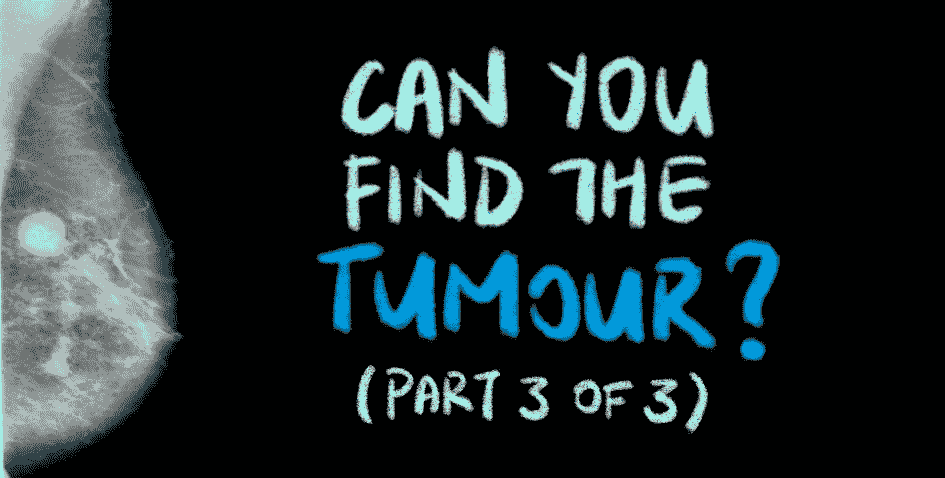

**饼干**——乳房 x 光片的答案将在本文结尾揭晓！图片作者。从 DDSM CBIS[取回的乳房 x 光片和口罩](https://wiki.cancerimagingarchive.net/display/Public/CBIS-DDSM)。

如果你正在阅读这篇文章，很可能我们有着相似的兴趣，从事着相似的行业。所以让我们 [***通过 LinkedIn***](https://www.linkedin.com/in/cleonwong/) *连接起来，在这里我分享我关于 AI 和 ML 的想法和资源的花絮！*

# 文章结构

这篇文章是一个 3 部分系列的第 3 部分，讲述了我如何解决一个深度学习项目，即使用图像分割模型 *识别乳房 x 光扫描中的肿块异常。* 作为对项目进行详细分解的结果，这是对计算机视觉中的核心问题之一——**语义分割**的全面概述，也是对在 TensorFlow 2 中执行这个项目的技术细节的深入探究。

## [第一部分](/can-you-find-the-breast-tumours-part-1-of-3-1473ba685036):

*   问题陈述。
*   什么是语义切分。
*   数据集下载指南。
*   你会在数据集中找到什么。
*   解开数据集的嵌套文件夹结构。
*   数据探索。

## [第二部分](/can-you-find-the-breast-tumours-part-2-of-3-1d43840707fc):

*   图像预处理流水线概述。
*   原始乳房 x 光片的一般问题。
*   深入研究原始乳房 x 光片的预处理流程。
*   深入到相应掩码的预处理管道。

## 第三部分:

*   介绍 VGG-16 U-Net 模型。
*   在 TensorFlow 2 中实现模型。
*   训练模型的注意事项。
*   结果和事后分析。
*   结束了。

## GitHub 知识库

这个项目的代码可以在[这个库](https://github.com/CleonWong/Can-You-Find-The-Tumour)的 [my Github](https://github.com/CleonWong) 中找到。

# 从[第二部分](/can-you-find-the-breast-tumours-part-2-of-3-1d43840707fc)继续

我们结束了 [*第二部分*](/can-you-find-the-breast-tumours-part-2-of-3-1d43840707fc) ，深入了解了我们的图像预处理流程，以及每个图像预处理步骤的可重用代码。通过管道，我们能够从原始图像进展到预处理图像，这些图像可以被输入到分割模型中。

在这一部分中，我们将介绍所选分割模型(VGG 16 U 网)背后的直觉，如何在 Tensorflow 2 中实现它，以及对结果的评估。

# 1.介绍 VGG-16 U-Net 模型

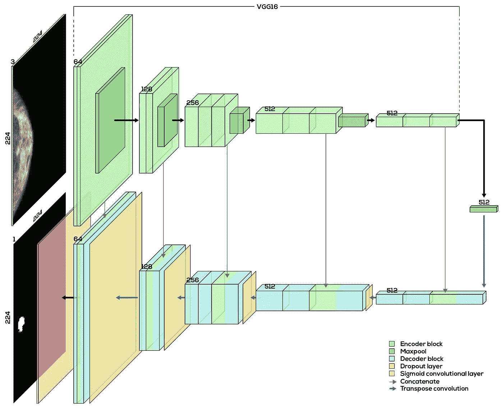

**图 1** VGG U-Net 模型架构。从 DDSM CBIS[取回的乳房 x 光片和口罩](https://wiki.cancerimagingarchive.net/display/Public/CBIS-DDSM)。作者绘制的图像。

自从 Olaf Ronneberger 等人在 2015 年发布他的论文[“U-Net:用于生物医学图像分割的卷积网络”](https://arxiv.org/abs/1505.04597)中开发并记录了 U-Net 架构，U-Net 已经成为用于分割任务的常见架构。它包括两个主要部分——编码器模块**(图的上半部分)和解码器模块**(图的下半部分)。这两个部分一起形成了一个 U 形，这解释了它的名字。****

U-Net 的高层次直觉就是如此。编码器模块学习特征并告诉我们“图像中有什么”，就像在分类任务中一样。然后，解码器模块在语义上将编码器模块学习的这些低分辨率特征投射回原始输入图像的全分辨率像素空间，为我们提供全分辨率分割图。

**编码器块:**通常是卷积层和最大池层的传统序列。可以把它想象成一个典型的卷积神经网络(CNN)架构，用于分类任务，但没有最后的密集层*(这些类型的网络被称为[全卷积网络(FCN)](https://arxiv.org/pdf/1411.4038.pdf) )。这个 FCN 可以是你自己设计的，也可以取自任何现有的 CNN，如 [AlexNet](https://papers.nips.cc/paper/2012/hash/c399862d3b9d6b76c8436e924a68c45b-Abstract.html) 、 [VGG-16](https://arxiv.org/abs/1409.1556) 或 [ResNet](https://arxiv.org/abs/1512.03385) 。对于这项任务，我选择了 VGG-16 的编码器块(没有最终的密集层)，因为我比其他 CNN 模型更好地理解它。*

**解码器模块:**它是与编码器模块对称的上采样卷积和级联层的网络。从图 1 的*中可以看出，从编码器块中选择的特征映射被连接到它们在解码器块中的相应层。由于 CNN 的早期层倾向于学习低级特征，而后期层学习更高级的特征，这种连接允许 U-Net 映射在所有级别上学习的特征，以产生最终的全分辨率预测分割图。*

我强烈建议你阅读这篇文章，以获得关于 U-Net 架构的更深入的解释。

# 2.在 Tensorflow 2 中实现模型

```
import tensorflow as tffrom tensorflow import keras
```

在实际代码中，我将模型实现为一个名为`unetVgg16`的 Python 类对象。为了简洁起见，我只包含了下面代码中对实现至关重要的部分。您应该访问[项目的存储库](https://github.com/CleonWong/Can-You-Find-The-Tumour/blob/master/src/lib/unet/unetVgg16.py)以获得实现该模型的完整代码。

函数`buildEncoder()`用于在迁移学习的帮助下构建 U-Net 的编码器部分。在第 3 行到第 8 行，我导入了 VGG-16 模型，其权重在来自 Keras 模型动物园的 ImageNet 数据集上进行了预训练。设置`include_top=False`从 VGG 16 中移除我们不想要的密集层(密集层被认为是 Keras 中的顶层)，只给我们留下 VGG 16 的 FCN 部分。如果你对迁移学习不熟悉，这篇文章应该给你一个很好的、温和的介绍。

使用迁移学习构建模型的编码器部分。点击 [**此处**](https://github.com/CleonWong/Can-You-Find-The-Tumour/blob/master/src/lib/unet/unetVgg16.py) 查看完整代码。

然后，函数`buildUnet()`构建解码器，从而构建整个 U-Net 架构。它调用`buildEncoder()`函数来创建编码器模块，并在其上构建解码器模块，最终形成 VGG-16 U-Net 的完整架构。如图 1 中的*所示，解码器模块中有 5 个子模块，模块 5 从图的右侧开始，接着是左侧的最后一个卷积层(红色)。*

由于`buildUnet()`函数包含近 300 行代码(因为它包含文档字符串、注释和换行符)，您可以参考[这里的库](https://github.com/CleonWong/Can-You-Find-The-Tumour/blob/master/src/lib/unet/unetVgg16.py#L170)获取完整代码。在浏览代码时，记住以下几点很重要:

*   `keras.layers.Conv2D()`构建传统卷积层。
*   `keras.layers.Dropout()`插入传统的脱落层。
*   `keras.layers.Concatenate()`在每个子块的开始执行连接。
*   `keras.layers.Conv2DTranspose()`负责每个子块之间特征图的上采样。这是将编码器块学习的低分辨率特征映射投影到原始图像的全分辨率像素空间。

# 3.训练模型的注意事项

既然我们已经适当地预处理了图像(来自 [*第二部分*](/can-you-find-the-breast-tumours-part-2-of-3-1d43840707fc) )并建立了模型，现在是训练模型的时候了。

我想重点谈谈训练管道的两个方面，它们对于这一分割任务至关重要且独一无二——图像增强和创建在每个训练时期结束时跟踪的自定义 IOU 指标。

## **3.1。图像增强**

图像增强可用于从现有的训练数据中人工创建新的训练数据，也可用于**在数据集**中引入可变性。

有许多图像放大可以做，其中我选择了以下来执行:

1.  随机水平翻转(概率 50%)。
2.  随机垂直翻转(概率 50%)。
3.  随机亮度调节。

如果你想阅读更多关于 TensorFlow 中其他可能的图像增强的内容，[这篇文章](/exploring-image-data-augmentation-with-keras-and-tensorflow-a8162d89b844)是一个很好的起点。

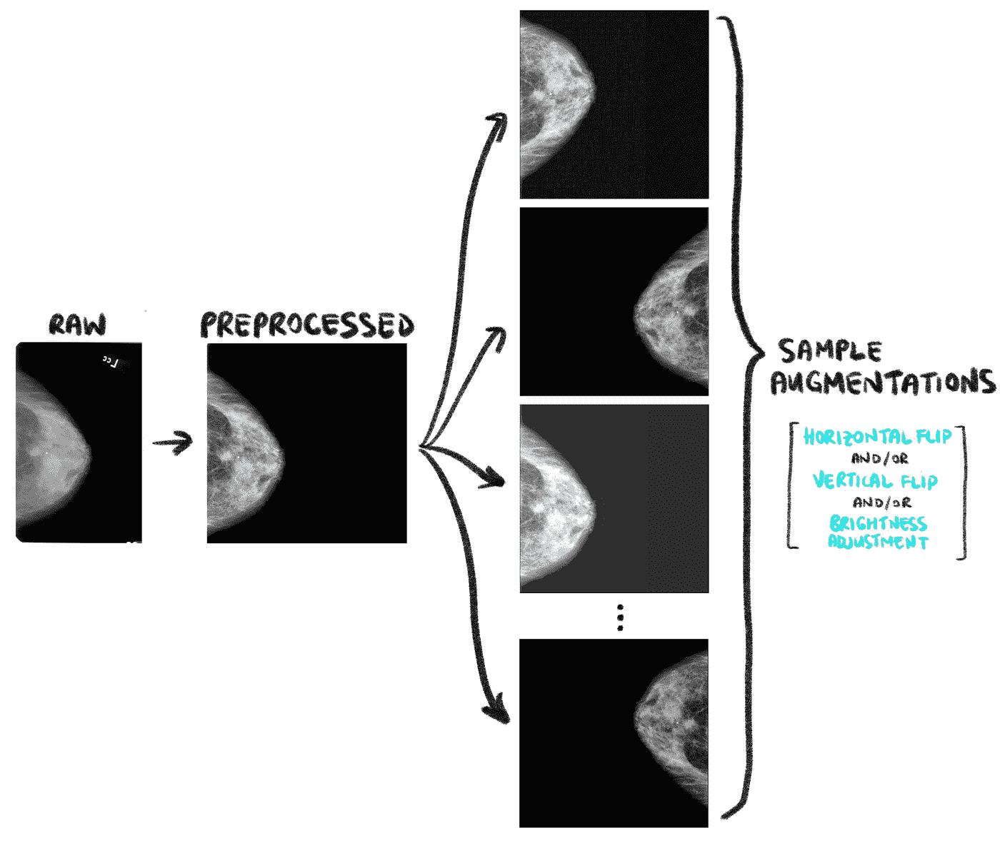

**图 2** 图像增强样本图像。从 DDSM CBIS[取回的乳房 x 光片和口罩](https://wiki.cancerimagingarchive.net/display/Public/CBIS-DDSM)。作者绘制的图像。

下面的代码片段显示了如何在 TensorFlow 2 中实现随机的水平翻转、垂直翻转和亮度调整。和往常一样，你可以参考[项目的资源库](https://github.com/CleonWong/Can-You-Find-The-Tumour)获取[的完整代码](https://github.com/CleonWong/Can-You-Find-The-Tumour/blob/master/src/lib/unet/unetVgg16.py#L723-L788)。

imgAugment() —用于图像增强的辅助函数。点击 [**此处**](https://github.com/CleonWong/Can-You-Find-The-Tumour/blob/master/src/lib/unet/unetVgg16.py#L723-L788) 查看完整代码。

我们必须记住，只有适当的图像增强才能帮助我们的模型学习！当选择合适的增强时，最重要的考虑之一是增强必须实际产生对我们的任务有意义的真实图像。

那么，什么是不切实际和无意义的图像，可以从不适当的扩大？*图 3* 举例说明了对预处理后的乳腺照片进行随机旋转、剪切、宽度移动和高度移动的结果。

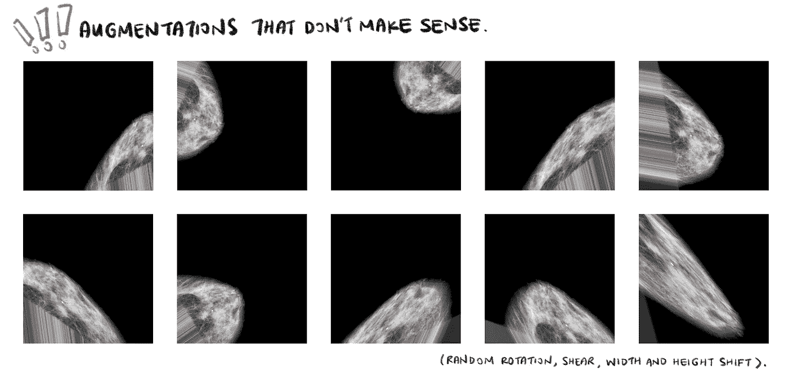

**图 3** 不适用于我们用例的图像增强(随机旋转、剪切、宽度移动和高度移动)示例。从 DDSM CBIS[取回的乳房 x 光片和口罩](https://wiki.cancerimagingarchive.net/display/Public/CBIS-DDSM)。作者绘制的图像。

上面的图像是不现实的，没有意义的，因为我们在现实中几乎不会遇到这样的乳房 x 光片！当我们将这种无意义的图像输入到我们的模型中时，模型将学习对分割问题没有意义的特征，并减慢其收敛速度。还要记住，这些剪切、旋转和移动也必须应用到蒙版上，这也是非常不现实和没有意义的。

换句话说，当选择正确的图像增强来执行时，我们必须问自己，**“以这种方式增强图像有意义吗？”**

## 3.2.创建自定义 IOU 指标

TensorFlow 允许我们通过`[compile](https://www.tensorflow.org/api_docs/python/tf/keras/Model#compile)` [API](https://www.tensorflow.org/api_docs/python/tf/keras/Model#compile) 中的`metrics`参数在每个训练时期结束时跟踪某些指标。通常，我们使用准确度、精确度和均方误差等指标。然而，这些度量并不十分适用于语义分割问题。相反，更常用的是**交集/并集(IoU)** 指标。

简而言之，IoU 是预测分割和基础事实之间的重叠百分比，除以预测分割和基础事实之间的联合面积。使用下面图 4 中的插图可以更好地解释这一点。

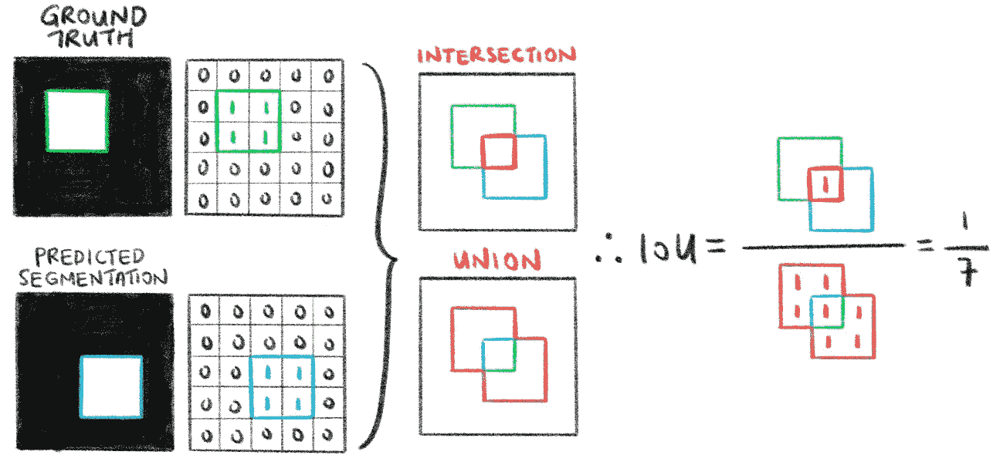

**图 4** 计算预测分割的 IoU 的简化示例。欠条是用浮点数(或分数)还是百分比来表示并不重要。作者绘制的图像。

从图示中，我们看到 IoU 的范围从 0 到 1；当预测的分割完全关闭(即，根本不与基础事实相交)时为 0，当预测的分割与基础事实完全匹配时为 1。我强烈建议阅读本文中标题为*“为什么我们使用交集而不是并集】*的部分，以更好地理解这一指标。

下面的代码片段展示了如何在 TensorFlow 中实现 IoU。参考这里的[完整代码](https://github.com/CleonWong/Can-You-Find-The-Tumour/blob/master/src/lib/unet/unetVgg16.py#L888-L949)来看看我是如何在 TensorFlow 的`compile` API 中实现它的。

使用基础真值掩码(y-true)和预测分段(y_pred)计算交集/并集度量的自定义函数。点击 [**此处**](https://github.com/CleonWong/Can-You-Find-The-Tumour/blob/master/src/lib/unet/unetVgg16.py#L909-L914) 查看完整代码。

## 3.3.训练模型

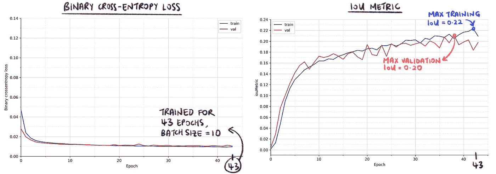

**图 5** 跨 43 个训练时期的二进制交叉熵损失函数和 IoU 检查点的图表。图中的每个点是每个训练(和验证)时期的平均损耗值和平均 IoU。作者绘制的图像。

最后，在以下配置下训练模型，图 5 显示了训练结果。

*   **历元数:** 43(被 Keras 的早期停止)
*   **批量大小:** 10
*   **学习率:** 0.00001
*   **辍学率:** 0.5
*   **损失函数:**二值交叉熵损失
*   乐观者:亚当

训练和验证借据的最大值在 0.20 左右。

# 4.结果和事后分析

在本文的最后一部分，我们深入分析模型的预测分割(也称为预测遮罩)。由于没有很多文献对这一特定的细分问题进行了研究，因此没有可供我们比较的基准。因此，我们将目视检查掩模，并使用“第一原理”方法对结果进行启发式和逻辑评估。

## 4.1.分析预测的掩模

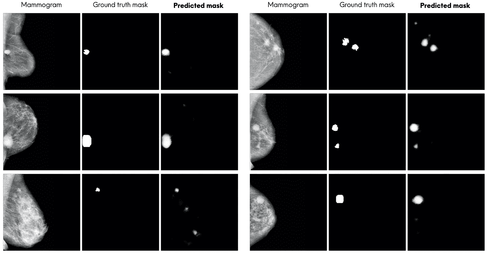

**图 6** 预测分割的样本(最后一列)。从 [CBIS-DDSM](https://wiki.cancerimagingarchive.net/display/Public/CBIS-DDSM) 取回的前两列乳房 x 光片和口罩。

通过快速目测，预测的分割看起来*相当准确*(注意“相当准确”将在*第 4.4 节*中更正式地定义)。该模型能够分割大多数肿块异常。看起来模型的主要错误是分割了比地面真相遮罩中更多的区域(而不是分割得更少)。通常，这些额外的区域是乳房 x 光照片中的亮点，看起来非常像肿块异常。

请注意，模型的预测掩膜是软掩膜(与硬二进制掩膜相对，如数据集中的地面真实掩膜)。这是由于 U 形网的最终 s 形图层导致预测遮罩中的值介于 0.0 和 1.0 之间。这些像素值可以被解释为每个像素属于“异常”类别的概率(1.0 表示该像素是异常的确定性)。

## 4.2.0.2 的 IoU 就一定不好吗？不完全是。

虽然预测的分段通常看起来是可接受的，但是很自然地，看着图 5 中的 IoU 图，并且问，**“为什么训练(和验证)时期的最高平均 IoU 只有大约 0.20？”**(其他分段题有时会有 0.80 以北的白条)。

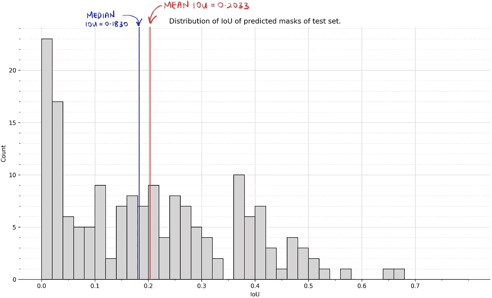

**图 7** 测试集图像的 IoU 分布。IoU 中值为 0.1830，平均值为 0.2033。作者绘制的图像。

在我们解决这个问题之前，请注意，模型产生的软掩码可能会导致 iou 低于硬掩码。这是有争议的，因为从软遮罩创建硬遮罩需要一些二值化技术，如阈值处理，这可能会影响 IoU 得分。然而，模型输出的柔化蒙版是需要记住的。

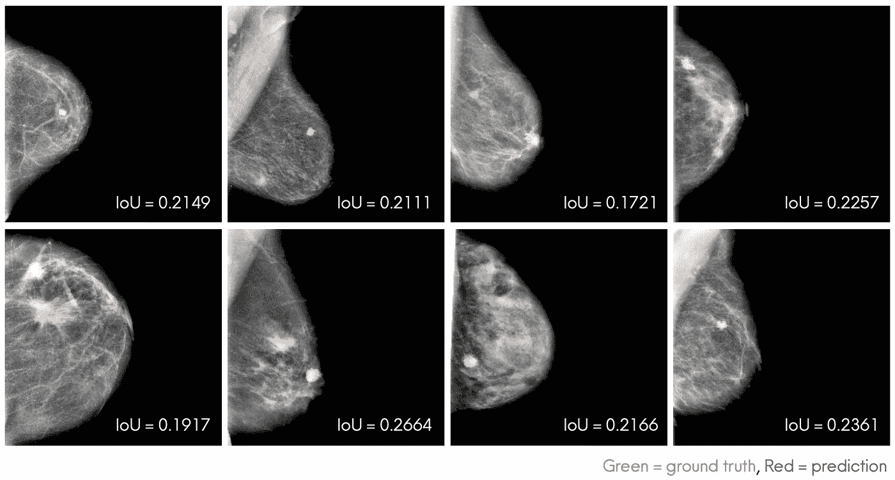

**图 8** 预测 iou 在 0.20 范围内的掩码。绿色区域表示地面真实遮罩，红色区域表示模型的预测遮罩。从 DDSM CBIS[取回的乳房 x 光片和口罩](https://wiki.cancerimagingarchive.net/display/Public/CBIS-DDSM)。作者绘制的图像。

要解决问题，更重要的是看预测出来的借据在 0.20 左右的口罩，如上图*图 8* 所示，看是否可以接受。从这些掩码中，我们看到它们实际上是可以接受的，尽管它们的 IoU 分数很低，但与地面真相掩码没有太大的不同。同样非常重要的是，该模型能够在大多数乳房 x 光照片中分割肿块异常的细胞核。在一些乳房 x 光照片中，该模型甚至分割出了看起来确实像肿块的区域，而地面真相掩盖没有捕捉到这些区域。

因此，0.20 左右的平均 IoU 对于我们的特定分段问题来说实际上相当不错，对这种低 IoU 的一种可能解释可能是模型输出的软屏蔽。

## 4.3.看着最低的借条

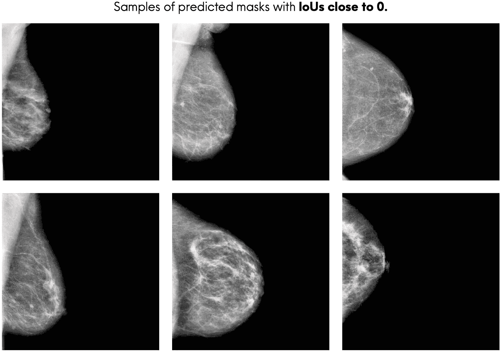

***图 9*** 借据接近 0 的预测掩码样本。绿色区域是地面真实遮罩，红色区域是预测遮罩。从 DDSM CBIS[取回的乳房 x 光片和口罩](https://wiki.cancerimagingarchive.net/display/Public/CBIS-DDSM)。

看预测的白条最低的口罩也很重要。*上面的图 9* 示出了当异常非常小时，当乳房区域具有密集的乳房组织网时，或者两者兼有时，该模型在分割肿块异常时表现不佳。

## 4.4.3 种最常见质量形状的分割性能

数据集中三种最常见的肿块形状是分叶状、不规则形和椭圆形。通过查看每个团块形状的*【精确】*预测掩模的百分比，我们可以了解我们的模型对每个团块形状的分割性能。

*准确预测*是什么意思？我们可以在视觉上检查预测的掩模，以试探性地定义什么是“精确预测的掩模”。为此，我们首先从视觉上检查预测的掩码并识别看起来准确的掩码(即看起来非常类似于地面真实掩码)，然后我们使用这些掩码的 IoU 来计算“可接受的”IoU 基准。高于基准的预测掩码可以被认为是“准确预测的”。

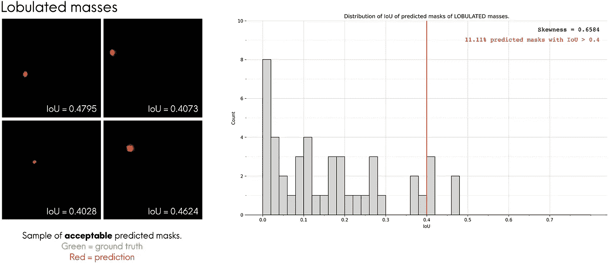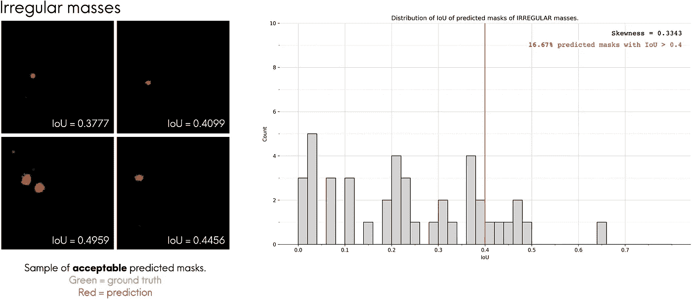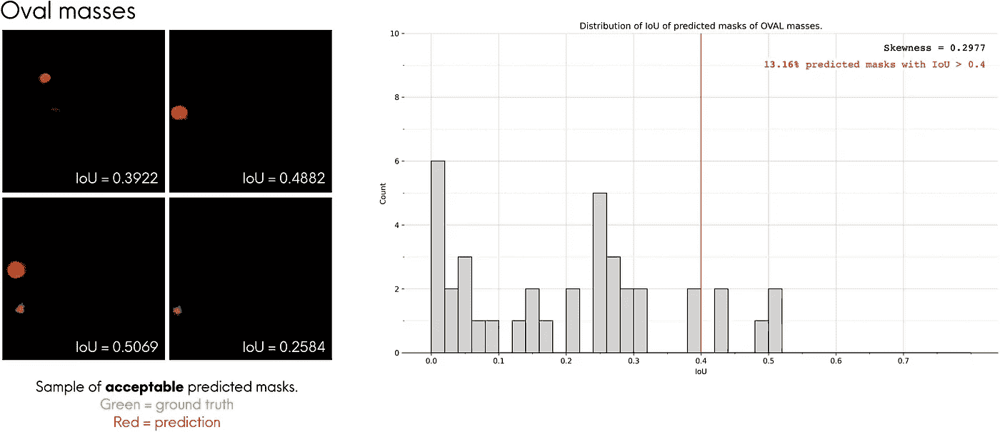

**图 10-a、10-b 和 10-c** 评估模型在 3 种最常见质量形状上的性能。从 DDSM CBIS[取回的乳房 x 光片和口罩](https://wiki.cancerimagingarchive.net/display/Public/CBIS-DDSM)。作者绘制的图像。

对于每个质量形状，我查看了看起来与其对应的地面真实遮罩最相似的前 4 个预测遮罩，并将其绘制在图 10-a、10-b 和 10-c 的左侧*。我叠加了预测遮罩(红色区域)和地面真相遮罩(绿色区域)，使它们更容易比较。从那里，我们看到这些预测的面具有 0.40 左右的借据。换句话说，我们可以说具有 IoU ≥ 0.4 的**预测掩码可以被认为是精确预测**。使用该基准，我们看到该模型对于不规则形状的块体表现最佳，其中 16.67%被该模型准确预测。*

# 包扎

最后，我们来到了这个 3 部分系列的结尾，在这里我们详细地分解了从乳房 x 光片中分割肿块异常的任务。在本系列中，您学习了什么是语义分割，以及如何从开始(下载数据)到结束(评估结果)构建图像分割任务的管道。最重要的是，你了解了我是如何处理流水线每个阶段面临的问题，以及我的代码背后的直觉。你现在可以将这些心智框架应用到你自己的机器学习项目中。

离开前的最后一件事——这是本系列标题图片中问题的答案！

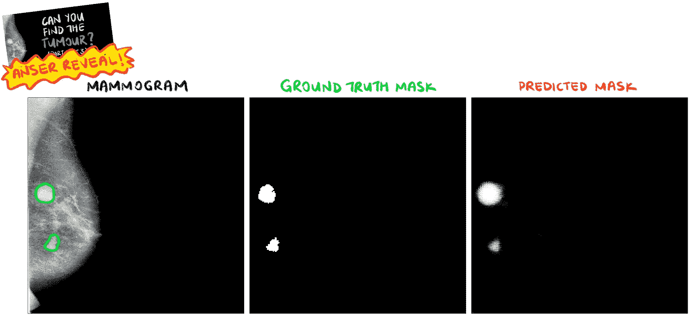

**图 11** 题图答案。从 DDSM CBIS[取回的乳房 x 光片和口罩](https://wiki.cancerimagingarchive.net/display/Public/CBIS-DDSM)。作者绘制的图像。

那么…你能找到肿瘤吗？

你应该看看本系列的[第 1 部分](/can-you-find-the-breast-tumours-part-1-of-3-1473ba685036)和[第 2 部分](/can-you-find-the-breast-tumours-part-2-of-3-1d43840707fc)，如果你还没有，它们给出了问题陈述的一个很好的背景，并逐渐积累了从第 3 部分中获得最大收益所需的知识！

# 谢谢你

如果你已经读完了这篇文章，我希望你喜欢这篇文章。如果这篇文章给你自己的项目带来了一些灵感、价值或帮助，请随意与你的社区分享。此外，任何建设性的问题、反馈或讨论都是绝对受欢迎的，所以请随时在下面评论或在 LinkedIn 上联系我，这里是 或 [***Twitter，地址是@CleonW_***](https://twitter.com/cleonw_?lang=en) 。

请在 Medium ( [Cleon Wong](https://medium.com/u/25cfa5ca1084?source=post_page-----388324241035--------------------------------) )上关注我，了解我的下一篇文章！